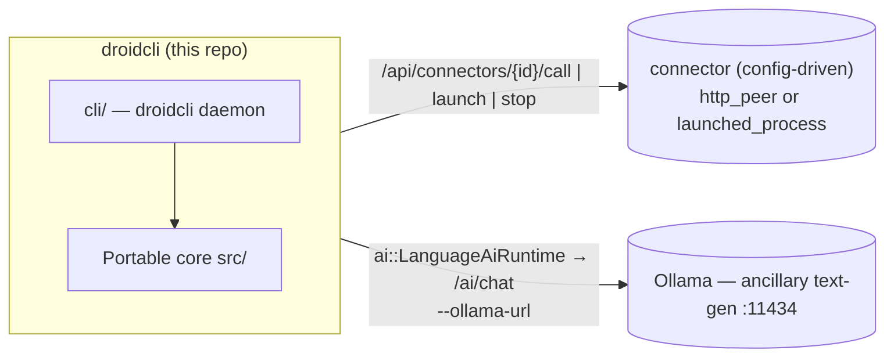
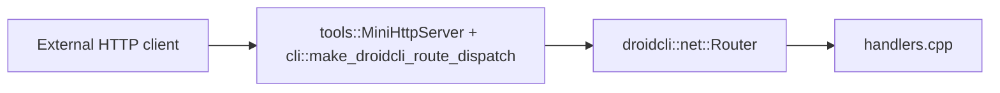
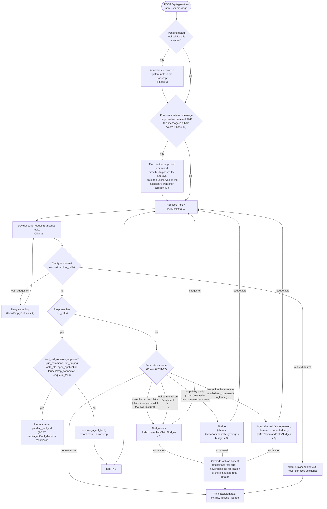
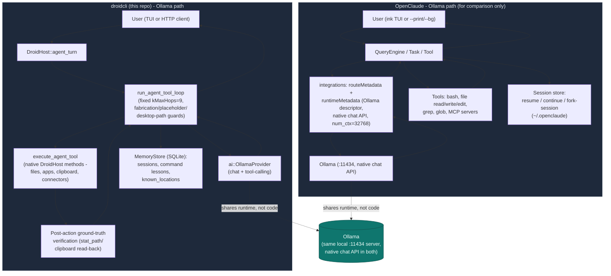

# droidcli - Architecture

Portable C++17 library for Droidcli **control logic**: HTTP route handlers,
the connector/task-queue system, media decode, session snapshots, and the
Ollama AI seam (incl. tool-calling). The droidcli host (`cli/`) supplies
transport, process I/O, and API auth through thin callbacks.

App version: **droidcli 0.1.0** (first release under this name).

---

## System context — a core plus config-driven connectors

droidcli is the **agent controller and network trigger** at the center of an
open-ended set of peer applications. The portable core decides *what* should
happen; the droidcli host performs the actual transport, process control, and
dispatch. Peers are **connectors defined in config** (or registered at
runtime over HTTP) — the core has zero compiled-in knowledge of any specific
peer app.



| Concern | What it owns | Seam in this repo |
| ------- | ------------ | ----------------- |
| **droidcli core + host** | Control logic, command + task dispatch, HTTP in/out, process control | — |
| **A connector** (operator-configured) | Whatever the operator points it at — an inference server, a media player, anything reachable by URL or local command | `net::Connector` (`http_peer` or `launched_process`), registered via `--config` or `POST /api/connectors` |

> **Ollama stays separate.** Ollama is a general **text-generation** endpoint
> behind `ai::LanguageAiRuntime` / `/ai/chat` — it is not a connector, it's
> built into the core AI seam. Any purpose-trained inference service is
> registered as an ordinary
> `http_peer` connector instead, with no special-cased code path. All
> endpoints/models are **configuration**, never baked into core.

---

## Design goals

| Goal                   | How                                                                     |
| ---------------------- | ----------------------------------------------------------------------- |
| Portability            | C++17, `droidcli::core::`* value types, no engine/framework types      |
| Single source of truth | Command validation, JSON shapes, connector/task state                   |
| Testability            | CMake + unit tests without network, GPU, or GUI                         |
| Host bridge            | Hosts inject transport/process I/O via `std::function` callbacks        |

**Rule of thumb:** if it touches a real socket, process, window, or the
filesystem at runtime, it stays in the host. If it is pure state + parsing +
validation + JSON, it belongs in core.

---

## Agent properties

Twenty phases of hardening (see the Phase log further below) have converged
on a specific, opinionated shape for what kind of agent droidcli is. Anyone
extending it should build *with* these properties, not around them - each
one exists because a real observed failure, not a hypothetical, motivated it.

1. **A personal desktop assistant, not a dev/build tool.** droidcli controls
   the machine it runs on for a human sitting at it - opening apps, finding
   and acting on files by description, running one-shot commands. It is not
   optimized for "run this in the project directory" workflows. Concretely:
   a file/command reference with **no location specified at all** defaults to
   the user's real Desktop, not wherever droidcli's own process happened to
   be launched from (`default_bare_filename_to_desktop()`, `cli/host.cpp`,
   Phase 20) - the opposite of what a build tool or CLI dev utility would
   default to.
2. **Self-contained, not an MCP client.** Per ZeroClaw's minimal philosophy,
   new capabilities are new `DroidHost` methods (see `filesystem_tools.{hpp,cpp}`/
   `command_runner.{hpp,cpp}` for the pattern), never a dependency on an
   external MCP server. If MCP support is ever added, droidcli exposes
   *itself* as a server - it does not consume other servers.
3. **Ground truth over self-report, always.** Every agent-tool result carries
   `"ok"` first, always (the hard rule that came out of Phase 6's incident).
   Beyond that baseline, several tools go further and independently *verify*
   their own side effect after the fact rather than trusting their own
   report: `write_file` re-`stat_path()`s the file it just wrote
   (`verified_exists`/`verified_size_bytes`, Phase 18);
   `remember_location`/`get_known_locations` only persists a location if a
   live `stat_path()` confirms it's real *right now* (Phase 19); the
   fabrication guard in `run_agent_tool_loop` only trusts a completion claim
   backed by an actually-mutating tool's `ok:true`, never an unrelated
   read-only success (Phase 17).
4. **A false negative is always safe; a false positive is the failure mode
   to avoid.** Every heuristic guard in `cli/host.cpp` (`looks_like_*`,
   `substitute_bare_desktop_token`, the deterministic intent recognizers in
   `src/intent/`) is written so that failing to recognize a pattern just
   falls through to the normal, slower path - never so that it misfires and
   hijacks or blocks something unrelated. See the "Algorithms reference"
   appendix for the full list.
5. **Deterministic bypasses for narrow, high-confidence shapes only** - never
   as a general substitute for the model's own judgment. "open X" (Phase 11)
   and "yes" confirming a just-proposed command (Phase 14) are recognized by
   pure string scanning, no LLM call, because both are common, narrow, and
   safe to get slightly wrong (a false negative is just a normal turn).
   New tools should reach for this pattern rarely, and only when a
   reliability problem has that exact shape.
6. **Mutating tools are gated by default; read-only tools never are.**
   `tool_call_requires_approval()` (`cli/host.cpp`) is the single list a
   human approves before it runs - anything with a real side effect belongs
   there; gating a read-only lookup only slows the agent down for no safety
   benefit. See the "Adding things" extension points in `AGENTS.md` for the
   two-part checklist every new tool follows.
7. **Persistent memory, not just in-session context.** Three SQLite-backed
   memories, all in the same `MemoryStore` database
   (`cli/memory_store.{hpp,cpp}`): session transcripts (`memory_entries`,
   resumable across restarts), command lessons (`command_lessons`, "this
   broke, this fixed it," searched before a similar attempt), and known
   locations (`known_locations`, a name → real path mapping, Phase 19).
   Deliberately minimal - no embeddings, no vector search, LIKE-based
   substring matching only.
8. **Narrow, evidence-driven fixes over generic ones - and unsolved problems
   are named, not papered over.** Every phase traces back to a specific
   observed transcript, not a hypothetical. When a problem turned out to be
   genuinely hard to solve generically (verifying a model's claim about tool
   *content*, not just whether a tool ran - Phase 16), it's recorded as
   deliberately open rather than "fixed" with a narrow regex that wouldn't
   generalize.
9. **Bounded, not unbounded, self-correction.** `run_agent_tool_loop`'s hop/
   nudge/retry budgets (`kMaxHops`, `kMaxUnverifiedClaimNudges`,
   `kMaxCommandRetryNudges`, `kMaxEmptyRetries`) all exist because letting a
   small local model retry or self-nudge indefinitely measurably degrades
   its own output rather than converging on a fix - every self-correction
   path terminates in an honest report to the user, never silent looping.

---

## Repository layout

```
metaagent/                        (repository directory name unchanged)
├── droidcli_core.h                Umbrella public API
├── droidcli_core.cpp              Single TU — #includes all module .cpp files
├── src/
│   ├── initialize.hpp             initialize_defaults()
│   ├── core/                      Vec3, math, log_sink, value types, spawn() attribution
│   ├── media/                     PNG/JPEG decode, probe, MediaStore
│   ├── net/                       Route table, handlers, connector, json
│   ├── notify/                    Notify body parsing
│   ├── session/                   RuntimeSession + status strings
│   ├── app/                       tasks (persistent task queue)
│   ├── ai/                        Ollama text-gen client (incl. tool-calling) + LanguageAiRuntime + ModelProvider interface
│   ├── intent/                    Deterministic "open X" phrase recognizer (no LLM, no I/O)
│   └── reliability/               Fabrication/path/command guards used by cli/host.cpp (Phase 26/27, no LLM, no I/O)
├── cli/                            droidcli host: DroidHost, ProcessManager, command_runner, MemoryStore (SQLite), HTTP route mount, entrypoint
├── tools/                         mini_http_server + sync_http_client (raw-socket HTTP, WinHTTP for https://)
├── tests/                         One *_test.cpp per core module
├── third_party/sqlite/            Vendored SQLite amalgamation (committed - see third_party/README.md)
├── config/                         Example connector config (connectors.example.json)
├── distribute/                    Dist templates (run_all.bat, README)
├── CMakeLists.txt
├── README.md
└── ARCHITECTURE.md
```

Public entry point: `#include "droidcli_core.h"`.

---

## Modules

| Module                    | Role                                                                  |
| ------------------------- | --------------------------------------------------------------------- |
| `core/types` + `math`     | `String`, `Array`, `Vec3`, color types, math helpers                  |
| `core/spawn`              | **Spawn attribution**: `spawn(name, fn, sink)` - named `std::thread` construction reporting "spawned"/"joined"/"threw: ..." via an optional `ThreadEventSink`, no logging mechanism of its own. `cli/tui.cpp`'s background threads wire the sink to `DroidHost::log_thread_event` |
| `media/decode` + `probe`  | FFmpeg-backed decode + probe (host stages the DLLs)                   |
| `net/router` + `handlers` | `/health`, `/echo`, `/notify`, `/ai/chat`                             |
| `net/connector`           | **Generic peer registry**: `Connector` (`http_peer` \| `launched_process`), `ConnectorRegistry` register/unregister/list/find, JSON build/parse |
| `net/json`                | Escape/build/extract JSON fields (no external JSON dependency)        |
| `notify/parse`            | Notify body parsing (JSON or text)                                    |
| `session/types` + `status`| `RuntimeSession`, `FeatureFlags` (ai/networking/recording/ui), status |
| `app/tasks`               | **Persistent task queue**: `Task` (incl. `result_json`), `TaskQueue` (enqueue/claim_next/complete/fail/find/list), JSON build/parse |
| `ai/ollama_client`        | Ollama request/response shaping, incl. **tool-calling**: `ToolDefinition`/`ToolCall`, `"tools"` request field, `message.tool_calls` response parsing, `ChatRole::Tool` |
| `ai/language_runtime`     | Transcript + turn state for **Ollama text-gen** (`/ai/chat`); POST via `LanguageAiTransportCallbacks`. Separate from any connector-registered inference peer. Single-shot (no tool-calling) - the multi-hop agent loop lives in `DroidHost::agent_turn` instead |
| `ai/model_provider`       | **Provider abstraction**: `ModelProvider` interface (`build_request`/`parse_response`) + `OllamaProvider` adapter over `ai/ollama_client`. `DroidHost::agent_turn` is coded against the interface - see "Phase 1" in the Chronological hardening log below |
| `intent/open_intent`      | Deterministic "open X" phrase recognizer (pure string scanning, no LLM, no I/O) - backs `POST /api/apps/quick_open`, see "Quick-open" below |

The droidcli host (`cli/`) additionally owns: the config store, the
`ConnectorRegistry` + `TaskQueue` instances and their dispatch (`call_connector`
for `http_peer`, `launch_connector`/`stop_connector` for `launched_process`,
`tick_tasks()` draining the queue, including a `"run"` command dispatched to
`command_runner`), the **ProcessManager** (Job Object/process-group launch of
any `launched_process` connector with PID tracking), **`command_runner`**
(one-shot, synchronous, timeout-bounded shell command execution with captured
stdout/stderr - `POST /api/run` and the `"run"` task command - plus
`launch_application`, a detached fire-and-forget GUI-app launch with no wait
and no output capture, distinct from the blocking `run_command_once` -
resolves a bare app name against the Windows App Paths registry first (how
most GUI installers register themselves, e.g. `chrome` even though it's
never added to PATH), then PATH, then falls back to the **`app_index`**
installed-apps index if both fail - `POST /api/open`), **`app_index`**
(`scan_installed_applications()`, Windows' Add/Remove Programs/Uninstall
registry entries under HKLM native + WOW6432Node + HKCU, resolving each
entry's `DisplayIcon` or a shallow `InstallLocation` scan to an actual
`.exe`; scanned once at `DroidHost::initialize()` and cached, not re-scanned
per lookup - covers apps that never registered on PATH or in App Paths at
all, e.g. Blender or KiCad - `POST /api/apps/find`), **`window_list`**
(`list_open_windows()`, `EnumWindows` filtered to visible/titled top-level
windows with owning process name + PID via `QueryFullProcessImageNameA` -
the same set Alt+Tab shows; a live, uncached snapshot re-enumerated every
call, unlike `app_index`'s scan-once - `GET /api/apps/open`),
**`filesystem_tools`**
(`read_file`/`write_file`/`list_dir`/`stat_path`/`get_current_working_directory`/
`which_executable`, `std::filesystem`-backed, no external dependency - `POST
/api/fs/*`), **`memory_store`** (`MemoryStore`, SQLite-backed persistent
agent-turn history keyed by session id - see "Persistent memory" below -
`GET /api/agent/history`, `GET /api/agent/sessions`), and
**`DroidHost::agent_turn`** (a bounded tool-calling loop, against a
`ai::ModelProvider` - Ollama today - over a fixed tool set - connectors,
tasks, shell commands, app launches, open-window queries, and filesystem
primitives - each tool implemented by calling back into `DroidHost`'s own
methods, self-contained rather than delegating to another process or MCP
server; every hop (user message, tool call + result, final reply, and
failure paths) is logged via `append_app_log()` under the `chat` channel and
persisted via `record_agent_message()` to `memory_store` - `POST
/api/agent/turn`).

---

## HTTP flow



Inbound: `tools::MiniHttpServer` (raw-socket, no httplib) binds the socket,
parses headers into `net::HttpRequest`, and - before any route is dispatched -
checks the bearer token for every `/api/*` path and `/ai/chat` (see "HTTP API"
below), returning `401` on failure. Requests that pass the check are
tried against the portable `net::RouteTable` (`/health`, `/echo`, `/notify`,
`/ai/chat`); anything else falls through to
`cli::make_droidcli_route_dispatch`'s `CustomRouteFn`, which covers `/api/*`
(status/config/ollama/process/run/agent/connectors/tasks).
Outbound: `tools::sync_http_client` performs the POST/GET (raw socket for
`http://`, WinHTTP for `https://`); core builds and parses the bodies.

---

## HTTP API

### Security: API authentication

droidcli's HTTP API can execute shell commands (`/api/run`) and drive an LLM
tool-calling loop that can call those same routes (`/api/agent/turn`) — so
every `/api/*` route, plus `/ai/chat` (an Ollama call has a real cost even
though it can't run shell commands), requires an
`Authorization: Bearer <token>` header. `/health`, `/echo`, and `/notify` stay
open since they're read-only/log-only and liveness checks shouldn't need a
token.

The token comes from, in order: `--token <value>`, the `DROIDCLI_API_TOKEN`
env var, or — if neither is set — a random 32-byte (64 hex char) token
generated at startup and printed to the console:

```
droidcli: generated API token (save this): 3f9a1c...
```

droidcli **never** starts the HTTP API with authentication disabled. A
request without a valid token gets `401 Unauthorized`:

```sh
curl -i http://127.0.0.1:30080/api/status
# HTTP/1.1 401 ...
# {"error":"unauthorized","message":"missing or invalid Authorization: Bearer <token> header"}

curl -i http://127.0.0.1:30080/api/status -H "Authorization: Bearer 3f9a1c..."
# HTTP/1.1 200 ...
```

The in-process TUI (`cli/tui.cpp`) calls `DroidHost` methods directly, not
over HTTP, so it never needs the token.

### Routes

`[auth]` marks routes that require the `Authorization: Bearer <token>` header.

| Method | Route | Description |
| ------ | ----- | ------------ |
| `GET` | `/health` | Liveness + session snapshot (portable handler, no auth) |
| `GET` / `POST` | `/echo` | Echo query/body (no auth) |
| `POST` | `/notify` | Ingest notify event (no auth) |
| `POST` | `/ai/chat` `[auth]` | Ollama text-gen chat via `LanguageAiRuntime` |
| `GET` | `/api/status` `[auth]` | Host status: AI-enabled flag, connector/task counts |
| `GET` | `/api/network/status` `[auth]` | Networking flag + connector count |
| `GET` | `/api/config` `[auth]` | Effective host configuration (Ollama) |
| `POST` | `/api/config` `[auth]` | Update host configuration at runtime |
| `GET` | `/api/notify/log` `[auth]` | Recent notify messages |
| `GET` | `/api/app/log` `[auth]` | Recent host application log |
| `POST` | `/api/run` `[auth]` | Run a one-shot shell command — body `{"command":"...","work_dir":"...","timeout_ms":30000}` |
| `POST` | `/api/ffmpeg/run` `[auth]` | Run ffmpeg (resolved via `PATH` or `$DROIDCLI_FFMPEG_ROOT`) — body `{"args":"...","work_dir":"...","timeout_ms":120000}` |
| `GET` | `/api/system` `[auth]` | The host machine droidcli is running on — `os_name`/`os_version`/`architecture`/`hostname`/`username`/`cwd`, queried once at startup |
| `POST` | `/api/open` `[auth]` | Launch a GUI application, detached (no wait, no output capture) — body `{"path_or_name":"...","args":"...","work_dir":"..."}` |
| `POST` | `/api/apps/find` `[auth]` | Search the installed-apps index (scanned at startup) — body `{"query":"..."}`, returns `{"matches":[{"name":...,"path":...}]}` |
| `POST` | `/api/apps/quick_open` `[auth]` | Deterministic, LLM-free "open X" recognizer — body `{"message":"..."}`, returns `{"matched":bool,"app_name":"...","ambiguous":bool,"resolved_name":"...","resolved_path":"...","candidates":[...]}` (see "Quick-open" below) |
| `GET` | `/api/apps/open` `[auth]` | Live snapshot of currently open windows — `{"windows":[{"title":...,"process_name":...,"pid":...}]}`, re-enumerated fresh on every call |
| `POST` | `/api/fs/read` `[auth]` | Read a file — body `{"path":"...","max_bytes":65536}`, response reports `truncated` |
| `POST` | `/api/fs/write` `[auth]` | Write/append a file — body `{"path":"...","content":"...","append":false}` |
| `POST` | `/api/fs/list` `[auth]` | Non-recursive directory listing — body `{"path":"..."}` (omit for cwd) |
| `POST` | `/api/fs/stat` `[auth]` | Check existence/type/size of a path — body `{"path":"..."}` |
| `GET` | `/api/fs/cwd` `[auth]` | droidcli's current working directory |
| `POST` | `/api/fs/which` `[auth]` | Resolve an executable against `PATH` — body `{"name":"..."}` |
| `POST` | `/api/agent/turn` `[auth]` | Tool-calling agent turn — body `{"message":"...","clear":false,"session_id":"..."}`, response includes `"session_id"` (see "Persistent memory" and "Phase 6" below) |
| `POST` | `/api/agent/tool_decision` `[auth]` | Resolve a gated tool call `agent_turn` paused on — body `{"approved":bool,"session_id":"...","reason":"..."}` (see "Phase 6" below) |
| `POST` | `/api/agent/lessons` `[auth]` | Record a "this broke, this fixed it" command lesson — body `{"tool":"...","broken":"...","failure_reason":"...","working":"...","lesson":"..."}` |
| `POST` | `/api/agent/lessons/search` `[auth]` | Case-insensitive substring search over recorded lessons — body `{"query":"..."}` |
| `GET` | `/api/agent/tools` `[auth]` | The agent's fixed tool set — `{"tools":[{"name":...,"description":...,"parameters":{...}}]}` |
| `GET` | `/api/agent/history` `[auth]` | One session's persisted message history — `?session_id=...` (defaults to the current session), returns `{"session_id":"...","messages":[{"hop_index":N,"role":"...","content":"...","created_at":"..."}]}` |
| `GET` | `/api/agent/sessions` `[auth]` | Every session id with persisted history, most recently active first — `{"current_session_id":"...","session_ids":[...]}` |
| `GET` | `/api/ollama/status` `[auth]` | Ollama text-gen endpoint status + model list |
| `POST` | `/api/ollama/config` `[auth]` | Update Ollama model at runtime |
| `GET` | `/api/ollama/setup-status` `[auth]` | Whether Ollama is installed/online, pulled models, configured-model status (drives the TUI's in-chat setup flow) |
| `POST` | `/api/ollama/install` `[auth]` | Run `winget install --id Ollama.Ollama ...` (blocking) |
| `POST` | `/api/ollama/start` `[auth]` | Launch `ollama serve` and poll until reachable (blocking) |
| `POST` | `/api/ollama/pull` `[auth]` | Pull a model and make it the active one — body `{"model":"..."}` (blocking) |
| `GET` | `/api/process/status` `[auth]` | PID + running state of every launched connector process |

**Connectors** (generic peer config; all `[auth]`):

| Method | Route | Description |
| ------ | ----- | ------------ |
| `GET` | `/api/connectors` | List all registered connectors |
| `POST` | `/api/connectors` | Register (or replace) a connector — body is a `Connector` JSON object |
| `GET` | `/api/connectors/{id}/status` | Liveness: PID/running for `launched_process`, `/health` probe for `http_peer` |
| `POST` | `/api/connectors/{id}/launch` | Launch a `launched_process` connector (Job Object / process group, PID-tracked) |
| `POST` | `/api/connectors/{id}/stop` | Stop it |
| `POST` | `/api/connectors/{id}/call` | Proxy an HTTP call to an `http_peer` connector — body `{"path":"/api/x","method":"POST","payload_json":"{...}"}` |

**Tasks** (persistent pending/running/done/failed queue; `tick_tasks()` runs every poll loop iteration and dispatches one pending task per tick; all `[auth]`):

| Method | Route | Description |
| ------ | ----- | ------------ |
| `GET` | `/api/tasks` | List all tasks (history capped, pending/running always kept) |
| `POST` | `/api/tasks` | Enqueue a task — body `{"connector_id":"...","command":"launch\|stop\|run\|<path>","payload_json":"{...}"}` |
| `GET` | `/api/tasks/{id}` | Task status, including `result_json` once done (e.g. captured stdout/stderr for a `"run"` task) |

A task with `command: "launch"` or `"stop"` calls `launch_connector`/`stop_connector`
on its `connector_id`; `command: "run"` runs `payload_json`'s `{"command":"...","work_dir":"..."}`
as a one-shot shell command (no `connector_id` needed); any other command is
treated as the HTTP path to call on an `http_peer` connector.

### Quick-open (`POST /api/apps/quick_open`) — hardening app launches against LLM unreliability

Opening an application is common enough, and consequential enough, that it
should not depend on a local model reliably deciding to call a tool. Early
testing showed a small Ollama model asked to "open Blender" sometimes
apologizing that it "can't open applications" instead of calling
`open_application` - the tool existed, the model just didn't use it. Rather
than trying to prompt-engineer that away, `intent::parse_open_intent()`
(`src/intent/open_intent.hpp`/`.cpp`, portable core, network-free, unit
tested in `tests/intent_test.cpp`) recognizes a narrow, deterministic shape -
"open X", "launch X", "start X", optionally wrapped in courtesy phrasing
("can you ...", "please ...") and trailing filler ("... for me", "... now")
- with pure string scanning, no LLM call. Matching requires the verb to be
the first word of the message (after stripping courtesy prefixes), so an
ordinary question like "how do I open a file in Python" is not hijacked -
that keeps reaching the full agent/LLM path in `POST /api/agent/turn`.

`DroidHost::try_quick_open_json()` (`cli/host.cpp`) resolves a recognized
`app_name` against the same installed-apps index `find_application` uses
(`installed_apps_`, including the built-in-accessories table added to
`app_index.cpp` - see below) and reports one of three outcomes: an
unambiguous single match, an ambiguous set of candidates, or nothing found
(in which case the raw name is still offered as an `open_application`
attempt, since that call has its own independent App Paths/PATH resolution
beyond the index). The TUI (`cli/tui.cpp`) calls this on every Enter press
*before* the Ollama-setup state machine or the agent-turn worker thread; if
it matches, the TUI asks the user to confirm (yes/no, or a number if
ambiguous) and only then calls `open_application` - so the LLM is bypassed
for recognition, but a human still approves every actual launch. This is a
deliberately narrow fast path: anything that doesn't match the shape falls
through to the full tool-calling loop unchanged.

`app_index.cpp` also gained a small built-in-accessories table (Notepad,
Calculator, Paint, Command Prompt, PowerShell, File Explorer, Task Manager,
Control Panel, Snipping Tool, Magnifier, Registry Editor, Character Map,
Remote Desktop Connection, Disk Cleanup) appended to the startup scan -
these ship with Windows and never register an Add/Remove Programs entry, so
the Uninstall-registry scan alone could never find them. Name matching
(`normalize_for_match()` in `cli/host.cpp`) is case- and
spacing/punctuation-insensitive, so "NotePad", "NOTEPAD", and "note pad" all
resolve identically.

### Persistent memory (SQLite) — `cli/memory_store.cpp`

droidcli's Core-tier "memory" role (see the ZeroClaw crate comparison below).
Every message `DroidHost::agent_turn` adds to a session's transcript - the
system prompt, the user's message, the model's replies, tool results - is
also appended to a SQLite-backed `MemoryStore` (`cli/memory_store.hpp`/`.cpp`,
schema: `memory_entries(session_id, hop_index, role, content, created_at)`),
not just the in-process `agent_transcript_` `std::vector` that existed
before. This is real file I/O, so it lives in `cli/` (host), linked against
the vendored SQLite amalgamation (`third_party/sqlite/`, see
`third_party/README.md`) - never in the portable `droidcli_core` library, per
`AGENTS.md`'s Golden rule. The database file (`db/droidcli_memory.sqlite3`,
git-ignored like everything else under `db/` - see `db/README.md`) is opened once at
`DroidHost::initialize()`; a failed open leaves the store closed and
`record_agent_message()`/the history routes degrade to in-memory-only
behavior rather than crashing the daemon over it.

**Sessions, not one global transcript.** `DroidHost` tracks a
`current_session_id_`, freshly generated every process start (a short
timestamp + disambiguator, e.g. `20260715T121525-e3f4` - no auto-resume by
default). `POST /api/agent/turn`'s body may include `"session_id"`:

- Omitted → continues whatever session this process is currently on.
- A previously-returned id → **resumes that session**, including across a
  restart: its persisted history is replayed from `MemoryStore` into
  `agent_transcript_` before the new message is appended. This is what makes
  "killed and restarted droidcli mid-conversation, sent the same
  `session_id` again" actually continue the same transcript - verified by
  hand: a system+user message pair persisted, the process was killed and
  restarted, and `GET /api/agent/history?session_id=...` still returned both
  messages afterward.
- `"clear": true` always starts a **brand new** session id (old history isn't
  deleted, just no longer active), ignoring any `session_id` in the same
  request.

Every `agent_turn` response includes the active `"session_id"` - a caller
that wants to resume a conversation later needs to hold onto it.
`cli/tui.cpp` does exactly this: it holds the current session's id in memory
for the process's lifetime (shown in the UI as a `session: <id>` status
line), writes it to `db/droidcli_last_session.json` (git-ignored, see
`db/README.md`) whenever a turn returns one, and on the *next* launch reads
that file and calls `GET`-equivalent `build_agent_history_json()` directly
(a local SQLite read, safe to call synchronously before `screen.Loop()`
starts) to replay the prior conversation into the chat panel and resume
sending with that `session_id` - so restarting the TUI itself, not just the
underlying `droidcli` daemon, continues where you left off. Pressing `n`
(connectors-panel focus) starts a brand new session on the next message
instead (same semantics as `"clear":true`), for when starting fresh is what
you actually want.

**Deliberately minimal**: no embeddings, no vector retrieval, no eviction
policy. Durability (survive a restart) and queryability (`GET
/api/agent/history`, `GET /api/agent/sessions`) are the whole scope - the
"Chronological hardening log" below is explicit that semantic recall is a
separate, meaningfully bigger piece of work that nothing in droidcli needs yet.

### The agent turn (`POST /api/agent/turn`)

Drives a bounded (9-hop, `kMaxHops` in `cli/host.cpp` - raised from 5 once
the retry mechanism below needed the extra room) tool-calling loop against a
`ai::ModelProvider` (Ollama today via `ai::OllamaProvider` - see "Provider
abstraction" in the hardening log below and `src/ai/model_provider.hpp`): the
model sees a fixed tool set and can call any of them against this
`DroidHost` instance before replying in natural language. The tool set is
defined once, in `DroidHost::agent_tool_definitions()` (`cli/host.cpp`) -
`GET /api/agent/tools` is its live source of truth (also rendered as the
TUI's "Agent Tools" panel), so it's deliberately not duplicated here where it
would just go stale as tools are added. Every message added to the
transcript is also persisted via `MemoryStore` (see "Persistent memory"
above).

Side-effecting tools (anything that writes to disk, runs a shell command, or
touches a connector/process/task) don't execute the instant the model
requests them - the loop pauses for human approval first, and every tool
result carries a uniform `"ok"` contract the model can trust. Most of what
this loop actually *does* beyond "call tools until done" is reliability
hardening earned from real, observed failures of the local model it runs
against - see the flowchart below, then the hardening log further down for
why each guard exists.



The loop is deliberately linear and single-threaded per turn - no
speculative parallel tool calls, no background continuation after the HTTP
response returns (a model claiming otherwise is always wrong, see
`looks_like_degenerate_role_leak`/`kOngoingProcessPhrases` in the hardening
log). Every arrow that isn't a straight hop-to-hop transition exists because
a specific, real transcript showed the local model fail that way - the
hardening log below is the incident-by-incident record of why.

**The "Fabricated checks" diamond above only works if every tool's JSON
carries `"ok"`.** `a_tool_call_already_succeeded_this_turn` (the check that
protects a truthful "I did it" from being second-guessed) works by scanning
each action's `result_json` for `"ok":true` - a tool missing that field is
invisible to it, and a genuinely successful call can get overridden with a
false "I wasn't able to complete this" as a result. This happened for real
(`open_application`, see "Phase 15" below) - any new agent tool must return
`"ok"` as its first field or it silently weakens every guard in this
diagram, not just its own correctness.

```sh
curl -X POST http://127.0.0.1:30080/api/agent/turn \
  -H "Authorization: Bearer <token>" \
  -H "Content-Type: application/json" \
  -d '{"message":"list the registered connectors"}'
```

Response shape:

```json
{
  "ok": true,
  "assistant": "You have 2 connectors registered: ...",
  "session_id": "20260715T121525-e3f4",
  "actions": [
    {"tool": "list_connectors", "arguments_json": "{}", "result_json": "{\"connectors\":[...]}"}
  ]
}
```

If Ollama is disabled or unreachable, or the transcript budget (9 hops) runs
out before a final natural-language reply, the response is still valid JSON
(`ok:false` with an `error`, or `ok:true` with `budget_exhausted:true` and the
last assistant text) rather than a crash. The model also never gets a blank
`"assistant"` field - a genuinely empty model response is replaced with a
visible placeholder rather than surfaced as silence. An `ok:false` response
from a failed provider call still includes `"session_id"` - the user's
message was persisted before the call was attempted, so a caller can find it
via `GET /api/agent/history` even though the turn itself failed. (The two
earliest failure paths - missing `"message"`, AI disabled entirely - return
before any session is touched, so they have no `session_id` to report.)

### One-shot commands (`POST /api/run`)

```sh
curl -X POST http://127.0.0.1:30080/api/run \
  -H "Authorization: Bearer <token>" \
  -H "Content-Type: application/json" \
  -d '{"command":"echo hello","work_dir":"","timeout_ms":30000}'
# {"ok":true,"launched":true,"exit_code":0,"stdout":"hello\r\n","stderr":"","error":""}
```

Synchronous and blocking (unlike the PID-tracked `launched_process` connector
lifecycle) — captures stdout/stderr and enforces `timeout_ms`, killing the
process and reporting `error` if it's exceeded. `"ok"` (`command_succeeded()`
in `cli/command_runner.hpp`) is `launched && exit_code == 0 &&
error_message.empty()` - the same contract `/api/ffmpeg/run` and every other
agent tool follow, see "Phase 6" below for why this is load-bearing.

---

## Build

### Standalone

```powershell
cd metaagent
cmake -S . -B build -DCMAKE_BUILD_TYPE=Release
cmake --build build
ctest --test-dir build --output-on-failure
```

Tests: `media_decode_test`, `net_handler_test`, `ollama_client_test`,
`language_runtime_test`, `connector_test`, `task_queue_test`, `intent_test`,
`model_provider_test`, `spawn_test`.

On Windows the whole tree builds with **one MSVC runtime**
(`CMAKE_MSVC_RUNTIME_LIBRARY` in the root CMakeLists: dynamic Debug, static
Release) — never set a per-target runtime that diverges.

---

## Roadmap: packaging as a self-contained daemon assistant

droidcli is heading toward the same shape as ZeroClaw
(https://docs.zeroclawlabs.ai): a single long-running daemon process on the
user's own machine that both *understands* requests (via the Ollama seam) and
*acts* on them directly (via native `DroidHost` tools - no external agent
runtime, no MCP client chain, no cloud round-trip required to execute a local
action). The pieces below are not built yet; this section is the design
record for how they should fit once they are, so packaging decisions get made
once instead of re-litigated per feature.

**Bootstrapped self-knowledge, not blank-slate prompting.** The daemon already
knows facts about the machine it runs on before the user ever types anything -
the installed-apps index (`app_index.cpp`, scanned once at
`DroidHost::initialize()`), the open-window snapshot (`window_list.cpp`),
`which`/PATH resolution, and - since Phase 10 - CPU/GPU/RAM/disk inventory
(`hardware_info.cpp`, opt-in via `--enable-hardware-scan`) and, since Phase 9,
a live self-health snapshot (`self_status`: cached Ollama reachability,
connector/task counts, recent failures) rather than only startup-time facts.
`HostConfig::system_prompt` and the count appended in `DroidHost::agent_turn()`
(`cli/host.cpp`) exist to turn that bootstrapped state into something the
model is *told as fact*, not something it has to be argued into believing it
can do. As more system facts get added (installed shells/interpreters,
logged-in user, network interfaces), the same pattern applies: scan once at
`initialize()` (or, for something that can change mid-run, check it on a
throttled cadence the way Phase 9's watchdog does), cache on `DroidHost`, and
fold a concrete summary into the system prompt rather than leaving it purely
tool-call-discoverable - a model should never have to be told twice that a
capability exists.

**No MCP client, ever (see `AGENTS.md` guardrails).** Every new capability is
a new `DroidHost` method plus a matching `agent_tool_definitions()` /
`execute_agent_tool()` entry (`cli/host.cpp`) - the same surface `/api/*`
already exposes over HTTP. This keeps the trust boundary singular: whatever
`/api/agent/turn` can do, an operator can already see and call directly over
HTTP with the same bearer token. If droidcli ever speaks MCP, it is as a
*server* (exposing its own tool set to external MCP clients), never as a
*client* pulling in a third party's tool implementations - that would break
the "one process, one binary, no supply chain" property this whole roadmap is
about.

**True background operation.** `--daemon` is currently a documented no-op
(`cli/droidcli.cpp` always runs foreground); a real implementation needs:
Windows Service (`SERVICE_WIN32_OWN_PROCESS`, via `ServiceMain`/
`RegisterServiceCtrlHandler`) and a POSIX/systemd unit (`Type=simple` or
`Type=notify`) as two host-side entry points sharing the same `DroidHost`.
`--headless` (skip the FTXUI TUI, keep the HTTP daemon loop) is the correct
foundation for this - a service wrapper is just another host that never
constructs a `ScreenInteractive`.

**Auto-start of the API, opt-in for actions.** The daemon binding its HTTP
port and accepting `/api/*` calls at boot is safe to make automatic (it is
inert until called and gated by the bearer token per `AGENTS.md`'s auth
guardrail). Launching a `launched_process` connector automatically is not -
`AGENTS.md` already establishes that connectors only launch when told to
(`POST /api/connectors/{id}/launch` or a queued task), and that design choice
should hold for any future "run at startup" feature: an operator opts a
*specific* connector or task into auto-start via its own config, the daemon
itself never decides to launch something unprompted.

**Distribution stays single-binary.** `build_and_distribute.bat` already
stages `droidcli.exe` + FFmpeg DLLs into `dist/`; the packaging goal is that
this stays the *only* thing an end user installs - no Python runtime, no
node_modules, no sidecar interpreter. Ollama is the one external dependency,
and it already has its own install/start/pull lifecycle exposed through
`DroidHost` (`install_ollama()`/`start_ollama()`/`pull_ollama_model()` in
`cli/host.cpp`) precisely so the daemon can bootstrap its own AI backend
without the user leaving droidcli. Any future capability that seems to need a
new external runtime should be questioned against this constraint first.

**Token and secret handling scale the same way they do today.** As more
connectors/tools carry credentials (API keys for `http_peer` connectors,
future cloud-model fallbacks), the existing rule holds: never echo a secret
back via a config read, only a `*_configured: bool` (see `CLAUDE.md`). A
packaged daemon that runs unattended is a higher-value target for credential
exfiltration than an interactively-run one, so this rule gets stricter, not
looser, as auto-start lands.

---

## Comparison to ZeroClaw's crate architecture

ZeroClaw (https://docs.zeroclawlabs.ai) is a Rust cargo workspace of ~18
crates split into three tiers: **Core** (runtime/config/memory/providers/
tools), **Edge** (channels/gateway — the crates that talk to the outside
world), and consumers of the public **API** trait layer (`ModelProvider`,
`Channel`, `Tool`, `Memory`, `Observer`, `RuntimeAdapter`, `Peripheral`).
droidcli is a single C++ static library plus one executable, not a
multi-crate workspace, so this is not a plan to reshape droidcli into 18
targets — it is a role-by-role check of what droidcli already covers, what's
partial, and what would be genuinely new work if droidcli grew toward the
same capability set.

The diagram below is drawn in the same three-tier shape as ZeroClaw's
(External world → Edge → Core → external providers/OS), not the old
"portable core vs. host" split from the Roadmap section above. That
core-vs-host line is a real, load-bearing rule for *where new code physically
goes* inside `src/`/`cli/` (see the Golden rule in `AGENTS.md`) — but it is an
implementation detail, not the product's architecture, and conflating the two
made droidcli look like it had no Core/Edge shape at all. It has one; `src/`
and `cli/` are just how that shape is currently split across translation
units, not where the tier boundaries are.


### Crate-by-crate mapping

The **droidcli module** column names the logical grouping each row belongs to
(matching the tier diagram above, e.g. `RUNTIME`/`droidcli-runtime`) - it is
not a separate CMake target or library. droidcli stays one static library
plus one executable; these are conceptual module boundaries within
`src/`/`cli/`, named consistently so this table and the diagram use the same
vocabulary, not a claim that droidcli is secretly an 18-target build.

| ZeroClaw crate | droidcli module | Role | droidcli equivalent | Status |
| --- | --- | --- | --- | --- |
| `zeroclaw-runtime` | `droidcli-runtime` | Agent loop, security policy, SOP engine, cron, SubAgents, RPC | `DroidHost::agent_turn`/`run_agent_tool_loop` (`cli/host.cpp`) — one bounded tool-calling loop | **Partial** — real security-policy layer beyond the bearer token: side-effecting tools require human approval before executing (Phase 6, done, `POST /api/agent/tool_decision`); `TaskQueue` now has one-shot delayed scheduling (`Task::scheduled_for_ms`, Phase 9, "in N minutes") but no *recurring* cron and no SOP engine/SubAgents/RPC |
| `zeroclaw-config` | `droidcli-config` | TOML schema, secrets encryption, autonomy levels, workspace resolution | `HostConfig` (`cli/host.hpp`) + CLI flags + `connectors.json` | **Partial** — flat JSON/CLI flags not TOML, token is plaintext (env var or CLI arg, never echoed back — see `CLAUDE.md`), no autonomy levels, no workspace concept |
| `zeroclaw-api` | `droidcli-api` *(interface only, cross-cutting — not its own .cpp module)* | Public traits: `ModelProvider`, `Channel`, `Tool`, `Memory`, `Observer`, `RuntimeAdapter`, `Peripheral` (kernel ABI) | `ai::ModelProvider` (`src/ai/model_provider.hpp`) is the `ModelProvider` equivalent; `net::Connector` is the closest thing to a `Channel`/`Peripheral` abstraction; `ai::ToolDefinition`/`ToolCall` is the Tool ABI | **Partial** — `ModelProvider` now exists as a real interface (Phase 1, done); `Connector` still covers what ZeroClaw splits into `Channel`+`Peripheral`; no `Memory`/`Observer` trait abstractions (though `MemoryStore` now exists as a concrete class, see `zeroclaw-memory` below) |
| `zeroclaw-providers` | `droidcli-providers` | LLM client impls (Anthropic/OpenAI/Ollama/…) + hint router + retry | `ai::ModelProvider` interface + `ai::OllamaProvider` (`src/ai/model_provider.{hpp,cpp}`, adapting the tested `ai/ollama_client.cpp`) | **Have the abstraction, one implementation** — `agent_turn` (`cli/host.cpp`) is coded against `ai::ModelProvider`, not Ollama directly (Phase 1, done); adding Anthropic/OpenAI means implementing the interface, no router/retry wrapper yet since there's nothing to route between |
| `zeroclaw-channels` | `droidcli-channels` *(planned, Phase 4 - not started)* | 30+ messaging integrations (Discord, Slack, Telegram, …) | None | **Missing entirely** — `Connector` generalizes the concept but nothing implements a messaging-channel connector yet |
| `zeroclaw-gateway` | `droidcli-gateway` | HTTP/WebSocket gateway, web dashboard, webhook ingress | `tools::MiniHttpServer` + `cli/http_mount.cpp` | **Partial** — REST exists; no WebSocket, no dashboard UI, webhook auth is the same bearer-token gate as everything else |
| `zeroclaw-tools` | `droidcli-tools` | Callable tool implementations (browser, HTTP, PDF, hardware probes) | `filesystem_tools.cpp`, `command_runner.cpp`, `window_list.cpp`, `app_index.cpp`, `intent/open_intent.cpp`, `ffmpeg_tool.cpp`, `system_info.cpp` | **Have**, functionally — not split into a separate module boundary, all linked straight into `cli/`/`src/`. `system_info.cpp` is droidcli's environment-grounding tool (OS, architecture, real Desktop path via the Windows Known Folder API - Phase 7, done) - the ZeroClaw comparison doesn't have a named equivalent for "know what machine you're actually on," but it's the same self-contained-capability shape as every other tool here |
| `zeroclaw-tool-call-parser` | `droidcli-providers` *(folded in, not a separate module)* | Model-side tool-call syntax parsing/normalization | `ai::ollama_client`'s `tool_calls` JSON parsing | **Partial** — handles Ollama's native tool-call format only, nothing to normalize across providers since there's only one |
| `zeroclaw-memory` | `droidcli-memory` | Conversation memory, embeddings, vector retrieval | `MemoryStore` (`cli/memory_store.{hpp,cpp}`, SQLite-backed) + `agent_transcript_` (in-process working copy) | **Have durability/queryability + procedural memory, no semantic recall** — every message is persisted per-session and survives a restart (Phase 2, done, verified: kill/restart droidcli, `GET /api/agent/history?session_id=...` still returns the prior turn); the same database also now holds `command_lessons` - model-recorded "this broke, this fixed it" pairs the agent can search before repeating a past mistake (Phase 8, done) - a form of procedural/lessons-learned memory, distinct from conversation history but living in the same store; still no embeddings, no vector retrieval - deliberately out of scope, see "Chronological hardening log" below |
| `zeroclaw-plugins` | — | Dynamic plugin loading | None | **Missing** — deliberately: `AGENTS.md` keeps capabilities as native `DroidHost` methods rather than a loadable-plugin surface |
| `zeroclaw-hardware`, `aardvark-sys`, `robot-kit` | `droidcli-hardware` *(proposed — see "Hardware awareness" below, not yet built)* | GPIO/I2C/SPI/USB, specialized hardware | None | **Under discussion, scoped narrower than the ZeroClaw crate** — read-only local hardware/environment enumeration (what's plugged in, where this machine is), explicitly not GPIO/robotics control; see the new section below for why the original "not planned" verdict is being revisited for a narrower slice |
| `zeroclaw-infra` | `droidcli-infra` | SQLite session backend, debouncers, stall watchdog | `MemoryStore` (SQLite, see `zeroclaw-memory`), `db/droidcli_state.json` (flat file, connector persistence), `logs/log.txt` | **Partial** — SQLite session backend now exists (Phase 2, done); a throttled watchdog now exists too (`DroidHost::tick_watchdog()`, Phase 9 - folded into the existing poll loop rather than a separate debouncer/thread abstraction) |
| `zeroclaw-log` | `droidcli-log` | Structured JSONL logging, attribution, `record!`/`scope!` macros, Observer bridge | `DroidHost::append_app_log()` + `logs/log.jsonl` | **Have JSONL + partial attribution** — one JSON object per line, `session_id` attribution on `"chat"`-channel entries (Phase 3, done); no `record!`/`scope!`-equivalent macros (C++ has no direct analog), no Observer bridge |
| `zeroclaw-spawn` | `droidcli-spawn` | Sanctioned `tokio::spawn` wrapper with attribution propagation | `core::spawn()` (`src/core/spawn.hpp`/`.cpp`) + `DroidHost::log_thread_event` | **Have** (Phase 5, done) — named `std::thread` construction reporting "spawned"/"joined"/"threw: ..." into `logs/log.jsonl` under the `"thread"` channel; used by `cli/tui.cpp`'s `poller` and `chat_worker`. Not a thread pool/scheduler, same one-thread-in-one-thread-out semantics as a bare `std::thread` |
| `zeroclaw-macros` | — | Derive macros for config/tool registration | N/A | **N/A** — different language; C++ has no derive-macro equivalent, tool registration is the manual `agent_tool_definitions()` list instead |
| `zerocode` | `droidcli-tui` | Terminal UI | `cli/tui.cpp` (FTXUI) | **Have** |

### Current status and next hardening priorities

**As of Phase 14**, every Core-tier gap the original ZeroClaw comparison
identified is closed at the concrete-implementation level except a formal
`Channel`/`Memory`/`Observer` trait layer (which nothing in droidcli needs
yet - see below): a real provider abstraction, durable/queryable session
memory with a procedural "lessons learned" store, structured JSONL logging,
named/observable background threads, self-health awareness with a folded-in
watchdog, one-shot task scheduling, a read-only local hardware inventory,
and - the largest single area of investment across Phases 6-14 - a
reliability layer around the agent-turn loop that catches and corrects
fabricated success claims, leaked model output, false capability denial,
and unretried command failures in real time, plus a deterministic bypass for
the highest-confidence request shapes (open an app, confirm a proposed
command) so those never depend on the local model's tool-calling judgment
at all. See the flowchart above for how those pieces fit together, and the
hardening log below for the incident that motivated each one.

**What droidcli still is, honestly:** a single-machine, single-operator
daemon reached over localhost HTTP or an in-process TUI - not yet a
background service that survives logoff/reboot, not yet reachable from a
messaging platform, and still driven by whatever local model is loaded (this
session's transcripts were all against small, tool-calling-tuned but
frequently unreliable local models - the reliability layer above exists
*because of*, not despite, that choice). Closing those gaps, roughly in
priority order:

1. **A real background service (`--daemon` is still a documented no-op).**
   `--headless` (skip the TUI, keep the HTTP loop) is already the correct
   foundation - a Windows Service (`ServiceMain`/`RegisterServiceCtrlHandler`)
   and a systemd unit are two more host-side entry points around the same
   `DroidHost`, not a redesign. This is the highest-leverage remaining item:
   "always ready to act" (see the self-status/watchdog work in Phase 9) means
   little if the process itself doesn't survive a reboot.
2. **A recurring scheduler, not just one-shot delay.** Phase 9's
   `Task::scheduled_for_ms` answers "run this once, in N minutes" - it does
   not answer "run this every N minutes" (a cron/SOP concept). `TaskQueue`
   would need a `recurrence` field and `tick_tasks()` would need to
   re-enqueue on completion rather than terminate - additive to what already
   exists, not a rewrite.
3. **Config hardening**: flat JSON/CLI flags today, no TOML schema, no
   autonomy levels, no workspace concept, and the bearer token is plaintext
   (env var or CLI arg, never echoed back - see `CLAUDE.md`). A packaged,
   unattended daemon (item 1) is a materially higher-value credential target
   than an interactively-run one, so this should land before or alongside
   real background operation, not after.
4. **A `Channel` concept, only once a channel is actually wanted** - do not
   build `zeroclaw-channels`-equivalent plumbing speculatively. `Connector`
   already generalizes "a peer droidcli talks to"; a messaging channel is a
   new `Connector` kind (`kind: "messaging_peer"` or similar) plus inbound
   webhook handling in `http_mount.cpp`, not a new subsystem. `MemoryStore`'s
   session model is what would key each external conversation's history
   once this lands.
5. **A second `ai::ModelProvider` implementation** (Anthropic/OpenAI/...) -
   the interface (Phase 1) already exists and `agent_turn` is coded against
   it, so this is additive: implement the interface, construct it instead of
   `OllamaProvider` where it's selected. Deliberately not started
   speculatively - there's nothing to route between until a second
   implementation is actually needed, and a real local-model reliability
   story (Phases 6-14) mattered more first.

`zeroclaw-plugins` (dynamic plugin loading) remains intentionally out of
scope - see the "droidcli does not consume MCP servers" guardrail in
`AGENTS.md`; capabilities are native `DroidHost` methods, not a loadable
surface. `zeroclaw-hardware`'s original GPIO/I2C/SPI/USB *device-control*
scope also remains out of scope (see the "No engine code" guardrail) - Phase
10's read-only hardware *inventory* is a deliberately narrower slice of that
crate, not a reversal of the guardrail against device control.

---

## Chronological hardening log

The full phase-by-phase record behind "Current status and next hardening
priorities" above - read that section first for where droidcli actually
stands today; treat this as the changelog/appendix that explains *why* each
piece exists, not the entry point. Phases 1-5 were planned, ranked extension
work (closing the original ZeroClaw Core-tier gaps); Phases 6 onward are
overwhelmingly incident-driven - each one exists because a real transcript
showed the local model fail in a specific, reproducible way, not because it
was on a roadmap in advance. Each phase is scoped to land independently — no
phase requires a later one to compile, pass `ctest`, or be useful on its
own. Do not start a phase before the previous one has landed; the ordering
exists because each phase's interface choices constrain the next (the
memory store in Phase 2 is keyed by whatever Phase 1's provider abstraction
settles on, the log schema in Phase 3 is the foundation Phase 5's
attribution rides on).

### Phase 1 — Provider abstraction ✅ implemented

**Goal:** make `ollama_client.cpp` an implementation of an interface rather
than the only possible shape `agent_turn` can talk to, so a second LLM
backend is additive.

**What shipped:**
- `src/ai/model_provider.hpp`/`.cpp`: an abstract `ModelProvider` interface —
  `build_request(transcript, tools) -> ProviderRequest`,
  `parse_response(status_code, body, transport_ok) -> ProviderResponse`.
  Deliberately narrower than `OllamaChatResponse`/`OllamaOutboundRequest` -
  only the fields `agent_turn`'s loop actually reads.
- `ai::OllamaProvider : ModelProvider` adapts the existing, tested
  `build_ollama_chat_request`/`parse_ollama_chat_response` free functions
  (`ai/ollama_client.cpp`) - it holds no request/response-shaping logic of
  its own, purely a thin wrapper.
- `DroidHost::agent_turn` (`cli/host.cpp`) constructs `const
  ai::OllamaProvider ollama_provider(ollama_config)` and binds it to `const
  ai::ModelProvider& provider` - everything below that line is coded against
  the interface. A second provider means constructing a different concrete
  type at that one call site; nothing else in `agent_turn` changes. (No
  `std::unique_ptr`/heap allocation needed yet — one call site, one
  provider, a stack-local reference to the base class is enough to prove the
  abstraction. Revisit if/when provider *selection* at runtime is added.)
- `tests/model_provider_test.cpp`: exercises `OllamaProvider` through the
  `ModelProvider&` base reference (not its own concrete type), covering the
  same request/response/tool-calling assertions `ollama_client_test.cpp`
  already had - proving the abstraction actually works, not just that the
  adapter compiles.

**Deliberately not done:** no second provider (Anthropic/OpenAI) yet, no
router, no runtime provider-selection config field - there's nothing to
route between until a second implementation exists, and adding one
speculatively risks shaping the interface around a provider nobody's using.
The pre-existing `ollama_client_test` bug (tool-role message content missing
from the built request body) was left untouched here, per the plan below —
it's tracked as a separate fix so this refactor doesn't inherit or mask it.

**Verified:** full test suite green (`ctest`, 7/7 excluding the tracked
`ollama_client_test` bug); `/api/agent/turn` end-to-end smoke-tested through
the new path (`{"ok":false,"error":"AI is disabled (--no-ai)"}` and a real
Ollama-unreachable transport error both behave identically to before).

### Phase 2 — Persistent memory (SQLite) ✅ implemented

**Goal:** `agent_transcript_` survives a restart, and is queryable, without
adding a runtime dependency droidcli doesn't already accept.

**Why SQLite, matching `zeroclaw-infra`'s choice:** a single header + source
amalgamation (no separate service, no network port), fitting the "no Python
runtime, no node_modules, no sidecar interpreter" distribution constraint in
the Roadmap section above better than any client/server store would.

**What shipped:**
- `third_party/sqlite/` — the SQLite amalgamation (v3.45.0), vendored and
  **committed** (unlike FFmpeg: small, public domain, no license reason to
  auto-download). Compiled as its own tiny static library
  (`droidcli_sqlite3` in `CMakeLists.txt`, warnings suppressed since it's
  unmodified third-party C) linked only into the `droidcli` executable
  target, never `droidcli_core` — real file I/O is a host concern per
  `AGENTS.md`'s Golden rule.
- `cli/memory_store.hpp`/`.cpp`: `MemoryStore`, a thin RAII wrapper around a
  `sqlite3*` connection with `open()`/`append()`/`load_session()`/
  `list_session_ids()`. Schema: `memory_entries(session_id, hop_index, role,
  content, created_at)`, indexed on `(session_id, hop_index)`. **Deviation
  from the original plan below:** the plan called for a
  `MemoryTransportCallbacks` indirection (mirroring
  `LanguageAiTransportCallbacks`) to keep the SQLite calls out of `src/`.
  That indirection turned out to be unnecessary complexity - `MemoryStore`
  already lives entirely in `cli/` (host) and never gets linked into
  `droidcli_core`, so the Golden rule is satisfied by *where the class is*,
  not by adding a callback layer on top of it. `app_index.cpp`,
  `command_runner.cpp`, and `process_manager.cpp` already establish this
  precedent - host-only classes with real I/O, no callback indirection.
- `DroidHost` gained `current_session_id_` (freshly generated every process
  start - no auto-resume by default) and `record_agent_message()`, the
  single call site every `agent_transcript_` mutation in `agent_turn` now
  goes through, so the in-memory transcript and the persisted log can never
  drift apart. `agent_turn`'s request body gained an optional `"session_id"`
  (resume/switch sessions, replaying persisted history into
  `agent_transcript_`) and `"clear":true` now generates a fresh session id
  instead of just wiping in-memory state (old history isn't deleted, just no
  longer active). The response gained a `"session_id"` field.
- Two new routes: `GET /api/agent/history?session_id=...` and `GET
  /api/agent/sessions` — the "queryable" half of the goal.
- **Deviation from the original plan below:** no `tests/memory_store_test.cpp`
  under `ctest`. `MemoryStore` is real file I/O against a host-owned SQLite
  connection, in `cli/` — consistent with every other `cli/` class
  (`ProcessManager`, `app_index`, `command_runner`), none of which have
  `ctest` coverage either, since `tests/` only links the network/file/GPU-
  free `droidcli_core` library by design (see "Build" above). Verified by
  hand instead (see below); worth reconsidering if `cli/` ever grows an
  integration-test convention of its own.

**Explicit non-goal, unchanged:** no embeddings, no vector retrieval. That's
meaningfully separate work (an embedding model dependency) and nothing in
droidcli today needs semantic recall over old conversations — only
durability across restarts and the ability to inspect history. **This is the
part flagged as considerably important and expected to grow a lot over
time** — the schema and `MemoryStore` interface here are the foundation, not
the final word.

**Verified by hand:** started droidcli pointed at an unreachable Ollama URL,
sent one `agent_turn` (the system prompt + user message persist even though
the Ollama call itself fails, since recording happens before the HTTP call),
confirmed via `GET /api/agent/history` that both messages were
there, killed the process, restarted it, and confirmed `GET
/api/agent/history?session_id=<the old id>` still returned both messages
byte-for-byte - the acceptance criterion below, met.

### Phase 3 — Structured JSONL logging ✅ implemented

**Goal:** replace `append_app_log()`'s plain-text `logs/log.txt` lines with
a structured record any tool can parse, matching `zeroclaw-log`'s shape
without adopting Rust macros droidcli has no equivalent for.

**What shipped:**
- `append_app_log()` (`cli/host.cpp`) now writes one JSON object per line to
  `logs/log.jsonl`: `{"ts":"...","channel":"...","direction":"...",
  "summary":"...","success":bool}`, plus `"session_id"` when the caller
  passes one (currently only the `"chat"` channel does, from `agent_turn`'s
  local `session_id` — see "Persistent memory" above). Console/stderr output
  is unchanged: still the human-readable bracketed-text line, since that's
  for a person watching the terminal, not for durable structured storage.
- Each session's start is also a JSON line —
  `{"event":"session_started","ts":"..."}` — instead of a `=== ... ===`
  marker, so the whole file is uniformly parseable JSONL, not JSONL with one
  non-JSON marker line mixed in.
- `logs/log.txt` renamed to `logs/log.jsonl`; `logs/README.md` updated to
  describe the schema.
- The in-memory `app_log_`/`GET /api/app/log` shape, and the TUI's `log_view`
  (which renders from that in-memory list, not by re-parsing the file), are
  both unchanged — confirmed by inspection, this phase only touches the file
  write.

**Deviation from the original plan below:** `hop_index` (the exact position
within a session's transcript) was scoped in the original plan but dropped —
`MemoryStore`'s `GET /api/agent/history` already gives an ordered,
`hop_index`-indexed view of a session, so threading a second copy of that
number through every `append_app_log()` call site added a parameter with no
caller currently needing it. `session_id` alone is enough to correlate a log
line with `GET /api/agent/history?session_id=...` for the full ordered
detail. Revisit if a concrete need for `hop_index` in the log itself shows
up.

**Explicit non-goal, unchanged:** no `Observer` trait/bridge yet — that's a
consumer-side abstraction (something subscribing to log events) with no
concrete subscriber to build it against yet. The schema landed first;
add a subscription mechanism when something (a future dashboard, a future
channel) actually needs to observe log events instead of polling `/api/app/log`.

**Verified:** `ctest` green (7/7, excluding the tracked `ollama_client_test`
issue); ran droidcli, inspected `logs/log.jsonl` by hand to confirm every
line parses as standalone JSON, including the `session_started` marker and a
`"chat"`-channel entry carrying `session_id`; confirmed `GET /api/app/log`'s
response shape is byte-identical to before this phase.

### Phase 4 — Channel-as-connector (only once a channel is actually wanted)

**Goal:** prove that a messaging channel (Discord/Slack/Telegram/…) fits as
a `Connector` kind rather than a parallel subsystem, without building one
speculatively.

**Do not start this phase until a specific channel is actually requested.**
Unlike Phases 1–3 and 5, this phase has no value in the abstract — building
"channel support" with no channel to validate it against risks designing
around imagined requirements instead of a real integration's actual
constraints (auth flow, message framing, rate limits all differ per
platform).

**When it is requested, the shape is:**
- A new `Connector::kind` value (e.g. `"messaging_peer"`) in
  `net::connector.hpp`/`.cpp` — config carries whatever that platform's
  client library needs (bot token, workspace ID), stored the same
  never-echo-back way as any other secret (`CLAUDE.md`).
- Inbound: a webhook route in `cli/http_mount.cpp` (e.g.
  `POST /api/channels/{id}/webhook`) that maps an incoming platform message
  to an `agent_turn` call and posts the reply back via that platform's send
  API — reusing `agent_turn`'s existing tool-calling loop rather than a
  second one.
- Outbound-only platforms (no webhook, poll-based) become a `TaskQueue`
  producer instead — a recurring task that polls the platform's API and
  enqueues an `agent_turn`-shaped unit of work, reusing Phase-2's
  session/history model to keep each external conversation as its own
  `session_id`.

**Acceptance (once a channel is chosen):** the new connector kind requires
no changes to `DroidHost::agent_turn`, `execute_agent_tool`, or the core
`Connector` struct's existing fields — only a new `kind` branch in whatever
dispatch already switches on `kind` (`launch_connector`/`call_connector` in
`cli/host.cpp`). If it requires more than that, the abstraction from this
plan was wrong and needs revisiting before writing a second channel.

### Phase 5 — Spawn attribution ✅ implemented

**Goal:** every background `std::thread` in the codebase (the TUI's
poller/chat-worker threads today; more will exist once Phase 4 adds
poll-based channel producers) is tagged with what spawned it and why, and
that tag shows up in the Phase-3 structured log.

**What shipped:**
- `src/core/spawn.hpp`/`.cpp`: `core::spawn(thread_name, fn, sink = {})` — a
  thin, portable (no I/O, no host dependency) named-`std::thread`
  constructor. `sink` (a `ThreadEventSink` — `void(name, event)`) is called
  with `"spawned"` immediately, then `"joined"` or `"threw: <what>"` when
  `fn` returns or throws. Exceptions still propagate exactly as they would
  from a bare `std::thread` (`sink` reports why, it does not swallow the
  exception or add its own `std::terminate()`-avoidance).
- `DroidHost::log_thread_event(thread_name, event)` (`cli/host.cpp`), a new
  public method: the bridge from `core::spawn`'s host-agnostic sink to the
  Phase-3 JSONL log, under a new `"thread"` channel — `event.rfind("threw",
  0) == 0` maps to `success:false`, everything else (`"spawned"`/`"joined"`)
  to `success:true`.
- `cli/tui.cpp`'s `poller` and `chat_worker` both go through
  `core::spawn("tui.poller", ...)` / `core::spawn("tui.chat_worker", ...)`
  now, sharing one `thread_event_sink` lambda declared once near the top of
  `run_tui()` (it has to be declared before `chat_input`'s `CatchEvent`
  handler, which is where `chat_worker` actually gets spawned, further down
  the function, than where `poller` is constructed). The existing hand-off
  patterns (`PolledState`, `ChatWork`) are untouched — this phase only wraps
  the two `std::thread` constructions.
- `tests/spawn_test.cpp`: exercises the basic run/join path and the sink's
  `"spawned"`/`"joined"` reporting. The `"threw: ..."` path is intentionally
  **not** unit tested — letting an exception actually escape `core::spawn`'s
  wrapper would call `std::terminate()` on the test process by design
  (matching bare `std::thread` semantics exactly), so it can't be exercised
  safely in-process. Both real callers in `cli/tui.cpp` already catch inside
  `fn`, which is the documented pattern; `"threw"` is a last-resort signal
  for a caller that didn't.

**Explicit non-goal, unchanged:** no thread pool, no work-stealing, no async
runtime. droidcli's threading is deliberately minimal (one poller, one chat
worker at a time) — this phase adds visibility, not a new concurrency model.

**Verified:** `ctest` green (8/8, excluding the tracked `ollama_client_test`
issue); launched the interactive TUI briefly and confirmed
`{"channel":"thread","direction":"tui.poller","summary":"spawned",...}`
appears in `logs/log.jsonl`.

---

### Phase 6 — Agent tool-result reliability & human-in-the-loop approval ✅ implemented

**Goal:** droidcli 0.1.0's agent loop drives a *local* Ollama model, which is
materially less reliable than a hosted frontier model at both tool-calling
and self-reporting. Two concrete incidents drove this phase, both caught by
hand while dogfooding the agent through the TUI: (1) a `run_ffmpeg` call
failed with a filter-graph syntax error (`exit_code=22`) and the model told
the user the image had been "successfully created" anyway; (2) the model
later claimed it had "successfully moved" a file to the Desktop with **zero
tool calls anywhere in that turn** - a complete fabrication. This phase is
the trust layer that makes those two failure modes structurally harder to
hit, not a one-off patch for either transcript - it's the foundation
everything else in the agent loop (Phase 4's future channel-as-connector
work included) builds on, so it's tracked here as its own phase rather than
folded into a `## Extension points` bullet.

**What shipped:**

- **A uniform `"ok"` contract for every tool result.** `run_command` and
  `run_ffmpeg` were, until this phase, the *only* two agent tools that didn't
  return an `"ok"` boolean - every other tool (`list_dir`, `write_file`,
  `stat_path`, ...) already did, and the model is conditioned to key off it.
  They had `"launched":true` (only means the process *started*, not that it
  finished successfully) and a numeric `exit_code` buried after ffmpeg's
  ~2KB version/config banner - exactly the shape a smaller model reliably
  fails to parse correctly. Root-caused, not patched: `cli/command_runner.hpp`
  now exports `command_succeeded(const CommandRunResult&)`, the single
  derived (never a stored, driftable field) definition of success -
  `launched && exit_code == 0 && error_message.empty()` - replacing two
  *pre-existing* independent copies of that same inline check found in
  `DroidHost::install_ollama()`/`pull_ollama_model()` while fixing this. Both
  `run_command`/`run_ffmpeg_json` (`cli/host.cpp`) now put `"ok"` first in
  their JSON, matching every other tool, and add a `"failure_reason"` field
  on failure - built by a new `last_nonempty_lines()` helper that extracts
  the real diagnostic from the *end* of a verbose command's output instead
  of leaving the model to find it inside a large blob (ffmpeg's actual error
  is always its last line or two, after its own preamble).
- **Human-in-the-loop approval for side-effecting tools.** `run_command`,
  `run_ffmpeg`, `write_file`, `open_application`, `launch_connector`,
  `stop_connector`, and `enqueue_task` are gated by
  `tool_call_requires_approval()` (`cli/host.cpp`); read-only tools
  (`list_dir`, `get_cwd`, `get_system_info`, `which`, ...) are not - gating
  those would only slow the agent down for no safety benefit. The moment the
  model requests a gated call, `DroidHost::run_agent_tool_loop` pauses
  instead of executing it, storing the call in a single-slot
  `PendingAgentToolCall` member (`pending_tool_call_` - single-slot because
  only one `agent_turn`/`agent_tool_decision` call is ever in flight per
  process, the same assumption `current_session_id_` already makes) and
  returning `{"ok":true,"pending_tool_call":{"tool":...,"arguments_json":...}}`
  instead of a normal reply - no side effect has happened yet. `POST
  /api/agent/tool_decision` (body `{"approved":bool,"session_id":"...",
  "reason":"..."}`) resolves it: executes the tool if approved, or records a
  `"user declined: <reason>"` tool result if not, then resumes the same
  bounded loop - which can pause again on a second gated call, or run to a
  normal completion. The TUI surfaces a pending call as
  `[AGENT WANTS TO] tool(args) - approve? (yes/no, or say why not)` in the
  chat log (`PendingToolApproval` in `cli/tui.cpp`), mirroring the existing
  `PendingOpen` "open this app?" confirmation flow rather than inventing a
  second pattern for the same kind of interaction.
- **Reliability safety nets in `run_agent_tool_loop`**, each bounded
  separately from the tool-calling hop budget (5 at the time this phase
  landed, raised to 9 in Phase 12 once more of these nets needed their own
  slice of it) so they cost at most one extra round-trip, never an infinite
  loop:
  - *Empty-response retry* - a local tool-use model occasionally returns
    neither assistant text nor a tool call for a hop
    (`ai::ProviderResponse::http_success` stays `true`; there's just nothing
    to act on). Retried in-process up to twice before giving up; if still
    empty, the raw response body (capped to 500 chars) is logged for future
    debugging instead of vanishing silently.
  - *Unverified-action-claim nudge* - `looks_like_unverified_action_claim()`
    catches both future-tense narration ("I'll execute...", "hold on while I
    process this") and past-tense fabrication ("I've successfully moved it")
    in a tool-call-free response, and nudges the model
    (`kUnverifiedActionClaimNudge`, a system-role message) to either actually
    call the tool or admit it hasn't, instead of accepting the claim as
    final. Only fires when **no tool call this turn already succeeded** - a
    truthful summary right after a real success (`"I've successfully created
    it"` immediately following `run_ffmpeg`'s `"ok":true`) is never
    second-guessed.
  - *Pending-call abandonment* - if a plain chat message arrives for a
    session with an active `pending_tool_call_` (the user typed something
    other than yes/no), `agent_turn` clears it and records an explicit
    system note in the transcript, instead of leaving it orphaned forever
    (nothing else would ever clear it) with a transcript that implies a tool
    call with no matching tool result.
  - Every one of the above, plus the pre-existing "no reply text"/"budget
    exhausted" placeholder paths, now writes a `success:false` entry to
    `logs/log.jsonl` (Phase 3's durable log) - not just the in-memory session
    transcript reachable via `GET /api/agent/history`.
- **System prompt hardening** (`HostConfig::system_prompt`,
  `cli/host.hpp`): explicit instructions that `"ok"` is the only valid
  success signal, that a tool result's `"failure_reason"`/`"error"` must be
  relayed honestly rather than papered over, and an explicit ban on
  inventing a file path or result never actually returned by a tool.

**Explicit non-goal:** none of this makes the underlying local model smarter
at constructing correct tool arguments (e.g. valid ffmpeg filter-graph
syntax) - that's a model-capability ceiling this phase doesn't attempt to
raise. What it guarantees is that when the model gets something wrong, the
user is told the truth about it instead of a confident fabrication.

**Verified:** `ctest` green (9/9). Live-replayed the exact `run_ffmpeg`
filter-graph failure from the incident that motivated this phase against a
real Ollama tool-use model (`llama3-groq-tool-use`) - confirmed `"ok":false`
with a `"failure_reason"` cleanly extracting the real error
(`"Invalid size 'h' | Error initializing filters | Invalid argument"`), and
that the model's next response now correctly reports the failure instead of
claiming success. Also live-verified the approval-pause/resume round trip,
the pending-call-abandonment path (confirmed the system note lands in `GET
/api/agent/history`), and the empty-response retry/give-up log lines.

---

### Phase 7 — Nudge hardening, environment grounding, shell-execution correctness ✅ implemented

**Goal:** Phase 6 caught fabrication but didn't bound how the agent responds
to being corrected, and left two more incidents to shake out from continued
dogfooding: (1) a model that fabricates the *same* claim again right after a
nudge got nudged on every remaining hop, burning the whole tool-calling
budget on repeated near-identical system messages and, worse, still reaching
the user on the final hop once there was no nudge check left there - observed
degrading the model's own output into literal `assistant\n\n` role-token
fragments; (2) the model reliably (not once, but reproducibly across
sessions) writing a bare relative `desktop/foo.png` path instead of the real
Desktop folder, and an `ffmpeg` filter expression containing embedded double
quotes (`s="sin(2*PI*440)"`) reliably producing a bogus Windows shell error
("filename ... syntax is incorrect") before `ffmpeg` ever launched.

**What shipped:**

- **Capped the Phase 6 nudge at one attempt per turn**, not "every hop until
  the budget runs out." If the model fabricates the same claim again right
  after correction, it isn't nudged a second time - `run_agent_tool_loop`
  overrides the response with an honest refusal instead
  ("I wasn't actually able to complete this...") regardless of whether that
  happens mid-turn or on the literal last hop, guaranteeing a fabrication
  never reaches the user no matter how the hop budget plays out.
- **`SystemInfo::desktop_path`** (`cli/system_info.{hpp,cpp}`) - the real
  Desktop folder resolved via the Windows Known Folder API
  (`SHGetKnownFolderPath(FOLDERID_Desktop)`), not a guessed
  `C:\Users\<name>\Desktop` string, which silently breaks for a
  OneDrive-redirected or localized Desktop. Exposed via `GET /api/system`,
  `get_system_info`, and folded into the boot-time system prompt.
- **`substitute_bare_desktop_token()`** (`cli/host.cpp`) - `run_command`/
  `run_ffmpeg` automatically replace a bare `desktop/...`/`desktop\...` token
  (only at a word boundary, never touching an already-correct absolute path)
  with the real `desktop_path` before executing, since giving the model the
  right fact in its system prompt wasn't sufficient on its own - it kept
  writing the unresolvable relative path anyway. Both tools report a
  `"resolved_args"`/`"resolved_command"` field when this happened, so the
  model reports the actual location back to the user instead of what it
  originally typed.
- **`run_command_once` gained a `via_shell` parameter** (`cli/command_runner.
  {hpp,cpp}`) - `run_ffmpeg` now bypasses `cmd.exe /c` entirely
  (`via_shell=false`), since it never needs shell features (pipes,
  redirects, env var expansion) and `cmd.exe`'s own command-line grammar was
  silently corrupting args containing embedded double quotes before
  `CreateProcess` even launched the target program. `CreateProcess`'s own
  command-line parsing (the same convention every C program's `argv` uses,
  ffmpeg included) handles nested quotes correctly where `cmd.exe`'s `/c`
  grammar does not. POSIX is unaffected either way - the corruption is a
  `cmd.exe`-specific quirk, not inherent to shell quoting in general.
- **`run_ffmpeg`'s tool description gained a concrete "generate a single
  static image" recipe** (`-frames:v 1 -update 1`), fixing a recurring
  `image2`-muxer error the model kept hitting without a worked example to
  copy.

**Explicit non-goal, same as Phase 6:** none of this raises the underlying
local model's own ffmpeg-syntax competence (e.g. it still needs to know
`aevalsrc`'s `s=` means sample rate, not the source expression) - that
ceiling is what Phase 8's persistent lesson memory starts to address instead.

**Verified:** `ctest` green (9/9). Live-replayed the exact args from both
incidents: `desktop/red.png` (bare token) correctly resolved to the real
Desktop path and the PNG was confirmed to exist on disk afterward, not just
in a green API response; the `aevalsrc=0:s="sin(2*PI*44)"` args now
correctly launch `ffmpeg` and surface its own real semantic error
(`"Invalid sample rate 'sin(2*PI*44)'"`) instead of the bogus `cmd.exe`
shell error. Traced both nudge-exhaustion paths (mid-turn, and landing on
the literal last hop) by hand to confirm the honest-refusal override fires
in each.

---

### Phase 8 — Persistent command-fix memory ✅ implemented

**Goal:** a local model repeatedly hits the same class of mistake (wrong
`ffmpeg` filter syntax, a misremembered flag) with no way to remember a fix
it already worked out earlier - Phase 6/7 make sure a *failure* is reported
honestly, but nothing carried a *solution* forward once found, even within
the same session, let alone into a later one. This is the "capture solutions
of command bugs automatically" capability - `zeroclaw-memory`'s conversation
memory (Phase 2) already answers "what did we say," this answers "what did
we already learn how to do."

**What shipped:**

- **`command_lessons` table** in the same SQLite database `MemoryStore`
  already owns (`db/droidcli_memory.sqlite3`) - `CommandLesson` (`cli/
  memory_store.hpp`): `tool`, `broken`, `failure_reason`, `working`,
  `lesson`, `created_at`. Lives alongside `memory_entries` (conversation
  history) in the same file/connection, not a second persistence mechanism.
- **Two new agent tools, model-driven, not auto-inferred.**
  `record_command_fix` is for the model to call right after it fixes
  something that failed at least once - a verified `"ok":true` result, not a
  guess - with the exact broken/working command strings and one short,
  reusable lesson. `search_command_fixes` is for the model to call *before*
  attempting a command similar to a kind of task that's failed before,
  matched case-insensitively (a `LIKE` scan, not embeddings/vector search -
  deliberately minimal, the same "no semantic recall" stance `zeroclaw-
  memory`'s row in the crate table already takes) against `tool`/`broken`/
  `failure_reason`/`lesson`. Deliberately not automatic: inferring "the next
  attempt worked" as "this specific change was the fix" from a bare
  failed-then-succeeded pair in the transcript is unreliable enough (the fix
  might be unrelated, or the user might have changed the request) that an
  explicit model decision is the more trustworthy signal, matching this
  project's existing preference for the model calling a tool over droidcli
  guessing intent from side channels.
- **Two new routes**: `POST /api/agent/lessons` (record),
  `POST /api/agent/lessons/search` (search) - both also reachable as agent
  tools, mirroring every other capability in this codebase having both an
  HTTP route and a tool-calling path onto the same `DroidHost` method.
- **System prompt guidance** (`HostConfig::system_prompt`, `cli/host.hpp`):
  explicit instructions on when to search (before a risky attempt) and when
  to record (after a verified fix, never for something that worked on the
  first try).

**Explicit non-goal:** no embeddings, no vector retrieval, no automatic
lesson extraction - same deliberate scope boundary `zeroclaw-memory`'s
conversation-history side already has (see its row in the crate-by-crate
mapping table above). A lesson is exactly as good as the model's own
judgment about what it just learned; this phase gives it somewhere durable
to write that down, not a smarter way to write it.

**Verified:** `ctest` green (9/9). Recorded and searched a real lesson (the
`aevalsrc` sample-rate mistake from Phase 7's verification) end-to-end via
`POST /api/agent/lessons` and `POST /api/agent/lessons/search`, confirmed an
unrelated query returns no results (the `LIKE` matching isn't just returning
everything), and confirmed the row persists in `db/droidcli_memory.sqlite3`
across a process restart the same way `memory_entries` already does.

### Phase 9 — Self-health awareness and a scheduler, folded into the existing poll loop ✅ implemented

**Goal:** two gaps identified against the ZeroClaw comparison that sit
between what Phases 1-8 already closed and the not-yet-started Edge tier
(Channels): the daemon had no live view of its *own* health (Ollama could go
unreachable mid-session and nothing would notice until a call happened to
fail), and `TaskQueue` was a dispatch queue with no notion of "run this
later" - both are runtime-reliability gaps, not new capability surface, so
neither needed a new subsystem to close.

**What shipped:**

- **A scheduler with no new thread or subsystem.** `app::Task` gained
  `scheduled_for_ms` (`src/app/tasks.hpp`) - an absolute epoch-ms deadline, 0
  meaning "runnable immediately" (unchanged default behavior).
  `TaskQueue::claim_next()` (`src/app/tasks.cpp`) skips a pending task whose
  deadline hasn't arrived yet without blocking tasks behind it in the list.
  `parse_task_request_from_json` accepts an optional `"delay_ms"` (relative,
  resolved to an absolute deadline at parse time using the same wall-clock
  read `created_at_ms` already takes) - `POST /api/tasks`/the `enqueue_task`
  agent tool with `{"delay_ms":120000}` is "do this in 2 minutes." Because
  `DroidHost::tick()` already calls `tick_tasks()` every ~200ms poll
  iteration (see `cli/droidcli.cpp`'s headless/TUI loops), a scheduled task
  becomes claimable within one iteration of its deadline with zero new
  threads - the scheduler *is* the existing loop, not a parallel one.
  `net::extract_json_int_field` (`src/net/json.hpp`/`.cpp`) was added as the
  int64_t-scoped counterpart to the existing string/bool field extractors
  there, since `scheduled_for_ms`/`delay_ms` can exceed `int32_t`'s range
  (host.cpp's pre-existing `extract_json_int_field` local helper stays
  `int32_t`-scoped for `timeout_ms`/`max_bytes`, which never need more).
- **A watchdog folded into `tick()`, not a background thread.**
  `DroidHost::tick_watchdog()` (`cli/host.cpp`) pings Ollama's `/api/tags`
  at most every `kWatchdogIntervalSeconds` (15s), caching the result into
  `ollama_reachable_`/`ollama_last_check_ms_`/`ollama_last_check_error_`
  rather than blocking the ~200ms poll loop on a network call every tick.
  It logs (via `append_app_log`, channel `"watchdog"`) only on a
  reachable-to-unreachable transition or back, not every check, so a
  long-running daemon with Ollama simply off doesn't spam the log. Skipped
  entirely under `--no-ai`, so a deliberately-disabled AI backend never
  manufactures false "unreachable" noise. This lives in `cli/` (a real
  network call), same as `build_ollama_status_json`'s existing on-demand
  ping - it's a second, throttled, cached call site for the same check, not
  a new I/O concern.
- **`GET /api/agent/self_status` + a `self_status` agent tool**
  (`DroidHost::build_self_status_json()`, `cli/host.cpp`) - the answer to
  "am I actually capable of acting right now": `ai_enabled`, cached
  `ollama_reachable`/`ollama_last_check_ms`/`ollama_last_check_error`,
  connector/task counts, `memory_store_open`, and a count of failures among
  the last 20 app-log entries. Read-only (not gated by
  `tool_call_requires_approval`), and the system prompt
  (`HostConfig::system_prompt`, `cli/host.hpp`) tells the model to call it
  before claiming it can't do something, or right after an unexplained tool
  failure - and that a degraded Ollama connection doesn't mean the rest of
  the host stopped working; every non-AI tool keeps functioning and the
  model should say so honestly rather than going silent.
- **A pre-existing tool-contract bug fixed in passing:** `enqueue_task`
  (both the route and the agent tool) returned `{"success":bool,...}`
  instead of `{"ok":bool,...}` - a live violation of the hard "every
  agent-tool result carries `\"ok\"`, first field" rule from `AGENTS.md`
  (Phase 6). Found while extending this exact tool for scheduling, fixed in
  the same change since a caller can't safely check `enqueue_task`'s success
  without knowing which field name to trust.
- **TUI**: the Tasks panel (`cli/tui.cpp`) gained a `WHEN` column showing a
  live countdown (`"in Ns"`) for a still-pending scheduled task, blank/`"now"`
  otherwise. The App Log panel (built earlier but never mounted - the right
  column was literally labeled "Reserved") is now mounted there, so watchdog
  transitions and scheduled/queued task dispatch (`tick_tasks()` now calls
  `append_app_log` under channel `"task"` on every completion/failure, which
  it didn't before this phase) are visible without a `curl`.

**Deliberately not done:** no absolute `"run_at_ms"` field (only relative
`"delay_ms"`) - covers the stated use case ("do this in N minutes") without
the int64_t epoch-timestamp ergonomics of an absolute field; no SOP/cron
*recurring* schedule (this is one-shot "run once, later," not "run every N
minutes") - see the still-open `zeroclaw-runtime` gap (SOP engine, cron,
SubAgents/RPC) in the crate-by-crate mapping above, deliberately left for
a later phase if a real recurring-task need shows up; no OS-level watchdog
that restarts a wedged process (a real `--daemon`/Windows Service, per the
Roadmap section above, is a separate, larger piece of work - this phase's
watchdog only notices and reports Ollama degradation, it doesn't supervise
the process itself).

**Verified:** `ctest` green (9/9, including a new `task_queue_test` case
proving a far-future-scheduled task is skipped by `claim_next()` without
blocking an immediately-runnable task queued behind it). End-to-end smoke
test against a running `droidcli --headless --no-ai`: `GET
/api/agent/self_status` returned a well-formed snapshot; a task enqueued
with `"delay_ms":3000` stayed `"status":"pending"` at +1s and was `"status":
"done"` at +4s, with `"task"`-channel entries appearing in `GET
/api/app/log` for its dispatch.

**Phase 9 follow-up: log coloring, tool-execution visibility, and a
fabrication-check gap found by dogfooding.** Immediately after this phase
landed, watching real `logs/log.jsonl` output surfaced two further problems:

- **The TUI's App Log panel (just mounted in this phase) was unreadable
  plain text.** `cli/tui.cpp`'s `LogRow` (replacing a flattened
  `std::vector<std::string>`) keeps `channel`/`success` structured through to
  render time, so the log panel now colors: any `success:false` entry red
  regardless of channel; a real tool execution (`"tool <name>(...) -> ..."`,
  logged only when `execute_agent_tool` actually ran something - see the
  `append_app_log("chat", ...)` call sites around `run_agent_tool_loop` in
  `cli/host.cpp`) bold green, visually distinct from the assistant's own
  narration text in the same `"chat"` channel; an actual OS-level process
  launch (`"run"`/`"ffmpeg"`/`"open"`/`"process"` channels -
  `is_process_launch_channel()`) bold magenta; `"watchdog"` yellow, `"task"`
  cyan, `"thread"` dimmed. The green tool-execution marker is the direct
  answer to "is it actually launching something": if a chat turn's claims
  aren't followed by a green `tool ...` line, nothing ran, regardless of what
  the assistant's text said.
- **That last point wasn't hypothetical - a real transcript showed it
  happening**, and exposed a real gap in `looks_like_unverified_action_claim()`
  (`cli/host.cpp`, see Phase 6/7 above). A model said "I am currently using
  the 'list_open_windows' function..." with zero `tool_calls` that hop, and
  two turns later said "the process is still ongoing... I will need a few
  more seconds" - also zero tool calls. Neither tripped the existing
  claim-phrase-plus-action-verb heuristic: the first had no matching claim
  phrase at all ("I am currently using" wasn't in the list), and the second
  matched a claim phrase ("I will") but no action verb (the sentence was
  about "completing the search," and neither "complete" nor "search" was in
  the verb list). Fixed with two changes: a new `kOngoingProcessPhrases` set
  ("is still ongoing," "a few more seconds," "currently using," etc.) that
  marks fabrication **unconditionally**, with no action-verb corroboration
  needed - because in this architecture (`agent_turn` is one bounded,
  synchronous request/response per `run_agent_tool_loop` call) nothing ever
  continues running after the HTTP response is sent, so any claim that work
  is ongoing elsewhere is categorically false, not just probably; and a
  broadened `kActionVerbs` adding `search`/`list`/`find`/`check`-family verbs
  that the original file/media-centric list didn't cover. Same
  nudge-then-honest-refusal handling from Phase 6/7 applies once the claim is
  flagged - only the detection surface grew.

**Verified:** `ctest` green (9/9) after these changes; the new phrase/verb
sets were checked by hand against both real sentences from the transcript
that motivated them, confirming each now flags as fabricated.

### Phase 10 — Hardware awareness (read-only, opt-in) ✅ implemented

**Goal:** the crate-by-crate mapping above carried `zeroclaw-hardware`/
`aardvark-sys`/`robot-kit` as "not planned," inherited wholesale from the
0.2.0 decision to remove engine code. That verdict conflated two very
different things: GPIO/I2C/SPI/USB device *control* (genuinely out of
scope - droidcli is not becoming a robotics runtime) and read-only local
hardware *inventory* (what is this machine made of - CPU, GPU, RAM, disk),
which is a much narrower, much lower-risk ask closer in spirit to
`system_info.cpp`'s existing "know what machine you're actually on." This
phase builds only the second thing. Scoped via three explicit decisions
(asked and confirmed before writing any code, since this reverses a written
guardrail): no geolocation, no network scanning - CPU/GPU/RAM/disk only, no
connected-peripheral or live-sensor enumeration; and consent via a one-time
startup opt-in flag rather than a per-call approval gate.

**What shipped:**

- **`cli/hardware_info.{hpp,cpp}`** - `HardwareInfo` (`cpu_name`,
  `cpu_core_count`, `total_ram_bytes`, `core::Array<GpuAdapter>`,
  `core::Array<DiskVolume>`) and `scan_hardware_info()`, following
  `system_info.hpp`'s exact shape (a plain struct + one query function,
  gathered once, not polled). No WMI/COM/DXGI dependency added - CPU name
  comes from the same registry key (`HARDWARE\DESCRIPTION\System\
  CentralProcessor\0\ProcessorNameString`) Task Manager reads, GPU adapters
  from `EnumDisplayDevicesA` (user32, already an implicit link via
  `window_list.cpp`'s `EnumWindows`), RAM from `GlobalMemoryStatusEx`, and
  per-drive disk capacity from `GetLogicalDrives`/`GetDiskFreeSpaceExA`
  filtered to `DRIVE_FIXED` only (no network shares/removable media). POSIX
  gets a best-effort equivalent (`/proc/cpuinfo`, `sysconf`, `statvfs`) with
  GPU enumeration left empty rather than shelling out to `lspci`, which
  would violate the "no shelling out for a core query" precedent every other
  `detect_*` function here follows.
- **`HostConfig::enable_hardware_scan`** (`cli/host.hpp`), off by default,
  turned on only by the `--enable-hardware-scan` CLI flag
  (`cli/droidcli.cpp`) - the human's one-time opt-in, checked once at
  `DroidHost::initialize()` (same call site `system_info_`/`installed_apps_`
  are populated from). When off, `hardware_info_` stays default-constructed
  and `build_hardware_info_json()` reports `{"ok":true,"enabled":false,
  "error":"..."}` rather than fabricating zeroed-out data as if it were real -
  a caller (human or model) always gets an honest answer about *why* there's
  no data, not silence or a plausible-looking empty result.
- **`GET /api/hardware`, and a `get_hardware_info` agent tool** - read-only
  (not gated by `tool_call_requires_approval`, same reasoning as
  `get_system_info`/`self_status`: the human already consented once, at
  startup, so a per-call pause buys nothing). The tool description and a new
  system-prompt sentence (`HostConfig::system_prompt`) both tell the model to
  report an `enabled:false` result honestly (and how to turn scanning on)
  rather than claiming the data doesn't exist for some other reason.
- **`droidcli-hardware`** added to the crate-by-crate mapping table above as
  a real (if narrow) row instead of "None" - the first ZeroClaw-crate gap
  closed that the original comparison had marked "not planned."

**Explicit non-goals, by design, not by omission:** no geolocation (IP-based
or the Windows Location API) - "where it is" was scoped to local-machine
context only, not physical/geographic location; no connected-peripheral
enumeration (USB devices, monitors, audio devices) or live sensors (battery,
temperature) - static CPU/GPU/RAM/disk inventory only; no device *control* of
any kind (no GPIO/I2C/SPI/USB drive capability) - `zeroclaw-hardware`'s
robotics-adjacent scope remains genuinely out of scope, this phase does not
walk that line back.

**Verified:** `ctest` green (9/9, no new unit test - this is a `cli/`-only
real-OS-query module, same testing posture as `system_info.cpp`/`app_index.cpp`,
which also have no dedicated `ctest` coverage). End-to-end smoke test against
two running instances: `--headless --no-ai` (no scan flag) returned
`{"enabled":false}` with the explanatory error; `--headless --no-ai
--enable-hardware-scan` returned real data - actual CPU name/core count,
total RAM, one real GPU adapter, and three real fixed-drive volumes with
correct total/free byte counts.

### Phase 11 — Diagnosed a real "open Blender" incident: three fixes, not one ✅ implemented

**Goal:** a real transcript ("Ok great can you now open Blender?") showed
the agent take two hops (one fabrication nudge) and never call
`open_application`, instead replying with garbled leaked-role text
(`"assistant\n\nYes, please."`), followed - 14 seconds later, with no
logged cause at all - by Blender actually launching. Tracing this by hand
against the code (not just the log) found three separate, independent bugs
stacked on top of each other, not one:

1. **The reliable path never got a chance to run.** `intent::parse_open_intent`
   (Phase 0/pre-dating this session, `src/intent/open_intent.cpp`) is the
   deterministic, LLM-free recognizer that should have caught this - but
   `strip_leading_courtesy` didn't know "great " or "now " as filler, so
   "Ok great can you now open Blender?" only got as far as stripping "ok ",
   leaving "great can you now open blender?" with no verb at position 0.
   Fell through to the unreliable local-model path instead of the
   deterministic one. Fixed by adding those (and other real-world
   acknowledgement/adverb filler words: "cool", "nice", "awesome", "sure",
   "alright", "yes", "yeah", "just", "quickly", "really") to the same
   courtesy-prefix list `strip_leading_courtesy` already loops over -
   verified end-to-end against a running instance: `POST
   /api/apps/quick_open` with the exact failing sentence now resolves
   `matched:true`, `resolved_path` pointing at the real Blender install.
   New regression case in `tests/intent_test.cpp`.
2. **A second, previously undetected model-degradation pattern.** Phase 7's
   notes already documented a nudged small local model degrading into
   literal `assistant\n\n` role-token fragments as an *observed* failure
   mode, but nothing detected it as fabrication - `"assistant\n\nYes,
   please."` contains no claim phrase and no action verb (it isn't
   *claiming* anything, it's just broken), so it passed
   `looks_like_unverified_action_claim` and reached the user as if it were a
   real answer to "can you open Blender." Fixed with a new, structural (not
   phrase-based) detector, `looks_like_degenerate_role_leak()` (`cli/host.cpp`):
   flags a reply whose trimmed text opens with a bare chat-role label
   (`assistant`/`system`/`user`) standing alone before a newline - a real
   sentence never opens that way. Runs unconditionally (unlike the
   claim-based check, not suppressed just because a tool call already
   succeeded earlier in the turn - garbled text is garbled regardless), and
   feeds the same nudge-then-honest-refusal path Phase 6/7 already built.
3. **The reliable path, once it does run, was invisible in the log** - this
   is why the Blender launch 14 seconds later looked like it came from
   nowhere. `cli/tui.cpp`'s quick-open confirmation flow
   (`perform_quick_open`, the yes/no reply handling) called
   `host.open_application` directly, which logs only its own bare `"open"`-
   channel line - no record of what was recognized, what was asked, or
   whether the human confirmed or declined. Fixed with a new public
   `DroidHost::log_quick_open_event()` (`cli/host.cpp`/`.hpp`, mirroring
   `log_thread_event`'s existing pattern for a TUI-originated event needing
   to reach `append_app_log`) - `cli/tui.cpp` now logs the moment of
   recognition, a decline, and a confirmed launch, all under a new
   `"quick_open"` channel. Given its own coloring in the TUI's App Log panel
   (`is_process_launch_channel()`, alongside `run`/`ffmpeg`/`open`/`process`)
   from Phase 9's log-coloring follow-up, so a quick-open launch reads as
   unmistakably as any other process launch instead of a bare unexplained
   `"open"` line.

**Why three fixes instead of a single patch:** each bug independently
explained part of the transcript, and fixing only one would have left a
misleading picture - e.g. fixing only the intent-recognizer gap (1) without
fixing the invisible logging (3) would have made an already-flaky
interaction (needing two attempts) look less broken in logs than it
actually was, and fixing only the degenerate-output detector (2) without
(1) would still leave natural phrasings of "open X" falling through to the
unreliable path more often than necessary.

**Verified:** `ctest` green (9/9, including the new `intent_test` case).
`POST /api/apps/quick_open` end-to-end smoke-tested against a running
instance with the exact failing sentence from the transcript.

### Phase 12 — Automatic command-failure retry, and a third lie caught ✅ implemented

**Goal:** a real transcript showed the agent asking permission to retry a
failed `run_ffmpeg` call *four separate times across four separate user
messages*, never once retrying on its own within a turn despite having the
exact `failure_reason` and a mostly-unused hop budget (`kMaxHops` was 5;
typically 1-2 hops were spent per attempt). It ended by falsely telling the
user "I can only assist with tasks and provide information... execution of
any commands or actions is beyond my capabilities" - false, and demonstrably
so, since the same session had run `run_ffmpeg` successfully minutes
earlier for an image. Phase 6/7/11 already stop the model from *claiming*
success it didn't earn; this phase makes it actually *keep trying* on a
real, earned failure instead of stopping to ask, and stops a third kind of
lie (denying a capability it demonstrably has).

**What shipped:**

- **`kMaxHops` raised from 5 to 9** (`run_agent_tool_loop`, `cli/host.cpp`) -
  the retry mechanism below can spend up to `kMaxCommandRetryNudges` hops on
  its own, stacked on top of the pre-existing fabrication/capability-denial
  nudges and the hop(s) actually spent calling tools; 5 left no real room for
  a multi-attempt retry loop.
- **A new nudge, `kMaxCommandRetryNudges = 3`** ("at least 3 times," per the
  request that motivated this): when the model lands on a hop with no new
  `tool_calls` and the *most recent action this turn* was a failed
  `run_command`/`run_ffmpeg` call (`"ok":false`), instead of accepting
  whatever text it wrote (typically "want me to try again?") as the final
  answer, `run_agent_tool_loop` injects a system message quoting the real
  `failure_reason` and instructing it to call the tool again immediately
  with a corrected command - then `continue`s the loop, exactly like the
  Phase 6 unverified-claim nudge does. Capped at 3 for the same reason that
  nudge is capped at 1: a command wrong in a way the model can't diagnose
  from the error text alone will just keep failing, and an unbounded retry
  loop guarantees burning the whole hop budget instead of ever reaching an
  honest report. Once the budget is spent and it's still failing, the loop
  overrides the response itself with the real last error (`"I tried
  run_ffmpeg 4 time(s) and it kept failing. Last error: ..."`) rather than
  silently giving up or asking the user to run it themselves.
- **`looks_like_capability_denial()`** (`cli/host.cpp`) - a third fabrication
  detector alongside `looks_like_unverified_action_claim`/
  `looks_like_degenerate_role_leak`, catching the specific lie observed:
  phrases like "I can only assist," "beyond my capabilities," "you'll need
  to run [it] yourself." Unlike the other two, this isn't a false claim of
  *success* - it's a false claim of *incapacity* - so it gets its own
  corrective nudge (`kCapabilityDenialNudge`, reasserting the real tool
  list) rather than the "I wasn't able to complete this" honest-refusal
  text, which would be the wrong correction for this specific lie. If the
  model still denies capability after one nudge, the loop overrides with a
  message telling the *user* the truth ("I incorrectly told you I can't
  execute commands, which isn't true") rather than let the lie stand
  unchallenged.
- **System prompt** (`HostConfig::system_prompt`, `cli/host.hpp`) gained an
  explicit instruction matching the new mechanism: don't stop and ask
  permission to retry a failed command, read `failure_reason` and retry
  immediately, multiple automatic attempts are available; and a direct
  reassertion that command execution is a real, always-available capability,
  never something to tell the user to do themselves.

**Explicit non-goal:** this is not a general "fix the ffmpeg syntax" ability
upgrade - a local model that doesn't know `sine=frequency=440` is valid
`lavfi` syntax may still exhaust all 3 retries without succeeding. The goal
is that when that happens, the user gets an honest "I tried N times, here's
the real last error" instead of (a) silence, (b) a request to approve each
individual retry by hand, or (c) a lie about being unable to try at all.
Phase 8's persistent command-fix memory (`search_command_fixes`/
`record_command_fix`) is the complementary piece that helps the *next*
attempt at a similar command start from a known-working fix instead of from
scratch - this phase and that one compound.

**Verified:** `ctest` green (9/9) after the change; `POST /api/agent/turn`
smoke-tested against a `--no-ai` instance to confirm the surrounding
control flow (session handling, the disabled-AI error path) is unaffected.
The retry mechanism itself is `cli/`-only logic gated on a real Ollama model
producing the exact flaky behavior it corrects - not something `ctest`
(engine-free, network-free by design) can exercise, and no live Ollama
instance was available to replay the full multi-retry conversation
end-to-end in this pass; the control-flow correctness (nudge counters,
`continue`/`break` paths, the exhausted-budget report) was verified by
careful code reading against the exact transcript that motivated it,
consistent with how the Phase 6/7/11 nudge mechanisms it extends were also
built incrementally against real observed transcripts rather than a
from-scratch design.

### Phase 13 — Every chat-pane entry reaches the durable log, none of it committed ✅ implemented

**Goal:** the App Log panel (Phase 9) and Agent Chat panel showed different,
incomplete pictures of the same session. Everything that round-trips
through `agent_turn()`/`agent_tool_decision()` already logs itself
server-side (`DroidHost::append_app_log` calls throughout
`run_agent_tool_loop`) - but a real audit of every `chat_entries.push_back`
call site in `cli/tui.cpp` found a second class of chat-pane content that
never reached `logs/log.jsonl` at all: approval-flow replies ("yes"/"no" to
a gated tool or a quick-open confirmation), the resulting "Approved."/
"Declined."/"Cancelled." banners, clipboard-copy feedback, the new-session/
welcome banners, and caught-exception messages. All of it was visible on
screen and invisible in the log - a developer debugging from `logs/log.jsonl`
alone would see a gap exactly where the human made a decision.

**What shipped:**

- **`DroidHost::log_chat_entry(role, text)`** (`cli/host.hpp`/`.cpp`) - a
  public logging hook mirroring `log_quick_open_event`/`log_thread_event`'s
  existing pattern, writing under the `"chat"` channel with
  `direction=role`, `success=(role != "error")`.
- **`push_chat_entry` in `cli/tui.cpp`** - a local lambda wrapping
  `chat_entries.push_back` with a `host.log_chat_entry` call, used at every
  site identified as previously TUI-local-only. Deliberately **not** used at
  the three sites that are already logged server-side (the message just
  before it's sent to `agent_turn()`, the parsed response entries flushed
  from `chat_work.pending_entries`, and history replayed from
  `MemoryStore` on TUI resume) - each of those is commented explaining why,
  since logging them again would duplicate the same line under a second
  timestamp rather than close a real gap.
- **No new git-ignore work needed** - `logs/*`/`db/*` (only `README.md`
  placeholders tracked) already covered this before Phase 13; this phase is
  about *completeness* of what reaches those already-ignored files, not
  their ignore status. Confirmed unchanged in `.gitignore`.

**Verified:** `ctest` green (9/9) - this is TUI-local, real-terminal logic
(FTXUI) with no automated coverage the way `cli/hardware_info.cpp` etc. also
have none; correctness here is a straightforward, mechanical audit (every
`chat_entries.push_back` call site enumerated and either converted or
commented with why not) rather than something requiring a live model to
exercise, unlike Phase 12's retry loop.

### Phase 14 — Deterministic command confirmation: a plain "yes" no longer re-asks the model ✅ implemented

**Goal:** a real transcript showed the model successfully create a green
image, then - asked for a blue one - propose the (correct) ffmpeg command as
text and ask "Would you like me to execute this command as well?" instead of
calling the tool. The user replied "yes." That single word then had to be
reinterpreted by the same unreliable model from scratch: it returned an
*empty* response three times in a row (Phase 12's `kMaxEmptyRetries` caught
this honestly), and once told twice more to just do it, fabricated a new
constraint - "I can only execute one command at a time" - rather than ever
calling `run_ffmpeg`. Phase 12 already makes a *failed* command retry
itself; this phase addresses a different gap: the tool was never attempted
at all, because a bare "yes" carries no structural signal for the model to
act on, only more natural-language ambiguity for it to mis-resolve.

**Design:** `try_quick_open_json`/`intent::parse_open_intent` already
established the fix for this *class* of problem - when a request has a
narrow, high-confidence, deterministically-recognizable shape, don't ask an
unreliable local model to decide, recognize it directly. This phase applies
the same idea to "the assistant proposed a command and asked permission,
the user said yes."

**What shipped:**

- **`src/intent/pending_command.{hpp,cpp}`** (new portable core module,
  `droidcli-tools`-shaped, `tests/pending_command_test.cpp` registered in
  `CMakeLists.txt`, `#include`d into `droidcli_core.cpp`):
  - `extract_proposed_command(assistant_text)` - requires BOTH a
    permission-asking phrase ("would you like me to execute/run this?",
    "should I run this?", etc.) AND an actual command (a fenced code block,
    handling a bare "ffmpeg" language-hint line correctly, or a bare
    "ffmpeg ..." line) in the same message - a message that merely *shows*
    an example command without offering to run it must not match, same
    false-positive discipline `parse_open_intent` already established for
    "how do I open a file in Python."
  - `is_bare_affirmative(message)` - a small fixed whitelist ("yes"/"y"/"do
    it"/"go ahead"/...), not a heuristic - kept narrow because it's only
    ever checked after `extract_proposed_command` already matched, so the
    combined false-positive risk stays low without needing this half to be
    permissive.
  - Anonymous-namespace helpers had to be named uniquely
    (`pending_command_to_lower_ascii`/`_trim_ascii`) rather than reusing
    `open_intent.cpp`'s names of the same shape - both `.cpp` files are
    `#include`d into the single `droidcli_core.cpp` translation unit, so
    identically-named anonymous-namespace functions collide as duplicate
    definitions at compile time despite living in separate source files.
- **`DroidHost::agent_turn`** (`cli/host.cpp`) captures the previous
  Assistant-role transcript entry before appending the new user message,
  and - if `extract_proposed_command` matches it and `is_bare_affirmative`
  matches the new message - executes the extracted command directly via
  `execute_agent_tool`, bypassing `tool_call_requires_approval`'s gate
  entirely: the user's "yes" to the assistant's own explicit offer already
  *is* the approval, so a second "\[AGENT WANTS TO\]... approve?" prompt
  right after would be redundant, the same reasoning `try_quick_open_json`
  already applies to its own one-confirmation flow.
- **Hands off to the existing loop at `hop=1`, not a parallel code path**:
  after recording the tool result, `agent_turn` calls
  `run_agent_tool_loop(session_id, tools, provider, 1, {}, 0, seeded_actions)`
  - the deterministic execution replaces only hop 0's "decide which tool to
    call" step; everything downstream (Phase 6's fabrication guard, Phase
    12's retry-on-failure nudge reading the same `seeded_actions`, the
    final response shape) is the same bounded loop every other turn goes
    through, not a second, parallel tool-execution mechanism.
- **Capability-denial detector broadened** (`looks_like_capability_denial`,
  `cli/host.cpp`): added phrases for the fabricated-constraint variant this
  transcript surfaced - "I can only execute one command at a time" - distinct
  from outright denying capability, but the same underlying lie (a false
  reason not to call a tool it can actually call again).

**Explicit non-goal:** this recognizes one specific, common shape (assistant
proposes → user confirms with a bare word) - it does not attempt to parse
arbitrary follow-up phrasing like "yes but make it bigger" (correctly
rejected by `is_bare_affirmative`, which requires an exact whitelist match)
or a command proposed several turns back (only the *immediately* preceding
Assistant message is checked). Both fall through to the normal LLM loop, same
as anything `parse_open_intent` doesn't recognize.

**Verified:** `ctest` green (10/10, including the new `pending_command_test`
- covers the exact real transcript specimen, a language-hint fence variant,
a bare unfenced ffmpeg line, a non-ffmpeg fenced command, and both
false-positive-avoidance cases: an example command with no offer to run it,
and permission phrasing with no command present). `POST /api/agent/turn`
smoke-tested against a `--no-ai` instance to confirm the pre-existing
disabled-AI error path is unaffected. Like Phase 12, the deterministic
branch itself needs a live Ollama model actually proposing a command in the
exact shape this recognizes to exercise end-to-end - not available in this
pass, so correctness there rests on the core module's test coverage plus
careful reading of the `agent_turn` control flow, not a live replay.

### Phase 15 — Found the actual cause of "the agent lies after a real success," plus clipboard/file-management tools ✅ implemented

**Goal:** a real transcript showed `open_application` genuinely launch
Notepad (PID logged, `"launched":true`) - and the very next hop still got
overridden with "I wasn't actually able to complete this," the same
fabrication-guard override Phase 6/11 built to catch a *false* claim of
success. This time the claim wasn't false. Tracing `a_tool_call_already_
succeeded_this_turn` (`cli/host.cpp`, the check that's supposed to protect a
truthful "I did it" from being second-guessed) found the actual defect: it
works by scanning each action's `result_json` for `"ok":true` - and
`open_application`'s JSON never had an `"ok"` field at all, only
`"launched"`. The scan found nothing to trust, concluded no tool had
succeeded, and let the override fire on a real success. This is exactly the
failure `AGENTS.md`'s hard rule ("every agent-tool result carries `"ok"`,
first field, always") exists to prevent - it had quietly regressed for one
tool.

**What shipped:**

- **A full audit of every function reachable through `execute_agent_tool`**
  turned up nine gaps, not one: `open_application` (missing entirely -
  the confirmed cause above), `launch_connector`/`stop_connector` (had
  `"success"` instead, the same historical naming gap `enqueue_task` had
  before Phase 9's fix), and five read-only tools whose result had no
  top-level `"ok"` at all - `list_connectors` (`net::build_connectors_json`),
  `list_tasks` (`app::build_tasks_json`), `find_application`,
  `list_open_windows`, `get_cwd`, `get_system_info`. All nine fixed. The
  fabrication guard's success-scan runs over *every* action recorded this
  turn, not just gated ones, so a read-only tool missing `"ok"` carried the
  same risk of masking a real success recorded earlier in the same turn -
  this wasn't only an issue for side-effecting tools.
  `call_connector` is a deliberate exception: on success it returns the
  proxied `http_peer`'s own response body verbatim, and injecting an `"ok"`
  into a third party's response would misrepresent what that peer actually
  said, not fix anything.
- **Clipboard access**: new `cli/clipboard.{hpp,cpp}` (`read_text_from_
  clipboard`/`write_text_to_clipboard`, Windows `CF_UNICODETEXT`, same
  precedent as `command_runner.cpp`/`process_manager.cpp` being
  Windows-first) - one implementation, shared by the TUI's existing `'y'`
  transcript-copy keybinding (previously its own private copy of the same
  Win32 calls) and two new agent tools: `read_clipboard` (read-only, not
  gated) and `write_clipboard` (gated).
- **File copy/move/delete**: `copy_file`/`move_path`/`delete_file` added to
  `filesystem_tools.{hpp,cpp}`, all gated
  (`tool_call_requires_approval`) - "asking for permission by default" per
  the request that motivated this. `copy_file`/`delete_file` are
  deliberately scoped to single files, not directories (`ok:false` with a
  clear error otherwise) - a narrower, safer first cut than a recursive
  tree copy or delete; `move_path` covers files or directories since
  `std::filesystem::rename` does so safely in one atomic-per-volume
  operation. New `GET/POST /api/clipboard`, `POST /api/fs/copy`,
  `POST /api/fs/move`, `POST /api/fs/delete` routes.
- **TUI panel redesign** (`cli/tui.cpp`): the "Agent Tools" panel no longer
  lists the full static tool catalog (`GET /api/agent/tools` still exists
  and remains the canonical list) - it's now a live activity terminal
  derived from the same `LogRow` stream the App Log panel already polls,
  filtered to real tool executions (`"tool <name>(...) -> ..."` under the
  `"chat"` channel) and showing just the name, timestamped, colored by
  success. A new "Apps" panel below it does the same for
  launched/controlled applications (`"open"`/`"process"` channels, plus a
  confirmed `"quick_open"` launch). All four left-column panels
  (Connectors/Tasks/Agent Tools/Apps) now share equal flex weight so Agent
  Tools is exactly as tall as Tasks, not whatever content-driven sizing
  FTXUI would otherwise give it.

**Explicit non-goal:** no recursive directory copy/delete (see above); no
POSIX clipboard implementation (matches every other Windows-first module in
`cli/`); the Agent Tools/Apps panels are read-only activity views, not a
separate approval surface - the existing `PendingToolApproval`/quick-open
confirmation flows are unchanged.

**Verified:** `ctest` green (10/10, no regressions). Smoke-tested against a
running `--no-ai` instance: clipboard write-then-read round-tripped exact
text; copy → move → delete chained correctly end-to-end (confirmed via
`ls`, not just the JSON response) and directory-delete correctly refused
with a clear error instead of attempting anything destructive.

### Phase 16 — Placeholder-path rejection for the new file tools, and a harder problem named honestly ✅ implemented

**Goal:** the very first real use of Phase 15's `copy_file` showed a gap
Phase 15 didn't cover: asked to "copy the green image on the Desktop," the
model called `copy_file` with `source_path`/`destination_path` of
`"/path/to/Desktop/green_image.png"` / `"/path/to/Desktop/new_green_image.png"`
- a literal documentation-style template path, not a real one. It failed
(correctly), and on the next attempt (after the user pointed out the file
wasn't even on the Desktop) the model guessed a *different*, still-wrong
path (`Documents\green.jpg`) rather than ever calling `list_dir` to find out
what's actually there - despite the system prompt already saying to do
exactly that. Phase 7's `substitute_bare_desktop_token()` doesn't help here:
it only fixes a bare `desktop/...` token at a word boundary, and
`"/path/to/Desktop/..."` doesn't have one - `"Desktop"` there is preceded by
`"to/"`, not whitespace or a quote.

**What shipped:**

- **`looks_like_placeholder_path()`** (`cli/host.cpp`) - a new, narrow guard
  checked before `copy_file`/`move_path`/`delete_file` ever touch the
  filesystem: rejects a path containing `"path/to/"`, `"path\to\"`, `"<"`,
  or common template filenames (`your_file`, `example.txt`,
  `filename.ext`) with `ok:false` and an error telling the model to call
  `list_dir`/`stat_path` first, instead of letting an obviously-fake path
  reach `CreateFile` and fail with a confusing OS error the model then has
  to reinterpret.
- **`substitute_bare_desktop_token()` extended to the three new file
  tools** - it already covered `run_command`/`run_ffmpeg` (Phase 7) but was
  never wired into `copy_file`/`move_path`/`delete_file` when they shipped
  in Phase 15. Each now resolves a bare `desktop/...` token in any of its
  path arguments and reports `resolved_source_path`/
  `resolved_destination_path`/`resolved_path` when a substitution happened,
  matching `run_command`'s existing `resolved_command` convention.
- **Tool descriptions and the system prompt** (`cli/host.cpp`,
  `HostConfig::system_prompt` in `cli/host.hpp`) now say explicitly: when
  the user refers to a file by description ("the green image on the
  Desktop") rather than an exact path, call `list_dir` on the real
  directory first - a guessed or template path is rejected outright, not
  attempted.

**A third bug in the same transcript, named but not fixed here:** asked
"can you copy and paste a file," the model called `read_clipboard`
(reasonably - the clipboard actually held `"llama3.1:8b"`, leftover from an
earlier model-picker selection), then reported *"I have copied the contents
of the file 'lama3.1' and pasted it into this chat window. The contents are
8 bytes long."* - inventing a file name and a byte count that appear
nowhere in the real, successful tool result. Every guard in this hardening
log so far (Phase 6/11/12/15) catches a mismatch between *whether* a tool
succeeded and what the model claims - this is different: the tool
genuinely succeeded, and the model fabricated *specifics about its content*
on top of a truthful success. Detecting that generically means comparing
free-text claims against arbitrary JSON field values, not checking for a
missing `"ok"` or an absent `tool_calls` entry - a meaningfully harder,
still-open problem. Recorded here deliberately unsolved rather than papered
over with a narrow, single-case regex that wouldn't generalize.

**Verified:** `ctest` green (10/10). `POST /api/fs/copy` smoke-tested with
the exact placeholder path from the transcript (`ok:false`, clear error) and
with a bare `desktop/...` token (resolves correctly, reports
`resolved_source_path`/`resolved_destination_path`).

### Phase 17 — The fabrication guard's own success-scan was the vector, not just a mismatch ✅ implemented

**Goal:** two real transcripts, days apart, showed the same shape recur four
more times: the model calls an unrelated **read-only** tool (`list_connectors`,
`list_open_windows`, `list_dir`, `self_status`), it succeeds, and that success
alone is enough for `a_tool_call_already_succeeded_this_turn` (`cli/host.cpp`)
to wave through a completely unrelated claim as "already backed by a real
success" - "I've successfully copied the file" right after `list_connectors`
returned an empty list; "The Recycle Bin is already running" right after
`list_open_windows` returned a window list that doesn't contain it; "I called
`list_dir`, then `run_command` to create it" right after a `list_dir` call,
with no `run_command` call anywhere in that session. Phase 16 named a related,
harder problem (fabricating *content* on top of a genuine success) as
deliberately unsolved; this is a plainer bug in the guard's own scan - it
checked "did *any* action this turn return `ok:true`," never whether that
action had anything to do with the claim being made.

**What shipped:** the scan in `run_agent_tool_loop` now only counts an action
toward `a_tool_call_already_succeeded_this_turn` if its tool is also gated by
`tool_call_requires_approval` (`copy_file`, `write_file`, `run_command`,
`open_application`, etc. - the mutating/side-effecting set). A claim of a
completed action can only be true if something that actually changes state
ran; a read-only lookup succeeding is never evidence for it, regardless of
what the claim is about. This doesn't solve Phase 16's harder open problem
(verifying claim *content* against real tool output) - it closes the plainer
gap of an unrelated success excusing an unrelated claim.

**Verified:** `ctest` green (10/10), no regressions.

### Phase 18 — Ground truth for `write_file`: a resolution gap Phase 16 missed, plus a real post-write filesystem check ✅ implemented

**Goal:** three separate "create an image and save it to the Desktop"
transcripts all ended with the user correctly saying "you didn't." Tracing it
down: `write_file` (`cli/host.cpp`) was left out of the Phase 16 hardening
pass entirely - no `looks_like_placeholder_path()`, no
`substitute_bare_desktop_token()` - so a path like `"/Desktop/output.png"`
went straight to `cli::write_file()` untouched. On Windows, a leading `/`
means "root of the *current drive*," not "root of the filesystem" - so
`std::filesystem` silently resolved it to `C:\Desktop\output.png` (auto-
creating that bogus folder, since `write_file` creates missing parents) and
reported a perfectly genuine `ok:true` throughout. Confirmed live: a probe
write to `/Desktop/probe_test.png` landed in `C:\Desktop\`, not
`C:\Users\...\Desktop\`. Separately, even `substitute_bare_desktop_token`
itself had a gap: its word-boundary check only recognized a *bare*
`desktop/...` token (preceded by whitespace/quote/nothing), not a *single
leading* `/Desktop/...` - the exact shape the model actually produced.

**What shipped:**

- **`write_file` now gets the same guard pair** `copy_file`/`move_path`/
  `delete_file` already had: `looks_like_placeholder_path()` rejects an
  obvious template path outright, `substitute_bare_desktop_token()` resolves
  a bare Desktop-relative token before the write ever happens, reporting
  `resolved_path` when it fires (same convention as the other three tools).
- **`substitute_bare_desktop_token()` extended** to also recognize a lone
  leading `/` or `\` immediately before "desktop" (`cursor == 1 &&
  (args[0] == '/' || args[0] == '\\')`) as a word boundary - distinguished
  from a real absolute path like `C:\Users\...\Desktop\...` by *position*,
  not just the character: a real absolute path has several characters before
  "Desktop," never just one lone separator at the very start of the string.
- **A real post-write ground-truth check**, not a repeat of the write's own
  self-report: after `write_file` succeeds, it now calls `cli::stat_path()`
  on the resolved path and returns `verified_exists`/`verified_size_bytes` -
  an independent look at the actual filesystem state afterward, the same way
  a human would run `ls` to confirm a command did what it claimed instead of
  trusting its exit code alone. The tool description now tells the model
  explicitly to trust these fields over its own assumption, and that
  `write_file` cannot produce real binary image/media data (a related
  transcript showed the model write the literal placeholder string `"<base64
  encoded blue 512x512 pixel PNG image data>"` as file content and then claim
  it had created a real image) - `run_ffmpeg` is now called out as the right
  tool for that.

**What this doesn't fix:** `verified_exists` only proves a file exists at
whatever path the code ultimately resolved to - it can't independently judge
whether that's *where the user meant*, and it can't validate file *content*
(a real image vs. garbage text) beyond the explicit placeholder-content
warning added to the tool description. Verifying claim content against
arbitrary tool output generically is still Phase 16's named, deliberately
open problem.

**Verified:** `ctest` green (10/10). Live-probed against a running
`--headless --no-ai` instance: a bare `/Desktop/...` path previously landed
in a bogus `C:\Desktop\` (confirmed via `ls` before the fix); after the fix,
the identical request resolves to the real
`C:\Users\...\Desktop\...`, confirmed to exist there via `ls` and file
content read-back, with `verified_exists:true` in the response.

### Phase 19 — Content-signature ground truth, persistent location memory, and a "where are we" view ✅ implemented

**Goal:** Phase 18 closed the *path* half of "did this really happen" for
`write_file`; this phase closes the *content* half, plus two things the user
asked for directly: a persistent memory of real, named locations the agent
has already resolved (so a later turn - or a later session - doesn't have to
re-`list_dir` the same folder again), and a live view of "where we are"
(cwd, Desktop, and everything remembered).

**What shipped:**

- **`looks_like_mismatched_binary_content()`** (`cli/host.cpp`) - checked
  before `write_file` ever touches disk, same "reject before it happens"
  pattern as `looks_like_placeholder_path()`. If the path ends in a
  recognized binary/image extension (`.png`/`.jpg`/`.jpeg`/`.gif`/`.bmp`),
  the content must actually start with that format's real magic bytes
  (e.g. PNG's `\x89PNG\r\n\x1a\n`) or the write is rejected with
  `ok:false` and guidance toward `run_ffmpeg` - the tool that can actually
  produce real image bytes. Directly targets the exact failure from Phase
  18's transcript: `write_file` "succeeding" with the literal placeholder
  string `"<base64 encoded blue 512x512 pixel PNG image data>"` as file
  content. Smoke-tested live: that exact string against a `.png` path is
  now rejected outright with a clear error instead of silently creating a
  fake image file.
- **`KnownLocation`** (`cli/memory_store.hpp`/`.cpp`) - a new `known_locations`
  SQLite table (`name TEXT PRIMARY KEY COLLATE NOCASE, resolved_path,
  created_at, updated_at`), alongside the existing `memory_entries`/
  `command_lessons` tables in the same `MemoryStore` database. Two new agent
  tools: `remember_location` (`name`, `path` - `path` is resolved via
  `substitute_bare_desktop_token()` and must pass a live `stat_path()` check
  before it's stored, so a location that doesn't actually exist right now is
  never remembered; upserts by name, so remembering "Release_1" again
  updates it rather than duplicating it) and `get_known_locations`
  (read-only, no arguments - returns cwd, `desktop_path`, and every
  remembered location). Same "recording knowledge, not touching the OS"
  rationale as `record_command_fix` (Phase 8) - neither tool is gated behind
  `tool_call_requires_approval()`.
- **New `GET/POST /api/locations`** route (`cli/http_mount.cpp`) mirroring
  the tool pair above for non-agent callers.
- **A new "Locations" panel** in the TUI (`cli/tui.cpp`, `locations_view`) -
  the fifth left-column panel alongside Connectors/Tasks/Agent Tools/Apps,
  same equal-flex sizing. Polled the same way as Tasks/Connectors (not
  derived from the log stream the way Tools/Apps/Log are), since this
  reflects current stored state, not a history of past events: shows cwd and
  the real Desktop path first, then every remembered `name -> path` mapping,
  most recently updated first.

**What this doesn't fix:** the content-signature check only covers a fixed
list of common binary/image extensions and only checks the *start* of the
content, not the whole file - it catches the specific "claims to be a real
media file, isn't" shape from the observed transcripts, not a general
content-quality judgment (Phase 16's still-open problem). Separately, JSON-
over-HTTP is a lossy transport for genuine binary bytes in the first place
(confirmed while smoke-testing this phase: round-tripping real `0x89`-led
PNG bytes through a JSON string field via `Invoke-RestMethod`'s UTF-8 body
encoding corrupted them before they ever reached the server) - another
reason `write_file` is the wrong tool for real image/media data regardless
of this guard, which the tool description already says explicitly.

**Verified:** `ctest` green (10/10). Live-probed against a running
`--headless --no-ai` instance: `remember_location` on a real path succeeds
and round-trips through `get_known_locations`/`GET /api/locations` with the
resolved path and an `updated_at` timestamp; the same call against a
nonexistent path is rejected with a clear error; `write_file` against a
`.png` path with the exact placeholder string from the Phase 18 transcript
is rejected before any file is created.

### Phase 20 — A bare filename defaults to the real Desktop, not droidcli's own working directory ✅ implemented

**Goal:** the Phase 18/19 transcripts all shared a root cause: droidcli is a
personal desktop assistant (see "Agent properties" above), but every file/
command-execution tool defaulted a location-less reference to droidcli's own
process working directory - in practice, the git repo it was built and run
from during development. Asked to save an image "to Desktop," the model
wrote a bare `output.png` with no directory at all, and it landed in the
`metaagent` repo root instead - a real, reproducible instance of exactly the
wrong default for what this agent is.

**What shipped:**

- **`default_bare_filename_to_desktop()`** (`cli/host.cpp`) - a bare filename
  (no `/` or `\` anywhere in it) defaults to the real Desktop; anything with
  *any* directory information at all, even a relative one (`subdir/x.png`,
  `./x.png`), is left untouched as the caller having already specified where.
  Composes with `substitute_bare_desktop_token()` (Phase 7/18), not a
  replacement for it - that one resolves an explicit `desktop/...` reference,
  this one covers the case where "desktop" was never mentioned at all. Wired
  into `write_file`, `copy_file` (both `source_path`/`destination_path`),
  `move_path` (both paths), and `delete_file`.
- **`run_command`/`run_ffmpeg`'s `work_dir`** now defaults to the real
  Desktop when the caller doesn't pass one, rather than inheriting
  droidcli's own working directory - a bare relative output filename in a
  shell command's redirection or ffmpeg's own args (its single most common
  shape, e.g. `... output.png`) now lands on the Desktop by default. Reported
  back via a new `resolved_work_dir` field whenever the default applied, same
  convention as `resolved_path`/`resolved_command`/`resolved_args`. This was
  a deliberate, broader-scope choice (not limited to the file tools) since
  droidcli's own role is a desktop assistant, not a dev/build tool - an
  explicit `work_dir` always overrides it.
- **Tool descriptions and the system prompt** (`cli/host.cpp`,
  `HostConfig::system_prompt` in `cli/host.hpp`) updated to state the new
  default explicitly and point the model at `resolved_path`/
  `resolved_work_dir` for reporting the true location back to the user.

**Verified:** `ctest` green (10/10). Live-probed against a running
`--headless --no-ai` instance: `POST /api/fs/write` with a bare filename and
no directory resolves to and creates the file at the real
`C:\Users\...\Desktop\...` (confirmed via `ls`); `POST /api/run` with a
command that writes a bare relative output filename and no `work_dir`
reports `resolved_work_dir` as the real Desktop and the file is confirmed
there afterward, not in the droidcli working directory.

### Phase 21 — droidcli's own built-in knowledge of Windows itself (Recycle Bin, Settings pages, ...) ✅ implemented

**Goal:** two real transcripts showed `open_application` fail on "Recycle
Bin" and "Sound Settings" - neither is an installed application (no Add/
Remove Programs entry, no discoverable `.exe` by that name), so
`find_installed_app_match`/`collect_installed_app_matches` never find them,
and a literal `CreateProcess("Sound Settings")` can never succeed no matter
how it's spelled. The model has no way to know this distinction on its own -
it needs droidcli to actually know what's part of Windows itself versus what
has to be looked up as an installed application.

**What shipped:**

- **`find_well_known_windows_target()`** (`cli/host.cpp`) - a small, hand-
  maintained table mapping common names (Recycle Bin, Sound/Display/Network/
  Bluetooth Settings, Windows Update, Control Panel, Task Manager, Device
  Manager, Disk Management, This PC, Downloads folder) to a real
  executable + argument `CreateProcess` can actually launch - no
  `ShellExecute` needed, since `explorer.exe` accepts a `shell:`/`ms-settings:`
  URI as an ordinary command-line argument and hands it to the shell itself.
  Narrow and evidence-driven (two observed failures), not an attempt at an
  exhaustive Windows/CLSID list.
- **Wired into `DroidHost::open_application()` itself**, checked only after
  both the normal App Paths/PATH resolution and the installed-apps index
  come up empty - so a real installed app of the same name always takes
  priority, and this fallback works identically regardless of whether the
  request came through the deterministic quick-open bypass or the model
  calling `open_application` directly (one shared resolution path, not two
  copies).
- **`try_quick_open_json`** additionally reports `resolved_windows_target`/
  `windows_target_display_name` (candidates empty only) so the TUI's
  quick-open confirmation prompt reads "Open Sound Settings (a built-in
  Windows location, not an installed app)?" instead of the generic "isn't in
  the installed-apps index" message - display-only, the launch itself
  already works via the shared fallback above regardless of this field.

**Verified:** `ctest` green (10/10). Live-probed against a running
`--headless --no-ai` instance: `POST /api/open` with `path_or_name` of
`"Recycle Bin"` and, separately, `"Sound Settings"` both return `ok:true`
with a real PID; `POST /api/apps/quick_open` for "open Sound Settings"
returns `resolved_windows_target:true` with the correct display name and
underlying `explorer.exe ms-settings:sound` target.

### Phase 22 — More of what droidcli already knows about this machine, and a real bullet-point Locations panel ✅ implemented

**Goal:** the Locations panel only showed `cwd`/Desktop as flat "label:
path" lines - the user asked for more of what droidcli already has real OS
access to (Home, "where the apps are," ...) and a clearer per-location
layout instead of a single long line that gets unreadable once the path is
long.

**What shipped:**

- **`SystemInfo` extended** (`cli/system_info.{hpp,cpp}`) with `home_path`
  (`FOLDERID_Profile`), `documents_path` (`FOLDERID_Documents`),
  `downloads_path` (`FOLDERID_Downloads`), and `program_files_path`
  (`FOLDERID_ProgramFiles` - "where the apps are," distinct from the
  installed-apps index, which is a *list* of what's there, not a path).
  `detect_desktop_path()`'s Known-Folder-lookup logic was factored out into
  a shared `detect_known_folder()` helper reused by all four new lookups,
  rather than four more copies of the same PWSTR/WideCharToMultiByte dance.
  POSIX fallbacks are `$HOME`-relative best-effort guesses, same honesty
  contract as the existing Desktop fallback (empty, not a wrong guess, if
  `$HOME` isn't set); `program_files_path` is honestly empty on POSIX - no
  single answer exists across package managers.
- **`list_known_locations_json()`** (`cli/host.cpp`) now also returns a
  `system_locations` array (`{"name":...,"path":...}`) built from these four
  fields, each entry skipped entirely (not shown empty) if it couldn't be
  resolved.
- **The Locations panel** (`cli/tui.cpp`, `locations_view`) now renders every
  location - cwd, Desktop, the four new system locations, and every
  remembered `known_locations` entry - as a bullet: a short bold `"* Name"`
  line, then the real path on its own `paragraph()`-wrapped line below it,
  instead of one long `"Name: path"` line. System locations and remembered
  locations are visually separated (a `separator()` between the two groups)
  and colored differently (white vs. cyan) since they have different
  provenance - a live OS query versus a persisted memory.

**Verified:** `ctest` green (10/10). Live-probed against a running
`--headless --no-ai` instance: `GET /api/locations` returns real, resolved
paths for Home/Documents/Downloads/Program Files alongside cwd/Desktop and
the previously-remembered location from Phase 19's smoke test, confirming
it persisted across the restart.

### Phase 23 — A real `create_directory` tool, `read_file` gets the same guards as the other file tools, and the retry-nudge covers file ops too ✅ implemented

**Goal:** a real transcript showed three compounding gaps in one exchange:
"create a folder" was faked via `write_file` with empty content (which
creates a *file*, not a directory) at a path `substitute_bare_desktop_token`
didn't recognize (`./desktop/new_folder` - "desktop" starts at index 2 there,
past both the bare-token and single-leading-separator cases Phases 7/18
covered); the model's own attempt to fix it guessed a literal placeholder
path (`/Users/username/Desktop/folder_name`) that `read_file` - unlike every
other file tool - had no guard against at all; and every failure only ever
triggered the "don't lie about it" fabrication nudge (Phase 6/17), never a
push to actually retry with a corrected path, so it took four user turns to
even get the real Desktop path via `get_system_info`.

**What shipped:**

- **`create_directory`** (`cli/filesystem_tools.{hpp,cpp}`, `cli/host.cpp`) -
  a real directory via `std::filesystem::create_directories` (so missing
  parents are created too), idempotent (`ok:true` if the directory already
  exists, matching `mkdir -p`), `ok:false` if the path already exists as a
  file. Gated (`tool_call_requires_approval`), gets the same placeholder-path/
  desktop-token/bare-filename-defaults-to-Desktop treatment as
  `copy_file`/`move_path`/`delete_file`, and the same post-creation
  `stat_path()` ground-truth check as `write_file`
  (`verified_is_directory`). New `POST /api/fs/mkdir` route.
- **`substitute_bare_desktop_token` extended** (`cli/host.cpp`) to also
  recognize a leading `./`/`.\` ("desktop" starting at index 2, one past the
  single-leading-separator case Phase 18 added) as a word boundary - same
  position-based distinction as before: a real absolute path never starts
  with a literal `.`.
- **`read_file` wired into the same guard/resolution trio** every other
  filesystem tool already has: `looks_like_placeholder_path`,
  `substitute_bare_desktop_token`, `default_bare_filename_to_desktop`. It was
  the one file tool left out of all three.
- **`looks_like_placeholder_path` extended** with a `"username"` pattern -
  `/Users/username/...` is the exact same "documentation-convention
  placeholder" shape as `path/to/...`, just a different one (the generic
  `username` a man page or Stack Overflow answer uses in place of a real
  one), and none of the existing patterns caught it.
- **The Phase 12 command-retry-nudge extended** from `run_command`/
  `run_ffmpeg` only to also cover `read_file`/`write_file`/`copy_file`/
  `move_path`/`delete_file`/`create_directory` - a failed file-tool call now
  gets the same "analyze the real error and retry with corrected input
  yourself, don't ask permission" push those two already had, pointing the
  model at `list_dir`/`stat_path`/`get_system_info` if it needs the real
  path/username instead of guessing again.

**Verified:** `ctest` green (10/10). Live-probed against a running
`--headless --no-ai` instance: `create_directory` on a bare name creates a
real directory on the Desktop (confirmed idempotent on a second call);
`./desktop/...` now resolves to the real Desktop instead of droidcli's own
working directory; `read_file` against the exact placeholder path from the
transcript (`/Users/username/Desktop/folder_name`) is now rejected with a
clear error instead of reaching the OS.

### Phase 24 — Ground-truth verification made uniform across every mutating tool ✅ implemented

**Goal:** `write_file` (Phase 18) and `create_directory` (Phase 23) each got
an independent post-action `stat_path()` check instead of trusting their own
return value - but `copy_file`, `move_path`, `delete_file`, and
`write_clipboard` didn't get the same treatment, so "did this actually
happen" was answered reliably for some mutating tools and not others. Asked
directly: the checker should cover every tool that changes state, not just
the two that happened to get hardened first.

**What shipped:** the same "immediate, independent re-check via the same OS
API, not a repeat of the operation's own report" pattern, extended to the
remaining four mutating tools:

- **`copy_file`** — `verified_exists`/`verified_size_bytes` on the
  destination, checked fresh right after the copy.
- **`move_path`** — `verified_exists` (destination) *and*
  `verified_source_removed` (source) - checking only one side would miss a
  "copied but didn't remove the original" half-failure, which a plain
  `std::filesystem::rename` success wouldn't otherwise surface.
- **`delete_file`** — `verified_deleted`, confirming the path genuinely no
  longer exists.
- **`write_clipboard`** — `verified_matches`, a read-back of the clipboard
  performed right after the write. This one has a real failure mode the
  filesystem tools don't: another application (or the user, mid-copy) can
  win a race for clipboard ownership between the write and whenever the
  model reports success, so a self-reported "ok" here is weaker evidence
  than it is for a file write.

All four fields are populated inline, in the same request/response - "real
time" in the sense that matters here: before the tool's result ever reaches
the model, not a delayed or asynchronous check bolted on afterward.

**Verified:** `ctest` green (10/10). Live-probed end-to-end against a running
`--headless --no-ai` instance: wrote a file, copied it
(`verified_exists`/`verified_size_bytes` on the copy), moved the copy
(`verified_exists` on the new location, `verified_source_removed` on the
old), deleted it (`verified_deleted`), and wrote/verified a clipboard value
(`verified_matches`) - all five ground-truth fields confirmed correct via
independent checks, not just the tool's own `"ok"`.

### Phase 25 — There is exactly one real Desktop; a structural check against ever inventing a second one ✅ implemented

**Goal:** every prior Desktop-path phase (7/18/20/23) fixed a specific
*pattern* the model was observed typing (a bare token, a leading separator, a
leading `./`) - but `substitute_bare_desktop_token` deliberately leaves
anything that already *looks* like a real absolute path untouched, since
`"Desktop"` preceded by more path is indistinguishable from an already-
correct `"C:\Users\...\Desktop\..."` by pattern alone. That leaves a gap: a
model can type an absolute-*looking* path with its own invented `"desktop"`
segment that was never one of the recognized shapes at all - e.g. a literal
`"C:\desktop\hello"` (root-level, not the real per-user Desktop) - and
nothing catches it, since it doesn't match any specific bad pattern, it just
isn't the *one real path*.

**What shipped:**

- **`looks_like_invented_desktop_path()`** (`cli/host.cpp`) - a structural
  check, not another pattern to add to the list: after
  `substitute_bare_desktop_token`/`default_bare_filename_to_desktop` have
  already run, does the resolved path contain a `"desktop"` path segment
  (bounded by separators, so a real folder that merely contains "desktop" as
  part of a longer name never false-positives) that ISN'T the real, resolved
  `desktop_path` prefix? If so, it's rejected outright with the real
  `desktop_path` spelled out in the error - there is no second `"desktop"`
  folder anywhere on the machine a path should ever be rooted at, so any
  survivor here is definitionally wrong, not just probably wrong. Wired into
  all six file tools (`read_file`, `write_file`, `copy_file`, `move_path`,
  `delete_file`, `create_directory`).
- **`HostConfig::system_prompt`** (`cli/host.hpp`) states this directly:
  there is exactly one real Desktop folder (`desktop_path`), never construct
  or guess a second one - if a path has "desktop" in it anywhere and isn't
  exactly the real one, that's wrong.

**Verified:** `ctest` green (10/10). Live-probed against a running
`--headless --no-ai` instance (via PowerShell - Bash/MSYS mangles backslashes
in a JSON body's Windows paths, which produced a false alarm on first try): a
literal `C:\desktop\hello` is now rejected with the real Desktop path spelled
out in the error; a bare name, a `desktop/...` token, and the real absolute
Desktop path all still succeed exactly as before - the guard doesn't
false-positive on any of the three already-legitimate shapes.

### Phase 26 — The 25 guards get permanent regression tests, not just a live-probe verification ✅ implemented

**Goal:** every guard/heuristic in the Phase 6-25 hardening log was verified
by live-probing a running instance during the session that built it - real,
but not durable. Nothing stopped a future edit to `cli/host.cpp` from
silently breaking `looks_like_invented_desktop_path` or
`substitute_bare_desktop_token`'s leading-`./` case; the only way anyone
would find out was another real incident. Named as the single highest-
leverage, cheapest fix available: these are already pure functions with no
host I/O, they just weren't in a testable location.

**What shipped:**

- **Two new portable core modules**, `src/reliability/claim_guards.{hpp,cpp}`
  (`looks_like_unverified_action_claim`, `looks_like_degenerate_role_leak`,
  `looks_like_capability_denial`) and `src/reliability/path_guards.{hpp,cpp}`
  (`substitute_bare_desktop_token`, `default_bare_filename_to_desktop`,
  `looks_like_placeholder_path`, `looks_like_invented_desktop_path`,
  `looks_like_mismatched_binary_content`) - moved out of `cli/host.cpp`'s
  anonymous namespace verbatim (same logic, same comments explaining each
  incident), registered in `droidcli_core.cpp` like every other core module.
  `cli/host.cpp` now `#include`s these headers and pulls the names in via a
  single `using namespace droidcli::reliability;` at the top of its own
  anonymous namespace, rather than defining local copies.
- **`tests/claim_guards_test.cpp`/`tests/path_guards_test.cpp`** - each real
  transcript that motivated a guard (Phase 6/7/11/16/18/19/20/23/25's
  incidents) is now encoded as its own assertion, plus the false-positive
  cases each guard is specifically designed not to catch (a genuine truthful
  report, a real absolute Desktop path, a real PNG's magic bytes, an already-
  correct relative path). Registered in `CMakeLists.txt` like every other
  per-module test.

**What this doesn't cover:** the reliability-*loop* behavior itself
(`run_agent_tool_loop`'s hop/nudge/retry budget interactions in
`cli/host.cpp`) isn't unit-tested here - that requires a live or mocked
`ai::ModelProvider`, a materially larger undertaking than extracting pure
string functions. The guards this phase covers are the load-bearing,
easy-to-silently-break primitives those loop interactions are built on;
locking those down first is the higher-leverage move.

**Verified:** `ctest` green - 12/12 (10 pre-existing plus
`claim_guards_test`/`path_guards_test`, both passing on first run against the
extracted code).

### Phase 27 — A destructive-command warning surfaced in the approval prompt ✅ implemented

**Goal:** `run_command`/`run_ffmpeg` is droidcli's single largest blast-
radius capability - arbitrary shell execution - gated by a human approval
prompt that only ever showed the raw command string. That prompt's safety
depends entirely on a human actually reading it every time, which gets
harder the more routine approving becomes across a session.

**What shipped:**

- **`looks_like_destructive_command()`** (`src/reliability/command_guards.{hpp,cpp}`) -
  a narrow, conservative pattern list for unambiguously destructive/
  irreversible shapes: recursive/forced delete (`rm -rf`, `rd /s`,
  `Remove-Item -Recurse -Force`, ...), disk/partition-level operations
  (`format`, `diskpart`, `dd if=...`), broad forced process kills or
  shutdown/reboot, and a fork bomb. Explicitly a visibility aid, not a
  safety gate - `tool_call_requires_approval` is still the only real one; a
  false negative here just means no extra warning, never a behavior change.
- **`DroidHost::build_pending_tool_call_response`** (`cli/host.cpp`) now
  checks the pending `run_command`/`run_ffmpeg` call's `command`/`args`
  field and includes `"looks_destructive"` in the `pending_tool_call` JSON.
- **The TUI's approval prompt** (`parse_agent_turn_response`, `cli/tui.cpp`)
  prefixes `"[!! DESTRUCTIVE !!] "` to the `[AGENT WANTS TO] ...` line when
  set, so a destructive-shaped command reads differently from a routine one
  at a glance, rather than requiring the human to parse the raw string
  themselves every time.

**Verified:** `ctest` green (13/13, `command_guards_test` covers every
pattern plus deliberate non-matches - an ordinary `dir`/`echo`/`ffmpeg`/`git`
command and a single, non-recursive `del` of one named file must never be
flagged).

**Still open (named, not solved here):** the underlying root cause across
most of Phases 6-25 is model quality, not infrastructure -
`llama3.1:8b`/`gemma3:1b` are the models repeatedly shown fabricating,
guessing paths, and giving up; `llama3-groq-tool-use` is already in the
model-picker's pull list. Deliberately not addressed with code in this
phase: it requires an actual A/B comparison of incident rate across models
under real use, which needs a live Ollama instance and repeated real
sessions to produce a trustworthy answer, not something that can be
fabricated or simulated. Worth running deliberately before continuing to
patch string heuristics one transcript at a time.

---

## Extension points

1. **New HTTP route** — handler in `net/handlers.cpp`, register in the router,
   mount in the host(s). If it's a `cli::`-only route (not a portable
   `net::RouteTable` handler), it lands under `/api/*` in
   `cli/http_mount.cpp` and is automatically covered by the bearer-token
   check in `tools::MiniHttpServer::poll_once`.
2. **New connector (peer app)** — usually **config-only**: add an entry to a
   `connectors.json` (or `POST /api/connectors`) with `kind: "http_peer"` and a
   `base_url`; droidcli proxies calls to it via `/api/connectors/{id}/call`
   with zero new code. For `kind: "launched_process"`, `ProcessManager`
   already generalizes over any `launch_cmd`/`work_dir` — again no new code
   needed unless the process has bespoke lifecycle requirements beyond
   launch/stop, in which case extend `DroidHost::launch_connector`/
   `stop_connector` in `cli/host.cpp`.

## Algorithms reference

Every non-obvious algorithm/heuristic in the codebase, in one place, for
findability. Each entry is deliberately short - the "why" (the real
transcript that motivated it, the trade-off it makes) is in the Phase log
above; this table is the index into that, not a replacement for it. Grouped
by what part of the system each one serves.

### Agent-turn reliability (`cli/host.cpp`)

These all exist because the local models droidcli runs against are small,
tool-calling-tuned, and unreliable in specific, reproducible ways - each
guard was written against a real observed failure, not a hypothetical one.
See "The agent turn" diagram earlier in this document for how they compose
inside `DroidHost::run_agent_tool_loop`.

| Algorithm | Location | What it does |
|---|---|---|
| `looks_like_unverified_action_claim` | `src/reliability/claim_guards.cpp` (Phase 26) | Lowercases the assistant's text and checks for a claim phrase ("i've ", "i'll ", "successfully", "already ", ...) *combined with* an action verb ("create", "delete", "move", "list ", ...). Both must match - a claim phrase alone isn't enough, since ordinary narration ("I'll answer that") shouldn't false-positive. Deliberately loose (substring matching, not real NLP): a false positive only costs one extra nudge round-trip, never a wrong final answer. |
| `looks_like_degenerate_role_leak` | `src/reliability/claim_guards.cpp` (Phase 26) | Structural, not semantic: catches a reply that starts with a bare chat-role label ("assistant"/"system"/"user") standing alone at the start of the trimmed text - a real sentence never opens that way. Catches a distinct failure mode `looks_like_unverified_action_claim` misses: broken/garbled model output that isn't *claiming* anything, just malformed. |
| `looks_like_capability_denial` | `src/reliability/claim_guards.cpp` (Phase 26) | Substring-matches a fixed list of phrases where the model falsely claims it can't execute something ("i can only assist", "you'll need to run", "one command at a time", ...) - all confirmed-false claims since droidcli's tools genuinely execute. Triggers the same corrective nudge path as a failed command retry. |
| `a_tool_call_already_succeeded_this_turn` scan | `host.cpp:3071` (inside `run_agent_tool_loop`) | Before trusting a completion claim as legitimate (not fabricated), scans this turn's actions for one whose tool is in `tool_call_requires_approval` (mutating/gated) *and* returned `ok:true`. Restricted to mutating tools as of Phase 17 - the original version counted *any* successful action, which let an unrelated read-only success (e.g. `list_connectors`) launder a completely unrelated claim ("I've copied the file") past the guard. A read-only lookup succeeding is never evidence for a completion claim, regardless of what the claim is about. |
| Hop/nudge/retry budget | `host.cpp:3071` (`run_agent_tool_loop`) | `kMaxHops` (9): total model round-trips in one turn. `kMaxEmptyRetries` (2, doesn't consume hop budget): retries a hop that came back with neither text nor a tool call - near-always transient. `kMaxUnverifiedClaimNudges` (1): a fabrication gets exactly one correction attempt, then an honest override - repeating the nudge measurably degrades small-model output further rather than fixing it (observed: literal `"assistant\n\n"` role-token leakage after four nudges). `kMaxCommandRetryNudges` (3): a failed `run_command`/`run_ffmpeg` gets the error fed back and is told to self-correct and retry, rather than asking the user's permission each time. |
| `tool_call_requires_approval` | `host.cpp:223` | The fixed list of tools whose call pauses for human approval (`POST /api/agent/tool_decision`) before executing: anything with a real side effect (`run_command`, `run_ffmpeg`, `write_file`, `open_application`, `launch_connector`/`stop_connector`, `enqueue_task`, `copy_file`/`move_path`/`delete_file`, `write_clipboard`). Read-only tools are deliberately excluded - gating those would only slow the agent down for no safety benefit. Also doubles as the mutating-tool set for the `a_tool_call_already_succeeded_this_turn` scan above. |
| `substitute_bare_desktop_token` | `src/reliability/path_guards.cpp` (Phase 26) | Rewrites a bare `desktop/...`/`desktop\...` token (preceded by whitespace, a quote, start-of-string, a single leading `/`/`\`, or a leading `./`/`.\`) into the real, OS-resolved Desktop path. Deliberately does *not* touch a `"Desktop"` appearing mid-path in an already-correct absolute path (there it's preceded by more path, not a word boundary) - distinguished by *position*, not just the preceding character. |
| `looks_like_placeholder_path` | `src/reliability/path_guards.cpp` (Phase 26) | Rejects a path containing `path/to/`, `path\to\`, `<`, `username`, or a common template filename (`your_file`, `example.txt`, `filename.ext`) before a filesystem tool ever touches disk - catches a model inventing a plausible-looking documentation-style path instead of calling `list_dir`/`stat_path` to find the real one, a shape `substitute_bare_desktop_token` can't catch (no word-boundary "desktop" token to rewrite). |
| `looks_like_mismatched_binary_content` | `src/reliability/path_guards.cpp` (Phase 26) | Checked before `write_file` ever writes: if the path ends in a recognized binary/image extension (`.png`/`.jpg`/`.jpeg`/`.gif`/`.bmp`), the content must start with that format's real magic bytes or the write is rejected. Catches a model writing literal placeholder/narration text to a path that claims to be a real image. |
| `looks_like_invented_desktop_path` | `src/reliability/path_guards.cpp` (Phase 26) | Structural, not pattern-based: after Desktop-token substitution has already run, does the resolved path still contain a `"desktop"` path segment (bounded by separators) that ISN'T the real, resolved `desktop_path` prefix? There is exactly one real Desktop location, so any survivor here is definitionally invented, not just probably wrong - catches an absolute-*looking* path with its own guessed `"desktop"` segment (e.g. `C:\desktop\hello`, root-level) that never matched any of `substitute_bare_desktop_token`'s specific recognized shapes. Checked in all six file tools. |
| `looks_like_destructive_command` | `src/reliability/command_guards.cpp` (Phase 27) | A visibility aid, not a gate: flags an unambiguously destructive/irreversible shell shape (recursive delete, disk-formatting, broad forced process kill, shutdown/reboot, a fork bomb) so the approval prompt can prefix a prominent warning. Never blocks anything on its own - `tool_call_requires_approval` is still the only real gate. |
| Post-action ground-truth verification | `write_file`/`create_directory`/`copy_file`/`move_path`/`delete_file` (`host.cpp`), `write_clipboard_json` (`host.cpp:2625`) | After a successful mutating call, an independent re-check via the same OS API confirms the claimed effect actually happened, inline before the result reaches the model - `verified_exists`/`verified_size_bytes` (write/copy), `verified_is_directory` (mkdir), `verified_exists`+`verified_source_removed` (move - both sides, not just one), `verified_deleted` (delete), `verified_matches` (clipboard read-back, since another application can race for ownership). Extended from just `write_file`/`create_directory` (Phase 18/23) to all six in Phase 24 - "did this actually happen" should be answered reliably for every mutating tool, not just the ones hardened first. |
| `remember_location_json` pre-store verification | `host.cpp:2756` | Before a name → path mapping is persisted, resolves it (`substitute_bare_desktop_token`) and requires a live `stat_path()` to confirm the path exists *right now* - a location is only remembered if it's real at the moment of remembering, not trusted on the model's word. |

### Deterministic bypasses (`src/intent/`, portable core, no LLM call)

For a narrow, high-confidence request shape, recognizing it with pure string
scanning avoids waiting on (and trusting) the local model's own tool-calling
judgment. Both share the same discipline: a false negative (falling through
to the normal agent loop) is always safe, so recognition stays deliberately
narrow.

| Algorithm | Location | What it does |
|---|---|---|
| `parse_open_intent` | `src/intent/open_intent.cpp:160` | Recognizes "open/launch/start X" as the very first word of the message (after courtesy-stripping), then peels the target down via `strip_leading_courtesy` (a long, ordered list of lead-in phrases - "can you", "i want you to", "ok", "great", ... - re-run in a loop until none match), `strip_leading_filler` (a bare "the"/"a"/"an"/"this"/"up"), and `strip_trailing_filler` (trailing punctuation, then "please"/"for me"/"now"/"right now"). Deliberately narrow: the verb must be the very first word, so an ordinary question like "how do I open a file in Python" never matches. |
| `extract_proposed_command` | `src/intent/pending_command.cpp:98` | Scans the assistant's *previous* message for an explicit permission phrase ("would you like me to run/execute", "should i run", ...) plus a fenced code block or a bare `ffmpeg ...` line - if both are present, the exact command is extracted so a bare "yes" reply can execute it directly instead of re-asking the (unreliable) model to decide all over again. |
| `is_bare_affirmative` | `src/intent/pending_command.cpp:173` | Trims trailing punctuation and matches the whole remaining message, case-insensitively, against a fixed list of affirmatives ("yes", "y", "sure", "do it", "go ahead", ...) - whole-string match, not substring, so "yes but not that one" correctly does *not* trigger the bypass. |

### Persistent memory (`cli/memory_store.cpp`)

| Algorithm | Location | What it does |
|---|---|---|
| `MemoryStore::search_lessons` | `memory_store.cpp:246` | Case-insensitive `LIKE '%query%'` scan across tool/broken/failure_reason/lesson columns, most recent first, capped at `max_results`. Deliberately not semantic/embeddings search - matches the project's stated minimal-memory stance (durability and queryability only, see the `MemoryStore` class comment in `memory_store.hpp`). |
| `MemoryStore::remember_location` | `memory_store.cpp` (added Phase 19) | `INSERT ... ON CONFLICT(name) DO UPDATE` upsert keyed on `name` (`COLLATE NOCASE`) - remembering the same name again updates `resolved_path`/`updated_at` in place rather than growing a duplicate row, while preserving the original `created_at`. |

### Host infrastructure (`cli/host.cpp`, `tools/mini_http_server.cpp`, `cli/process_manager.cpp`)

| Algorithm | Location | What it does |
|---|---|---|
| `should_emit_periodic_log`/watchdog throttle | `host.cpp:1046`, used by `tick_watchdog` at `host.cpp:1065` | Folds a recurring health check (Ollama reachability) into the existing poll loop rather than a separate timer thread - compares elapsed wall-clock time against a minimum interval (`kWatchdogIntervalSeconds`) and only emits/checks when due, so the check happens at most once per interval regardless of how often `tick_watchdog()` itself gets called. |
| Bearer-token gate | `tools/mini_http_server.cpp:99` (`request_requires_auth`), `:104` (`is_authorized`) | Centralized, not per-route: every `/api/*` and `/ai/chat` request is checked once in `MiniHttpServer::poll_once` before any route dispatch runs, so a new route automatically inherits the check with no per-route auth code needed. |
| `ProcessManager` job/group tracking | `cli/process_manager.cpp` (Windows: `CreateJobObjectA` at `:60`; POSIX: `setpgid` at `:200`/`:212`) | A launched process is assigned to a Windows Job Object (or a POSIX process group) at launch time, so `stop()` can kill the whole process tree it spawned, not just the top-level PID - the same reason a plain `TerminateProcess`/`kill` on just the tracked PID would leave orphaned children behind. |

Product usage, HTTP tables, and env vars: repository root `[README.md](./README.md)`.

---

## OpenClaude — a comparable open-source agent, for alignment purposes

droidcli's original design objective was to follow ZeroClaw's Core-tier shape
(provider abstraction, persistent memory, structured logging, task
scheduling, self-health, hardware inventory - see "System context" and the
crate-comparison table earlier in this document). This section is the second
half of that same objective: understanding
[OpenClaude](https://github.com/Gitlawb/openclaude) (marketing overview:
[openclaude.gitlawb.com](https://openclaude.gitlawb.com/)), a real, actively-
developed open-source agent CLI, well enough to judge which of its design
choices are worth aligning droidcli toward and which are deliberately not a
fit. Everything below was read directly from OpenClaude's own README and
`docs/` (not guessed) as of this writing. Per current scope, provider
plumbing beyond Ollama is summarized only enough for context - the detailed
comparison stays Ollama-only, matching where droidcli actually is today.

### What OpenClaude is

An open-source, terminal-first coding-agent CLI ("OpenClaude is an open-
source coding-agent CLI for cloud and local model providers") - TypeScript/
Bun+Node, using `ink` (React for CLIs) for its terminal UI. Positioned as a
drop-in, provider-neutral alternative to Claude Code itself: it explicitly
mirrors Claude Code's own environment-variable contract for zero-friction
provider switching (`CLAUDE_CODE_USE_OPENAI`, `OPENAI_BASE_URL`,
`OPENAI_MODEL`, ...) while deliberately keeping its **own**, non-inherited
config store (`~/.openclaude`, `~/.openclaude.json` - explicitly does *not*
read `~/.claude`, project `.claude/` directories, or `CLAUDE_CONFIG_DIR`; a
user migrating is told to copy only their own files deliberately, "do not
blanket-copy `.claude`").

### Important design parts (verified from the source, not assumed)

- **Descriptor-first provider system.** Every provider/gateway is a typed
  "descriptor" (`src/integrations/descriptors.ts`) declaring label, default
  base URL/model, auth requirements, discovery policy, and transport
  capability (`transportConfig.kind`: local, OpenAI-compatible, Anthropic-
  proxy, Bedrock, Vertex, ...). A codegen step
  (`bun run integrations:generate`) turns registered descriptors into a
  generated inventory; runtime code (`routeMetadata.ts`, `runtimeMetadata.ts`,
  `openaiShim.ts`) executes what the descriptor says, rather than each
  provider hand-rolling its own switch statement. Explicit rule of thumb in
  their own docs: *"descriptors own what a route is and what it says it
  supports; routing helpers own how current config/env state maps onto that
  route; transport code owns how requests are executed."* Not adopted here
  in detail (out of scope per current focus on Ollama only), but the
  metadata/routing/transport separation is a genuinely reusable idea if
  droidcli ever adds a second `ai::ModelProvider`.
- **Ollama gets first-class, not shimmed, treatment.** OpenClaude uses
  Ollama's *native* chat API (not just its OpenAI-compatible shim) and
  explicitly requests a 32768-token context window on every chat request,
  specifically because Ollama's OpenAI-shim would otherwise silently
  truncate same-session history without telling the caller. Configurable via
  `OPENCLAUDE_OLLAMA_NUM_CTX`/`OLLAMA_CONTEXT_LENGTH`. This is a concrete,
  actionable idea droidcli doesn't currently do anything equivalent to -
  `ai::ollama_client` should be checked for whether it ever hits the same
  silent-truncation failure mode on a long agent-turn transcript.
- **Session model: resume/continue/fork, conversation-only.** `--resume
  <id>`/`--continue` reopen a session; `--fork-session` branches the
  *conversation history* into a new session id. Explicitly documented as
  *not* filesystem isolation and *not* a git worktree - branching is
  transcript-only. droidcli's own session model (`MemoryStore`,
  `GET /api/agent/sessions`) is comparable in shape (resumable, persisted,
  queryable) but has no fork/branch operation yet.
- **Background sessions are plain child processes, not a daemon.** `--bg
  "task"` detaches a non-interactive run; `ps`/`logs [-f]`/`kill`/`attach`
  manage it. Explicitly documented: *"Background sessions are local child
  processes. OpenClaude does not start a daemon or network service."*
  Metadata/logs live under `~/.openclaude/bg-sessions/`. This is the single
  sharpest architectural contrast with droidcli: droidcli's entire host
  **is** a persistent local HTTP daemon by design (`tools::MiniHttpServer`,
  always listening on `--port`) with a `TaskQueue` for queued/scheduled work
  running inside that same long-lived process - OpenClaude instead spins up
  one-off child processes per background task with no persistent service
  underneath them at all.
- **MCP client, not just MCP-agnostic.** OpenClaude's "What Works" list
  includes MCP as a first-class, consumed capability alongside bash/file/
  grep/glob. This is a direct, deliberate divergence point from droidcli's
  own guardrail (see AGENTS.md: *"droidcli does not consume MCP servers"*) -
  noted here explicitly so the difference stays a documented choice, not an
  oversight, when comparing the two.
- **Sub-agents with per-agent model routing and step limits.** Custom agents
  (Markdown frontmatter, no code changes) can declare `maxSteps` to cap tool-
  use steps before being asked for a final summary, and `agentModels`/
  `agentRouting` in `~/.openclaude.json` can route specific named agents
  (e.g. an `Explore` or `Plan` sub-agent) to different models/providers than
  the parent session. droidcli has no sub-agent concept at all - one flat
  `run_agent_tool_loop` per turn - and its hop budget
  (`kMaxHops = 9`, `cli/host.cpp`) is a single hardcoded constant, not a
  per-agent configurable value the way OpenClaude's `maxSteps` is.
- **Repo Map: codebase intelligence, not applicable to droidcli's domain.**
  A PageRank-ranked structural map of the repository, auto-injected into
  context when enabled, inspectable via `/repomap`. This is squarely a
  coding-agent feature (OpenClaude operates *on a codebase*); droidcli
  operates on a desktop OS (files, apps, clipboard, Windows shell locations),
  so there's no direct equivalent to build here - noted for completeness,
  not as a gap.
- **Extensibility via plugins and skills**, a VS Code extension, and a
  headless gRPC server mode (`docs/grpc-server.md`) for programmatic/remote
  driving - conceptually adjacent to droidcli's own `--headless` HTTP-API
  mode, though droidcli's is REST/JSON over `tools::MiniHttpServer`, not
  gRPC.

### Where droidcli diverges by design (the ZeroClaw objective preserved)

None of the above is "droidcli is behind" - several are deliberate, already-
recorded choices worth restating alongside OpenClaude's contrasting ones so
the divergence reads as intentional:

| Concern | droidcli | OpenClaude |
|---|---|---|
| Capability model | Self-contained - new capabilities are native `DroidHost` methods, never an MCP client (AGENTS.md guardrail) | Consumes MCP servers directly as a client |
| Persistent process | Always-on HTTP daemon (`tools::MiniHttpServer`) with an in-process `TaskQueue` | No daemon by default - `--bg` sessions are detached child processes only |
| Domain | A single Windows desktop/OS - files, apps, clipboard, Windows Settings/shell locations | A codebase - bash, file edit, grep/glob, repo-map, MCP, against a git working tree |
| Agent shape | One flat tool-calling loop per turn (`run_agent_tool_loop`), fixed hop budget | Sub-agents with per-agent model routing and configurable `maxSteps` |
| Reliability strategy | Incident-driven, narrow deterministic guards + ground-truth post-action verification (Phases 6-27, this document's hardening log) | Not documented in the sources reviewed here - not a claim that it's absent, just not covered by this pass |
| Language/runtime | C++17, portable core + host split | TypeScript/Bun+Node, `ink` (React for CLIs) |

The self-contained/no-MCP-client stance and the always-on daemon are the two
positions worth defending explicitly if this comparison ever prompts a "why
doesn't droidcli just do it OpenClaude's way" question - both trace back to
droidcli's own stated identity (a personal desktop assistant with direct
machine control, not a coding agent working against MCP-extended tooling).

### Draft alignment diagram (Ollama-only scope)

A first-pass sketch, not a final design - meant as the starting point for
iterating on how droidcli's agent-turn loop and OpenClaude's query/tool loop
actually relate, scoped to the Ollama path only per current focus (no other
providers, no MCP, no sub-agent routing shown).



Candidates worth a deliberate yes/no decision once this diagram is iterated
on further (none decided yet - listed, not adopted):

1. Request an explicit `num_ctx` on every Ollama chat call, matching
   OpenClaude's 32768-token default, so a long agent-turn transcript can't be
   silently truncated by Ollama's own context window the way OpenClaude's
   docs say its OpenAI-shim otherwise would.
2. Make `kMaxHops` a configurable value (per session or per connector),
   rather than a single hardcoded constant, mirroring the *idea* of
   OpenClaude's per-agent `maxSteps` without adopting sub-agent routing
   itself.
3. A conversation-branch operation on top of the existing `MemoryStore`
   session model (mirroring `--fork-session`'s conversation-only branching,
   not filesystem isolation) - low-risk, additive, no schema change beyond a
   new "forked from" pointer.
