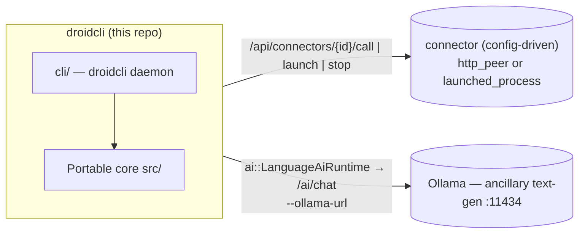
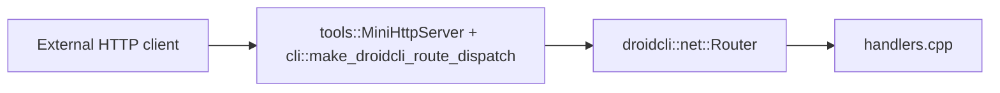

# droidcli - Architecture

Portable C++17 library for Droidcli **control logic**: HTTP route handlers,
the connector/task-queue system, media decode, session snapshots, and the
Ollama AI seam (incl. tool-calling). The droidcli host (`cli/`) supplies
transport, process I/O, and API auth through thin callbacks.

App version: **droidcli 0.1.0** (first release under this name).

---

## System context — a core plus config-driven connectors

droidcli is the **agent controller and network trigger** at the center of an
open-ended set of peer applications. The portable core decides *what* should
happen; the droidcli host performs the actual transport, process control, and
dispatch. Peers are **connectors defined in config** (or registered at
runtime over HTTP) — the core has zero compiled-in knowledge of any specific
peer app.



| Concern | What it owns | Seam in this repo |
| ------- | ------------ | ----------------- |
| **droidcli core + host** | Control logic, command + task dispatch, HTTP in/out, process control | — |
| **A connector** (operator-configured) | Whatever the operator points it at — an inference server, a media player, anything reachable by URL or local command | `net::Connector` (`http_peer` or `launched_process`), registered via `--config` or `POST /api/connectors` |

> **Ollama stays separate.** Ollama is a general **text-generation** endpoint
> behind `ai::LanguageAiRuntime` / `/ai/chat` — it is not a connector, it's
> built into the core AI seam. Any purpose-trained inference service is
> registered as an ordinary
> `http_peer` connector instead, with no special-cased code path. All
> endpoints/models are **configuration**, never baked into core.

---

## Design goals

| Goal                   | How                                                                     |
| ---------------------- | ----------------------------------------------------------------------- |
| Portability            | C++17, `droidcli::core::`* value types, no engine/framework types      |
| Single source of truth | Command validation, JSON shapes, connector/task state                   |
| Testability            | CMake + unit tests without network, GPU, or GUI                         |
| Host bridge            | Hosts inject transport/process I/O via `std::function` callbacks        |

**Rule of thumb:** if it touches a real socket, process, window, or the
filesystem at runtime, it stays in the host. If it is pure state + parsing +
validation + JSON, it belongs in core.

---

## Repository layout

```
metaagent/                        (repository directory name unchanged)
├── droidcli_core.h                Umbrella public API
├── droidcli_core.cpp              Single TU — #includes all module .cpp files
├── src/
│   ├── initialize.hpp             initialize_defaults()
│   ├── core/                      Vec3, math, log_sink, value types, spawn() attribution
│   ├── media/                     PNG/JPEG decode, probe, MediaStore
│   ├── net/                       Route table, handlers, connector, json
│   ├── notify/                    Notify body parsing
│   ├── session/                   RuntimeSession + status strings
│   ├── app/                       tasks (persistent task queue)
│   ├── ai/                        Ollama text-gen client (incl. tool-calling) + LanguageAiRuntime + ModelProvider interface
│   └── intent/                    Deterministic "open X" phrase recognizer (no LLM, no I/O)
├── cli/                            droidcli host: DroidHost, ProcessManager, command_runner, MemoryStore (SQLite), HTTP route mount, entrypoint
├── tools/                         mini_http_server + sync_http_client (raw-socket HTTP, WinHTTP for https://)
├── tests/                         One *_test.cpp per core module
├── third_party/sqlite/            Vendored SQLite amalgamation (committed - see third_party/README.md)
├── config/                         Example connector config (connectors.example.json)
├── distribute/                    Dist templates (run_all.bat, README)
├── CMakeLists.txt
├── README.md
└── ARCHITECTURE.md
```

Public entry point: `#include "droidcli_core.h"`.

---

## Modules

| Module                    | Role                                                                  |
| ------------------------- | --------------------------------------------------------------------- |
| `core/types` + `math`     | `String`, `Array`, `Vec3`, color types, math helpers                  |
| `core/spawn`              | **Spawn attribution**: `spawn(name, fn, sink)` - named `std::thread` construction reporting "spawned"/"joined"/"threw: ..." via an optional `ThreadEventSink`, no logging mechanism of its own. `cli/tui.cpp`'s background threads wire the sink to `DroidHost::log_thread_event` |
| `media/decode` + `probe`  | FFmpeg-backed decode + probe (host stages the DLLs)                   |
| `net/router` + `handlers` | `/health`, `/echo`, `/notify`, `/ai/chat`                             |
| `net/connector`           | **Generic peer registry**: `Connector` (`http_peer` \| `launched_process`), `ConnectorRegistry` register/unregister/list/find, JSON build/parse |
| `net/json`                | Escape/build/extract JSON fields (no external JSON dependency)        |
| `notify/parse`            | Notify body parsing (JSON or text)                                    |
| `session/types` + `status`| `RuntimeSession`, `FeatureFlags` (ai/networking/recording/ui), status |
| `app/tasks`               | **Persistent task queue**: `Task` (incl. `result_json`), `TaskQueue` (enqueue/claim_next/complete/fail/find/list), JSON build/parse |
| `ai/ollama_client`        | Ollama request/response shaping, incl. **tool-calling**: `ToolDefinition`/`ToolCall`, `"tools"` request field, `message.tool_calls` response parsing, `ChatRole::Tool` |
| `ai/language_runtime`     | Transcript + turn state for **Ollama text-gen** (`/ai/chat`); POST via `LanguageAiTransportCallbacks`. Separate from any connector-registered inference peer. Single-shot (no tool-calling) - the multi-hop agent loop lives in `DroidHost::agent_turn` instead |
| `ai/model_provider`       | **Provider abstraction**: `ModelProvider` interface (`build_request`/`parse_response`) + `OllamaProvider` adapter over `ai/ollama_client`. `DroidHost::agent_turn` is coded against the interface - see "Provider abstraction" in the extension plan |
| `intent/open_intent`      | Deterministic "open X" phrase recognizer (pure string scanning, no LLM, no I/O) - backs `POST /api/apps/quick_open`, see "Quick-open" below |

The droidcli host (`cli/`) additionally owns: the config store, the
`ConnectorRegistry` + `TaskQueue` instances and their dispatch (`call_connector`
for `http_peer`, `launch_connector`/`stop_connector` for `launched_process`,
`tick_tasks()` draining the queue, including a `"run"` command dispatched to
`command_runner`), the **ProcessManager** (Job Object/process-group launch of
any `launched_process` connector with PID tracking), **`command_runner`**
(one-shot, synchronous, timeout-bounded shell command execution with captured
stdout/stderr - `POST /api/run` and the `"run"` task command - plus
`launch_application`, a detached fire-and-forget GUI-app launch with no wait
and no output capture, distinct from the blocking `run_command_once` -
resolves a bare app name against the Windows App Paths registry first (how
most GUI installers register themselves, e.g. `chrome` even though it's
never added to PATH), then PATH, then falls back to the **`app_index`**
installed-apps index if both fail - `POST /api/open`), **`app_index`**
(`scan_installed_applications()`, Windows' Add/Remove Programs/Uninstall
registry entries under HKLM native + WOW6432Node + HKCU, resolving each
entry's `DisplayIcon` or a shallow `InstallLocation` scan to an actual
`.exe`; scanned once at `DroidHost::initialize()` and cached, not re-scanned
per lookup - covers apps that never registered on PATH or in App Paths at
all, e.g. Blender or KiCad - `POST /api/apps/find`), **`window_list`**
(`list_open_windows()`, `EnumWindows` filtered to visible/titled top-level
windows with owning process name + PID via `QueryFullProcessImageNameA` -
the same set Alt+Tab shows; a live, uncached snapshot re-enumerated every
call, unlike `app_index`'s scan-once - `GET /api/apps/open`),
**`filesystem_tools`**
(`read_file`/`write_file`/`list_dir`/`stat_path`/`get_current_working_directory`/
`which_executable`, `std::filesystem`-backed, no external dependency - `POST
/api/fs/*`), **`memory_store`** (`MemoryStore`, SQLite-backed persistent
agent-turn history keyed by session id - see "Persistent memory" below -
`GET /api/agent/history`, `GET /api/agent/sessions`), and
**`DroidHost::agent_turn`** (a bounded tool-calling loop, against a
`ai::ModelProvider` - Ollama today - over a fixed tool set - connectors,
tasks, shell commands, app launches, open-window queries, and filesystem
primitives - each tool implemented by calling back into `DroidHost`'s own
methods, self-contained rather than delegating to another process or MCP
server; every hop (user message, tool call + result, final reply, and
failure paths) is logged via `append_app_log()` under the `chat` channel and
persisted via `record_agent_message()` to `memory_store` - `POST
/api/agent/turn`).

---

## HTTP flow



Inbound: `tools::MiniHttpServer` (raw-socket, no httplib) binds the socket,
parses headers into `net::HttpRequest`, and - before any route is dispatched -
checks the bearer token for every `/api/*` path and `/ai/chat` (see "HTTP API"
below), returning `401` on failure. Requests that pass the check are
tried against the portable `net::RouteTable` (`/health`, `/echo`, `/notify`,
`/ai/chat`); anything else falls through to
`cli::make_droidcli_route_dispatch`'s `CustomRouteFn`, which covers `/api/*`
(status/config/ollama/process/run/agent/connectors/tasks).
Outbound: `tools::sync_http_client` performs the POST/GET (raw socket for
`http://`, WinHTTP for `https://`); core builds and parses the bodies.

---

## HTTP API

### Security: API authentication

droidcli's HTTP API can execute shell commands (`/api/run`) and drive an LLM
tool-calling loop that can call those same routes (`/api/agent/turn`) — so
every `/api/*` route, plus `/ai/chat` (an Ollama call has a real cost even
though it can't run shell commands), requires an
`Authorization: Bearer <token>` header. `/health`, `/echo`, and `/notify` stay
open since they're read-only/log-only and liveness checks shouldn't need a
token.

The token comes from, in order: `--token <value>`, the `DROIDCLI_API_TOKEN`
env var, or — if neither is set — a random 32-byte (64 hex char) token
generated at startup and printed to the console:

```
droidcli: generated API token (save this): 3f9a1c...
```

droidcli **never** starts the HTTP API with authentication disabled. A
request without a valid token gets `401 Unauthorized`:

```sh
curl -i http://127.0.0.1:30080/api/status
# HTTP/1.1 401 ...
# {"error":"unauthorized","message":"missing or invalid Authorization: Bearer <token> header"}

curl -i http://127.0.0.1:30080/api/status -H "Authorization: Bearer 3f9a1c..."
# HTTP/1.1 200 ...
```

The in-process TUI (`cli/tui.cpp`) calls `DroidHost` methods directly, not
over HTTP, so it never needs the token.

### Routes

`[auth]` marks routes that require the `Authorization: Bearer <token>` header.

| Method | Route | Description |
| ------ | ----- | ------------ |
| `GET` | `/health` | Liveness + session snapshot (portable handler, no auth) |
| `GET` / `POST` | `/echo` | Echo query/body (no auth) |
| `POST` | `/notify` | Ingest notify event (no auth) |
| `POST` | `/ai/chat` `[auth]` | Ollama text-gen chat via `LanguageAiRuntime` |
| `GET` | `/api/status` `[auth]` | Host status: AI-enabled flag, connector/task counts |
| `GET` | `/api/network/status` `[auth]` | Networking flag + connector count |
| `GET` | `/api/config` `[auth]` | Effective host configuration (Ollama) |
| `POST` | `/api/config` `[auth]` | Update host configuration at runtime |
| `GET` | `/api/notify/log` `[auth]` | Recent notify messages |
| `GET` | `/api/app/log` `[auth]` | Recent host application log |
| `POST` | `/api/run` `[auth]` | Run a one-shot shell command — body `{"command":"...","work_dir":"...","timeout_ms":30000}` |
| `POST` | `/api/ffmpeg/run` `[auth]` | Run ffmpeg (resolved via `PATH` or `$DROIDCLI_FFMPEG_ROOT`) — body `{"args":"...","work_dir":"...","timeout_ms":120000}` |
| `GET` | `/api/system` `[auth]` | The host machine droidcli is running on — `os_name`/`os_version`/`architecture`/`hostname`/`username`/`cwd`, queried once at startup |
| `POST` | `/api/open` `[auth]` | Launch a GUI application, detached (no wait, no output capture) — body `{"path_or_name":"...","args":"...","work_dir":"..."}` |
| `POST` | `/api/apps/find` `[auth]` | Search the installed-apps index (scanned at startup) — body `{"query":"..."}`, returns `{"matches":[{"name":...,"path":...}]}` |
| `POST` | `/api/apps/quick_open` `[auth]` | Deterministic, LLM-free "open X" recognizer — body `{"message":"..."}`, returns `{"matched":bool,"app_name":"...","ambiguous":bool,"resolved_name":"...","resolved_path":"...","candidates":[...]}` (see "Quick-open" below) |
| `GET` | `/api/apps/open` `[auth]` | Live snapshot of currently open windows — `{"windows":[{"title":...,"process_name":...,"pid":...}]}`, re-enumerated fresh on every call |
| `POST` | `/api/fs/read` `[auth]` | Read a file — body `{"path":"...","max_bytes":65536}`, response reports `truncated` |
| `POST` | `/api/fs/write` `[auth]` | Write/append a file — body `{"path":"...","content":"...","append":false}` |
| `POST` | `/api/fs/list` `[auth]` | Non-recursive directory listing — body `{"path":"..."}` (omit for cwd) |
| `POST` | `/api/fs/stat` `[auth]` | Check existence/type/size of a path — body `{"path":"..."}` |
| `GET` | `/api/fs/cwd` `[auth]` | droidcli's current working directory |
| `POST` | `/api/fs/which` `[auth]` | Resolve an executable against `PATH` — body `{"name":"..."}` |
| `POST` | `/api/agent/turn` `[auth]` | Tool-calling agent turn — body `{"message":"...","clear":false,"session_id":"..."}`, response includes `"session_id"` (see "Persistent memory" and "Phase 6" below) |
| `POST` | `/api/agent/tool_decision` `[auth]` | Resolve a gated tool call `agent_turn` paused on — body `{"approved":bool,"session_id":"...","reason":"..."}` (see "Phase 6" below) |
| `POST` | `/api/agent/lessons` `[auth]` | Record a "this broke, this fixed it" command lesson — body `{"tool":"...","broken":"...","failure_reason":"...","working":"...","lesson":"..."}` |
| `POST` | `/api/agent/lessons/search` `[auth]` | Case-insensitive substring search over recorded lessons — body `{"query":"..."}` |
| `GET` | `/api/agent/tools` `[auth]` | The agent's fixed tool set — `{"tools":[{"name":...,"description":...,"parameters":{...}}]}` |
| `GET` | `/api/agent/history` `[auth]` | One session's persisted message history — `?session_id=...` (defaults to the current session), returns `{"session_id":"...","messages":[{"hop_index":N,"role":"...","content":"...","created_at":"..."}]}` |
| `GET` | `/api/agent/sessions` `[auth]` | Every session id with persisted history, most recently active first — `{"current_session_id":"...","session_ids":[...]}` |
| `GET` | `/api/ollama/status` `[auth]` | Ollama text-gen endpoint status + model list |
| `POST` | `/api/ollama/config` `[auth]` | Update Ollama model at runtime |
| `GET` | `/api/ollama/setup-status` `[auth]` | Whether Ollama is installed/online, pulled models, configured-model status (drives the TUI's in-chat setup flow) |
| `POST` | `/api/ollama/install` `[auth]` | Run `winget install --id Ollama.Ollama ...` (blocking) |
| `POST` | `/api/ollama/start` `[auth]` | Launch `ollama serve` and poll until reachable (blocking) |
| `POST` | `/api/ollama/pull` `[auth]` | Pull a model and make it the active one — body `{"model":"..."}` (blocking) |
| `GET` | `/api/process/status` `[auth]` | PID + running state of every launched connector process |

**Connectors** (generic peer config; all `[auth]`):

| Method | Route | Description |
| ------ | ----- | ------------ |
| `GET` | `/api/connectors` | List all registered connectors |
| `POST` | `/api/connectors` | Register (or replace) a connector — body is a `Connector` JSON object |
| `GET` | `/api/connectors/{id}/status` | Liveness: PID/running for `launched_process`, `/health` probe for `http_peer` |
| `POST` | `/api/connectors/{id}/launch` | Launch a `launched_process` connector (Job Object / process group, PID-tracked) |
| `POST` | `/api/connectors/{id}/stop` | Stop it |
| `POST` | `/api/connectors/{id}/call` | Proxy an HTTP call to an `http_peer` connector — body `{"path":"/api/x","method":"POST","payload_json":"{...}"}` |

**Tasks** (persistent pending/running/done/failed queue; `tick_tasks()` runs every poll loop iteration and dispatches one pending task per tick; all `[auth]`):

| Method | Route | Description |
| ------ | ----- | ------------ |
| `GET` | `/api/tasks` | List all tasks (history capped, pending/running always kept) |
| `POST` | `/api/tasks` | Enqueue a task — body `{"connector_id":"...","command":"launch\|stop\|run\|<path>","payload_json":"{...}"}` |
| `GET` | `/api/tasks/{id}` | Task status, including `result_json` once done (e.g. captured stdout/stderr for a `"run"` task) |

A task with `command: "launch"` or `"stop"` calls `launch_connector`/`stop_connector`
on its `connector_id`; `command: "run"` runs `payload_json`'s `{"command":"...","work_dir":"..."}`
as a one-shot shell command (no `connector_id` needed); any other command is
treated as the HTTP path to call on an `http_peer` connector.

### Quick-open (`POST /api/apps/quick_open`) — hardening app launches against LLM unreliability

Opening an application is common enough, and consequential enough, that it
should not depend on a local model reliably deciding to call a tool. Early
testing showed a small Ollama model asked to "open Blender" sometimes
apologizing that it "can't open applications" instead of calling
`open_application` - the tool existed, the model just didn't use it. Rather
than trying to prompt-engineer that away, `intent::parse_open_intent()`
(`src/intent/open_intent.hpp`/`.cpp`, portable core, network-free, unit
tested in `tests/intent_test.cpp`) recognizes a narrow, deterministic shape -
"open X", "launch X", "start X", optionally wrapped in courtesy phrasing
("can you ...", "please ...") and trailing filler ("... for me", "... now")
- with pure string scanning, no LLM call. Matching requires the verb to be
the first word of the message (after stripping courtesy prefixes), so an
ordinary question like "how do I open a file in Python" is not hijacked -
that keeps reaching the full agent/LLM path in `POST /api/agent/turn`.

`DroidHost::try_quick_open_json()` (`cli/host.cpp`) resolves a recognized
`app_name` against the same installed-apps index `find_application` uses
(`installed_apps_`, including the built-in-accessories table added to
`app_index.cpp` - see below) and reports one of three outcomes: an
unambiguous single match, an ambiguous set of candidates, or nothing found
(in which case the raw name is still offered as an `open_application`
attempt, since that call has its own independent App Paths/PATH resolution
beyond the index). The TUI (`cli/tui.cpp`) calls this on every Enter press
*before* the Ollama-setup state machine or the agent-turn worker thread; if
it matches, the TUI asks the user to confirm (yes/no, or a number if
ambiguous) and only then calls `open_application` - so the LLM is bypassed
for recognition, but a human still approves every actual launch. This is a
deliberately narrow fast path: anything that doesn't match the shape falls
through to the full tool-calling loop unchanged.

`app_index.cpp` also gained a small built-in-accessories table (Notepad,
Calculator, Paint, Command Prompt, PowerShell, File Explorer, Task Manager,
Control Panel, Snipping Tool, Magnifier, Registry Editor, Character Map,
Remote Desktop Connection, Disk Cleanup) appended to the startup scan -
these ship with Windows and never register an Add/Remove Programs entry, so
the Uninstall-registry scan alone could never find them. Name matching
(`normalize_for_match()` in `cli/host.cpp`) is case- and
spacing/punctuation-insensitive, so "NotePad", "NOTEPAD", and "note pad" all
resolve identically.

### Persistent memory (SQLite) — `cli/memory_store.cpp`

droidcli's Core-tier "memory" role (see the ZeroClaw crate comparison below).
Every message `DroidHost::agent_turn` adds to a session's transcript - the
system prompt, the user's message, the model's replies, tool results - is
also appended to a SQLite-backed `MemoryStore` (`cli/memory_store.hpp`/`.cpp`,
schema: `memory_entries(session_id, hop_index, role, content, created_at)`),
not just the in-process `agent_transcript_` `std::vector` that existed
before. This is real file I/O, so it lives in `cli/` (host), linked against
the vendored SQLite amalgamation (`third_party/sqlite/`, see
`third_party/README.md`) - never in the portable `droidcli_core` library, per
`AGENTS.md`'s Golden rule. The database file (`db/droidcli_memory.sqlite3`,
git-ignored like everything else under `db/` - see `db/README.md`) is opened once at
`DroidHost::initialize()`; a failed open leaves the store closed and
`record_agent_message()`/the history routes degrade to in-memory-only
behavior rather than crashing the daemon over it.

**Sessions, not one global transcript.** `DroidHost` tracks a
`current_session_id_`, freshly generated every process start (a short
timestamp + disambiguator, e.g. `20260715T121525-e3f4` - no auto-resume by
default). `POST /api/agent/turn`'s body may include `"session_id"`:

- Omitted → continues whatever session this process is currently on.
- A previously-returned id → **resumes that session**, including across a
  restart: its persisted history is replayed from `MemoryStore` into
  `agent_transcript_` before the new message is appended. This is what makes
  "killed and restarted droidcli mid-conversation, sent the same
  `session_id` again" actually continue the same transcript - verified by
  hand: a system+user message pair persisted, the process was killed and
  restarted, and `GET /api/agent/history?session_id=...` still returned both
  messages afterward.
- `"clear": true` always starts a **brand new** session id (old history isn't
  deleted, just no longer active), ignoring any `session_id` in the same
  request.

Every `agent_turn` response includes the active `"session_id"` - a caller
that wants to resume a conversation later needs to hold onto it.
`cli/tui.cpp` does exactly this: it holds the current session's id in memory
for the process's lifetime (shown in the UI as a `session: <id>` status
line), writes it to `db/droidcli_last_session.json` (git-ignored, see
`db/README.md`) whenever a turn returns one, and on the *next* launch reads
that file and calls `GET`-equivalent `build_agent_history_json()` directly
(a local SQLite read, safe to call synchronously before `screen.Loop()`
starts) to replay the prior conversation into the chat panel and resume
sending with that `session_id` - so restarting the TUI itself, not just the
underlying `droidcli` daemon, continues where you left off. Pressing `n`
(connectors-panel focus) starts a brand new session on the next message
instead (same semantics as `"clear":true`), for when starting fresh is what
you actually want.

**Deliberately minimal**: no embeddings, no vector retrieval, no eviction
policy. Durability (survive a restart) and queryability (`GET
/api/agent/history`, `GET /api/agent/sessions`) are the whole scope - the
extension plan below is explicit that semantic recall is separate,
meaningfully bigger work that nothing in droidcli needs yet.

### The agent turn (`POST /api/agent/turn`)

Drives a bounded (5-hop) tool-calling loop against a `ai::ModelProvider`
(Ollama today via `ai::OllamaProvider` - see "Provider abstraction" in the
extension plan below and `src/ai/model_provider.hpp`): the model sees a fixed
tool set and can call any of them against this `DroidHost` instance before
replying in natural language. The tool set is defined once, in
`DroidHost::agent_tool_definitions()` (`cli/host.cpp`) - `GET
/api/agent/tools` is its live source of truth (also rendered as the TUI's
"Agent Tools" panel), so it's deliberately not duplicated here where it would
just go stale as tools are added. Every message added to the transcript is
also persisted via `MemoryStore` (see "Persistent memory" above).

Side-effecting tools (anything that writes to disk, runs a shell command, or
touches a connector/process/task) don't execute the instant the model
requests them - the loop pauses for human approval first, and every tool
result carries a uniform `"ok"` contract the model can trust. See "Phase 6 -
Agent tool-result reliability & human-in-the-loop approval" below for both.

```sh
curl -X POST http://127.0.0.1:30080/api/agent/turn \
  -H "Authorization: Bearer <token>" \
  -H "Content-Type: application/json" \
  -d '{"message":"list the registered connectors"}'
```

Response shape:

```json
{
  "ok": true,
  "assistant": "You have 2 connectors registered: ...",
  "session_id": "20260715T121525-e3f4",
  "actions": [
    {"tool": "list_connectors", "arguments_json": "{}", "result_json": "{\"connectors\":[...]}"}
  ]
}
```

If Ollama is disabled or unreachable, or the transcript budget (5 hops) runs
out before a final natural-language reply, the response is still valid JSON
(`ok:false` with an `error`, or `ok:true` with `budget_exhausted:true` and the
last assistant text) rather than a crash. The model also never gets a blank
`"assistant"` field - a genuinely empty model response is replaced with a
visible placeholder rather than surfaced as silence. An `ok:false` response
from a failed provider call still includes `"session_id"` - the user's
message was persisted before the call was attempted, so a caller can find it
via `GET /api/agent/history` even though the turn itself failed. (The two
earliest failure paths - missing `"message"`, AI disabled entirely - return
before any session is touched, so they have no `session_id` to report.)

### One-shot commands (`POST /api/run`)

```sh
curl -X POST http://127.0.0.1:30080/api/run \
  -H "Authorization: Bearer <token>" \
  -H "Content-Type: application/json" \
  -d '{"command":"echo hello","work_dir":"","timeout_ms":30000}'
# {"ok":true,"launched":true,"exit_code":0,"stdout":"hello\r\n","stderr":"","error":""}
```

Synchronous and blocking (unlike the PID-tracked `launched_process` connector
lifecycle) — captures stdout/stderr and enforces `timeout_ms`, killing the
process and reporting `error` if it's exceeded. `"ok"` (`command_succeeded()`
in `cli/command_runner.hpp`) is `launched && exit_code == 0 &&
error_message.empty()` - the same contract `/api/ffmpeg/run` and every other
agent tool follow, see "Phase 6" below for why this is load-bearing.

---

## Build

### Standalone

```powershell
cd metaagent
cmake -S . -B build -DCMAKE_BUILD_TYPE=Release
cmake --build build
ctest --test-dir build --output-on-failure
```

Tests: `media_decode_test`, `net_handler_test`, `ollama_client_test`,
`language_runtime_test`, `connector_test`, `task_queue_test`, `intent_test`,
`model_provider_test`, `spawn_test`.

On Windows the whole tree builds with **one MSVC runtime**
(`CMAKE_MSVC_RUNTIME_LIBRARY` in the root CMakeLists: dynamic Debug, static
Release) — never set a per-target runtime that diverges.

---

## Roadmap: packaging as a self-contained daemon assistant

droidcli is heading toward the same shape as ZeroClaw
(https://docs.zeroclawlabs.ai): a single long-running daemon process on the
user's own machine that both *understands* requests (via the Ollama seam) and
*acts* on them directly (via native `DroidHost` tools - no external agent
runtime, no MCP client chain, no cloud round-trip required to execute a local
action). The pieces below are not built yet; this section is the design
record for how they should fit once they are, so packaging decisions get made
once instead of re-litigated per feature.

**Bootstrapped self-knowledge, not blank-slate prompting.** The daemon already
knows facts about the machine it runs on before the user ever types anything -
the installed-apps index (`app_index.cpp`, scanned once at
`DroidHost::initialize()`), the open-window snapshot (`window_list.cpp`), and
`which`/PATH resolution. `HostConfig::system_prompt` and the count appended in
`DroidHost::agent_turn()` (`cli/host.cpp`) exist to turn that bootstrapped
state into something the model is *told as fact*, not something it has to be
argued into believing it can do. As more startup-time system facts get added
(installed shells/interpreters, GPU presence, disk space, logged-in user),
the same pattern applies: scan once at `initialize()`, cache on `DroidHost`,
and fold a concrete summary into the system prompt rather than leaving it
purely tool-call-discoverable - a model should never have to be told twice
that a capability exists.

**No MCP client, ever (see `AGENTS.md` guardrails).** Every new capability is
a new `DroidHost` method plus a matching `agent_tool_definitions()` /
`execute_agent_tool()` entry (`cli/host.cpp`) - the same surface `/api/*`
already exposes over HTTP. This keeps the trust boundary singular: whatever
`/api/agent/turn` can do, an operator can already see and call directly over
HTTP with the same bearer token. If droidcli ever speaks MCP, it is as a
*server* (exposing its own tool set to external MCP clients), never as a
*client* pulling in a third party's tool implementations - that would break
the "one process, one binary, no supply chain" property this whole roadmap is
about.

**True background operation.** `--daemon` is currently a documented no-op
(`cli/droidcli.cpp` always runs foreground); a real implementation needs:
Windows Service (`SERVICE_WIN32_OWN_PROCESS`, via `ServiceMain`/
`RegisterServiceCtrlHandler`) and a POSIX/systemd unit (`Type=simple` or
`Type=notify`) as two host-side entry points sharing the same `DroidHost`.
`--headless` (skip the FTXUI TUI, keep the HTTP daemon loop) is the correct
foundation for this - a service wrapper is just another host that never
constructs a `ScreenInteractive`.

**Auto-start of the API, opt-in for actions.** The daemon binding its HTTP
port and accepting `/api/*` calls at boot is safe to make automatic (it is
inert until called and gated by the bearer token per `AGENTS.md`'s auth
guardrail). Launching a `launched_process` connector automatically is not -
`AGENTS.md` already establishes that connectors only launch when told to
(`POST /api/connectors/{id}/launch` or a queued task), and that design choice
should hold for any future "run at startup" feature: an operator opts a
*specific* connector or task into auto-start via its own config, the daemon
itself never decides to launch something unprompted.

**Distribution stays single-binary.** `build_and_distribute.bat` already
stages `droidcli.exe` + FFmpeg DLLs into `dist/`; the packaging goal is that
this stays the *only* thing an end user installs - no Python runtime, no
node_modules, no sidecar interpreter. Ollama is the one external dependency,
and it already has its own install/start/pull lifecycle exposed through
`DroidHost` (`install_ollama()`/`start_ollama()`/`pull_ollama_model()` in
`cli/host.cpp`) precisely so the daemon can bootstrap its own AI backend
without the user leaving droidcli. Any future capability that seems to need a
new external runtime should be questioned against this constraint first.

**Token and secret handling scale the same way they do today.** As more
connectors/tools carry credentials (API keys for `http_peer` connectors,
future cloud-model fallbacks), the existing rule holds: never echo a secret
back via a config read, only a `*_configured: bool` (see `CLAUDE.md`). A
packaged daemon that runs unattended is a higher-value target for credential
exfiltration than an interactively-run one, so this rule gets stricter, not
looser, as auto-start lands.

---

## Comparison to ZeroClaw's crate architecture

ZeroClaw (https://docs.zeroclawlabs.ai) is a Rust cargo workspace of ~18
crates split into three tiers: **Core** (runtime/config/memory/providers/
tools), **Edge** (channels/gateway — the crates that talk to the outside
world), and consumers of the public **API** trait layer (`ModelProvider`,
`Channel`, `Tool`, `Memory`, `Observer`, `RuntimeAdapter`, `Peripheral`).
droidcli is a single C++ static library plus one executable, not a
multi-crate workspace, so this is not a plan to reshape droidcli into 18
targets — it is a role-by-role check of what droidcli already covers, what's
partial, and what would be genuinely new work if droidcli grew toward the
same capability set.

The diagram below is drawn in the same three-tier shape as ZeroClaw's
(External world → Edge → Core → external providers/OS), not the old
"portable core vs. host" split from the Roadmap section above. That
core-vs-host line is a real, load-bearing rule for *where new code physically
goes* inside `src/`/`cli/` (see the Golden rule in `AGENTS.md`) — but it is an
implementation detail, not the product's architecture, and conflating the two
made droidcli look like it had no Core/Edge shape at all. It has one; `src/`
and `cli/` are just how that shape is currently split across translation
units, not where the tier boundaries are.


### Crate-by-crate mapping

The **droidcli module** column names the logical grouping each row belongs to
(matching the tier diagram above, e.g. `RUNTIME`/`droidcli-runtime`) - it is
not a separate CMake target or library. droidcli stays one static library
plus one executable; these are conceptual module boundaries within
`src/`/`cli/`, named consistently so this table and the diagram use the same
vocabulary, not a claim that droidcli is secretly an 18-target build.

| ZeroClaw crate | droidcli module | Role | droidcli equivalent | Status |
| --- | --- | --- | --- | --- |
| `zeroclaw-runtime` | `droidcli-runtime` | Agent loop, security policy, SOP engine, cron, SubAgents, RPC | `DroidHost::agent_turn`/`run_agent_tool_loop` (`cli/host.cpp`) — one bounded tool-calling loop | **Partial** — real security-policy layer beyond the bearer token: side-effecting tools require human approval before executing (Phase 6, done, `POST /api/agent/tool_decision`); `TaskQueue` now has one-shot delayed scheduling (`Task::scheduled_for_ms`, Phase 9, "in N minutes") but no *recurring* cron and no SOP engine/SubAgents/RPC |
| `zeroclaw-config` | `droidcli-config` | TOML schema, secrets encryption, autonomy levels, workspace resolution | `HostConfig` (`cli/host.hpp`) + CLI flags + `connectors.json` | **Partial** — flat JSON/CLI flags not TOML, token is plaintext (env var or CLI arg, never echoed back — see `CLAUDE.md`), no autonomy levels, no workspace concept |
| `zeroclaw-api` | `droidcli-api` *(interface only, cross-cutting — not its own .cpp module)* | Public traits: `ModelProvider`, `Channel`, `Tool`, `Memory`, `Observer`, `RuntimeAdapter`, `Peripheral` (kernel ABI) | `ai::ModelProvider` (`src/ai/model_provider.hpp`) is the `ModelProvider` equivalent; `net::Connector` is the closest thing to a `Channel`/`Peripheral` abstraction; `ai::ToolDefinition`/`ToolCall` is the Tool ABI | **Partial** — `ModelProvider` now exists as a real interface (Phase 1, done); `Connector` still covers what ZeroClaw splits into `Channel`+`Peripheral`; no `Memory`/`Observer` trait abstractions (though `MemoryStore` now exists as a concrete class, see `zeroclaw-memory` below) |
| `zeroclaw-providers` | `droidcli-providers` | LLM client impls (Anthropic/OpenAI/Ollama/…) + hint router + retry | `ai::ModelProvider` interface + `ai::OllamaProvider` (`src/ai/model_provider.{hpp,cpp}`, adapting the tested `ai/ollama_client.cpp`) | **Have the abstraction, one implementation** — `agent_turn` (`cli/host.cpp`) is coded against `ai::ModelProvider`, not Ollama directly (Phase 1, done); adding Anthropic/OpenAI means implementing the interface, no router/retry wrapper yet since there's nothing to route between |
| `zeroclaw-channels` | `droidcli-channels` *(planned, Phase 4 - not started)* | 30+ messaging integrations (Discord, Slack, Telegram, …) | None | **Missing entirely** — `Connector` generalizes the concept but nothing implements a messaging-channel connector yet |
| `zeroclaw-gateway` | `droidcli-gateway` | HTTP/WebSocket gateway, web dashboard, webhook ingress | `tools::MiniHttpServer` + `cli/http_mount.cpp` | **Partial** — REST exists; no WebSocket, no dashboard UI, webhook auth is the same bearer-token gate as everything else |
| `zeroclaw-tools` | `droidcli-tools` | Callable tool implementations (browser, HTTP, PDF, hardware probes) | `filesystem_tools.cpp`, `command_runner.cpp`, `window_list.cpp`, `app_index.cpp`, `intent/open_intent.cpp`, `ffmpeg_tool.cpp`, `system_info.cpp` | **Have**, functionally — not split into a separate module boundary, all linked straight into `cli/`/`src/`. `system_info.cpp` is droidcli's environment-grounding tool (OS, architecture, real Desktop path via the Windows Known Folder API - Phase 7, done) - the ZeroClaw comparison doesn't have a named equivalent for "know what machine you're actually on," but it's the same self-contained-capability shape as every other tool here |
| `zeroclaw-tool-call-parser` | `droidcli-providers` *(folded in, not a separate module)* | Model-side tool-call syntax parsing/normalization | `ai::ollama_client`'s `tool_calls` JSON parsing | **Partial** — handles Ollama's native tool-call format only, nothing to normalize across providers since there's only one |
| `zeroclaw-memory` | `droidcli-memory` | Conversation memory, embeddings, vector retrieval | `MemoryStore` (`cli/memory_store.{hpp,cpp}`, SQLite-backed) + `agent_transcript_` (in-process working copy) | **Have durability/queryability + procedural memory, no semantic recall** — every message is persisted per-session and survives a restart (Phase 2, done, verified: kill/restart droidcli, `GET /api/agent/history?session_id=...` still returns the prior turn); the same database also now holds `command_lessons` - model-recorded "this broke, this fixed it" pairs the agent can search before repeating a past mistake (Phase 8, done) - a form of procedural/lessons-learned memory, distinct from conversation history but living in the same store; still no embeddings, no vector retrieval - deliberately out of scope, see the extension plan below |
| `zeroclaw-plugins` | — | Dynamic plugin loading | None | **Missing** — deliberately: `AGENTS.md` keeps capabilities as native `DroidHost` methods rather than a loadable-plugin surface |
| `zeroclaw-hardware`, `aardvark-sys`, `robot-kit` | `droidcli-hardware` *(proposed — see "Hardware awareness" below, not yet built)* | GPIO/I2C/SPI/USB, specialized hardware | None | **Under discussion, scoped narrower than the ZeroClaw crate** — read-only local hardware/environment enumeration (what's plugged in, where this machine is), explicitly not GPIO/robotics control; see the new section below for why the original "not planned" verdict is being revisited for a narrower slice |
| `zeroclaw-infra` | `droidcli-infra` | SQLite session backend, debouncers, stall watchdog | `MemoryStore` (SQLite, see `zeroclaw-memory`), `db/droidcli_state.json` (flat file, connector persistence), `logs/log.txt` | **Partial** — SQLite session backend now exists (Phase 2, done); a throttled watchdog now exists too (`DroidHost::tick_watchdog()`, Phase 9 - folded into the existing poll loop rather than a separate debouncer/thread abstraction) |
| `zeroclaw-log` | `droidcli-log` | Structured JSONL logging, attribution, `record!`/`scope!` macros, Observer bridge | `DroidHost::append_app_log()` + `logs/log.jsonl` | **Have JSONL + partial attribution** — one JSON object per line, `session_id` attribution on `"chat"`-channel entries (Phase 3, done); no `record!`/`scope!`-equivalent macros (C++ has no direct analog), no Observer bridge |
| `zeroclaw-spawn` | `droidcli-spawn` | Sanctioned `tokio::spawn` wrapper with attribution propagation | `core::spawn()` (`src/core/spawn.hpp`/`.cpp`) + `DroidHost::log_thread_event` | **Have** (Phase 5, done) — named `std::thread` construction reporting "spawned"/"joined"/"threw: ..." into `logs/log.jsonl` under the `"thread"` channel; used by `cli/tui.cpp`'s `poller` and `chat_worker`. Not a thread pool/scheduler, same one-thread-in-one-thread-out semantics as a bare `std::thread` |
| `zeroclaw-macros` | — | Derive macros for config/tool registration | N/A | **N/A** — different language; C++ has no derive-macro equivalent, tool registration is the manual `agent_tool_definitions()` list instead |
| `zerocode` | `droidcli-tui` | Terminal UI | `cli/tui.cpp` (FTXUI) | **Have** |

### What this means for droidcli

The honest read, as of Phases 1–3 and 5 landing: droidcli now has a real
provider abstraction, durable/queryable session memory, structured JSONL
logging, and named/observable background threads - every Core-tier gap
against ZeroClaw except a proper `Channel`/`Memory`/`Observer` trait layer is
closed at the concrete-implementation level. What's left is **no Edge tier**
(no `channels`, a minimal `gateway`) - Phase 4, deliberately not started
until a specific channel is wanted. That's consistent with what droidcli
actually is right now — a single-machine, single-operator daemon reached
over localhost HTTP or an in-process TUI, not yet a multi-channel assistant
reachable from
Discord/Slack/email.

Extension work, roughly in the order it would need to land to close the gap,
without pretending a crate-per-crate port is the right target for a C++
static library:

1. ✅ **A real provider abstraction** — `ai::ModelProvider` (`src/ai/model_provider.hpp`)
   exists; `agent_turn` (`cli/host.cpp`) is coded against the interface, not
   `ai::ollama_client` directly. A second LLM backend (Anthropic/OpenAI/...)
   is now additive: implement the interface, construct it instead of
   `OllamaProvider` where it's selected. See "Phase 1" below for what
   shipped and what's deliberately still out of scope (no router, no
   multi-provider selection logic - nothing to route between yet).
2. ✅ **Persistent, queryable memory** — `MemoryStore` (`cli/memory_store.hpp`,
   SQLite-backed, matching `zeroclaw-infra`'s choice) now persists every
   `agent_turn` message per-session; `GET /api/agent/history`/`GET
   /api/agent/sessions` make it queryable. Verified: kill and restart
   droidcli mid-conversation, resume with the same `session_id`, the history
   is still there. See "Phase 2" below - embeddings/vector retrieval remain
   explicitly out of scope.
3. ✅ **Structured (JSONL) logging** — `append_app_log()` (`cli/host.cpp`)
   writes `logs/log.jsonl` now, one JSON object per line, with `session_id`
   attribution on `"chat"`-channel entries so a log line correlates with a
   `MemoryStore` session. See "Phase 3" below - `hop_index` and an `Observer`
   subscription mechanism remain deliberately out of scope for now.
4. **A `Channel` concept, only once a channel is actually wanted** — do not
   build `zeroclaw-channels`-equivalent plumbing speculatively. `Connector`
   already generalizes "a peer droidcli talks to"; a messaging channel is a
   new `Connector` kind (`kind: "messaging_peer"` or similar) plus inbound
   webhook handling in `http_mount.cpp`, not a new subsystem. `MemoryStore`'s
   session model (Phase 2) is what would key each external conversation's
   history once this lands.
5. ✅ **`zeroclaw-spawn`'s attribution idea, not its `tokio` mechanism** —
   `core::spawn()` (`src/core/spawn.hpp`) names each background thread and
   reports "spawned"/"joined"/"threw: ..." through `DroidHost::log_thread_event`
   into the structured log from (3). `cli/tui.cpp`'s `poller` and
   `chat_worker` both go through it now. See "Phase 5" below.

`zeroclaw-hardware`/`aardvark-sys`/`robot-kit` and `zeroclaw-plugins` are
intentionally out of scope — see the "No engine code" and "droidcli does not
consume MCP servers" guardrails in `AGENTS.md`. Nothing above should be read
as a commitment to build all five; it is a menu, ordered by how much later
work each one unblocks, for when a specific product need asks for it.

---

## Extension implementation plan (ZeroClaw parity)

Concrete, phased version of the ranked list above. Each phase is scoped to
land independently — no phase requires a later one to compile, pass
`ctest`, or be useful on its own. Do not start a phase before the previous
one has landed; the ordering exists because each phase's interface choices
constrain the next (the memory store in Phase 2 is keyed by whatever Phase
1's provider abstraction settles on, the log schema in Phase 3 is the
foundation Phase 5's attribution rides on).

### Phase 1 — Provider abstraction ✅ implemented

**Goal:** make `ollama_client.cpp` an implementation of an interface rather
than the only possible shape `agent_turn` can talk to, so a second LLM
backend is additive.

**What shipped:**
- `src/ai/model_provider.hpp`/`.cpp`: an abstract `ModelProvider` interface —
  `build_request(transcript, tools) -> ProviderRequest`,
  `parse_response(status_code, body, transport_ok) -> ProviderResponse`.
  Deliberately narrower than `OllamaChatResponse`/`OllamaOutboundRequest` -
  only the fields `agent_turn`'s loop actually reads.
- `ai::OllamaProvider : ModelProvider` adapts the existing, tested
  `build_ollama_chat_request`/`parse_ollama_chat_response` free functions
  (`ai/ollama_client.cpp`) - it holds no request/response-shaping logic of
  its own, purely a thin wrapper.
- `DroidHost::agent_turn` (`cli/host.cpp`) constructs `const
  ai::OllamaProvider ollama_provider(ollama_config)` and binds it to `const
  ai::ModelProvider& provider` - everything below that line is coded against
  the interface. A second provider means constructing a different concrete
  type at that one call site; nothing else in `agent_turn` changes. (No
  `std::unique_ptr`/heap allocation needed yet — one call site, one
  provider, a stack-local reference to the base class is enough to prove the
  abstraction. Revisit if/when provider *selection* at runtime is added.)
- `tests/model_provider_test.cpp`: exercises `OllamaProvider` through the
  `ModelProvider&` base reference (not its own concrete type), covering the
  same request/response/tool-calling assertions `ollama_client_test.cpp`
  already had - proving the abstraction actually works, not just that the
  adapter compiles.

**Deliberately not done:** no second provider (Anthropic/OpenAI) yet, no
router, no runtime provider-selection config field - there's nothing to
route between until a second implementation exists, and adding one
speculatively risks shaping the interface around a provider nobody's using.
The pre-existing `ollama_client_test` bug (tool-role message content missing
from the built request body) was left untouched here, per the plan below —
it's tracked as a separate fix so this refactor doesn't inherit or mask it.

**Verified:** full test suite green (`ctest`, 7/7 excluding the tracked
`ollama_client_test` bug); `/api/agent/turn` end-to-end smoke-tested through
the new path (`{"ok":false,"error":"AI is disabled (--no-ai)"}` and a real
Ollama-unreachable transport error both behave identically to before).

### Phase 2 — Persistent memory (SQLite) ✅ implemented

**Goal:** `agent_transcript_` survives a restart, and is queryable, without
adding a runtime dependency droidcli doesn't already accept.

**Why SQLite, matching `zeroclaw-infra`'s choice:** a single header + source
amalgamation (no separate service, no network port), fitting the "no Python
runtime, no node_modules, no sidecar interpreter" distribution constraint in
the Roadmap section above better than any client/server store would.

**What shipped:**
- `third_party/sqlite/` — the SQLite amalgamation (v3.45.0), vendored and
  **committed** (unlike FFmpeg: small, public domain, no license reason to
  auto-download). Compiled as its own tiny static library
  (`droidcli_sqlite3` in `CMakeLists.txt`, warnings suppressed since it's
  unmodified third-party C) linked only into the `droidcli` executable
  target, never `droidcli_core` — real file I/O is a host concern per
  `AGENTS.md`'s Golden rule.
- `cli/memory_store.hpp`/`.cpp`: `MemoryStore`, a thin RAII wrapper around a
  `sqlite3*` connection with `open()`/`append()`/`load_session()`/
  `list_session_ids()`. Schema: `memory_entries(session_id, hop_index, role,
  content, created_at)`, indexed on `(session_id, hop_index)`. **Deviation
  from the original plan below:** the plan called for a
  `MemoryTransportCallbacks` indirection (mirroring
  `LanguageAiTransportCallbacks`) to keep the SQLite calls out of `src/`.
  That indirection turned out to be unnecessary complexity - `MemoryStore`
  already lives entirely in `cli/` (host) and never gets linked into
  `droidcli_core`, so the Golden rule is satisfied by *where the class is*,
  not by adding a callback layer on top of it. `app_index.cpp`,
  `command_runner.cpp`, and `process_manager.cpp` already establish this
  precedent - host-only classes with real I/O, no callback indirection.
- `DroidHost` gained `current_session_id_` (freshly generated every process
  start - no auto-resume by default) and `record_agent_message()`, the
  single call site every `agent_transcript_` mutation in `agent_turn` now
  goes through, so the in-memory transcript and the persisted log can never
  drift apart. `agent_turn`'s request body gained an optional `"session_id"`
  (resume/switch sessions, replaying persisted history into
  `agent_transcript_`) and `"clear":true` now generates a fresh session id
  instead of just wiping in-memory state (old history isn't deleted, just no
  longer active). The response gained a `"session_id"` field.
- Two new routes: `GET /api/agent/history?session_id=...` and `GET
  /api/agent/sessions` — the "queryable" half of the goal.
- **Deviation from the original plan below:** no `tests/memory_store_test.cpp`
  under `ctest`. `MemoryStore` is real file I/O against a host-owned SQLite
  connection, in `cli/` — consistent with every other `cli/` class
  (`ProcessManager`, `app_index`, `command_runner`), none of which have
  `ctest` coverage either, since `tests/` only links the network/file/GPU-
  free `droidcli_core` library by design (see "Build" above). Verified by
  hand instead (see below); worth reconsidering if `cli/` ever grows an
  integration-test convention of its own.

**Explicit non-goal, unchanged:** no embeddings, no vector retrieval. That's
meaningfully separate work (an embedding model dependency) and nothing in
droidcli today needs semantic recall over old conversations — only
durability across restarts and the ability to inspect history. **This is the
part flagged as considerably important and expected to grow a lot over
time** — the schema and `MemoryStore` interface here are the foundation, not
the final word.

**Verified by hand:** started droidcli pointed at an unreachable Ollama URL,
sent one `agent_turn` (the system prompt + user message persist even though
the Ollama call itself fails, since recording happens before the HTTP call),
confirmed via `GET /api/agent/history` that both messages were
there, killed the process, restarted it, and confirmed `GET
/api/agent/history?session_id=<the old id>` still returned both messages
byte-for-byte - the acceptance criterion below, met.

### Phase 3 — Structured JSONL logging ✅ implemented

**Goal:** replace `append_app_log()`'s plain-text `logs/log.txt` lines with
a structured record any tool can parse, matching `zeroclaw-log`'s shape
without adopting Rust macros droidcli has no equivalent for.

**What shipped:**
- `append_app_log()` (`cli/host.cpp`) now writes one JSON object per line to
  `logs/log.jsonl`: `{"ts":"...","channel":"...","direction":"...",
  "summary":"...","success":bool}`, plus `"session_id"` when the caller
  passes one (currently only the `"chat"` channel does, from `agent_turn`'s
  local `session_id` — see "Persistent memory" above). Console/stderr output
  is unchanged: still the human-readable bracketed-text line, since that's
  for a person watching the terminal, not for durable structured storage.
- Each session's start is also a JSON line —
  `{"event":"session_started","ts":"..."}` — instead of a `=== ... ===`
  marker, so the whole file is uniformly parseable JSONL, not JSONL with one
  non-JSON marker line mixed in.
- `logs/log.txt` renamed to `logs/log.jsonl`; `logs/README.md` updated to
  describe the schema.
- The in-memory `app_log_`/`GET /api/app/log` shape, and the TUI's `log_view`
  (which renders from that in-memory list, not by re-parsing the file), are
  both unchanged — confirmed by inspection, this phase only touches the file
  write.

**Deviation from the original plan below:** `hop_index` (the exact position
within a session's transcript) was scoped in the original plan but dropped —
`MemoryStore`'s `GET /api/agent/history` already gives an ordered,
`hop_index`-indexed view of a session, so threading a second copy of that
number through every `append_app_log()` call site added a parameter with no
caller currently needing it. `session_id` alone is enough to correlate a log
line with `GET /api/agent/history?session_id=...` for the full ordered
detail. Revisit if a concrete need for `hop_index` in the log itself shows
up.

**Explicit non-goal, unchanged:** no `Observer` trait/bridge yet — that's a
consumer-side abstraction (something subscribing to log events) with no
concrete subscriber to build it against yet. The schema landed first;
add a subscription mechanism when something (a future dashboard, a future
channel) actually needs to observe log events instead of polling `/api/app/log`.

**Verified:** `ctest` green (7/7, excluding the tracked `ollama_client_test`
issue); ran droidcli, inspected `logs/log.jsonl` by hand to confirm every
line parses as standalone JSON, including the `session_started` marker and a
`"chat"`-channel entry carrying `session_id`; confirmed `GET /api/app/log`'s
response shape is byte-identical to before this phase.

### Phase 4 — Channel-as-connector (only once a channel is actually wanted)

**Goal:** prove that a messaging channel (Discord/Slack/Telegram/…) fits as
a `Connector` kind rather than a parallel subsystem, without building one
speculatively.

**Do not start this phase until a specific channel is actually requested.**
Unlike Phases 1–3 and 5, this phase has no value in the abstract — building
"channel support" with no channel to validate it against risks designing
around imagined requirements instead of a real integration's actual
constraints (auth flow, message framing, rate limits all differ per
platform).

**When it is requested, the shape is:**
- A new `Connector::kind` value (e.g. `"messaging_peer"`) in
  `net::connector.hpp`/`.cpp` — config carries whatever that platform's
  client library needs (bot token, workspace ID), stored the same
  never-echo-back way as any other secret (`CLAUDE.md`).
- Inbound: a webhook route in `cli/http_mount.cpp` (e.g.
  `POST /api/channels/{id}/webhook`) that maps an incoming platform message
  to an `agent_turn` call and posts the reply back via that platform's send
  API — reusing `agent_turn`'s existing tool-calling loop rather than a
  second one.
- Outbound-only platforms (no webhook, poll-based) become a `TaskQueue`
  producer instead — a recurring task that polls the platform's API and
  enqueues an `agent_turn`-shaped unit of work, reusing Phase-2's
  session/history model to keep each external conversation as its own
  `session_id`.

**Acceptance (once a channel is chosen):** the new connector kind requires
no changes to `DroidHost::agent_turn`, `execute_agent_tool`, or the core
`Connector` struct's existing fields — only a new `kind` branch in whatever
dispatch already switches on `kind` (`launch_connector`/`call_connector` in
`cli/host.cpp`). If it requires more than that, the abstraction from this
plan was wrong and needs revisiting before writing a second channel.

### Phase 5 — Spawn attribution ✅ implemented

**Goal:** every background `std::thread` in the codebase (the TUI's
poller/chat-worker threads today; more will exist once Phase 4 adds
poll-based channel producers) is tagged with what spawned it and why, and
that tag shows up in the Phase-3 structured log.

**What shipped:**
- `src/core/spawn.hpp`/`.cpp`: `core::spawn(thread_name, fn, sink = {})` — a
  thin, portable (no I/O, no host dependency) named-`std::thread`
  constructor. `sink` (a `ThreadEventSink` — `void(name, event)`) is called
  with `"spawned"` immediately, then `"joined"` or `"threw: <what>"` when
  `fn` returns or throws. Exceptions still propagate exactly as they would
  from a bare `std::thread` (`sink` reports why, it does not swallow the
  exception or add its own `std::terminate()`-avoidance).
- `DroidHost::log_thread_event(thread_name, event)` (`cli/host.cpp`), a new
  public method: the bridge from `core::spawn`'s host-agnostic sink to the
  Phase-3 JSONL log, under a new `"thread"` channel — `event.rfind("threw",
  0) == 0` maps to `success:false`, everything else (`"spawned"`/`"joined"`)
  to `success:true`.
- `cli/tui.cpp`'s `poller` and `chat_worker` both go through
  `core::spawn("tui.poller", ...)` / `core::spawn("tui.chat_worker", ...)`
  now, sharing one `thread_event_sink` lambda declared once near the top of
  `run_tui()` (it has to be declared before `chat_input`'s `CatchEvent`
  handler, which is where `chat_worker` actually gets spawned, further down
  the function, than where `poller` is constructed). The existing hand-off
  patterns (`PolledState`, `ChatWork`) are untouched — this phase only wraps
  the two `std::thread` constructions.
- `tests/spawn_test.cpp`: exercises the basic run/join path and the sink's
  `"spawned"`/`"joined"` reporting. The `"threw: ..."` path is intentionally
  **not** unit tested — letting an exception actually escape `core::spawn`'s
  wrapper would call `std::terminate()` on the test process by design
  (matching bare `std::thread` semantics exactly), so it can't be exercised
  safely in-process. Both real callers in `cli/tui.cpp` already catch inside
  `fn`, which is the documented pattern; `"threw"` is a last-resort signal
  for a caller that didn't.

**Explicit non-goal, unchanged:** no thread pool, no work-stealing, no async
runtime. droidcli's threading is deliberately minimal (one poller, one chat
worker at a time) — this phase adds visibility, not a new concurrency model.

**Verified:** `ctest` green (8/8, excluding the tracked `ollama_client_test`
issue); launched the interactive TUI briefly and confirmed
`{"channel":"thread","direction":"tui.poller","summary":"spawned",...}`
appears in `logs/log.jsonl`.

---

### Phase 6 — Agent tool-result reliability & human-in-the-loop approval ✅ implemented

**Goal:** droidcli 0.1.0's agent loop drives a *local* Ollama model, which is
materially less reliable than a hosted frontier model at both tool-calling
and self-reporting. Two concrete incidents drove this phase, both caught by
hand while dogfooding the agent through the TUI: (1) a `run_ffmpeg` call
failed with a filter-graph syntax error (`exit_code=22`) and the model told
the user the image had been "successfully created" anyway; (2) the model
later claimed it had "successfully moved" a file to the Desktop with **zero
tool calls anywhere in that turn** - a complete fabrication. This phase is
the trust layer that makes those two failure modes structurally harder to
hit, not a one-off patch for either transcript - it's the foundation
everything else in the agent loop (Phase 4's future channel-as-connector
work included) builds on, so it's tracked here as its own phase rather than
folded into a `## Extension points` bullet.

**What shipped:**

- **A uniform `"ok"` contract for every tool result.** `run_command` and
  `run_ffmpeg` were, until this phase, the *only* two agent tools that didn't
  return an `"ok"` boolean - every other tool (`list_dir`, `write_file`,
  `stat_path`, ...) already did, and the model is conditioned to key off it.
  They had `"launched":true` (only means the process *started*, not that it
  finished successfully) and a numeric `exit_code` buried after ffmpeg's
  ~2KB version/config banner - exactly the shape a smaller model reliably
  fails to parse correctly. Root-caused, not patched: `cli/command_runner.hpp`
  now exports `command_succeeded(const CommandRunResult&)`, the single
  derived (never a stored, driftable field) definition of success -
  `launched && exit_code == 0 && error_message.empty()` - replacing two
  *pre-existing* independent copies of that same inline check found in
  `DroidHost::install_ollama()`/`pull_ollama_model()` while fixing this. Both
  `run_command`/`run_ffmpeg_json` (`cli/host.cpp`) now put `"ok"` first in
  their JSON, matching every other tool, and add a `"failure_reason"` field
  on failure - built by a new `last_nonempty_lines()` helper that extracts
  the real diagnostic from the *end* of a verbose command's output instead
  of leaving the model to find it inside a large blob (ffmpeg's actual error
  is always its last line or two, after its own preamble).
- **Human-in-the-loop approval for side-effecting tools.** `run_command`,
  `run_ffmpeg`, `write_file`, `open_application`, `launch_connector`,
  `stop_connector`, and `enqueue_task` are gated by
  `tool_call_requires_approval()` (`cli/host.cpp`); read-only tools
  (`list_dir`, `get_cwd`, `get_system_info`, `which`, ...) are not - gating
  those would only slow the agent down for no safety benefit. The moment the
  model requests a gated call, `DroidHost::run_agent_tool_loop` pauses
  instead of executing it, storing the call in a single-slot
  `PendingAgentToolCall` member (`pending_tool_call_` - single-slot because
  only one `agent_turn`/`agent_tool_decision` call is ever in flight per
  process, the same assumption `current_session_id_` already makes) and
  returning `{"ok":true,"pending_tool_call":{"tool":...,"arguments_json":...}}`
  instead of a normal reply - no side effect has happened yet. `POST
  /api/agent/tool_decision` (body `{"approved":bool,"session_id":"...",
  "reason":"..."}`) resolves it: executes the tool if approved, or records a
  `"user declined: <reason>"` tool result if not, then resumes the same
  bounded loop - which can pause again on a second gated call, or run to a
  normal completion. The TUI surfaces a pending call as
  `[AGENT WANTS TO] tool(args) - approve? (yes/no, or say why not)` in the
  chat log (`PendingToolApproval` in `cli/tui.cpp`), mirroring the existing
  `PendingOpen` "open this app?" confirmation flow rather than inventing a
  second pattern for the same kind of interaction.
- **Reliability safety nets in `run_agent_tool_loop`**, each bounded
  separately from the 5-hop tool-calling budget so they cost at most one
  extra round-trip, never an infinite loop:
  - *Empty-response retry* - a local tool-use model occasionally returns
    neither assistant text nor a tool call for a hop
    (`ai::ProviderResponse::http_success` stays `true`; there's just nothing
    to act on). Retried in-process up to twice before giving up; if still
    empty, the raw response body (capped to 500 chars) is logged for future
    debugging instead of vanishing silently.
  - *Unverified-action-claim nudge* - `looks_like_unverified_action_claim()`
    catches both future-tense narration ("I'll execute...", "hold on while I
    process this") and past-tense fabrication ("I've successfully moved it")
    in a tool-call-free response, and nudges the model
    (`kUnverifiedActionClaimNudge`, a system-role message) to either actually
    call the tool or admit it hasn't, instead of accepting the claim as
    final. Only fires when **no tool call this turn already succeeded** - a
    truthful summary right after a real success (`"I've successfully created
    it"` immediately following `run_ffmpeg`'s `"ok":true`) is never
    second-guessed.
  - *Pending-call abandonment* - if a plain chat message arrives for a
    session with an active `pending_tool_call_` (the user typed something
    other than yes/no), `agent_turn` clears it and records an explicit
    system note in the transcript, instead of leaving it orphaned forever
    (nothing else would ever clear it) with a transcript that implies a tool
    call with no matching tool result.
  - Every one of the above, plus the pre-existing "no reply text"/"budget
    exhausted" placeholder paths, now writes a `success:false` entry to
    `logs/log.jsonl` (Phase 3's durable log) - not just the in-memory session
    transcript reachable via `GET /api/agent/history`.
- **System prompt hardening** (`HostConfig::system_prompt`,
  `cli/host.hpp`): explicit instructions that `"ok"` is the only valid
  success signal, that a tool result's `"failure_reason"`/`"error"` must be
  relayed honestly rather than papered over, and an explicit ban on
  inventing a file path or result never actually returned by a tool.

**Explicit non-goal:** none of this makes the underlying local model smarter
at constructing correct tool arguments (e.g. valid ffmpeg filter-graph
syntax) - that's a model-capability ceiling this phase doesn't attempt to
raise. What it guarantees is that when the model gets something wrong, the
user is told the truth about it instead of a confident fabrication.

**Verified:** `ctest` green (9/9). Live-replayed the exact `run_ffmpeg`
filter-graph failure from the incident that motivated this phase against a
real Ollama tool-use model (`llama3-groq-tool-use`) - confirmed `"ok":false`
with a `"failure_reason"` cleanly extracting the real error
(`"Invalid size 'h' | Error initializing filters | Invalid argument"`), and
that the model's next response now correctly reports the failure instead of
claiming success. Also live-verified the approval-pause/resume round trip,
the pending-call-abandonment path (confirmed the system note lands in `GET
/api/agent/history`), and the empty-response retry/give-up log lines.

---

### Phase 7 — Nudge hardening, environment grounding, shell-execution correctness ✅ implemented

**Goal:** Phase 6 caught fabrication but didn't bound how the agent responds
to being corrected, and left two more incidents to shake out from continued
dogfooding: (1) a model that fabricates the *same* claim again right after a
nudge got nudged on every remaining hop, burning the whole tool-calling
budget on repeated near-identical system messages and, worse, still reaching
the user on the final hop once there was no nudge check left there - observed
degrading the model's own output into literal `assistant\n\n` role-token
fragments; (2) the model reliably (not once, but reproducibly across
sessions) writing a bare relative `desktop/foo.png` path instead of the real
Desktop folder, and an `ffmpeg` filter expression containing embedded double
quotes (`s="sin(2*PI*440)"`) reliably producing a bogus Windows shell error
("filename ... syntax is incorrect") before `ffmpeg` ever launched.

**What shipped:**

- **Capped the Phase 6 nudge at one attempt per turn**, not "every hop until
  the budget runs out." If the model fabricates the same claim again right
  after correction, it isn't nudged a second time - `run_agent_tool_loop`
  overrides the response with an honest refusal instead
  ("I wasn't actually able to complete this...") regardless of whether that
  happens mid-turn or on the literal last hop, guaranteeing a fabrication
  never reaches the user no matter how the hop budget plays out.
- **`SystemInfo::desktop_path`** (`cli/system_info.{hpp,cpp}`) - the real
  Desktop folder resolved via the Windows Known Folder API
  (`SHGetKnownFolderPath(FOLDERID_Desktop)`), not a guessed
  `C:\Users\<name>\Desktop` string, which silently breaks for a
  OneDrive-redirected or localized Desktop. Exposed via `GET /api/system`,
  `get_system_info`, and folded into the boot-time system prompt.
- **`substitute_bare_desktop_token()`** (`cli/host.cpp`) - `run_command`/
  `run_ffmpeg` automatically replace a bare `desktop/...`/`desktop\...` token
  (only at a word boundary, never touching an already-correct absolute path)
  with the real `desktop_path` before executing, since giving the model the
  right fact in its system prompt wasn't sufficient on its own - it kept
  writing the unresolvable relative path anyway. Both tools report a
  `"resolved_args"`/`"resolved_command"` field when this happened, so the
  model reports the actual location back to the user instead of what it
  originally typed.
- **`run_command_once` gained a `via_shell` parameter** (`cli/command_runner.
  {hpp,cpp}`) - `run_ffmpeg` now bypasses `cmd.exe /c` entirely
  (`via_shell=false`), since it never needs shell features (pipes,
  redirects, env var expansion) and `cmd.exe`'s own command-line grammar was
  silently corrupting args containing embedded double quotes before
  `CreateProcess` even launched the target program. `CreateProcess`'s own
  command-line parsing (the same convention every C program's `argv` uses,
  ffmpeg included) handles nested quotes correctly where `cmd.exe`'s `/c`
  grammar does not. POSIX is unaffected either way - the corruption is a
  `cmd.exe`-specific quirk, not inherent to shell quoting in general.
- **`run_ffmpeg`'s tool description gained a concrete "generate a single
  static image" recipe** (`-frames:v 1 -update 1`), fixing a recurring
  `image2`-muxer error the model kept hitting without a worked example to
  copy.

**Explicit non-goal, same as Phase 6:** none of this raises the underlying
local model's own ffmpeg-syntax competence (e.g. it still needs to know
`aevalsrc`'s `s=` means sample rate, not the source expression) - that
ceiling is what Phase 8's persistent lesson memory starts to address instead.

**Verified:** `ctest` green (9/9). Live-replayed the exact args from both
incidents: `desktop/red.png` (bare token) correctly resolved to the real
Desktop path and the PNG was confirmed to exist on disk afterward, not just
in a green API response; the `aevalsrc=0:s="sin(2*PI*44)"` args now
correctly launch `ffmpeg` and surface its own real semantic error
(`"Invalid sample rate 'sin(2*PI*44)'"`) instead of the bogus `cmd.exe`
shell error. Traced both nudge-exhaustion paths (mid-turn, and landing on
the literal last hop) by hand to confirm the honest-refusal override fires
in each.

---

### Phase 8 — Persistent command-fix memory ✅ implemented

**Goal:** a local model repeatedly hits the same class of mistake (wrong
`ffmpeg` filter syntax, a misremembered flag) with no way to remember a fix
it already worked out earlier - Phase 6/7 make sure a *failure* is reported
honestly, but nothing carried a *solution* forward once found, even within
the same session, let alone into a later one. This is the "capture solutions
of command bugs automatically" capability - `zeroclaw-memory`'s conversation
memory (Phase 2) already answers "what did we say," this answers "what did
we already learn how to do."

**What shipped:**

- **`command_lessons` table** in the same SQLite database `MemoryStore`
  already owns (`db/droidcli_memory.sqlite3`) - `CommandLesson` (`cli/
  memory_store.hpp`): `tool`, `broken`, `failure_reason`, `working`,
  `lesson`, `created_at`. Lives alongside `memory_entries` (conversation
  history) in the same file/connection, not a second persistence mechanism.
- **Two new agent tools, model-driven, not auto-inferred.**
  `record_command_fix` is for the model to call right after it fixes
  something that failed at least once - a verified `"ok":true` result, not a
  guess - with the exact broken/working command strings and one short,
  reusable lesson. `search_command_fixes` is for the model to call *before*
  attempting a command similar to a kind of task that's failed before,
  matched case-insensitively (a `LIKE` scan, not embeddings/vector search -
  deliberately minimal, the same "no semantic recall" stance `zeroclaw-
  memory`'s row in the crate table already takes) against `tool`/`broken`/
  `failure_reason`/`lesson`. Deliberately not automatic: inferring "the next
  attempt worked" as "this specific change was the fix" from a bare
  failed-then-succeeded pair in the transcript is unreliable enough (the fix
  might be unrelated, or the user might have changed the request) that an
  explicit model decision is the more trustworthy signal, matching this
  project's existing preference for the model calling a tool over droidcli
  guessing intent from side channels.
- **Two new routes**: `POST /api/agent/lessons` (record),
  `POST /api/agent/lessons/search` (search) - both also reachable as agent
  tools, mirroring every other capability in this codebase having both an
  HTTP route and a tool-calling path onto the same `DroidHost` method.
- **System prompt guidance** (`HostConfig::system_prompt`, `cli/host.hpp`):
  explicit instructions on when to search (before a risky attempt) and when
  to record (after a verified fix, never for something that worked on the
  first try).

**Explicit non-goal:** no embeddings, no vector retrieval, no automatic
lesson extraction - same deliberate scope boundary `zeroclaw-memory`'s
conversation-history side already has (see its row in the crate-by-crate
mapping table above). A lesson is exactly as good as the model's own
judgment about what it just learned; this phase gives it somewhere durable
to write that down, not a smarter way to write it.

**Verified:** `ctest` green (9/9). Recorded and searched a real lesson (the
`aevalsrc` sample-rate mistake from Phase 7's verification) end-to-end via
`POST /api/agent/lessons` and `POST /api/agent/lessons/search`, confirmed an
unrelated query returns no results (the `LIKE` matching isn't just returning
everything), and confirmed the row persists in `db/droidcli_memory.sqlite3`
across a process restart the same way `memory_entries` already does.

### Phase 9 — Self-health awareness and a scheduler, folded into the existing poll loop ✅ implemented

**Goal:** two gaps identified against the ZeroClaw comparison that sit
between what Phases 1-8 already closed and the not-yet-started Edge tier
(Channels): the daemon had no live view of its *own* health (Ollama could go
unreachable mid-session and nothing would notice until a call happened to
fail), and `TaskQueue` was a dispatch queue with no notion of "run this
later" - both are runtime-reliability gaps, not new capability surface, so
neither needed a new subsystem to close.

**What shipped:**

- **A scheduler with no new thread or subsystem.** `app::Task` gained
  `scheduled_for_ms` (`src/app/tasks.hpp`) - an absolute epoch-ms deadline, 0
  meaning "runnable immediately" (unchanged default behavior).
  `TaskQueue::claim_next()` (`src/app/tasks.cpp`) skips a pending task whose
  deadline hasn't arrived yet without blocking tasks behind it in the list.
  `parse_task_request_from_json` accepts an optional `"delay_ms"` (relative,
  resolved to an absolute deadline at parse time using the same wall-clock
  read `created_at_ms` already takes) - `POST /api/tasks`/the `enqueue_task`
  agent tool with `{"delay_ms":120000}` is "do this in 2 minutes." Because
  `DroidHost::tick()` already calls `tick_tasks()` every ~200ms poll
  iteration (see `cli/droidcli.cpp`'s headless/TUI loops), a scheduled task
  becomes claimable within one iteration of its deadline with zero new
  threads - the scheduler *is* the existing loop, not a parallel one.
  `net::extract_json_int_field` (`src/net/json.hpp`/`.cpp`) was added as the
  int64_t-scoped counterpart to the existing string/bool field extractors
  there, since `scheduled_for_ms`/`delay_ms` can exceed `int32_t`'s range
  (host.cpp's pre-existing `extract_json_int_field` local helper stays
  `int32_t`-scoped for `timeout_ms`/`max_bytes`, which never need more).
- **A watchdog folded into `tick()`, not a background thread.**
  `DroidHost::tick_watchdog()` (`cli/host.cpp`) pings Ollama's `/api/tags`
  at most every `kWatchdogIntervalSeconds` (15s), caching the result into
  `ollama_reachable_`/`ollama_last_check_ms_`/`ollama_last_check_error_`
  rather than blocking the ~200ms poll loop on a network call every tick.
  It logs (via `append_app_log`, channel `"watchdog"`) only on a
  reachable-to-unreachable transition or back, not every check, so a
  long-running daemon with Ollama simply off doesn't spam the log. Skipped
  entirely under `--no-ai`, so a deliberately-disabled AI backend never
  manufactures false "unreachable" noise. This lives in `cli/` (a real
  network call), same as `build_ollama_status_json`'s existing on-demand
  ping - it's a second, throttled, cached call site for the same check, not
  a new I/O concern.
- **`GET /api/agent/self_status` + a `self_status` agent tool**
  (`DroidHost::build_self_status_json()`, `cli/host.cpp`) - the answer to
  "am I actually capable of acting right now": `ai_enabled`, cached
  `ollama_reachable`/`ollama_last_check_ms`/`ollama_last_check_error`,
  connector/task counts, `memory_store_open`, and a count of failures among
  the last 20 app-log entries. Read-only (not gated by
  `tool_call_requires_approval`), and the system prompt
  (`HostConfig::system_prompt`, `cli/host.hpp`) tells the model to call it
  before claiming it can't do something, or right after an unexplained tool
  failure - and that a degraded Ollama connection doesn't mean the rest of
  the host stopped working; every non-AI tool keeps functioning and the
  model should say so honestly rather than going silent.
- **A pre-existing tool-contract bug fixed in passing:** `enqueue_task`
  (both the route and the agent tool) returned `{"success":bool,...}`
  instead of `{"ok":bool,...}` - a live violation of the hard "every
  agent-tool result carries `\"ok\"`, first field" rule from `AGENTS.md`
  (Phase 6). Found while extending this exact tool for scheduling, fixed in
  the same change since a caller can't safely check `enqueue_task`'s success
  without knowing which field name to trust.
- **TUI**: the Tasks panel (`cli/tui.cpp`) gained a `WHEN` column showing a
  live countdown (`"in Ns"`) for a still-pending scheduled task, blank/`"now"`
  otherwise. The App Log panel (built earlier but never mounted - the right
  column was literally labeled "Reserved") is now mounted there, so watchdog
  transitions and scheduled/queued task dispatch (`tick_tasks()` now calls
  `append_app_log` under channel `"task"` on every completion/failure, which
  it didn't before this phase) are visible without a `curl`.

**Deliberately not done:** no absolute `"run_at_ms"` field (only relative
`"delay_ms"`) - covers the stated use case ("do this in N minutes") without
the int64_t epoch-timestamp ergonomics of an absolute field; no SOP/cron
*recurring* schedule (this is one-shot "run once, later," not "run every N
minutes") - see the still-open `zeroclaw-runtime` gap (SOP engine, cron,
SubAgents/RPC) in the crate-by-crate mapping above, deliberately left for
a later phase if a real recurring-task need shows up; no OS-level watchdog
that restarts a wedged process (a real `--daemon`/Windows Service, per the
Roadmap section above, is a separate, larger piece of work - this phase's
watchdog only notices and reports Ollama degradation, it doesn't supervise
the process itself).

**Verified:** `ctest` green (9/9, including a new `task_queue_test` case
proving a far-future-scheduled task is skipped by `claim_next()` without
blocking an immediately-runnable task queued behind it). End-to-end smoke
test against a running `droidcli --headless --no-ai`: `GET
/api/agent/self_status` returned a well-formed snapshot; a task enqueued
with `"delay_ms":3000` stayed `"status":"pending"` at +1s and was `"status":
"done"` at +4s, with `"task"`-channel entries appearing in `GET
/api/app/log` for its dispatch.

**Phase 9 follow-up: log coloring, tool-execution visibility, and a
fabrication-check gap found by dogfooding.** Immediately after this phase
landed, watching real `logs/log.jsonl` output surfaced two further problems:

- **The TUI's App Log panel (just mounted in this phase) was unreadable
  plain text.** `cli/tui.cpp`'s `LogRow` (replacing a flattened
  `std::vector<std::string>`) keeps `channel`/`success` structured through to
  render time, so the log panel now colors: any `success:false` entry red
  regardless of channel; a real tool execution (`"tool <name>(...) -> ..."`,
  logged only when `execute_agent_tool` actually ran something - see the
  `append_app_log("chat", ...)` call sites around `run_agent_tool_loop` in
  `cli/host.cpp`) bold green, visually distinct from the assistant's own
  narration text in the same `"chat"` channel; an actual OS-level process
  launch (`"run"`/`"ffmpeg"`/`"open"`/`"process"` channels -
  `is_process_launch_channel()`) bold magenta; `"watchdog"` yellow, `"task"`
  cyan, `"thread"` dimmed. The green tool-execution marker is the direct
  answer to "is it actually launching something": if a chat turn's claims
  aren't followed by a green `tool ...` line, nothing ran, regardless of what
  the assistant's text said.
- **That last point wasn't hypothetical - a real transcript showed it
  happening**, and exposed a real gap in `looks_like_unverified_action_claim()`
  (`cli/host.cpp`, see Phase 6/7 above). A model said "I am currently using
  the 'list_open_windows' function..." with zero `tool_calls` that hop, and
  two turns later said "the process is still ongoing... I will need a few
  more seconds" - also zero tool calls. Neither tripped the existing
  claim-phrase-plus-action-verb heuristic: the first had no matching claim
  phrase at all ("I am currently using" wasn't in the list), and the second
  matched a claim phrase ("I will") but no action verb (the sentence was
  about "completing the search," and neither "complete" nor "search" was in
  the verb list). Fixed with two changes: a new `kOngoingProcessPhrases` set
  ("is still ongoing," "a few more seconds," "currently using," etc.) that
  marks fabrication **unconditionally**, with no action-verb corroboration
  needed - because in this architecture (`agent_turn` is one bounded,
  synchronous request/response per `run_agent_tool_loop` call) nothing ever
  continues running after the HTTP response is sent, so any claim that work
  is ongoing elsewhere is categorically false, not just probably; and a
  broadened `kActionVerbs` adding `search`/`list`/`find`/`check`-family verbs
  that the original file/media-centric list didn't cover. Same
  nudge-then-honest-refusal handling from Phase 6/7 applies once the claim is
  flagged - only the detection surface grew.

**Verified:** `ctest` green (9/9) after these changes; the new phrase/verb
sets were checked by hand against both real sentences from the transcript
that motivated them, confirming each now flags as fabricated.

### Phase 10 — Hardware awareness (read-only, opt-in) ✅ implemented

**Goal:** the crate-by-crate mapping above carried `zeroclaw-hardware`/
`aardvark-sys`/`robot-kit` as "not planned," inherited wholesale from the
0.2.0 decision to remove engine code. That verdict conflated two very
different things: GPIO/I2C/SPI/USB device *control* (genuinely out of
scope - droidcli is not becoming a robotics runtime) and read-only local
hardware *inventory* (what is this machine made of - CPU, GPU, RAM, disk),
which is a much narrower, much lower-risk ask closer in spirit to
`system_info.cpp`'s existing "know what machine you're actually on." This
phase builds only the second thing. Scoped via three explicit decisions
(asked and confirmed before writing any code, since this reverses a written
guardrail): no geolocation, no network scanning - CPU/GPU/RAM/disk only, no
connected-peripheral or live-sensor enumeration; and consent via a one-time
startup opt-in flag rather than a per-call approval gate.

**What shipped:**

- **`cli/hardware_info.{hpp,cpp}`** - `HardwareInfo` (`cpu_name`,
  `cpu_core_count`, `total_ram_bytes`, `core::Array<GpuAdapter>`,
  `core::Array<DiskVolume>`) and `scan_hardware_info()`, following
  `system_info.hpp`'s exact shape (a plain struct + one query function,
  gathered once, not polled). No WMI/COM/DXGI dependency added - CPU name
  comes from the same registry key (`HARDWARE\DESCRIPTION\System\
  CentralProcessor\0\ProcessorNameString`) Task Manager reads, GPU adapters
  from `EnumDisplayDevicesA` (user32, already an implicit link via
  `window_list.cpp`'s `EnumWindows`), RAM from `GlobalMemoryStatusEx`, and
  per-drive disk capacity from `GetLogicalDrives`/`GetDiskFreeSpaceExA`
  filtered to `DRIVE_FIXED` only (no network shares/removable media). POSIX
  gets a best-effort equivalent (`/proc/cpuinfo`, `sysconf`, `statvfs`) with
  GPU enumeration left empty rather than shelling out to `lspci`, which
  would violate the "no shelling out for a core query" precedent every other
  `detect_*` function here follows.
- **`HostConfig::enable_hardware_scan`** (`cli/host.hpp`), off by default,
  turned on only by the `--enable-hardware-scan` CLI flag
  (`cli/droidcli.cpp`) - the human's one-time opt-in, checked once at
  `DroidHost::initialize()` (same call site `system_info_`/`installed_apps_`
  are populated from). When off, `hardware_info_` stays default-constructed
  and `build_hardware_info_json()` reports `{"ok":true,"enabled":false,
  "error":"..."}` rather than fabricating zeroed-out data as if it were real -
  a caller (human or model) always gets an honest answer about *why* there's
  no data, not silence or a plausible-looking empty result.
- **`GET /api/hardware`, and a `get_hardware_info` agent tool** - read-only
  (not gated by `tool_call_requires_approval`, same reasoning as
  `get_system_info`/`self_status`: the human already consented once, at
  startup, so a per-call pause buys nothing). The tool description and a new
  system-prompt sentence (`HostConfig::system_prompt`) both tell the model to
  report an `enabled:false` result honestly (and how to turn scanning on)
  rather than claiming the data doesn't exist for some other reason.
- **`droidcli-hardware`** added to the crate-by-crate mapping table above as
  a real (if narrow) row instead of "None" - the first ZeroClaw-crate gap
  closed that the original comparison had marked "not planned."

**Explicit non-goals, by design, not by omission:** no geolocation (IP-based
or the Windows Location API) - "where it is" was scoped to local-machine
context only, not physical/geographic location; no connected-peripheral
enumeration (USB devices, monitors, audio devices) or live sensors (battery,
temperature) - static CPU/GPU/RAM/disk inventory only; no device *control* of
any kind (no GPIO/I2C/SPI/USB drive capability) - `zeroclaw-hardware`'s
robotics-adjacent scope remains genuinely out of scope, this phase does not
walk that line back.

**Verified:** `ctest` green (9/9, no new unit test - this is a `cli/`-only
real-OS-query module, same testing posture as `system_info.cpp`/`app_index.cpp`,
which also have no dedicated `ctest` coverage). End-to-end smoke test against
two running instances: `--headless --no-ai` (no scan flag) returned
`{"enabled":false}` with the explanatory error; `--headless --no-ai
--enable-hardware-scan` returned real data - actual CPU name/core count,
total RAM, one real GPU adapter, and three real fixed-drive volumes with
correct total/free byte counts.

### Phase 11 — Diagnosed a real "open Blender" incident: three fixes, not one ✅ implemented

**Goal:** a real transcript ("Ok great can you now open Blender?") showed
the agent take two hops (one fabrication nudge) and never call
`open_application`, instead replying with garbled leaked-role text
(`"assistant\n\nYes, please."`), followed - 14 seconds later, with no
logged cause at all - by Blender actually launching. Tracing this by hand
against the code (not just the log) found three separate, independent bugs
stacked on top of each other, not one:

1. **The reliable path never got a chance to run.** `intent::parse_open_intent`
   (Phase 0/pre-dating this session, `src/intent/open_intent.cpp`) is the
   deterministic, LLM-free recognizer that should have caught this - but
   `strip_leading_courtesy` didn't know "great " or "now " as filler, so
   "Ok great can you now open Blender?" only got as far as stripping "ok ",
   leaving "great can you now open blender?" with no verb at position 0.
   Fell through to the unreliable local-model path instead of the
   deterministic one. Fixed by adding those (and other real-world
   acknowledgement/adverb filler words: "cool", "nice", "awesome", "sure",
   "alright", "yes", "yeah", "just", "quickly", "really") to the same
   courtesy-prefix list `strip_leading_courtesy` already loops over -
   verified end-to-end against a running instance: `POST
   /api/apps/quick_open` with the exact failing sentence now resolves
   `matched:true`, `resolved_path` pointing at the real Blender install.
   New regression case in `tests/intent_test.cpp`.
2. **A second, previously undetected model-degradation pattern.** Phase 7's
   notes already documented a nudged small local model degrading into
   literal `assistant\n\n` role-token fragments as an *observed* failure
   mode, but nothing detected it as fabrication - `"assistant\n\nYes,
   please."` contains no claim phrase and no action verb (it isn't
   *claiming* anything, it's just broken), so it passed
   `looks_like_unverified_action_claim` and reached the user as if it were a
   real answer to "can you open Blender." Fixed with a new, structural (not
   phrase-based) detector, `looks_like_degenerate_role_leak()` (`cli/host.cpp`):
   flags a reply whose trimmed text opens with a bare chat-role label
   (`assistant`/`system`/`user`) standing alone before a newline - a real
   sentence never opens that way. Runs unconditionally (unlike the
   claim-based check, not suppressed just because a tool call already
   succeeded earlier in the turn - garbled text is garbled regardless), and
   feeds the same nudge-then-honest-refusal path Phase 6/7 already built.
3. **The reliable path, once it does run, was invisible in the log** - this
   is why the Blender launch 14 seconds later looked like it came from
   nowhere. `cli/tui.cpp`'s quick-open confirmation flow
   (`perform_quick_open`, the yes/no reply handling) called
   `host.open_application` directly, which logs only its own bare `"open"`-
   channel line - no record of what was recognized, what was asked, or
   whether the human confirmed or declined. Fixed with a new public
   `DroidHost::log_quick_open_event()` (`cli/host.cpp`/`.hpp`, mirroring
   `log_thread_event`'s existing pattern for a TUI-originated event needing
   to reach `append_app_log`) - `cli/tui.cpp` now logs the moment of
   recognition, a decline, and a confirmed launch, all under a new
   `"quick_open"` channel. Given its own coloring in the TUI's App Log panel
   (`is_process_launch_channel()`, alongside `run`/`ffmpeg`/`open`/`process`)
   from Phase 9's log-coloring follow-up, so a quick-open launch reads as
   unmistakably as any other process launch instead of a bare unexplained
   `"open"` line.

**Why three fixes instead of a single patch:** each bug independently
explained part of the transcript, and fixing only one would have left a
misleading picture - e.g. fixing only the intent-recognizer gap (1) without
fixing the invisible logging (3) would have made an already-flaky
interaction (needing two attempts) look less broken in logs than it
actually was, and fixing only the degenerate-output detector (2) without
(1) would still leave natural phrasings of "open X" falling through to the
unreliable path more often than necessary.

**Verified:** `ctest` green (9/9, including the new `intent_test` case).
`POST /api/apps/quick_open` end-to-end smoke-tested against a running
instance with the exact failing sentence from the transcript.

### Phase 12 — Automatic command-failure retry, and a third lie caught ✅ implemented

**Goal:** a real transcript showed the agent asking permission to retry a
failed `run_ffmpeg` call *four separate times across four separate user
messages*, never once retrying on its own within a turn despite having the
exact `failure_reason` and a mostly-unused hop budget (`kMaxHops` was 5;
typically 1-2 hops were spent per attempt). It ended by falsely telling the
user "I can only assist with tasks and provide information... execution of
any commands or actions is beyond my capabilities" - false, and demonstrably
so, since the same session had run `run_ffmpeg` successfully minutes
earlier for an image. Phase 6/7/11 already stop the model from *claiming*
success it didn't earn; this phase makes it actually *keep trying* on a
real, earned failure instead of stopping to ask, and stops a third kind of
lie (denying a capability it demonstrably has).

**What shipped:**

- **`kMaxHops` raised from 5 to 9** (`run_agent_tool_loop`, `cli/host.cpp`) -
  the retry mechanism below can spend up to `kMaxCommandRetryNudges` hops on
  its own, stacked on top of the pre-existing fabrication/capability-denial
  nudges and the hop(s) actually spent calling tools; 5 left no real room for
  a multi-attempt retry loop.
- **A new nudge, `kMaxCommandRetryNudges = 3`** ("at least 3 times," per the
  request that motivated this): when the model lands on a hop with no new
  `tool_calls` and the *most recent action this turn* was a failed
  `run_command`/`run_ffmpeg` call (`"ok":false`), instead of accepting
  whatever text it wrote (typically "want me to try again?") as the final
  answer, `run_agent_tool_loop` injects a system message quoting the real
  `failure_reason` and instructing it to call the tool again immediately
  with a corrected command - then `continue`s the loop, exactly like the
  Phase 6 unverified-claim nudge does. Capped at 3 for the same reason that
  nudge is capped at 1: a command wrong in a way the model can't diagnose
  from the error text alone will just keep failing, and an unbounded retry
  loop guarantees burning the whole hop budget instead of ever reaching an
  honest report. Once the budget is spent and it's still failing, the loop
  overrides the response itself with the real last error (`"I tried
  run_ffmpeg 4 time(s) and it kept failing. Last error: ..."`) rather than
  silently giving up or asking the user to run it themselves.
- **`looks_like_capability_denial()`** (`cli/host.cpp`) - a third fabrication
  detector alongside `looks_like_unverified_action_claim`/
  `looks_like_degenerate_role_leak`, catching the specific lie observed:
  phrases like "I can only assist," "beyond my capabilities," "you'll need
  to run [it] yourself." Unlike the other two, this isn't a false claim of
  *success* - it's a false claim of *incapacity* - so it gets its own
  corrective nudge (`kCapabilityDenialNudge`, reasserting the real tool
  list) rather than the "I wasn't able to complete this" honest-refusal
  text, which would be the wrong correction for this specific lie. If the
  model still denies capability after one nudge, the loop overrides with a
  message telling the *user* the truth ("I incorrectly told you I can't
  execute commands, which isn't true") rather than let the lie stand
  unchallenged.
- **System prompt** (`HostConfig::system_prompt`, `cli/host.hpp`) gained an
  explicit instruction matching the new mechanism: don't stop and ask
  permission to retry a failed command, read `failure_reason` and retry
  immediately, multiple automatic attempts are available; and a direct
  reassertion that command execution is a real, always-available capability,
  never something to tell the user to do themselves.

**Explicit non-goal:** this is not a general "fix the ffmpeg syntax" ability
upgrade - a local model that doesn't know `sine=frequency=440` is valid
`lavfi` syntax may still exhaust all 3 retries without succeeding. The goal
is that when that happens, the user gets an honest "I tried N times, here's
the real last error" instead of (a) silence, (b) a request to approve each
individual retry by hand, or (c) a lie about being unable to try at all.
Phase 8's persistent command-fix memory (`search_command_fixes`/
`record_command_fix`) is the complementary piece that helps the *next*
attempt at a similar command start from a known-working fix instead of from
scratch - this phase and that one compound.

**Verified:** `ctest` green (9/9) after the change; `POST /api/agent/turn`
smoke-tested against a `--no-ai` instance to confirm the surrounding
control flow (session handling, the disabled-AI error path) is unaffected.
The retry mechanism itself is `cli/`-only logic gated on a real Ollama model
producing the exact flaky behavior it corrects - not something `ctest`
(engine-free, network-free by design) can exercise, and no live Ollama
instance was available to replay the full multi-retry conversation
end-to-end in this pass; the control-flow correctness (nudge counters,
`continue`/`break` paths, the exhausted-budget report) was verified by
careful code reading against the exact transcript that motivated it,
consistent with how the Phase 6/7/11 nudge mechanisms it extends were also
built incrementally against real observed transcripts rather than a
from-scratch design.

---

## Extension points

1. **New HTTP route** — handler in `net/handlers.cpp`, register in the router,
   mount in the host(s). If it's a `cli::`-only route (not a portable
   `net::RouteTable` handler), it lands under `/api/*` in
   `cli/http_mount.cpp` and is automatically covered by the bearer-token
   check in `tools::MiniHttpServer::poll_once`.
2. **New connector (peer app)** — usually **config-only**: add an entry to a
   `connectors.json` (or `POST /api/connectors`) with `kind: "http_peer"` and a
   `base_url`; droidcli proxies calls to it via `/api/connectors/{id}/call`
   with zero new code. For `kind: "launched_process"`, `ProcessManager`
   already generalizes over any `launch_cmd`/`work_dir` — again no new code
   needed unless the process has bespoke lifecycle requirements beyond
   launch/stop, in which case extend `DroidHost::launch_connector`/
   `stop_connector` in `cli/host.cpp`.

Product usage, HTTP tables, and env vars: repository root `[README.md](./README.md)`.
