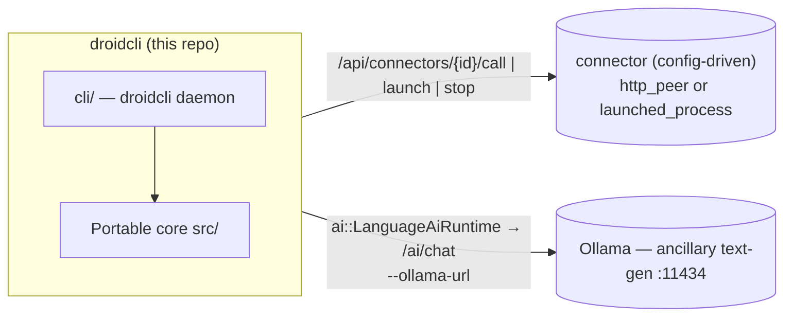
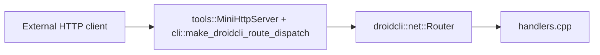

# droidcli - Architecture

Portable C++17 library for Droidcli **control logic**: HTTP route handlers,
the connector/task-queue system, media decode, session snapshots, and the
Ollama AI seam (incl. tool-calling). The droidcli host (`cli/`) supplies
transport, process I/O, and API auth through thin callbacks.

App version: **droidcli 0.1.0** (first release under this name).

---

## System context — a core plus config-driven connectors

droidcli is the **agent controller and network trigger** at the center of an
open-ended set of peer applications. The portable core decides *what* should
happen; the droidcli host performs the actual transport, process control, and
dispatch. Peers are **connectors defined in config** (or registered at
runtime over HTTP) — the core has zero compiled-in knowledge of any specific
peer app.



| Concern | What it owns | Seam in this repo |
| ------- | ------------ | ----------------- |
| **droidcli core + host** | Control logic, command + task dispatch, HTTP in/out, process control | — |
| **A connector** (operator-configured) | Whatever the operator points it at — an inference server, a media player, anything reachable by URL or local command | `net::Connector` (`http_peer` or `launched_process`), registered via `--config` or `POST /api/connectors` |

> **Ollama stays separate.** Ollama is a general **text-generation** endpoint
> behind `ai::LanguageAiRuntime` / `/ai/chat` — it is not a connector, it's
> built into the core AI seam. Any purpose-trained inference service is
> registered as an ordinary
> `http_peer` connector instead, with no special-cased code path. All
> endpoints/models are **configuration**, never baked into core.

---

## Design goals

| Goal                   | How                                                                     |
| ---------------------- | ----------------------------------------------------------------------- |
| Portability            | C++17, `droidcli::core::`* value types, no engine/framework types      |
| Single source of truth | Command validation, JSON shapes, connector/task state                   |
| Testability            | CMake + unit tests without network, GPU, or GUI                         |
| Host bridge            | Hosts inject transport/process I/O via `std::function` callbacks        |

**Rule of thumb:** if it touches a real socket, process, window, or the
filesystem at runtime, it stays in the host. If it is pure state + parsing +
validation + JSON, it belongs in core.

---

## Repository layout

```
metaagent/                        (repository directory name unchanged)
├── droidcli_core.h                Umbrella public API
├── droidcli_core.cpp              Single TU — #includes all module .cpp files
├── src/
│   ├── initialize.hpp             initialize_defaults()
│   ├── core/                      Vec3, math, log_sink, value types
│   ├── media/                     PNG/JPEG decode, probe, MediaStore
│   ├── net/                       Route table, handlers, connector, json
│   ├── notify/                    Notify body parsing
│   ├── session/                   RuntimeSession + status strings
│   ├── app/                       tasks (persistent task queue)
│   └── ai/                        Ollama text-gen client (incl. tool-calling) + LanguageAiRuntime
├── cli/                            droidcli host: DroidHost, ProcessManager, command_runner, HTTP route mount, entrypoint
├── tools/                         mini_http_server + sync_http_client (raw-socket HTTP, WinHTTP for https://)
├── tests/                         One *_test.cpp per core module
├── config/                         Example connector config (connectors.example.json)
├── distribute/                    Dist templates (run_all.bat, README)
├── CMakeLists.txt
├── README.md
└── ARCHITECTURE.md
```

Public entry point: `#include "droidcli_core.h"`.

---

## Modules

| Module                    | Role                                                                  |
| ------------------------- | --------------------------------------------------------------------- |
| `core/types` + `math`     | `String`, `Array`, `Vec3`, color types, math helpers                  |
| `media/decode` + `probe`  | FFmpeg-backed decode + probe (host stages the DLLs)                   |
| `net/router` + `handlers` | `/health`, `/echo`, `/notify`, `/ai/chat`                             |
| `net/connector`           | **Generic peer registry**: `Connector` (`http_peer` \| `launched_process`), `ConnectorRegistry` register/unregister/list/find, JSON build/parse |
| `net/json`                | Escape/build/extract JSON fields (no external JSON dependency)        |
| `notify/parse`            | Notify body parsing (JSON or text)                                    |
| `session/types` + `status`| `RuntimeSession`, `FeatureFlags` (ai/networking/recording/ui), status |
| `app/tasks`               | **Persistent task queue**: `Task` (incl. `result_json`), `TaskQueue` (enqueue/claim_next/complete/fail/find/list), JSON build/parse |
| `ai/ollama_client`        | Ollama request/response shaping, incl. **tool-calling**: `ToolDefinition`/`ToolCall`, `"tools"` request field, `message.tool_calls` response parsing, `ChatRole::Tool` |
| `ai/language_runtime`     | Transcript + turn state for **Ollama text-gen** (`/ai/chat`); POST via `LanguageAiTransportCallbacks`. Separate from any connector-registered inference peer. Single-shot (no tool-calling) - the multi-hop agent loop lives in `DroidHost::agent_turn` instead |

The droidcli host (`cli/`) additionally owns: the config store, the
`ConnectorRegistry` + `TaskQueue` instances and their dispatch (`call_connector`
for `http_peer`, `launch_connector`/`stop_connector` for `launched_process`,
`tick_tasks()` draining the queue, including a `"run"` command dispatched to
`command_runner`), the **ProcessManager** (Job Object/process-group launch of
any `launched_process` connector with PID tracking), **`command_runner`**
(one-shot, synchronous, timeout-bounded shell command execution with captured
stdout/stderr - `POST /api/run` and the `"run"` task command - plus
`launch_application`, a detached fire-and-forget GUI-app launch with no wait
and no output capture, distinct from the blocking `run_command_once` -
`POST /api/open`), **`filesystem_tools`**
(`read_file`/`write_file`/`list_dir`/`stat_path`/`get_current_working_directory`/
`which_executable`, `std::filesystem`-backed, no external dependency - `POST
/api/fs/*`), and **`DroidHost::agent_turn`** (a bounded Ollama tool-calling
loop over a fixed tool set - connectors, tasks, shell commands, app launches,
and filesystem primitives - each tool implemented by calling back into
`DroidHost`'s own methods, self-contained rather than delegating to another
process or MCP server - `POST /api/agent/turn`).

---

## HTTP flow



Inbound: `tools::MiniHttpServer` (raw-socket, no httplib) binds the socket,
parses headers into `net::HttpRequest`, and - before any route is dispatched -
checks the bearer token for every `/api/*` path and `/ai/chat` (see "HTTP API"
below), returning `401` on failure. Requests that pass the check are
tried against the portable `net::RouteTable` (`/health`, `/echo`, `/notify`,
`/ai/chat`); anything else falls through to
`cli::make_droidcli_route_dispatch`'s `CustomRouteFn`, which covers `/api/*`
(status/config/ollama/process/run/agent/connectors/tasks).
Outbound: `tools::sync_http_client` performs the POST/GET (raw socket for
`http://`, WinHTTP for `https://`); core builds and parses the bodies.

---

## HTTP API

### Security: API authentication

droidcli's HTTP API can execute shell commands (`/api/run`) and drive an LLM
tool-calling loop that can call those same routes (`/api/agent/turn`) — so
every `/api/*` route, plus `/ai/chat` (an Ollama call has a real cost even
though it can't run shell commands), requires an
`Authorization: Bearer <token>` header. `/health`, `/echo`, and `/notify` stay
open since they're read-only/log-only and liveness checks shouldn't need a
token.

The token comes from, in order: `--token <value>`, the `DROIDCLI_API_TOKEN`
env var, or — if neither is set — a random 32-byte (64 hex char) token
generated at startup and printed to the console:

```
droidcli: generated API token (save this): 3f9a1c...
```

droidcli **never** starts the HTTP API with authentication disabled. A
request without a valid token gets `401 Unauthorized`:

```sh
curl -i http://127.0.0.1:30080/api/status
# HTTP/1.1 401 ...
# {"error":"unauthorized","message":"missing or invalid Authorization: Bearer <token> header"}

curl -i http://127.0.0.1:30080/api/status -H "Authorization: Bearer 3f9a1c..."
# HTTP/1.1 200 ...
```

The in-process TUI (`cli/tui.cpp`) calls `DroidHost` methods directly, not
over HTTP, so it never needs the token.

### Routes

`[auth]` marks routes that require the `Authorization: Bearer <token>` header.

| Method | Route | Description |
| ------ | ----- | ------------ |
| `GET` | `/health` | Liveness + session snapshot (portable handler, no auth) |
| `GET` / `POST` | `/echo` | Echo query/body (no auth) |
| `POST` | `/notify` | Ingest notify event (no auth) |
| `POST` | `/ai/chat` `[auth]` | Ollama text-gen chat via `LanguageAiRuntime` |
| `GET` | `/api/status` `[auth]` | Host status: AI-enabled flag, connector/task counts |
| `GET` | `/api/network/status` `[auth]` | Networking flag + connector count |
| `GET` | `/api/config` `[auth]` | Effective host configuration (Ollama) |
| `POST` | `/api/config` `[auth]` | Update host configuration at runtime |
| `GET` | `/api/notify/log` `[auth]` | Recent notify messages |
| `GET` | `/api/app/log` `[auth]` | Recent host application log |
| `POST` | `/api/run` `[auth]` | Run a one-shot shell command — body `{"command":"...","work_dir":"...","timeout_ms":30000}` |
| `POST` | `/api/open` `[auth]` | Launch a GUI application, detached (no wait, no output capture) — body `{"path_or_name":"...","args":"...","work_dir":"..."}` |
| `POST` | `/api/fs/read` `[auth]` | Read a file — body `{"path":"...","max_bytes":65536}`, response reports `truncated` |
| `POST` | `/api/fs/write` `[auth]` | Write/append a file — body `{"path":"...","content":"...","append":false}` |
| `POST` | `/api/fs/list` `[auth]` | Non-recursive directory listing — body `{"path":"..."}` (omit for cwd) |
| `POST` | `/api/fs/stat` `[auth]` | Check existence/type/size of a path — body `{"path":"..."}` |
| `GET` | `/api/fs/cwd` `[auth]` | droidcli's current working directory |
| `POST` | `/api/fs/which` `[auth]` | Resolve an executable against `PATH` — body `{"name":"..."}` |
| `POST` | `/api/agent/turn` `[auth]` | Tool-calling agent turn — body `{"message":"...","clear":false}` |
| `GET` | `/api/ollama/status` `[auth]` | Ollama text-gen endpoint status + model list |
| `POST` | `/api/ollama/config` `[auth]` | Update Ollama model at runtime |
| `GET` | `/api/process/status` `[auth]` | PID + running state of every launched connector process |

**Connectors** (generic peer config; all `[auth]`):

| Method | Route | Description |
| ------ | ----- | ------------ |
| `GET` | `/api/connectors` | List all registered connectors |
| `POST` | `/api/connectors` | Register (or replace) a connector — body is a `Connector` JSON object |
| `GET` | `/api/connectors/{id}/status` | Liveness: PID/running for `launched_process`, `/health` probe for `http_peer` |
| `POST` | `/api/connectors/{id}/launch` | Launch a `launched_process` connector (Job Object / process group, PID-tracked) |
| `POST` | `/api/connectors/{id}/stop` | Stop it |
| `POST` | `/api/connectors/{id}/call` | Proxy an HTTP call to an `http_peer` connector — body `{"path":"/api/x","method":"POST","payload_json":"{...}"}` |

**Tasks** (persistent pending/running/done/failed queue; `tick_tasks()` runs every poll loop iteration and dispatches one pending task per tick; all `[auth]`):

| Method | Route | Description |
| ------ | ----- | ------------ |
| `GET` | `/api/tasks` | List all tasks (history capped, pending/running always kept) |
| `POST` | `/api/tasks` | Enqueue a task — body `{"connector_id":"...","command":"launch\|stop\|run\|<path>","payload_json":"{...}"}` |
| `GET` | `/api/tasks/{id}` | Task status, including `result_json` once done (e.g. captured stdout/stderr for a `"run"` task) |

A task with `command: "launch"` or `"stop"` calls `launch_connector`/`stop_connector`
on its `connector_id`; `command: "run"` runs `payload_json`'s `{"command":"...","work_dir":"..."}`
as a one-shot shell command (no `connector_id` needed); any other command is
treated as the HTTP path to call on an `http_peer` connector.

### The agent turn (`POST /api/agent/turn`)

Drives a bounded (5-hop) Ollama tool-calling loop: the model sees a fixed tool
set (`list_connectors`, `connector_status`, `launch_connector`,
`stop_connector`, `call_connector`, `enqueue_task`, `list_tasks`,
`run_command`) and can call any of them against this `DroidHost` instance
before replying in natural language.

```sh
curl -X POST http://127.0.0.1:30080/api/agent/turn \
  -H "Authorization: Bearer <token>" \
  -H "Content-Type: application/json" \
  -d '{"message":"list the registered connectors"}'
```

Response shape:

```json
{
  "ok": true,
  "assistant": "You have 2 connectors registered: ...",
  "actions": [
    {"tool": "list_connectors", "arguments_json": "{}", "result_json": "{\"connectors\":[...]}"}
  ]
}
```

If Ollama is disabled or unreachable, or the transcript budget (5 hops) runs
out before a final natural-language reply, the response is still valid JSON
(`ok:false` with an `error`, or `ok:true` with `budget_exhausted:true` and the
last assistant text) rather than a crash.

### One-shot commands (`POST /api/run`)

```sh
curl -X POST http://127.0.0.1:30080/api/run \
  -H "Authorization: Bearer <token>" \
  -H "Content-Type: application/json" \
  -d '{"command":"echo hello","work_dir":"","timeout_ms":30000}'
# {"launched":true,"exit_code":0,"stdout":"hello\r\n","stderr":"","error":""}
```

Synchronous and blocking (unlike the PID-tracked `launched_process` connector
lifecycle) — captures stdout/stderr and enforces `timeout_ms`, killing the
process and reporting `error` if it's exceeded.

---

## Build

### Standalone

```powershell
cd metaagent
cmake -S . -B build -DCMAKE_BUILD_TYPE=Release
cmake --build build
ctest --test-dir build --output-on-failure
```

Tests: `media_decode_test`, `net_handler_test`, `ollama_client_test`,
`language_runtime_test`, `connector_test`, `task_queue_test`.

On Windows the whole tree builds with **one MSVC runtime**
(`CMAKE_MSVC_RUNTIME_LIBRARY` in the root CMakeLists: dynamic Debug, static
Release) — never set a per-target runtime that diverges.

---

## Extension points

1. **New HTTP route** — handler in `net/handlers.cpp`, register in the router,
   mount in the host(s). If it's a `cli::`-only route (not a portable
   `net::RouteTable` handler), it lands under `/api/*` in
   `cli/http_mount.cpp` and is automatically covered by the bearer-token
   check in `tools::MiniHttpServer::poll_once`.
2. **New connector (peer app)** — usually **config-only**: add an entry to a
   `connectors.json` (or `POST /api/connectors`) with `kind: "http_peer"` and a
   `base_url`; droidcli proxies calls to it via `/api/connectors/{id}/call`
   with zero new code. For `kind: "launched_process"`, `ProcessManager`
   already generalizes over any `launch_cmd`/`work_dir` — again no new code
   needed unless the process has bespoke lifecycle requirements beyond
   launch/stop, in which case extend `DroidHost::launch_connector`/
   `stop_connector` in `cli/host.cpp`.

Product usage, HTTP tables, and env vars: repository root `[README.md](./README.md)`.
