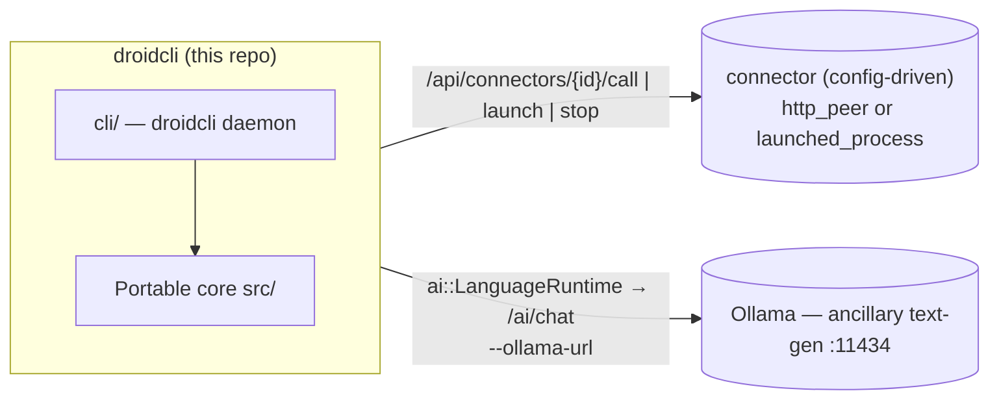
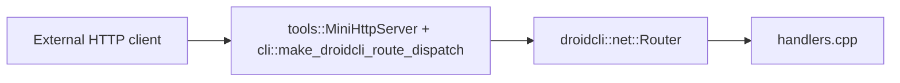
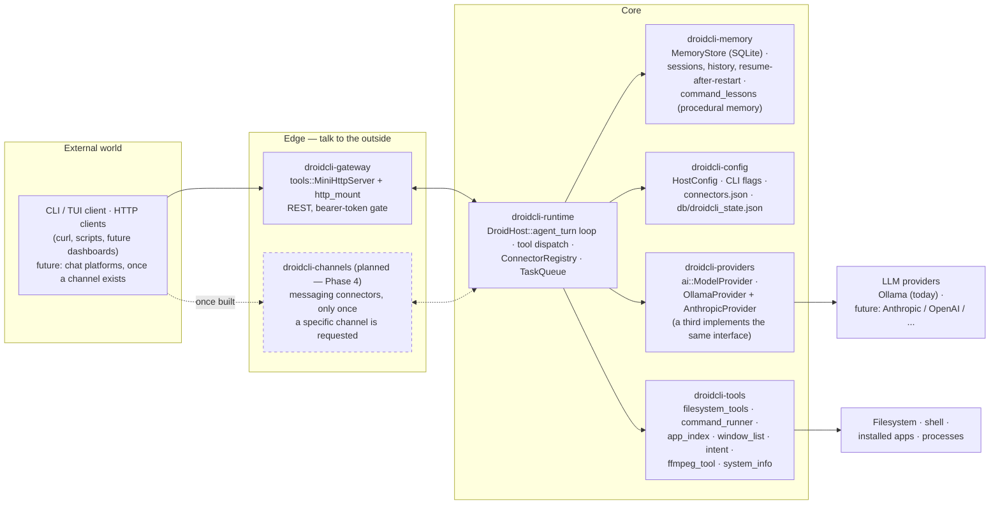
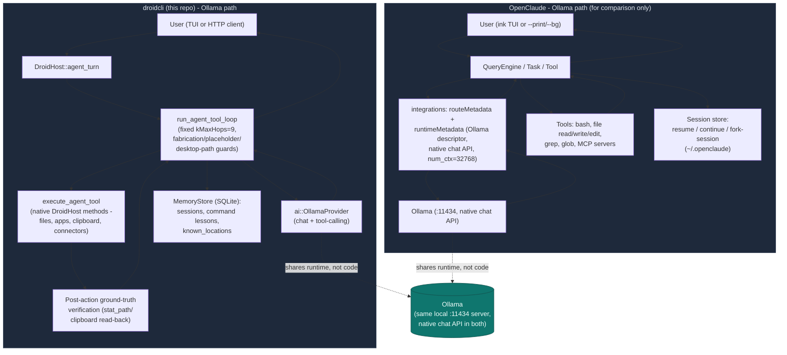

# droidcli - Architecture

Portable C++17 library for Droidcli **control logic**: HTTP route handlers,
the connector/task-queue system, media decode, session snapshots, and the
Ollama AI seam (incl. tool-calling). The droidcli host (`cli/`) supplies
transport, process I/O, and API auth through thin callbacks.

App version: **droidcli 0.1.0** (first release under this name).

---

## System context — a core plus config-driven connectors

droidcli is the **agent controller and network trigger** at the center of an
open-ended set of peer applications. The portable core decides *what* should
happen; the droidcli host performs the actual transport, process control, and
dispatch. Peers are **connectors defined in config** (or registered at
runtime over HTTP) — the core has zero compiled-in knowledge of any specific
peer app.



| Concern | What it owns | Seam in this repo |
| ------- | ------------ | ----------------- |
| **droidcli core + host** | Control logic, command + task dispatch, HTTP in/out, process control | — |
| **A connector** (operator-configured) | Whatever the operator points it at — an inference server, a media player, anything reachable by URL or local command | `net::Connector` (`http_peer` or `launched_process`), registered via `--config` or `POST /api/connectors` |

> **Ollama stays separate.** Ollama is a general **text-generation** endpoint
> behind `ai::LanguageRuntime` / `/ai/chat` — it is not a connector, it's
> built into the core AI seam. Any purpose-trained inference service is
> registered as an ordinary
> `http_peer` connector instead, with no special-cased code path. All
> endpoints/models are **configuration**, never baked into core.

---

## Design goals

- **Portability** — C++17, `droidcli::core::` value types only, no
  engine/framework types leaking into public headers or core logic.
- **Ground-Truth** — a claimed success is independently re-verified against
  real, observable state (a re-read after write, a live process/registry
  check) rather than trusted on a tool's own say-so — see "Post-action
  ground-truth verification" in the Algorithms reference below, and the
  Chronological hardening log's Phase 18/24 entries for the incidents that
  made this a hard rule.
- **Testability** — CMake + unit tests run with no network, GPU, or GUI
  required; command validation, JSON shapes, and connector/task state all
  live in `src/` specifically so they can be exercised this way.
- **Host Bridge** — hosts inject real transport/process/filesystem I/O into
  core via `std::function` callbacks; core itself never touches a socket,
  process, or window directly.

**Rule of thumb:** if it touches a real socket, process, window, or the
filesystem at runtime, it stays in the host. If it is pure state + parsing +
validation + JSON, it belongs in core.

---

## Agent properties

Forty-two phases of hardening (see the Phase log further below) have
converged on a specific, opinionated shape for what kind of agent droidcli
is. Anyone extending it should build *with* these properties, not around
them - each one exists because a real observed failure, not a hypothetical,
motivated it.

1. **A personal desktop assistant, not a dev/build tool.** droidcli controls
   the machine it runs on for a human sitting at it - opening apps, finding
   and acting on files by description, running one-shot commands. It is not
   optimized for "run this in the project directory" workflows. Concretely:
   a file/command reference with **no location specified at all** defaults to
   the user's real Desktop, not wherever droidcli's own process happened to
   be launched from (`default_bare_filename_to_desktop()`, `cli/host.cpp`,
   Phase 20) - the opposite of what a build tool or CLI dev utility would
   default to.
2. **Self-contained, not an MCP client.** Per ZeroClaw's minimal philosophy,
   new capabilities are new `DroidHost` methods (see `filesystem_tools.{hpp,cpp}`/
   `command_runner.{hpp,cpp}` for the pattern), never a dependency on an
   external MCP server. If MCP support is ever added, droidcli exposes
   *itself* as a server - it does not consume other servers.
3. **Ground truth over self-report, always.** Every agent-tool result carries
   `"ok"` first, always (the hard rule that came out of Phase 6's incident).
   Beyond that baseline, several tools go further and independently *verify*
   their own side effect after the fact rather than trusting their own
   report: `write_file` re-`stat_path()`s the file it just wrote
   (`verified_exists`/`verified_size_bytes`, Phase 18);
   `remember_location`/`get_known_locations` only persists a location if a
   live `stat_path()` confirms it's real *right now* (Phase 19); the
   fabrication guard in `run_agent_tool_loop` only trusts a completion claim
   backed by an actually-mutating tool's `ok:true`, never an unrelated
   read-only success (Phase 17).
4. **A false negative is always safe; a false positive is the failure mode
   to avoid.** Every heuristic guard in `cli/host.cpp` (`looks_like_*`,
   `substitute_bare_desktop_token`, the deterministic intent recognizers in
   `src/intent/`) is written so that failing to recognize a pattern just
   falls through to the normal, slower path - never so that it misfires and
   hijacks or blocks something unrelated. See the "Algorithms reference"
   appendix for the full list.
5. **Deterministic bypasses for narrow, high-confidence shapes only** - never
   as a general substitute for the model's own judgment. "open X" (Phase 11)
   and "yes" confirming a just-proposed command (Phase 14) are recognized by
   pure string scanning, no LLM call, because both are common, narrow, and
   safe to get slightly wrong (a false negative is just a normal turn).
   New tools should reach for this pattern rarely, and only when a
   reliability problem has that exact shape.
6. **Mutating tools are gated by default; read-only tools never are.**
   `tool_call_requires_approval()` (`cli/host.cpp`) is the single list a
   human approves before it runs - anything with a real side effect belongs
   there; gating a read-only lookup only slows the agent down for no safety
   benefit. See the "Adding things" extension points in `AGENTS.md` for the
   two-part checklist every new tool follows.
7. **Persistent memory, not just in-session context.** Three SQLite-backed
   memories, all in the same `MemoryStore` database
   (`cli/memory_store.{hpp,cpp}`): session transcripts (`memory_entries`,
   resumable across restarts), command lessons (`command_lessons`, "this
   broke, this fixed it," searched before a similar attempt), and known
   locations (`known_locations`, a name → real path mapping, Phase 19).
   Deliberately minimal - no embeddings, no vector search, LIKE-based
   substring matching only.
8. **Narrow, evidence-driven fixes over generic ones - and unsolved problems
   are named, not papered over.** Every phase traces back to a specific
   observed transcript, not a hypothetical. When a problem turned out to be
   genuinely hard to solve generically (verifying a model's claim about tool
   *content*, not just whether a tool ran - Phase 16), it's recorded as
   deliberately open rather than "fixed" with a narrow regex that wouldn't
   generalize.
9. **Bounded, not unbounded, self-correction.** `run_agent_tool_loop`'s hop/
   nudge/retry budgets (`kMaxHops`, `kMaxUnverifiedClaimNudges`,
   `kMaxCommandRetryNudges`, `kMaxEmptyRetries`) all exist because letting a
   small local model retry or self-nudge indefinitely measurably degrades
   its own output rather than converging on a fix - every self-correction
   path terminates in an honest report to the user, never silent looping.
10. **Never propose or execute an unverified process launch.** The Windows
    execution ruleset (see its own section below) resolves every
    `open_application` call against a fixed trust order - an explicit path,
    the App Paths registry, the installed-apps index, droidcli's own curated
    Windows-locations table, then a *verified* PATH search as a last resort
    - and refuses outright if nothing resolves, rather than letting the OS's
    own blind bare-name search gamble on a coincidental match (Phase 41).
    This resolution now runs *before* a gated call is ever shown to a human
    as a yes/no, not just before it executes (Phase 42) - an approved
    `open_application` call is guaranteed to reference something real.
11. **Multi-provider by construction, not Ollama-locked.** `ai::ModelProvider`
    (Phase 1) is the interface `agent_turn` is coded against; `OllamaProvider`
    and `AnthropicProvider` (Phase 32) are both adapters over it, selected at
    runtime via `HostConfig::ai_provider` - adding a third provider means
    implementing the interface, not touching the agent-turn loop itself.
12. **Configuration and secrets outlive the process, and the process itself
    can outlive a reboot.** Runtime settings (model, provider, port) persist
    to a JSON file across restarts, not just for the lifetime of one run
    (Phase 33), update immediately when changed at runtime rather than only
    at the next startup (Phase 36), and secrets in that file (the bearer
    token, an API key) are encrypted at rest via Windows DPAPI, never
    plaintext (Phase 33). A real Windows Service entry point (`--service`,
    `--install-service`) means droidcli no longer has to be a foreground
    process a human is watching to keep running (Phase 34).

---

## Repository layout

```
metaagent/                        (repository directory name unchanged)
├── droidcli_core.h                Umbrella public API
├── droidcli_core.cpp              Single TU — #includes all module .cpp files
├── src/
│   ├── initialize.hpp             initialize_defaults()
│   ├── core/                      Vec3, math, log_sink, value types, spawn() attribution
│   ├── media/                     PNG/JPEG decode, probe, MediaStore
│   ├── net/                       Route table, handlers, connector, json
│   ├── notify/                    Notify body parsing
│   ├── session/                   RuntimeSession + status strings
│   ├── app/                       tasks (persistent task queue)
│   ├── ai/                        Ollama text-gen client (incl. tool-calling) + LanguageRuntime + ModelProvider interface
│   ├── intent/                    Deterministic "open X" phrase recognizer (no LLM, no I/O)
│   └── reliability/               Fabrication/path/command guards used by cli/host.cpp (Phase 26/27, no LLM, no I/O)
├── cli/                            droidcli host: DroidHost, ProcessManager, command_runner, MemoryStore (SQLite), HTTP route mount, entrypoint
├── tools/                         mini_http_server + sync_http_client (raw-socket HTTP, WinHTTP for https://)
├── tests/                         One *_test.cpp per core module
├── third_party/sqlite/            Vendored SQLite amalgamation (committed - see third_party/README.md)
├── config/                         Example connector config (connectors.example.json)
├── distribute/                    Dist templates (run_all.bat, README)
├── CMakeLists.txt
├── README.md
└── ARCHITECTURE.md
```

Public entry point: `#include "droidcli_core.h"`.

---

## Modules

Grouped by the `droidcli-xyz` module boundary each belongs to - the same
vocabulary "Comparison to ZeroClaw's crate architecture" below uses (see
that section's tier diagram for how these connect to each other). This is a
conceptual grouping, not a separate CMake target or library - droidcli stays
one static library (`src/`) plus one executable (`cli/`).

### Foundations (shared low-level utilities, no `droidcli-xyz` equivalent)

| Module | Role |
| --- | --- |
| `core/types` + `math` | `String`, `Array`, `Vec3`, color types, math helpers |
| `net/json` | Escape/build/extract JSON fields (no external JSON dependency) |
| `notify/parse` | Notify body parsing (JSON or text) |
| `session/types` + `status` | `RuntimeSession`, `FeatureFlags` (ai/networking/recording/ui), status |
| `media/decode` + `probe` | FFmpeg-backed decode + probe (host stages the DLLs) |
| `reliability/*` | `path_guards`/`claim_guards`/`command_guards` - the fabrication/placeholder-path/destructive-command heuristics behind the agent-turn reliability layer (see "Algorithms reference" below) |
| `intent/*` | `open_intent` (deterministic "open X" recognizer) and `pending_command` (deterministic "yes" confirms a just-proposed command) - pure string scanning, no LLM, no I/O |

### `droidcli-runtime` — agent loop, connectors, tasks, spawn attribution

| Module | Role |
| --- | --- |
| `net/connector` | **Generic peer registry**: `Connector` (`http_peer` \| `launched_process`), `ConnectorRegistry` register/unregister/list/find, JSON build/parse |
| `app/tasks` | **Persistent task queue**: `Task` (incl. `result_json`, one-shot delay, cron-style `recurrence_ms`), `TaskQueue` (enqueue/claim_next/complete/fail/find/list) |
| `core/spawn` | **Spawn attribution**: `spawn(name, fn, sink)` - named `std::thread` construction reporting "spawned"/"joined"/"threw: ..." via an optional `ThreadEventSink`. `cli/tui.cpp`'s background threads wire the sink to `DroidHost::log_thread_event` |
| `DroidHost::agent_turn`/`run_agent_tool_loop` (`cli/host.cpp`) | The bounded tool-calling loop itself, against an `ai::ModelProvider`, over a fixed tool set - connectors, tasks, shell commands, app launches, open-window queries, and filesystem primitives - each tool implemented by calling back into `DroidHost`'s own methods, self-contained rather than delegating to another process or MCP server. Every hop is logged (`append_app_log`, `"chat"` channel) and persisted (`record_agent_message`) to `droidcli-memory` |

### `droidcli-providers` — LLM backends

| Module | Role |
| --- | --- |
| `ai/model_provider` | **Provider abstraction**: `ModelProvider` interface (`build_request`/`parse_response`), adapted by `OllamaProvider` and `AnthropicProvider`. `DroidHost::agent_turn` is coded against the interface, selecting a concrete provider at runtime via `HostConfig::ai_provider` |
| `ai/ollama_client` | Ollama request/response shaping, incl. **tool-calling** (`ToolDefinition`/`ToolCall`, `"tools"` request field, `message.tool_calls` response parsing) and per-call telemetry (`num_ctx`, token counts, timing) |
| `ai/anthropic_client` | Anthropic Messages API request/response shaping - the same free-function, no-I/O shape as `ai/ollama_client`, including its own tool-calling (`tool_use` content blocks) and telemetry (`usage.input_tokens`/`output_tokens`) |
| `ai/language_runtime` | Transcript + turn state for the legacy single-shot **Ollama text-gen** endpoint (`/ai/chat`); POST via `LanguageTransportCallbacks`. No tool-calling - the multi-hop agent loop lives in `DroidHost::agent_turn` instead |

### `droidcli-memory`

| Module | Role |
| --- | --- |
| `memory_store` | `MemoryStore` (SQLite-backed): session transcripts (`memory_entries`, resumable across restarts, `GET /api/agent/history`), command lessons (`command_lessons`, "this broke, this fixed it," searched before a similar attempt), and known locations (`known_locations`, a name → real path mapping) |

### `droidcli-config`

| Module | Role |
| --- | --- |
| `settings_store` (`cli/settings_store.{hpp,cpp}`) | JSON settings file (port, Ollama/Anthropic config, provider selection) with secrets (bearer token, API key) DPAPI-encrypted at rest on Windows - loaded at startup and re-saved on every runtime change, not just at process start |
| `HostConfig` (`cli/host.hpp`) | In-memory config struct `DroidHost` actually runs against - populated from CLI flags, the settings file, or a runtime `POST /api/config`/`POST /api/ollama/config` update |

### `droidcli-tools` — callable tool implementations

| Module | Role |
| --- | --- |
| `filesystem_tools` | `read_file`/`write_file`/`list_dir`/`stat_path`/`get_current_working_directory`/`which_executable`, `std::filesystem`-backed, no external dependency |
| `command_runner` | One-shot, synchronous, timeout-bounded shell command execution (`run_command_once`, captured stdout/stderr) plus `launch_application` (detached, fire-and-forget GUI-app launch) - see "Windows execution ruleset" below for the trust-ordered resolution both go through |
| `app_index` | `scan_installed_applications()` - Windows' Add/Remove Programs/Uninstall registry entries (HKLM native + WOW6432Node + HKCU), scanned once at `DroidHost::initialize()` and cached |
| `window_list` | `list_open_windows()` - `EnumWindows` filtered to visible/titled top-level windows, a live uncached snapshot re-enumerated every call, unlike `app_index`'s scan-once |
| `ffmpeg_tool` | Resolves and invokes the ffmpeg binary for transcode/convert/clip/extract/thumbnail work, `via_shell=false` (see "Windows execution ruleset") |
| `system_info` | Environment grounding - OS, architecture, real Desktop path via the Windows Known Folder API, the current date/time (freshly read every call, not cached) |
| `hardware_info` | Opt-in (`--enable-hardware-scan`), read-only local CPU/GPU/RAM/disk inventory |
| `windows_service` (`cli/windows_service.{hpp,cpp}`) | Windows Service lifecycle (`ServiceMain`/`RegisterServiceCtrlHandler`) and install/uninstall via the Service Control Manager |

### `droidcli-gateway`

| Module | Role |
| --- | --- |
| `net/router` + `net/handlers` | Portable route table + handlers: `/health`, `/echo`, `/notify`, `/ai/chat` |
| `tools/mini_http_server` | Raw-socket HTTP server, bearer-token gate (`request_requires_auth`/`is_authorized`), custom-route fallback hook |
| `http_mount` (`cli/http_mount.cpp`) | Mounts every `droidcli`-specific `/api/*` route onto the router via `CustomRouteFn` |
| `tools/sync_http_client` | Outbound HTTP/HTTPS (WinHTTP for `https://`, raw sockets for local `http://` peers) - what `ai/model_provider`'s providers actually POST through |

### `droidcli-infra`

| Module | Role |
| --- | --- |
| `process_manager` | Job Object (Windows) / process-group (POSIX) tracking for any `launched_process` connector, so `stop()` kills the whole tree it spawned |
| `db/droidcli_state.json`, `db/droidcli_settings.json` | Flat-file persistence (connector state, host settings) alongside `memory_store`'s SQLite backend |

### `droidcli-log`

| Module | Role |
| --- | --- |
| `core/log_sink` | The `LogSink` interface core logs through - host-injected, no direct stdout/file dependency in `src/` |
| `DroidHost::append_app_log` (`cli/host.cpp`) | Structured JSONL (`logs/log.jsonl`), one object per line, `session_id` attribution on `"chat"`-channel entries |

### `droidcli-tui`

| Module | Role |
| --- | --- |
| `cli/tui.cpp` | FTXUI-based terminal dashboard - chat pane, connector list, app log, session/model status line |

---

## HTTP flow



Inbound: `tools::MiniHttpServer` (raw-socket, no httplib) binds the socket,
parses headers into `net::HttpRequest`, and - before any route is dispatched -
checks the bearer token for every `/api/*` path and `/ai/chat` (see "HTTP API"
below), returning `401` on failure. Requests that pass the check are
tried against the portable `net::RouteTable` (`/health`, `/echo`, `/notify`,
`/ai/chat`); anything else falls through to
`cli::make_droidcli_route_dispatch`'s `CustomRouteFn`, which covers `/api/*`
(status/config/ollama/process/run/agent/connectors/tasks).
Outbound: `tools::sync_http_client` performs the POST/GET (raw socket for
`http://`, WinHTTP for `https://`); core builds and parses the bodies.

---

## HTTP API

### Security: API authentication

droidcli's HTTP API can execute shell commands (`/api/run`) and drive an LLM
tool-calling loop that can call those same routes (`/api/agent/turn`) — so
every `/api/*` route, plus `/ai/chat` (an Ollama call has a real cost even
though it can't run shell commands), requires an
`Authorization: Bearer <token>` header. `/health`, `/echo`, and `/notify` stay
open since they're read-only/log-only and liveness checks shouldn't need a
token.

The token comes from, in order: `--token <value>`, the `DROIDCLI_API_TOKEN`
env var, or — if neither is set — a random 32-byte (64 hex char) token
generated at startup and printed to the console:

```
droidcli: generated API token (save this): 3f9a1c...
```

droidcli **never** starts the HTTP API with authentication disabled. A
request without a valid token gets `401 Unauthorized`:

```sh
curl -i http://127.0.0.1:30080/api/status
# HTTP/1.1 401 ...
# {"error":"unauthorized","message":"missing or invalid Authorization: Bearer <token> header"}

curl -i http://127.0.0.1:30080/api/status -H "Authorization: Bearer 3f9a1c..."
# HTTP/1.1 200 ...
```

The in-process TUI (`cli/tui.cpp`) calls `DroidHost` methods directly, not
over HTTP, so it never needs the token.

### Routes

`[auth]` marks routes that require the `Authorization: Bearer <token>` header.

| Method | Route | Description |
| ------ | ----- | ------------ |
| `GET` | `/health` | Liveness + session snapshot (portable handler, no auth) |
| `GET` / `POST` | `/echo` | Echo query/body (no auth) |
| `POST` | `/notify` | Ingest notify event (no auth) |
| `POST` | `/ai/chat` `[auth]` | Ollama text-gen chat via `LanguageRuntime` |
| `GET` | `/api/status` `[auth]` | Host status: AI-enabled flag, connector/task counts |
| `GET` | `/api/network/status` `[auth]` | Networking flag + connector count |
| `GET` | `/api/config` `[auth]` | Effective host configuration (Ollama) |
| `POST` | `/api/config` `[auth]` | Update host configuration at runtime |
| `GET` | `/api/notify/log` `[auth]` | Recent notify messages |
| `GET` | `/api/app/log` `[auth]` | Recent host application log |
| `POST` | `/api/run` `[auth]` | Run a one-shot shell command — body `{"command":"...","work_dir":"...","timeout_ms":30000}` |
| `POST` | `/api/ffmpeg/run` `[auth]` | Run ffmpeg (resolved via `PATH` or `$DROIDCLI_FFMPEG_ROOT`) — body `{"args":"...","work_dir":"...","timeout_ms":120000}` |
| `GET` | `/api/system` `[auth]` | The host machine droidcli is running on — `os_name`/`os_version`/`architecture`/`hostname`/`username`/`cwd`, queried once at startup |
| `POST` | `/api/open` `[auth]` | Launch a GUI application, detached (no wait, no output capture) — body `{"path_or_name":"...","args":"...","work_dir":"..."}` |
| `POST` | `/api/apps/find` `[auth]` | Search the installed-apps index (scanned at startup) — body `{"query":"..."}`, returns `{"matches":[{"name":...,"path":...}]}` |
| `POST` | `/api/apps/quick_open` `[auth]` | Deterministic, LLM-free "open X" recognizer — body `{"message":"..."}`, returns `{"matched":bool,"app_name":"...","ambiguous":bool,"resolved_name":"...","resolved_path":"...","candidates":[...]}` (see "Quick-open" below) |
| `GET` | `/api/apps/open` `[auth]` | Live snapshot of currently open windows — `{"windows":[{"title":...,"process_name":...,"pid":...}]}`, re-enumerated fresh on every call |
| `POST` | `/api/fs/read` `[auth]` | Read a file — body `{"path":"...","max_bytes":65536}`, response reports `truncated` |
| `POST` | `/api/fs/write` `[auth]` | Write/append a file — body `{"path":"...","content":"...","append":false}` |
| `POST` | `/api/fs/list` `[auth]` | Non-recursive directory listing — body `{"path":"..."}` (omit for cwd) |
| `POST` | `/api/fs/stat` `[auth]` | Check existence/type/size of a path — body `{"path":"..."}` |
| `GET` | `/api/fs/cwd` `[auth]` | droidcli's current working directory |
| `POST` | `/api/fs/which` `[auth]` | Resolve an executable against `PATH` — body `{"name":"..."}` |
| `POST` | `/api/agent/turn` `[auth]` | Tool-calling agent turn — body `{"message":"...","clear":false,"session_id":"..."}`, response includes `"session_id"` (see "Persistent memory" and "Phase 6" below) |
| `POST` | `/api/agent/tool_decision` `[auth]` | Resolve a gated tool call `agent_turn` paused on — body `{"approved":bool,"session_id":"...","reason":"..."}` (see "Phase 6" below) |
| `POST` | `/api/agent/lessons` `[auth]` | Record a "this broke, this fixed it" command lesson — body `{"tool":"...","broken":"...","failure_reason":"...","working":"...","lesson":"..."}` |
| `POST` | `/api/agent/lessons/search` `[auth]` | Case-insensitive substring search over recorded lessons — body `{"query":"..."}` |
| `GET` | `/api/agent/tools` `[auth]` | The agent's fixed tool set — `{"tools":[{"name":...,"description":...,"parameters":{...}}]}` |
| `GET` | `/api/agent/history` `[auth]` | One session's persisted message history — `?session_id=...` (defaults to the current session), returns `{"session_id":"...","messages":[{"hop_index":N,"role":"...","content":"...","created_at":"..."}]}` |
| `GET` | `/api/agent/sessions` `[auth]` | Every session id with persisted history, most recently active first — `{"current_session_id":"...","session_ids":[...]}` |
| `GET` | `/api/ollama/status` `[auth]` | Ollama text-gen endpoint status + model list |
| `POST` | `/api/ollama/config` `[auth]` | Update Ollama model at runtime |
| `GET` | `/api/ollama/setup-status` `[auth]` | Whether Ollama is installed/online, pulled models, configured-model status (drives the TUI's in-chat setup flow) |
| `POST` | `/api/ollama/install` `[auth]` | Run `winget install --id Ollama.Ollama ...` (blocking) |
| `POST` | `/api/ollama/start` `[auth]` | Launch `ollama serve` and poll until reachable (blocking) |
| `POST` | `/api/ollama/pull` `[auth]` | Pull a model and make it the active one — body `{"model":"..."}` (blocking) |
| `GET` | `/api/process/status` `[auth]` | PID + running state of every launched connector process |

**Connectors** (generic peer config; all `[auth]`):

| Method | Route | Description |
| ------ | ----- | ------------ |
| `GET` | `/api/connectors` | List all registered connectors |
| `POST` | `/api/connectors` | Register (or replace) a connector — body is a `Connector` JSON object |
| `GET` | `/api/connectors/{id}/status` | Liveness: PID/running for `launched_process`, `/health` probe for `http_peer` |
| `POST` | `/api/connectors/{id}/launch` | Launch a `launched_process` connector (Job Object / process group, PID-tracked) |
| `POST` | `/api/connectors/{id}/stop` | Stop it |
| `POST` | `/api/connectors/{id}/call` | Proxy an HTTP call to an `http_peer` connector — body `{"path":"/api/x","method":"POST","payload_json":"{...}"}` |

**Tasks** (persistent pending/running/done/failed queue; `tick_tasks()` runs every poll loop iteration and dispatches one pending task per tick; all `[auth]`):

| Method | Route | Description |
| ------ | ----- | ------------ |
| `GET` | `/api/tasks` | List all tasks (history capped, pending/running always kept) |
| `POST` | `/api/tasks` | Enqueue a task — body `{"connector_id":"...","command":"launch\|stop\|run\|<path>","payload_json":"{...}"}` |
| `GET` | `/api/tasks/{id}` | Task status, including `result_json` once done (e.g. captured stdout/stderr for a `"run"` task) |

A task with `command: "launch"` or `"stop"` calls `launch_connector`/`stop_connector`
on its `connector_id`; `command: "run"` runs `payload_json`'s `{"command":"...","work_dir":"..."}`
as a one-shot shell command (no `connector_id` needed); any other command is
treated as the HTTP path to call on an `http_peer` connector.

### Quick-open (`POST /api/apps/quick_open`) — hardening app launches against LLM unreliability

Opening an application is common enough, and consequential enough, that it
should not depend on a local model reliably deciding to call a tool. Early
testing showed a small Ollama model asked to "open Blender" sometimes
apologizing that it "can't open applications" instead of calling
`open_application` - the tool existed, the model just didn't use it. Rather
than trying to prompt-engineer that away, `intent::parse_open_intent()`
(`src/intent/open_intent.hpp`/`.cpp`, portable core, network-free, unit
tested in `tests/intent_test.cpp`) recognizes a narrow, deterministic shape -
"open X", "launch X", "start X", optionally wrapped in courtesy phrasing
("can you ...", "please ...") and trailing filler ("... for me", "... now")
- with pure string scanning, no LLM call. Matching requires the verb to be
the first word of the message (after stripping courtesy prefixes), so an
ordinary question like "how do I open a file in Python" is not hijacked -
that keeps reaching the full agent/LLM path in `POST /api/agent/turn`.

`DroidHost::try_quick_open_json()` (`cli/host.cpp`) resolves a recognized
`app_name` against the same installed-apps index `find_application` uses
(`installed_apps_`, including the built-in-accessories table added to
`app_index.cpp` - see below) and reports one of three outcomes: an
unambiguous single match, an ambiguous set of candidates, or nothing found
(in which case the raw name is still offered as an `open_application`
attempt, since that call has its own independent App Paths/PATH resolution
beyond the index). The TUI (`cli/tui.cpp`) calls this on every Enter press
*before* the Ollama-setup state machine or the agent-turn worker thread; if
it matches, the TUI asks the user to confirm (yes/no, or a number if
ambiguous) and only then calls `open_application` - so the LLM is bypassed
for recognition, but a human still approves every actual launch. This is a
deliberately narrow fast path: anything that doesn't match the shape falls
through to the full tool-calling loop unchanged.

`app_index.cpp` also gained a small built-in-accessories table (Notepad,
Calculator, Paint, Command Prompt, PowerShell, File Explorer, Task Manager,
Control Panel, Snipping Tool, Magnifier, Registry Editor, Character Map,
Remote Desktop Connection, Disk Cleanup) appended to the startup scan -
these ship with Windows and never register an Add/Remove Programs entry, so
the Uninstall-registry scan alone could never find them. Name matching
(`normalize_for_match()` in `cli/host.cpp`) is case- and
spacing/punctuation-insensitive, so "NotePad", "NOTEPAD", and "note pad" all
resolve identically.

### Persistent memory (SQLite) — `cli/memory_store.cpp`

droidcli's Core-tier "memory" role (see the ZeroClaw crate comparison below).
Every message `DroidHost::agent_turn` adds to a session's transcript - the
system prompt, the user's message, the model's replies, tool results - is
also appended to a SQLite-backed `MemoryStore` (`cli/memory_store.hpp`/`.cpp`,
schema: `memory_entries(session_id, hop_index, role, content, created_at)`),
not just the in-process `agent_transcript_` `std::vector` that existed
before. This is real file I/O, so it lives in `cli/` (host), linked against
the vendored SQLite amalgamation (`third_party/sqlite/`, see
`third_party/README.md`) - never in the portable `droidcli_core` library, per
`AGENTS.md`'s Golden rule. The database file (`db/droidcli_memory.sqlite3`,
git-ignored like everything else under `db/` - see `db/README.md`) is opened once at
`DroidHost::initialize()`; a failed open leaves the store closed and
`record_agent_message()`/the history routes degrade to in-memory-only
behavior rather than crashing the daemon over it.

**Sessions, not one global transcript.** `DroidHost` tracks a
`current_session_id_`, freshly generated every process start (a short
timestamp + disambiguator, e.g. `20260715T121525-e3f4` - no auto-resume by
default). `POST /api/agent/turn`'s body may include `"session_id"`:

- Omitted → continues whatever session this process is currently on.
- A previously-returned id → **resumes that session**, including across a
  restart: its persisted history is replayed from `MemoryStore` into
  `agent_transcript_` before the new message is appended. This is what makes
  "killed and restarted droidcli mid-conversation, sent the same
  `session_id` again" actually continue the same transcript - verified by
  hand: a system+user message pair persisted, the process was killed and
  restarted, and `GET /api/agent/history?session_id=...` still returned both
  messages afterward.
- `"clear": true` always starts a **brand new** session id (old history isn't
  deleted, just no longer active), ignoring any `session_id` in the same
  request.

Every `agent_turn` response includes the active `"session_id"` - a caller
that wants to resume a conversation later needs to hold onto it.
`cli/tui.cpp` does exactly this: it holds the current session's id in memory
for the process's lifetime (shown in the UI as a `session: <id>` status
line), writes it to `db/droidcli_last_session.json` (git-ignored, see
`db/README.md`) whenever a turn returns one, and on the *next* launch reads
that file and calls `GET`-equivalent `build_agent_history_json()` directly
(a local SQLite read, safe to call synchronously before `screen.Loop()`
starts) to replay the prior conversation into the chat panel and resume
sending with that `session_id` - so restarting the TUI itself, not just the
underlying `droidcli` daemon, continues where you left off. Pressing `n`
(connectors-panel focus) starts a brand new session on the next message
instead (same semantics as `"clear":true`), for when starting fresh is what
you actually want.

**Deliberately minimal**: no embeddings, no vector retrieval, no eviction
policy. Durability (survive a restart) and queryability (`GET
/api/agent/history`, `GET /api/agent/sessions`) are the whole scope - the
"Chronological hardening log" below is explicit that semantic recall is a
separate, meaningfully bigger piece of work that nothing in droidcli needs yet.

### The agent turn (`POST /api/agent/turn`)

Drives a bounded (9-hop, `kMaxHops` in `cli/host.cpp` - raised from 5 once
the retry mechanism below needed the extra room) tool-calling loop against a
`ai::ModelProvider` (Ollama today via `ai::OllamaProvider` - see "Provider
abstraction" in the hardening log below and `src/ai/model_provider.hpp`): the
model sees a fixed tool set and can call any of them against this
`DroidHost` instance before replying in natural language. The tool set is
defined once, in `DroidHost::agent_tool_definitions()` (`cli/host.cpp`) -
`GET /api/agent/tools` is its live source of truth (also rendered as the
TUI's "Agent Tools" panel), so it's deliberately not duplicated here where it
would just go stale as tools are added. Every message added to the
transcript is also persisted via `MemoryStore` (see "Persistent memory"
above).

Side-effecting tools (anything that writes to disk, runs a shell command, or
touches a connector/process/task) don't execute the instant the model
requests them - the loop pauses for human approval first, and every tool
result carries a uniform `"ok"` contract the model can trust. Most of what
this loop actually *does* beyond "call tools until done" is reliability
hardening earned from real, observed failures of the local model it runs
against - see the flowchart below, then the hardening log further down for
why each guard exists.


The loop is deliberately linear and single-threaded per turn - no
speculative parallel tool calls, no background continuation after the HTTP
response returns (a model claiming otherwise is always wrong, see
`looks_like_degenerate_role_leak`/`kOngoingProcessPhrases` in the hardening
log). Every arrow that isn't a straight hop-to-hop transition exists because
a specific, real transcript showed the local model fail that way - the
hardening log below is the incident-by-incident record of why.

**The "Fabricated checks" diamond above only works if every tool's JSON
carries `"ok"`.** `a_tool_call_already_succeeded_this_turn` (the check that
protects a truthful "I did it" from being second-guessed) works by scanning
each action's `result_json` for `"ok":true` - a tool missing that field is
invisible to it, and a genuinely successful call can get overridden with a
false "I wasn't able to complete this" as a result. This happened for real
(`open_application`, see "Phase 15" below) - any new agent tool must return
`"ok"` as its first field or it silently weakens every guard in this
diagram, not just its own correctness.

```sh
curl -X POST http://127.0.0.1:30080/api/agent/turn \
  -H "Authorization: Bearer <token>" \
  -H "Content-Type: application/json" \
  -d '{"message":"list the registered connectors"}'
```

Response shape:

```json
{
  "ok": true,
  "assistant": "You have 2 connectors registered: ...",
  "session_id": "20260715T121525-e3f4",
  "actions": [
    {"tool": "list_connectors", "arguments_json": "{}", "result_json": "{\"connectors\":[...]}"}
  ]
}
```

If Ollama is disabled or unreachable, or the transcript budget (9 hops) runs
out before a final natural-language reply, the response is still valid JSON
(`ok:false` with an `error`, or `ok:true` with `budget_exhausted:true` and the
last assistant text) rather than a crash. The model also never gets a blank
`"assistant"` field - a genuinely empty model response is replaced with a
visible placeholder rather than surfaced as silence. An `ok:false` response
from a failed provider call still includes `"session_id"` - the user's
message was persisted before the call was attempted, so a caller can find it
via `GET /api/agent/history` even though the turn itself failed. (The two
earliest failure paths - missing `"message"`, AI disabled entirely - return
before any session is touched, so they have no `session_id` to report.)

### One-shot commands (`POST /api/run`)

```sh
curl -X POST http://127.0.0.1:30080/api/run \
  -H "Authorization: Bearer <token>" \
  -H "Content-Type: application/json" \
  -d '{"command":"echo hello","work_dir":"","timeout_ms":30000}'
# {"ok":true,"launched":true,"exit_code":0,"stdout":"hello\r\n","stderr":"","error":""}
```

Synchronous and blocking (unlike the PID-tracked `launched_process` connector
lifecycle) — captures stdout/stderr and enforces `timeout_ms`, killing the
process and reporting `error` if it's exceeded. `"ok"` (`command_succeeded()`
in `cli/command_runner.hpp`) is `launched && exit_code == 0 &&
error_message.empty()` - the same contract `/api/ffmpeg/run` and every other
agent tool follow, see "Phase 6" below for why this is load-bearing.

---

## Build

### Standalone

```powershell
cd metaagent
cmake -S . -B build -DCMAKE_BUILD_TYPE=Release
cmake --build build
ctest --test-dir build --output-on-failure
```

Tests: `media_decode_test`, `net_handler_test`, `ollama_client_test`,
`language_runtime_test`, `connector_test`, `task_queue_test`, `intent_test`,
`model_provider_test`, `spawn_test`.

On Windows the whole tree builds with **one MSVC runtime**
(`CMAKE_MSVC_RUNTIME_LIBRARY` in the root CMakeLists: dynamic Debug, static
Release) — never set a per-target runtime that diverges.

---

## Roadmap: packaging as a self-contained daemon assistant

droidcli is heading toward the same shape as ZeroClaw
(https://docs.zeroclawlabs.ai): a single long-running daemon process on the
user's own machine that both *understands* requests (via the Ollama seam) and
*acts* on them directly (via native `DroidHost` tools - no external agent
runtime, no MCP client chain, no cloud round-trip required to execute a local
action). The pieces below are not built yet; this section is the design
record for how they should fit once they are, so packaging decisions get made
once instead of re-litigated per feature.

**Bootstrapped self-knowledge, not blank-slate prompting.** The daemon already
knows facts about the machine it runs on before the user ever types anything -
the installed-apps index (`app_index.cpp`, scanned once at
`DroidHost::initialize()`), the open-window snapshot (`window_list.cpp`),
`which`/PATH resolution, and - since Phase 10 - CPU/GPU/RAM/disk inventory
(`hardware_info.cpp`, opt-in via `--enable-hardware-scan`) and, since Phase 9,
a live self-health snapshot (`self_status`: cached Ollama reachability,
connector/task counts, recent failures) rather than only startup-time facts.
`HostConfig::system_prompt` and the count appended in `DroidHost::agent_turn()`
(`cli/host.cpp`) exist to turn that bootstrapped state into something the
model is *told as fact*, not something it has to be argued into believing it
can do. As more system facts get added (installed shells/interpreters,
logged-in user, network interfaces), the same pattern applies: scan once at
`initialize()` (or, for something that can change mid-run, check it on a
throttled cadence the way Phase 9's watchdog does), cache on `DroidHost`, and
fold a concrete summary into the system prompt rather than leaving it purely
tool-call-discoverable - a model should never have to be told twice that a
capability exists.

**No MCP client, ever (see `AGENTS.md` guardrails).** Every new capability is
a new `DroidHost` method plus a matching `agent_tool_definitions()` /
`execute_agent_tool()` entry (`cli/host.cpp`) - the same surface `/api/*`
already exposes over HTTP. This keeps the trust boundary singular: whatever
`/api/agent/turn` can do, an operator can already see and call directly over
HTTP with the same bearer token. If droidcli ever speaks MCP, it is as a
*server* (exposing its own tool set to external MCP clients), never as a
*client* pulling in a third party's tool implementations - that would break
the "one process, one binary, no supply chain" property this whole roadmap is
about.

**True background operation.** `--daemon` is currently a documented no-op
(`cli/droidcli.cpp` always runs foreground); a real implementation needs:
Windows Service (`SERVICE_WIN32_OWN_PROCESS`, via `ServiceMain`/
`RegisterServiceCtrlHandler`) and a POSIX/systemd unit (`Type=simple` or
`Type=notify`) as two host-side entry points sharing the same `DroidHost`.
`--headless` (skip the FTXUI TUI, keep the HTTP daemon loop) is the correct
foundation for this - a service wrapper is just another host that never
constructs a `ScreenInteractive`.

**Auto-start of the API, opt-in for actions.** The daemon binding its HTTP
port and accepting `/api/*` calls at boot is safe to make automatic (it is
inert until called and gated by the bearer token per `AGENTS.md`'s auth
guardrail). Launching a `launched_process` connector automatically is not -
`AGENTS.md` already establishes that connectors only launch when told to
(`POST /api/connectors/{id}/launch` or a queued task), and that design choice
should hold for any future "run at startup" feature: an operator opts a
*specific* connector or task into auto-start via its own config, the daemon
itself never decides to launch something unprompted.

**Distribution stays single-binary.** `build_and_distribute.bat` already
stages `droidcli.exe` + FFmpeg DLLs into `dist/`; the packaging goal is that
this stays the *only* thing an end user installs - no Python runtime, no
node_modules, no sidecar interpreter. Ollama is the one external dependency,
and it already has its own install/start/pull lifecycle exposed through
`DroidHost` (`install_ollama()`/`start_ollama()`/`pull_ollama_model()` in
`cli/host.cpp`) precisely so the daemon can bootstrap its own AI backend
without the user leaving droidcli. Any future capability that seems to need a
new external runtime should be questioned against this constraint first.

**Token and secret handling scale the same way they do today.** As more
connectors/tools carry credentials (API keys for `http_peer` connectors,
future cloud-model fallbacks), the existing rule holds: never echo a secret
back via a config read, only a `*_configured: bool` (see `CLAUDE.md`). A
packaged daemon that runs unattended is a higher-value target for credential
exfiltration than an interactively-run one, so this rule gets stricter, not
looser, as auto-start lands.

---

## Comparison to ZeroClaw's crate architecture

ZeroClaw (https://docs.zeroclawlabs.ai) is a Rust cargo workspace of ~18
crates split into three tiers: **Core** (runtime/config/memory/providers/
tools), **Edge** (channels/gateway — the crates that talk to the outside
world), and consumers of the public **API** trait layer (`ModelProvider`,
`Channel`, `Tool`, `Memory`, `Observer`, `RuntimeAdapter`, `Peripheral`).
droidcli is a single C++ static library plus one executable, not a
multi-crate workspace, so this is not a plan to reshape droidcli into 18
targets — it is a role-by-role check of what droidcli already covers, what's
partial, and what would be genuinely new work if droidcli grew toward the
same capability set.

The diagram below is drawn in the same three-tier shape as ZeroClaw's
(External world → Edge → Core → external providers/OS), not the old
"portable core vs. host" split from the Roadmap section above. That
core-vs-host line is a real, load-bearing rule for *where new code physically
goes* inside `src/`/`cli/` (see the Golden rule in `AGENTS.md`) — but it is an
implementation detail, not the product's architecture, and conflating the two
made droidcli look like it had no Core/Edge shape at all. It has one; `src/`
and `cli/` are just how that shape is currently split across translation
units, not where the tier boundaries are.



### Crate-by-crate mapping

The **droidcli module** column names the logical grouping each row belongs to
(matching the tier diagram above, e.g. `RUNTIME`/`droidcli-runtime`) - it is
not a separate CMake target or library. droidcli stays one static library
plus one executable; these are conceptual module boundaries within
`src/`/`cli/`, named consistently so this table and the diagram use the same
vocabulary, not a claim that droidcli is secretly an 18-target build.

| ZeroClaw crate | droidcli module | Role | droidcli equivalent | Status |
| --- | --- | --- | --- | --- |
| `zeroclaw-runtime` | `droidcli-runtime` | Agent loop, security policy, SOP engine, cron, SubAgents, RPC | `DroidHost::agent_turn`/`run_agent_tool_loop` (`cli/host.cpp`) — one bounded tool-calling loop | **Partial** — real security-policy layer beyond the bearer token: side-effecting tools require human approval before executing, now pre-verified before that approval prompt is even shown for `open_application` (Phase 6, 42); `TaskQueue` has both one-shot delayed scheduling (`Task::scheduled_for_ms`, Phase 9) *and* cron/SOP-style recurrence (`Task::recurrence_ms`, `cancel_task`, Phase 28) - no SubAgents/RPC |
| `zeroclaw-config` | `droidcli-config` | TOML schema, secrets encryption, autonomy levels, workspace resolution | `HostConfig` (`cli/host.hpp`) + `settings_store` (`cli/settings_store.{hpp,cpp}`) + CLI flags + `connectors.json` | **Partial** — flat JSON, not TOML, but secrets *are* now encrypted at rest (the bearer token/API key, DPAPI on Windows, Phase 33) when persisted to `db/droidcli_settings.json`, and a runtime config change is saved immediately, not just at startup (Phase 36); still no autonomy levels, no workspace concept |
| `zeroclaw-api` | `droidcli-api` *(interface only, cross-cutting — not its own .cpp module)* | Public traits: `ModelProvider`, `Channel`, `Tool`, `Memory`, `Observer`, `RuntimeAdapter`, `Peripheral` (kernel ABI) | `ai::ModelProvider` (`src/ai/model_provider.hpp`) is the `ModelProvider` equivalent; `net::Connector` is the closest thing to a `Channel`/`Peripheral` abstraction; `ai::ToolDefinition`/`ToolCall` is the Tool ABI | **Partial** — `ModelProvider` now exists as a real interface (Phase 1, done); `Connector` still covers what ZeroClaw splits into `Channel`+`Peripheral`; no `Memory`/`Observer` trait abstractions (though `MemoryStore` now exists as a concrete class, see `zeroclaw-memory` below) |
| `zeroclaw-providers` | `droidcli-providers` | LLM client impls (Anthropic/OpenAI/Ollama/…) + hint router + retry | `ai::ModelProvider` interface + `ai::OllamaProvider`/`ai::AnthropicProvider` (`src/ai/model_provider.{hpp,cpp}`, adapting the tested `ai/ollama_client.cpp`/`ai/anthropic_client.cpp`) | **Have the abstraction, two implementations** — `agent_turn` (`cli/host.cpp`) is coded against `ai::ModelProvider`, not Ollama directly (Phase 1); Anthropic added as a second concrete provider, selected at runtime via `--provider` (Phase 32); still no router/retry-across-providers wrapper, since `agent_turn` always runs against exactly one configured provider per instance, not a pool to route between |
| `zeroclaw-channels` | `droidcli-channels` *(planned, Phase 4 - not started)* | 30+ messaging integrations (Discord, Slack, Telegram, …) | None | **Missing entirely** — `Connector` generalizes the concept but nothing implements a messaging-channel connector yet |
| `zeroclaw-gateway` | `droidcli-gateway` | HTTP/WebSocket gateway, web dashboard, webhook ingress | `tools::MiniHttpServer` + `cli/http_mount.cpp` | **Partial** — REST exists; no WebSocket, no dashboard UI, webhook auth is the same bearer-token gate as everything else |
| `zeroclaw-tools` | `droidcli-tools` | Callable tool implementations (browser, HTTP, PDF, hardware probes) | `filesystem_tools.cpp`, `command_runner.cpp`, `window_list.cpp`, `app_index.cpp`, `intent/open_intent.cpp`, `ffmpeg_tool.cpp`, `system_info.cpp` | **Have**, functionally — not split into a separate module boundary, all linked straight into `cli/`/`src/`. `system_info.cpp` is droidcli's environment-grounding tool (OS, architecture, real Desktop path via the Windows Known Folder API - Phase 7, done) - the ZeroClaw comparison doesn't have a named equivalent for "know what machine you're actually on," but it's the same self-contained-capability shape as every other tool here |
| `zeroclaw-tool-call-parser` | `droidcli-providers` *(folded in, not a separate module)* | Model-side tool-call syntax parsing/normalization | `ai::ollama_client`'s `tool_calls` JSON parsing | **Partial** — handles Ollama's native tool-call format only, nothing to normalize across providers since there's only one |
| `zeroclaw-memory` | `droidcli-memory` | Conversation memory, embeddings, vector retrieval | `MemoryStore` (`cli/memory_store.{hpp,cpp}`, SQLite-backed) + `agent_transcript_` (in-process working copy) | **Have durability/queryability + procedural memory, no semantic recall** — every message is persisted per-session and survives a restart (Phase 2, done, verified: kill/restart droidcli, `GET /api/agent/history?session_id=...` still returns the prior turn); the same database also now holds `command_lessons` - model-recorded "this broke, this fixed it" pairs the agent can search before repeating a past mistake (Phase 8, done) - a form of procedural/lessons-learned memory, distinct from conversation history but living in the same store; still no embeddings, no vector retrieval - deliberately out of scope, see "Chronological hardening log" below |
| `zeroclaw-plugins` | — | Dynamic plugin loading | None | **Missing** — deliberately: `AGENTS.md` keeps capabilities as native `DroidHost` methods rather than a loadable-plugin surface |
| `zeroclaw-hardware`, `aardvark-sys`, `robot-kit` | `droidcli-hardware` *(proposed — see "Hardware awareness" below, not yet built)* | GPIO/I2C/SPI/USB, specialized hardware | None | **Under discussion, scoped narrower than the ZeroClaw crate** — read-only local hardware/environment enumeration (what's plugged in, where this machine is), explicitly not GPIO/robotics control; see the new section below for why the original "not planned" verdict is being revisited for a narrower slice |
| `zeroclaw-infra` | `droidcli-infra` | SQLite session backend, debouncers, stall watchdog | `MemoryStore` (SQLite, see `zeroclaw-memory`), `db/droidcli_state.json`/`db/droidcli_settings.json` (flat files, connector/settings persistence), `logs/log.jsonl`, `windows_service` | **Partial** — SQLite session backend (Phase 2); a throttled watchdog (`DroidHost::tick_watchdog()`, Phase 9 - folded into the existing poll loop rather than a separate debouncer/thread abstraction); a real Windows Service entry point so the process itself can survive a reboot/logoff (Phase 34) |
| `zeroclaw-log` | `droidcli-log` | Structured JSONL logging, attribution, `record!`/`scope!` macros, Observer bridge | `DroidHost::append_app_log()` + `logs/log.jsonl` | **Have JSONL + partial attribution** — one JSON object per line, `session_id` attribution on `"chat"`-channel entries (Phase 3, done); no `record!`/`scope!`-equivalent macros (C++ has no direct analog), no Observer bridge |
| `zeroclaw-spawn` | `droidcli-spawn` | Sanctioned `tokio::spawn` wrapper with attribution propagation | `core::spawn()` (`src/core/spawn.hpp`/`.cpp`) + `DroidHost::log_thread_event` | **Have** (Phase 5, done) — named `std::thread` construction reporting "spawned"/"joined"/"threw: ..." into `logs/log.jsonl` under the `"thread"` channel; used by `cli/tui.cpp`'s `poller` and `chat_worker`. Not a thread pool/scheduler, same one-thread-in-one-thread-out semantics as a bare `std::thread` |
| `zeroclaw-macros` | — | Derive macros for config/tool registration | N/A | **N/A** — different language; C++ has no derive-macro equivalent, tool registration is the manual `agent_tool_definitions()` list instead |
| `zerocode` | `droidcli-tui` | Terminal UI | `cli/tui.cpp` (FTXUI) | **Have** |

### Current status and next hardening priorities

**As of Phase 34**, three of the four items this section used to rank as
open (background service, config hardening, a second `ai::ModelProvider`)
are done - see Phases 32-34 in the hardening log below. Only the `Channel`
concept remains deliberately parked. The paragraph below is otherwise
unchanged from Phase 28, since the Core-tier reliability work it describes
didn't change in this pass.

**As of Phase 28**, every Core-tier gap the original ZeroClaw comparison
identified is closed at the concrete-implementation level except a formal
`Channel`/`Memory`/`Observer` trait layer (which nothing in droidcli needs
yet - see below): a real provider abstraction, durable/queryable session
memory (session history, command lessons, known locations) with a
procedural "lessons learned" store, structured JSONL logging, named/
observable background threads, self-health awareness with a folded-in
watchdog, a task queue with both one-shot delay *and* cron/SOP-style
recurrence (Phase 28), a read-only local hardware inventory, and - the
largest single area of investment across Phases 6-27 - a reliability layer
around the agent-turn loop that catches and corrects fabricated success
claims, leaked model output, false capability denial, unretried
command/file-tool failures, and invented paths in real time (now backed by
permanent regression tests, not just live verification - Phase 26), plus a
deterministic bypass for the highest-confidence request shapes (open an
app/Windows location, confirm a proposed command) so those never depend on
the local model's tool-calling judgment at all. See the flowchart above for
how those pieces fit together, and the hardening log below for the incident
that motivated each one.

**What droidcli still is, honestly, as of Phase 28:** a single-machine,
single-operator daemon reached over localhost HTTP or an in-process TUI -
still driven by whatever local model is loaded (this session's transcripts
were all against small, tool-calling-tuned but frequently unreliable local
models - the reliability layer above exists *because of*, not despite, that
choice). Two things Phase 28 flagged as true then are no longer true as of
Phase 32-34: it's no longer Ollama-only (a second `ai::ModelProvider` exists
- Phase 32), and it's no longer console-only-forever (a real Windows Service
entry point exists - Phase 34). A deliberate A/B comparison of local models
under real use is still the cheapest remaining lever on local-model incident
rate specifically (see "OpenClaude" above - `llama3-groq-tool-use` is
already in the model picker's pull list and untested against the incumbent
default), but that's now one option among several once a second provider
exists, not the only lever available. Remaining open items:

1. ~~A real background service~~ - **done, Phase 34.** `--service` (Windows
   Service, via `ServiceMain`/`RegisterServiceCtrlHandler`) is a third host
   entry point around the same `DroidHost`, alongside the pre-existing
   `--headless` and TUI modes - not a redesign. A systemd unit for Linux is
   not included (nothing in this session's environment could build/test one
   - see Phase 34's own scope note); `--daemon` remains a documented no-op
   for that platform in the meantime.
2. ~~Config hardening~~ - **done, Phase 33**, for the concrete gap that
   mattered most (the bearer token/API keys being plaintext at rest, made a
   materially higher-value target the moment Phase 34 made unattended
   background operation possible): a JSON settings file with secrets
   DPAPI-encrypted at rest on Windows. A full TOML schema, autonomy levels,
   and a workspace concept remain undone - Phase 33 deliberately scoped to
   the credential-exposure gap specifically rather than building broader
   config infrastructure speculatively ahead of a concrete need for it.
3. **A `Channel` concept, only once a channel is actually wanted** - do not
   build `zeroclaw-channels`-equivalent plumbing speculatively. `Connector`
   already generalizes "a peer droidcli talks to"; a messaging channel is a
   new `Connector` kind (`kind: "messaging_peer"` or similar) plus inbound
   webhook handling in `http_mount.cpp`, not a new subsystem. `MemoryStore`'s
   session model is what would key each external conversation's history
   once this lands. The only item left in this list.
4. ~~A second `ai::ModelProvider` implementation~~ - **done, Phase 32**
   (Anthropic). The interface (Phase 1) needed no changes; `agent_turn`
   selects between providers by construction, not a second code path. A
   third provider (OpenAI, ...) is the same additive shape if one is ever
   actually needed.

Four items from this list as of Phase 14 are now done and removed: ~~a
recurring scheduler~~ (Phase 28 - `Task::recurrence_ms`, `cancel_task`), the
model's own lack of date/time awareness (Phase 29 - `get_system_info`'s
`current_datetime`, freshly read every call rather than cached at startup
like the rest of `SystemInfo`), ~~a real background service~~ (Phase 34),
and ~~a second `ai::ModelProvider`~~ (Phase 32). Config hardening (Phase 33)
is narrowed rather than fully closed - see item 2 above.

`zeroclaw-plugins` (dynamic plugin loading) remains intentionally out of
scope - see the "droidcli does not consume MCP servers" guardrail in
`AGENTS.md`; capabilities are native `DroidHost` methods, not a loadable
surface. `zeroclaw-hardware`'s original GPIO/I2C/SPI/USB *device-control*
scope also remains out of scope (see the "No engine code" guardrail) - Phase
10's read-only hardware *inventory* is a deliberately narrower slice of that
crate, not a reversal of the guardrail against device control.

---

## Chronological hardening log

droidcli has gone through 42 phases of hardening. Phases 1-5 were planned,
ranked extension work (closing the original ZeroClaw Core-tier gaps); Phase
6 onward were overwhelmingly incident-driven - each one exists because a
real transcript showed a local model fail in a specific, reproducible way,
not because it was on a roadmap in advance. This section used to carry the
full phase-by-phase incident narrative; it's been compressed to what's
still load-bearing for understanding *why* the current architecture looks
the way it does - the concrete guard/algorithm list itself lives in
"Algorithms reference" below, not here. Phase numbers are kept as stable
references (other sections cite them), even where the narrative behind a
given number has been folded into its era's summary paragraph.

### Phases 1-5 — Core-tier foundations

The original set of ranked, planned gaps versus ZeroClaw's Core tier,
closed in dependency order (each phase's interface choices constrain the
next): a real `ai::ModelProvider` interface `agent_turn` is coded against,
not Ollama-specific logic (Phase 1); `MemoryStore`, a SQLite-backed
persistent session/history store keyed by whatever Phase 1 settled on
(Phase 2); structured JSONL logging (`logs/log.jsonl`, one object per line,
`session_id` attribution) replacing plain-text log lines (Phase 3);
`core::spawn()`, named `std::thread` construction reporting
"spawned"/"joined"/"threw: ..." so background threads are observable, not
silent (Phase 5). Phase 4 (a `Channel`/messaging-connector concept) was
scoped but deliberately not started - see "Current status and next
hardening priorities" above for why it stays parked until a specific
channel is actually requested.

### Phases 6-27 — Agent-turn reliability: the largest single investment

The local models droidcli runs against are small, tool-calling-tuned, and
unreliable in specific, reproducible ways - this 22-phase span is the
guard layer that resulted from running real transcripts against them and
fixing exactly what broke, incident by incident, rather than guessing at
failure modes in advance. The classes of failure this closed: **fabricated
success claims** (the model saying it did something with no tool call to
back it up, or a tool call that never happened, first caught in Phase 6 and
hardened again in Phase 17 once the guard's own success-scan turned out to
be a vector for laundering an unrelated success into an unrelated claim);
**false capability denial** (the model claiming it can't do something it
demonstrably can); **unretried command/file-tool failures** (a failed
`run_command`/`write_file`/etc. that should have been retried with
corrected input instead of silently given up on or re-asked of the user,
Phase 12/23); **invented paths** (a plausible-looking but fabricated
Desktop/placeholder path never checked against reality, Phases 16/18-20/25);
and **unverified mutation claims** (a tool reporting success without an
independent re-check that the claimed effect actually happened - ground-truth
verification, made uniform across every mutating tool in Phase 24). Also
from this span: human-in-the-loop approval for every side-effecting tool
call (Phase 6), deterministic bypasses for the highest-confidence request
shapes so they never depend on the model's own tool-calling judgment at all
(`open_application`/Windows-location recognition in Phase 11, a bare "yes"
confirming a just-proposed command in Phase 14), persistent command-fix
memory so a past mistake doesn't get repeated (Phase 8), a self-health
watchdog folded into the existing poll loop (Phase 9), a read-only opt-in
hardware inventory (Phase 10), a destructive-command warning surfaced in
the approval prompt (Phase 27), and permanent regression tests for all of
the above, not just live-probe verification (Phase 26). The concrete
guard-by-guard list is the "Agent-turn reliability" table in "Algorithms
reference" below.

### Phases 28-31 — Scheduling, time-awareness, and a verification pass

A recurring/cron-style task scheduler (`Task::recurrence_ms`, `cancel_task`)
on top of Phase 2's one-shot delayed scheduling (Phase 28); the model
gained real date/time awareness via a freshly-read-every-call
`current_datetime` field, not just a value cached at session start (Phase
29); per-hop Ollama telemetry (latency, token counts) structured into
`logs/log.jsonl` (Phase 30); and a live-verification pass confirming that
two narrow, deliberately-unwidened non-goals in Phase 14's deterministic
command-confirmation bypass ("yes but modify it," a confirmation several
turns removed from the original proposal) don't actually need widening -
the existing fabrication guard and pending-call abandonment handling
already catch both correctly when they fall through to the normal loop
(Phase 31, no code change).

### Phases 32-37 — Multi-provider, config hardening, background service

The three items this document used to rank as the top open priorities,
closed in the same pass: a second `ai::ModelProvider` (Anthropic, selected
at runtime via `--provider` - Phase 32); a JSON settings file with secrets
DPAPI-encrypted at rest on Windows, persisted at every startup and updated
immediately on every runtime config change, not just at the next restart
(Phase 33, 36); and a real Windows Service entry point (`--service`,
`--install-service`) so the process itself can survive a reboot/logoff, not
just `--headless` (Phase 34). Alongside these: full paths shown in gated-tool
approval prompts instead of a bare, unverifiable guess (Phase 35), and a
configurable Ollama context window (`num_ctx`, default 32768 matching
OpenClaude, via `--ollama-num-ctx`) requested on every chat call instead of
silently relying on Ollama's own often-smaller per-model default (Phase 37).

### Phases 38-44 — Windows app/execution reliability

A real transcript showed `open_application("Memory")` report success while
giving no way to confirm what had actually launched, and a second showed
two natural phrasings ("the memory panel of Window," "disk partition") fail
outright with no matching alias. This span is the fix, in increments: a
much wider known-Windows-locations table plus a `list_windows_locations`
tool so the model can answer "what can you open" from real data instead of
guessing (Phase 38); the TUI session line showing the active model (Phase
39); `resolved_path`/`resolution_source` reporting what actually launched,
not an echo of the request (Phase 40); a trust-ordered, verified resolution
pipeline replacing the old "try a blind CreateProcess search first, fall
back to more trustworthy sources only if that happened to fail" order
(Phase 41); running that same resolution *before* a gated call is ever
shown to a human as a yes/no, so an approved call is guaranteed to succeed
and an unresolvable one never reaches the human at all (Phase 42); and
closing the two gaps that remained even after that - the
built-in-Windows-locations tier silently falling back to an unverified bare
name if a PATH search failed, and a given path never being checked for
existence at all - by resolving curated targets deterministically against
the real Windows System/Windows-root directories instead of PATH, verifying
a given path before ever calling it "resolved," and making
`launch_application` itself refuse an unresolved bare name rather than
still carrying its own now-legacy blind-search fallback (Phase 43). A third
transcript then showed "open the partition disk" fail outright (the alias
is "disk partition" - reversed word order, no substring relationship either
way) and, worse, get proposed for a "try it anyway" confirmation with no
escape valve once declined-or-failed - closed by a word-order-independent
matching fallback plus making the TUI's deterministic quick-open path fall
through to the normal agent loop (which can search further via
`find_application`/`list_windows_locations`) instead of committing to a
guess it can't back up, whenever nothing was actually found to open (Phase
44). This work is now a living, current-state document rather than a
historical narrative - see "Windows execution ruleset" immediately below,
which is the thing to read (and keep accurate) going forward, not this
paragraph.

---

## Windows execution ruleset

**This section is the canonical contract for how droidcli launches anything
on Windows - a GUI application, a built-in Windows panel/Settings page, or a
shell command. Treat it as stable: a change here should be rare, deliberate,
and update this section in the same commit, not just the code.** The
concrete failure mode every rule below exists to prevent is droidcli
launching something other than what the user actually asked for while still
reporting success - see Phase 40/41 above for the incident that forced this
to be written down explicitly rather than left as implicit behavior spread
across `cli/command_runner.cpp` and `cli/host.cpp`.

### The rules

1. **Never call `CreateProcess` (or any process-spawning API) with an
   unresolved bare name.** Every launch target must first be resolved to a
   real, verified path. `launch_application` (`cli/command_runner.cpp`)
   itself enforces this as a hard precondition - it refuses outright
   (`looks_like_path` check) if handed anything that isn't already a
   resolved path, rather than doing any resolution of its own. It used to
   *be* a resolution step (an App Paths registry lookup, then a blind
   CreateProcess bare-name attempt as fallback); that was removed once every
   caller started pre-resolving (Phase 43) - a live fallback there would be
   reachable only if a caller's own resolution had a gap, and would
   silently reintroduce the exact unverified-launch risk this rule exists
   to eliminate, undetected, the next time it happened to fire on a
   coincidental match.
2. **Resolution is trust-ordered, not first-match, and every tier is
   independently verified - never dependent on the PATH environment
   variable being configured a particular way.** The order, from most to
   least trustworthy: an explicit path the caller gave (verified via
   `fs::exists`, Phase 43) → the Windows App Paths registry → droidcli's own
   installed-apps index → droidcli's own curated built-in-Windows-locations
   table (`list_windows_locations`), resolved against the real Windows
   System/Windows-root directories via `resolve_system_executable`
   (`GetSystemDirectoryA`/`GetWindowsDirectoryA`, Phase 43 - *not* a PATH
   search, since every curated target genuinely lives in one of those two
   places regardless of PATH) → a verified PATH search (`which_executable`),
   as an explicit last resort only. A more specific, more curated source
   always gets first refusal over a more generic one - a coincidental PATH
   match must never pre-empt a real installed app or a known Windows panel,
   and a misconfigured PATH must never cause a *curated* target to fall
   through to an unverified guess. See `DroidHost::resolve_open_application_target`
   (`cli/host.cpp`) for the implementation of this exact order.
3. **If nothing resolves, fail outright - never guess.** An unresolved bare
   name (or a given path that doesn't actually exist, Phase 43) is a clean,
   explicit error (`resolution_source` empty, `launched:false`, a message
   telling the caller to ask the user for the exact name or full path), not
   an attempt with the OS's own unverified search as a hope-it-works
   fallback. A false negative here (refusing something that might have
   worked) is always safe; a false positive (launching the wrong thing while
   reporting success) is the actual failure mode this rule exists to prevent.
4. **Every successful launch reports what actually happened, not what was
   guessed.** `resolved_path` (Phase 40, `QueryFullProcessImageNameA` queried
   back from the live process handle) and `resolution_source` (Phase 41) are
   both present on every success - a caller (human or model) should never
   have to trust an echo of its own input as proof of what ran.
5. **A command needing real shell features (pipes, redirects, env var
   expansion) goes through `run_command`'s `via_shell=true` (the default,
   routing through `cmd.exe /c`); a command that's just "run this program
   with these arguments" and needs no shell features uses `via_shell=false`
   (`CreateProcess`'s own argv-style parsing) instead** - see Phase 7's
   incident (a `cmd.exe`-mangled ffmpeg filter expression containing nested
   quotes) for why routing a quote-sensitive command through `cmd.exe`'s own
   re-tokenizing grammar is a real, observed corruption risk, not a
   theoretical one. `run_ffmpeg` is the existing precedent
   (`cli/ffmpeg_tool.cpp`, `resolve_ffmpeg` - itself a verified-resolution
   function following this same ruleset); apply the same judgment to any new
   command-shaped tool rather than defaulting to shell execution out of
   habit.
6. **Filesystem mutations (`write_file`, `copy_file`, `move_path`,
   `delete_file`, `create_directory`) never go through the command line at
   all** - they call `std::filesystem`/Win32 file APIs directly
   (`cli/filesystem_tools.cpp`), so there is no shell-quoting surface for
   this category of operation to begin with. This ruleset's trust-ordering
   concerns (rules 1-3) are specific to *process launches* (`open_application`,
   `run_command`, `run_ffmpeg`); they don't apply to file I/O, which has its
   own, separate guard layer (`src/reliability/path_guards.hpp` - placeholder-path
   rejection, invented-Desktop-path rejection, ground-truth post-write
   verification - see the "Agent-turn reliability" table in "Algorithms
   reference" below).
7. **Search before giving up, and never let deterministic recognition trap a
   request it can't actually resolve.** `find_well_known_windows_target` has
   a word-order-independent fallback tier (Phase 44) - "partition disk"
   still finds the "disk partition" alias even though neither phrase
   contains the other. But no matcher covers every phrasing, so recognizing
   *that* a message is an open-request (`parse_open_intent`'s verb-shape
   check) is not the same thing as having found something real to open -
   the TUI's deterministic quick-open path only commits to its yes/no
   confirmation flow when a candidate or a resolved target actually exists;
   otherwise it falls through to the normal agent loop instead of proposing
   a guaranteed-to-fail "try it anyway" (Phase 44). The agent loop has
   `find_application`/`list_windows_locations` and can search further
   before honestly reporting it couldn't find anything - a dead end in the
   fast, deterministic path is always recoverable one layer up, never a
   final answer on its own.

### Where this is enforced (defense in depth, not one checkpoint)

| Layer | What it does | Where |
|---|---|---|
| Deterministic recognition | A high-confidence request shape ("open the memory panel") resolves to a real Windows target *before the model is ever asked to decide* - no LLM guess enters the picture at all for the shapes this covers. Word-order-independent (Phase 44), and never commits to a doomed confirmation when nothing actually resolves - falls through to the agent loop instead (Phase 44). | `src/intent/open_intent.cpp`, `find_well_known_windows_target` (`cli/host.cpp`), the quick-open handler (`cli/tui.cpp`) |
| Pre-approval resolution (Phase 42) | Runs the full trust-ordered resolution *before* a gated call is ever shown to a human as a yes/no - rewrites the proposal to the already-verified target on success, or fails immediately (no prompt at all) if nothing resolves. The human never approves a proposal that references something that doesn't exist. | `DroidHost::precheck_and_resolve_gated_call` (`cli/host.cpp`) |
| Resolution (this ruleset) | Rules 1-3 above - trust-ordered, verified-or-refused, never a blind guess. Shared by the pre-approval precheck and execution itself, so they can't resolve the same input differently. | `DroidHost::resolve_open_application_target` (`cli/host.cpp`) |
| Execution-layer enforcement (Phase 43) | The last line of defense against a resolution bug: even if a caller somehow got this wrong, `launch_application` itself refuses to run an unresolved bare name rather than falling back to its own blind search. | `launch_application` (`cli/command_runner.cpp`) |
| Tool-facing documentation | The `open_application`/`run_command`/`run_ffmpeg` tool descriptions state the trust order and the "ask, don't guess" rule explicitly, so a model that *isn't* caught by the deterministic layer is still told the same discipline. | `agent_tool_definitions()` (`cli/host.cpp`) |
| Human-facing transparency | The approval prompt shows a full, resolved path when one was given (Phase 35/40), not a bare guess a human can't verify at a glance. | `display_arguments_with_full_paths` (`cli/host.cpp`) |
| Post-execution truth | `resolved_path`/`resolution_source` report what actually ran, independent of what was asked for - the last line of defense if every earlier layer still let something surprising through. | `LaunchAppResult` (`cli/command_runner.hpp`), `DroidHost::open_application` |
| Self-correction on failure | An `open_application` failure (including a pre-approval resolution failure, Phase 42) is a retriable-tool failure - the model gets pushed to retry with a corrected, real name instead of stalling or asking the user again. | `kRetriableTools` (`cli/host.cpp`) |
| Regression coverage | `tests/intent_test.cpp`/`tests/path_guards_test.cpp` lock in the pure-logic pieces (courtesy-phrase stripping, path-guard heuristics) `ctest` still be run after any change touching this area. | `tests/` |

None of these layers alone would have caught the `"Memory"` incident - the
deterministic layer didn't recognize that exact phrasing (fixed separately
in Phase 40), and there was no resolution-order enforcement at all before
this phase. That's the actual argument for keeping all of them, not
collapsing to "just fix the resolver": a future gap in one layer (a phrasing
the deterministic recognizer misses, a tool description a smaller model
doesn't follow) is still caught by the layers below it.

---

## Extension points

1. **New HTTP route** — handler in `net/handlers.cpp`, register in the router,
   mount in the host(s). If it's a `cli::`-only route (not a portable
   `net::RouteTable` handler), it lands under `/api/*` in
   `cli/http_mount.cpp` and is automatically covered by the bearer-token
   check in `tools::MiniHttpServer::poll_once`.
2. **New connector (peer app)** — usually **config-only**: add an entry to a
   `connectors.json` (or `POST /api/connectors`) with `kind: "http_peer"` and a
   `base_url`; droidcli proxies calls to it via `/api/connectors/{id}/call`
   with zero new code. For `kind: "launched_process"`, `ProcessManager`
   already generalizes over any `launch_cmd`/`work_dir` — again no new code
   needed unless the process has bespoke lifecycle requirements beyond
   launch/stop, in which case extend `DroidHost::launch_connector`/
   `stop_connector` in `cli/host.cpp`.

## Algorithms reference

Every non-obvious algorithm/heuristic in the codebase, in one place, for
findability. Each entry is one line - the incident/rationale behind it lives
in the Chronological hardening log above (cited by phase number here), not
duplicated in this table. File/function names are given instead of line
numbers, which drift too fast in an actively-changing file to stay trustworthy.

### Agent-turn reliability (`cli/host.cpp`, `src/reliability/`)

Exists because the local models droidcli runs against are small,
tool-calling-tuned, and unreliable in specific, reproducible ways (Phases
6-27). See "The agent turn" diagram earlier in this document for how these
compose inside `DroidHost::run_agent_tool_loop`.

| Algorithm | Location | What it does |
|---|---|---|
| `looks_like_unverified_action_claim` | `claim_guards.cpp` | A claim phrase ("i've ", "successfully", ...) *plus* an action verb, both required - ordinary narration alone doesn't match. |
| `looks_like_degenerate_role_leak` | `claim_guards.cpp` | Catches a reply that opens with a bare chat-role label ("assistant") standing alone - malformed output, not a claim. |
| `looks_like_capability_denial` | `claim_guards.cpp` | Matches fixed phrases where the model falsely claims it can't do something it demonstrably can. |
| `a_tool_call_already_succeeded_this_turn` | `run_agent_tool_loop` (`host.cpp`) | Before trusting a completion claim, requires a *mutating* tool's `ok:true` this turn - a read-only success is never evidence for a completion claim (Phase 17). |
| Hop/nudge/retry budgets | `run_agent_tool_loop` (`host.cpp`) | `kMaxHops`, `kMaxEmptyRetries`, `kMaxUnverifiedClaimNudges`, `kMaxCommandRetryNudges` - every self-correction path is bounded and terminates in an honest report, never silent looping. |
| `tool_call_requires_approval` | `host.cpp` | The fixed list of side-effecting tools gated behind human approval; read-only tools are excluded. |
| `substitute_bare_desktop_token` | `path_guards.cpp` | Rewrites a bare `desktop/...` token to the real, OS-resolved Desktop path - position-aware, doesn't touch `"Desktop"` mid-path. |
| `looks_like_placeholder_path` | `path_guards.cpp` | Rejects a documentation-style invented path (`path/to/`, `username`, `example.txt`) before a filesystem tool touches disk. |
| `looks_like_mismatched_binary_content` | `path_guards.cpp` | A `write_file` target ending in a binary/image extension must have real matching magic bytes, or the write is rejected. |
| `looks_like_invented_desktop_path` | `path_guards.cpp` | Structural: any `"desktop"` path segment that isn't the one real, resolved Desktop is definitionally invented. |
| `looks_like_destructive_command` | `command_guards.cpp` | Flags an unambiguously destructive shell shape so the approval prompt can warn - a visibility aid, not a gate. |
| Post-action ground-truth verification | every mutating tool (`host.cpp`) | An independent re-check via the same OS API confirms a claimed effect actually happened, before the result reaches the model (Phase 18/24). |
| `remember_location_json` pre-store check | `host.cpp` | A name → path mapping is only persisted if a live `stat_path()` confirms it's real right now. |

### Deterministic bypasses (`src/intent/`, portable core, no LLM call)

A narrow, high-confidence request shape is recognized by pure string
scanning instead of trusting the local model's own tool-calling judgment.
A false negative (falling through to the normal loop) is always safe, so
recognition stays deliberately narrow.

| Algorithm | Location | What it does |
|---|---|---|
| `parse_open_intent` | `open_intent.cpp` | "open/launch/start X" as the first word, after courtesy/filler stripping - narrow enough that "how do I open a file in Python" never matches. |
| `extract_proposed_command` | `pending_command.cpp` | Scans the assistant's previous message for a permission phrase plus a fenced/bare command, together - lets a bare "yes" execute it directly. |
| `is_bare_affirmative` | `pending_command.cpp` | Whole-string match (not substring) against a fixed affirmative list - "yes but not that one" correctly doesn't trigger the bypass. |
| `resolve_open_application_target` | `host.cpp` | The Windows execution ruleset's trust-ordered resolution - see that section above, not repeated here. |

### Persistent memory (`cli/memory_store.cpp`) and host infrastructure

| Algorithm | Location | What it does |
|---|---|---|
| `MemoryStore::search_lessons` | `memory_store.cpp` | Case-insensitive `LIKE` scan, most recent first - deliberately not semantic/embeddings search. |
| `MemoryStore::remember_location` | `memory_store.cpp` | Upsert keyed on name (`COLLATE NOCASE`) - remembering the same name again updates in place. |
| `should_emit_periodic_log`/watchdog throttle | `tick_watchdog` (`host.cpp`) | Folds a recurring health check into the existing poll loop instead of a separate timer thread. |
| Bearer-token gate | `MiniHttpServer::poll_once` (`mini_http_server.cpp`) | Centralized once, before any route dispatch - a new route inherits it automatically. |
| `ProcessManager` job/group tracking | `process_manager.cpp` | A Windows Job Object / POSIX process group per launch, so `stop()` kills the whole spawned tree, not just the top PID. |

Product usage, HTTP tables, and env vars: repository root `[README.md](./README.md)`.

---

## OpenClaude — a comparable open-source agent, for alignment purposes

droidcli's original design objective was to follow ZeroClaw's Core-tier shape
(provider abstraction, persistent memory, structured logging, task
scheduling, self-health, hardware inventory - see "System context" and the
crate-comparison table earlier in this document). This section is the second
half of that same objective: understanding
[OpenClaude](https://github.com/Gitlawb/openclaude) (marketing overview:
[openclaude.gitlawb.com](https://openclaude.gitlawb.com/)), a real, actively-
developed open-source agent CLI, well enough to judge which of its design
choices are worth aligning droidcli toward and which are deliberately not a
fit. Everything below was read directly from OpenClaude's own README and
`docs/` (not guessed) as of this writing. Per current scope, provider
plumbing beyond Ollama is summarized only enough for context - the detailed
comparison stays Ollama-only, matching where droidcli actually is today.

### What OpenClaude is

An open-source, terminal-first coding-agent CLI ("OpenClaude is an open-
source coding-agent CLI for cloud and local model providers") - TypeScript/
Bun+Node, using `ink` (React for CLIs) for its terminal UI. Positioned as a
drop-in, provider-neutral alternative to Claude Code itself: it explicitly
mirrors Claude Code's own environment-variable contract for zero-friction
provider switching (`CLAUDE_CODE_USE_OPENAI`, `OPENAI_BASE_URL`,
`OPENAI_MODEL`, ...) while deliberately keeping its **own**, non-inherited
config store (`~/.openclaude`, `~/.openclaude.json` - explicitly does *not*
read `~/.claude`, project `.claude/` directories, or `CLAUDE_CONFIG_DIR`; a
user migrating is told to copy only their own files deliberately, "do not
blanket-copy `.claude`").

### Important design parts (verified from the source, not assumed)

- **Descriptor-first provider system.** Every provider/gateway is a typed
  "descriptor" (`src/integrations/descriptors.ts`) declaring label, default
  base URL/model, auth requirements, discovery policy, and transport
  capability (`transportConfig.kind`: local, OpenAI-compatible, Anthropic-
  proxy, Bedrock, Vertex, ...). A codegen step
  (`bun run integrations:generate`) turns registered descriptors into a
  generated inventory; runtime code (`routeMetadata.ts`, `runtimeMetadata.ts`,
  `openaiShim.ts`) executes what the descriptor says, rather than each
  provider hand-rolling its own switch statement. Explicit rule of thumb in
  their own docs: *"descriptors own what a route is and what it says it
  supports; routing helpers own how current config/env state maps onto that
  route; transport code owns how requests are executed."* Not adopted here
  in detail (out of scope per current focus on Ollama only), but the
  metadata/routing/transport separation is a genuinely reusable idea if
  droidcli ever adds a second `ai::ModelProvider`.
- **Ollama gets first-class, not shimmed, treatment.** OpenClaude uses
  Ollama's *native* chat API (not just its OpenAI-compatible shim) and
  explicitly requests a 32768-token context window on every chat request,
  specifically because Ollama's OpenAI-shim would otherwise silently
  truncate same-session history without telling the caller. Configurable via
  `OPENCLAUDE_OLLAMA_NUM_CTX`/`OLLAMA_CONTEXT_LENGTH`. This is a concrete,
  actionable idea droidcli doesn't currently do anything equivalent to -
  `ai::ollama_client` should be checked for whether it ever hits the same
  silent-truncation failure mode on a long agent-turn transcript.
- **Session model: resume/continue/fork, conversation-only.** `--resume
  <id>`/`--continue` reopen a session; `--fork-session` branches the
  *conversation history* into a new session id. Explicitly documented as
  *not* filesystem isolation and *not* a git worktree - branching is
  transcript-only. droidcli's own session model (`MemoryStore`,
  `GET /api/agent/sessions`) is comparable in shape (resumable, persisted,
  queryable) but has no fork/branch operation yet.
- **Background sessions are plain child processes, not a daemon.** `--bg
  "task"` detaches a non-interactive run; `ps`/`logs [-f]`/`kill`/`attach`
  manage it. Explicitly documented: *"Background sessions are local child
  processes. OpenClaude does not start a daemon or network service."*
  Metadata/logs live under `~/.openclaude/bg-sessions/`. This is the single
  sharpest architectural contrast with droidcli: droidcli's entire host
  **is** a persistent local HTTP daemon by design (`tools::MiniHttpServer`,
  always listening on `--port`) with a `TaskQueue` for queued/scheduled work
  running inside that same long-lived process - OpenClaude instead spins up
  one-off child processes per background task with no persistent service
  underneath them at all.
- **MCP client, not just MCP-agnostic.** OpenClaude's "What Works" list
  includes MCP as a first-class, consumed capability alongside bash/file/
  grep/glob. This is a direct, deliberate divergence point from droidcli's
  own guardrail (see AGENTS.md: *"droidcli does not consume MCP servers"*) -
  noted here explicitly so the difference stays a documented choice, not an
  oversight, when comparing the two.
- **Sub-agents with per-agent model routing and step limits.** Custom agents
  (Markdown frontmatter, no code changes) can declare `maxSteps` to cap tool-
  use steps before being asked for a final summary, and `agentModels`/
  `agentRouting` in `~/.openclaude.json` can route specific named agents
  (e.g. an `Explore` or `Plan` sub-agent) to different models/providers than
  the parent session. droidcli has no sub-agent concept at all - one flat
  `run_agent_tool_loop` per turn - and its hop budget
  (`kMaxHops = 9`, `cli/host.cpp`) is a single hardcoded constant, not a
  per-agent configurable value the way OpenClaude's `maxSteps` is.
- **Repo Map: codebase intelligence, not applicable to droidcli's domain.**
  A PageRank-ranked structural map of the repository, auto-injected into
  context when enabled, inspectable via `/repomap`. This is squarely a
  coding-agent feature (OpenClaude operates *on a codebase*); droidcli
  operates on a desktop OS (files, apps, clipboard, Windows shell locations),
  so there's no direct equivalent to build here - noted for completeness,
  not as a gap.
- **Extensibility via plugins and skills**, a VS Code extension, and a
  headless gRPC server mode (`docs/grpc-server.md`) for programmatic/remote
  driving - conceptually adjacent to droidcli's own `--headless` HTTP-API
  mode, though droidcli's is REST/JSON over `tools::MiniHttpServer`, not
  gRPC.

### Where droidcli diverges by design (the ZeroClaw objective preserved)

None of the above is "droidcli is behind" - several are deliberate, already-
recorded choices worth restating alongside OpenClaude's contrasting ones so
the divergence reads as intentional:

| Concern | droidcli | OpenClaude |
|---|---|---|
| Capability model | Self-contained - new capabilities are native `DroidHost` methods, never an MCP client (AGENTS.md guardrail) | Consumes MCP servers directly as a client |
| Persistent process | Always-on HTTP daemon (`tools::MiniHttpServer`) with an in-process `TaskQueue` | No daemon by default - `--bg` sessions are detached child processes only |
| Domain | A single Windows desktop/OS - files, apps, clipboard, Windows Settings/shell locations | A codebase - bash, file edit, grep/glob, repo-map, MCP, against a git working tree |
| Agent shape | One flat tool-calling loop per turn (`run_agent_tool_loop`), fixed hop budget | Sub-agents with per-agent model routing and configurable `maxSteps` |
| Reliability strategy | Incident-driven, narrow deterministic guards + ground-truth post-action verification (Phases 6-27, this document's hardening log) | Not documented in the sources reviewed here - not a claim that it's absent, just not covered by this pass |
| Language/runtime | C++17, portable core + host split | TypeScript/Bun+Node, `ink` (React for CLIs) |

The self-contained/no-MCP-client stance and the always-on daemon are the two
positions worth defending explicitly if this comparison ever prompts a "why
doesn't droidcli just do it OpenClaude's way" question - both trace back to
droidcli's own stated identity (a personal desktop assistant with direct
machine control, not a coding agent working against MCP-extended tooling).

### Draft alignment diagram (Ollama-only scope)

A first-pass sketch, not a final design - meant as the starting point for
iterating on how droidcli's agent-turn loop and OpenClaude's query/tool loop
actually relate, scoped to the Ollama path only per current focus (no other
providers, no MCP, no sub-agent routing shown).



Candidates worth a deliberate yes/no decision once this diagram is iterated
on further:

1. ~~Request an explicit `num_ctx` on every Ollama chat call~~ - **adopted,
   Phase 37.**
2. Make `kMaxHops` a configurable value (per session or per connector),
   rather than a single hardcoded constant, mirroring the *idea* of
   OpenClaude's per-agent `maxSteps` without adopting sub-agent routing
   itself. Not decided yet.
3. A conversation-branch operation on top of the existing `MemoryStore`
   session model (mirroring `--fork-session`'s conversation-only branching,
   not filesystem isolation) - low-risk, additive, no schema change beyond a
   new "forked from" pointer. Not decided yet.
