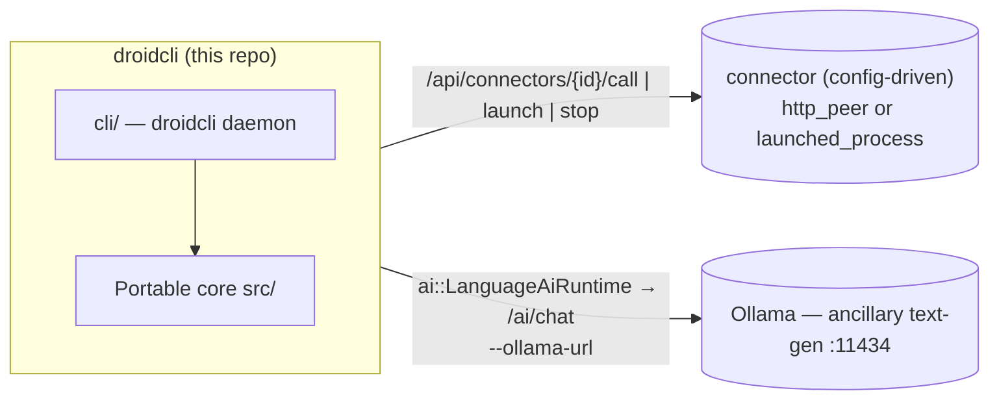
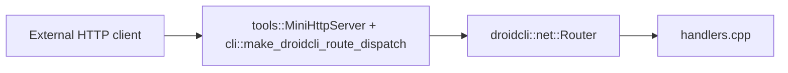
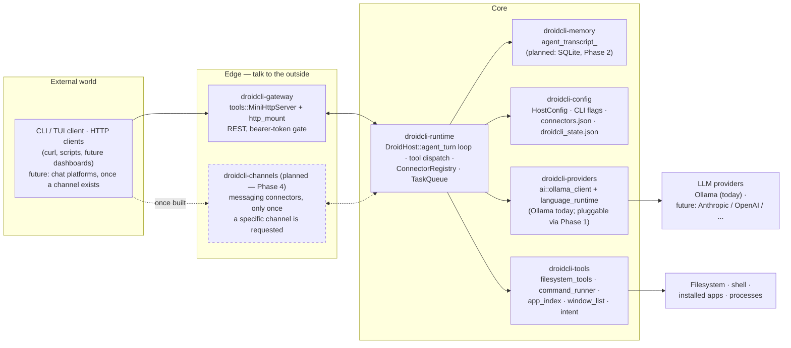

# droidcli - Architecture

Portable C++17 library for Droidcli **control logic**: HTTP route handlers,
the connector/task-queue system, media decode, session snapshots, and the
Ollama AI seam (incl. tool-calling). The droidcli host (`cli/`) supplies
transport, process I/O, and API auth through thin callbacks.

App version: **droidcli 0.1.0** (first release under this name).

---

## System context — a core plus config-driven connectors

droidcli is the **agent controller and network trigger** at the center of an
open-ended set of peer applications. The portable core decides *what* should
happen; the droidcli host performs the actual transport, process control, and
dispatch. Peers are **connectors defined in config** (or registered at
runtime over HTTP) — the core has zero compiled-in knowledge of any specific
peer app.



| Concern | What it owns | Seam in this repo |
| ------- | ------------ | ----------------- |
| **droidcli core + host** | Control logic, command + task dispatch, HTTP in/out, process control | — |
| **A connector** (operator-configured) | Whatever the operator points it at — an inference server, a media player, anything reachable by URL or local command | `net::Connector` (`http_peer` or `launched_process`), registered via `--config` or `POST /api/connectors` |

> **Ollama stays separate.** Ollama is a general **text-generation** endpoint
> behind `ai::LanguageAiRuntime` / `/ai/chat` — it is not a connector, it's
> built into the core AI seam. Any purpose-trained inference service is
> registered as an ordinary
> `http_peer` connector instead, with no special-cased code path. All
> endpoints/models are **configuration**, never baked into core.

---

## Design goals

| Goal                   | How                                                                     |
| ---------------------- | ----------------------------------------------------------------------- |
| Portability            | C++17, `droidcli::core::`* value types, no engine/framework types      |
| Single source of truth | Command validation, JSON shapes, connector/task state                   |
| Testability            | CMake + unit tests without network, GPU, or GUI                         |
| Host bridge            | Hosts inject transport/process I/O via `std::function` callbacks        |

**Rule of thumb:** if it touches a real socket, process, window, or the
filesystem at runtime, it stays in the host. If it is pure state + parsing +
validation + JSON, it belongs in core.

---

## Repository layout

```
metaagent/                        (repository directory name unchanged)
├── droidcli_core.h                Umbrella public API
├── droidcli_core.cpp              Single TU — #includes all module .cpp files
├── src/
│   ├── initialize.hpp             initialize_defaults()
│   ├── core/                      Vec3, math, log_sink, value types
│   ├── media/                     PNG/JPEG decode, probe, MediaStore
│   ├── net/                       Route table, handlers, connector, json
│   ├── notify/                    Notify body parsing
│   ├── session/                   RuntimeSession + status strings
│   ├── app/                       tasks (persistent task queue)
│   ├── ai/                        Ollama text-gen client (incl. tool-calling) + LanguageAiRuntime
│   └── intent/                    Deterministic "open X" phrase recognizer (no LLM, no I/O)
├── cli/                            droidcli host: DroidHost, ProcessManager, command_runner, HTTP route mount, entrypoint
├── tools/                         mini_http_server + sync_http_client (raw-socket HTTP, WinHTTP for https://)
├── tests/                         One *_test.cpp per core module
├── config/                         Example connector config (connectors.example.json)
├── distribute/                    Dist templates (run_all.bat, README)
├── CMakeLists.txt
├── README.md
└── ARCHITECTURE.md
```

Public entry point: `#include "droidcli_core.h"`.

---

## Modules

| Module                    | Role                                                                  |
| ------------------------- | --------------------------------------------------------------------- |
| `core/types` + `math`     | `String`, `Array`, `Vec3`, color types, math helpers                  |
| `media/decode` + `probe`  | FFmpeg-backed decode + probe (host stages the DLLs)                   |
| `net/router` + `handlers` | `/health`, `/echo`, `/notify`, `/ai/chat`                             |
| `net/connector`           | **Generic peer registry**: `Connector` (`http_peer` \| `launched_process`), `ConnectorRegistry` register/unregister/list/find, JSON build/parse |
| `net/json`                | Escape/build/extract JSON fields (no external JSON dependency)        |
| `notify/parse`            | Notify body parsing (JSON or text)                                    |
| `session/types` + `status`| `RuntimeSession`, `FeatureFlags` (ai/networking/recording/ui), status |
| `app/tasks`               | **Persistent task queue**: `Task` (incl. `result_json`), `TaskQueue` (enqueue/claim_next/complete/fail/find/list), JSON build/parse |
| `ai/ollama_client`        | Ollama request/response shaping, incl. **tool-calling**: `ToolDefinition`/`ToolCall`, `"tools"` request field, `message.tool_calls` response parsing, `ChatRole::Tool` |
| `ai/language_runtime`     | Transcript + turn state for **Ollama text-gen** (`/ai/chat`); POST via `LanguageAiTransportCallbacks`. Separate from any connector-registered inference peer. Single-shot (no tool-calling) - the multi-hop agent loop lives in `DroidHost::agent_turn` instead |
| `intent/open_intent`      | Deterministic "open X" phrase recognizer (pure string scanning, no LLM, no I/O) - backs `POST /api/apps/quick_open`, see "Quick-open" below |

The droidcli host (`cli/`) additionally owns: the config store, the
`ConnectorRegistry` + `TaskQueue` instances and their dispatch (`call_connector`
for `http_peer`, `launch_connector`/`stop_connector` for `launched_process`,
`tick_tasks()` draining the queue, including a `"run"` command dispatched to
`command_runner`), the **ProcessManager** (Job Object/process-group launch of
any `launched_process` connector with PID tracking), **`command_runner`**
(one-shot, synchronous, timeout-bounded shell command execution with captured
stdout/stderr - `POST /api/run` and the `"run"` task command - plus
`launch_application`, a detached fire-and-forget GUI-app launch with no wait
and no output capture, distinct from the blocking `run_command_once` -
resolves a bare app name against the Windows App Paths registry first (how
most GUI installers register themselves, e.g. `chrome` even though it's
never added to PATH), then PATH, then falls back to the **`app_index`**
installed-apps index if both fail - `POST /api/open`), **`app_index`**
(`scan_installed_applications()`, Windows' Add/Remove Programs/Uninstall
registry entries under HKLM native + WOW6432Node + HKCU, resolving each
entry's `DisplayIcon` or a shallow `InstallLocation` scan to an actual
`.exe`; scanned once at `DroidHost::initialize()` and cached, not re-scanned
per lookup - covers apps that never registered on PATH or in App Paths at
all, e.g. Blender or KiCad - `POST /api/apps/find`), **`window_list`**
(`list_open_windows()`, `EnumWindows` filtered to visible/titled top-level
windows with owning process name + PID via `QueryFullProcessImageNameA` -
the same set Alt+Tab shows; a live, uncached snapshot re-enumerated every
call, unlike `app_index`'s scan-once - `GET /api/apps/open`),
**`filesystem_tools`**
(`read_file`/`write_file`/`list_dir`/`stat_path`/`get_current_working_directory`/
`which_executable`, `std::filesystem`-backed, no external dependency - `POST
/api/fs/*`), and **`DroidHost::agent_turn`** (a bounded Ollama tool-calling
loop over a fixed tool set - connectors, tasks, shell commands, app launches,
open-window queries, and filesystem primitives - each tool implemented by
calling back into `DroidHost`'s own methods, self-contained rather than
delegating to another process or MCP server; every hop (user message, tool
call + result, final reply, and failure paths) is logged via
`append_app_log()` under the `chat` channel - `POST /api/agent/turn`).

---

## HTTP flow



Inbound: `tools::MiniHttpServer` (raw-socket, no httplib) binds the socket,
parses headers into `net::HttpRequest`, and - before any route is dispatched -
checks the bearer token for every `/api/*` path and `/ai/chat` (see "HTTP API"
below), returning `401` on failure. Requests that pass the check are
tried against the portable `net::RouteTable` (`/health`, `/echo`, `/notify`,
`/ai/chat`); anything else falls through to
`cli::make_droidcli_route_dispatch`'s `CustomRouteFn`, which covers `/api/*`
(status/config/ollama/process/run/agent/connectors/tasks).
Outbound: `tools::sync_http_client` performs the POST/GET (raw socket for
`http://`, WinHTTP for `https://`); core builds and parses the bodies.

---

## HTTP API

### Security: API authentication

droidcli's HTTP API can execute shell commands (`/api/run`) and drive an LLM
tool-calling loop that can call those same routes (`/api/agent/turn`) — so
every `/api/*` route, plus `/ai/chat` (an Ollama call has a real cost even
though it can't run shell commands), requires an
`Authorization: Bearer <token>` header. `/health`, `/echo`, and `/notify` stay
open since they're read-only/log-only and liveness checks shouldn't need a
token.

The token comes from, in order: `--token <value>`, the `DROIDCLI_API_TOKEN`
env var, or — if neither is set — a random 32-byte (64 hex char) token
generated at startup and printed to the console:

```
droidcli: generated API token (save this): 3f9a1c...
```

droidcli **never** starts the HTTP API with authentication disabled. A
request without a valid token gets `401 Unauthorized`:

```sh
curl -i http://127.0.0.1:30080/api/status
# HTTP/1.1 401 ...
# {"error":"unauthorized","message":"missing or invalid Authorization: Bearer <token> header"}

curl -i http://127.0.0.1:30080/api/status -H "Authorization: Bearer 3f9a1c..."
# HTTP/1.1 200 ...
```

The in-process TUI (`cli/tui.cpp`) calls `DroidHost` methods directly, not
over HTTP, so it never needs the token.

### Routes

`[auth]` marks routes that require the `Authorization: Bearer <token>` header.

| Method | Route | Description |
| ------ | ----- | ------------ |
| `GET` | `/health` | Liveness + session snapshot (portable handler, no auth) |
| `GET` / `POST` | `/echo` | Echo query/body (no auth) |
| `POST` | `/notify` | Ingest notify event (no auth) |
| `POST` | `/ai/chat` `[auth]` | Ollama text-gen chat via `LanguageAiRuntime` |
| `GET` | `/api/status` `[auth]` | Host status: AI-enabled flag, connector/task counts |
| `GET` | `/api/network/status` `[auth]` | Networking flag + connector count |
| `GET` | `/api/config` `[auth]` | Effective host configuration (Ollama) |
| `POST` | `/api/config` `[auth]` | Update host configuration at runtime |
| `GET` | `/api/notify/log` `[auth]` | Recent notify messages |
| `GET` | `/api/app/log` `[auth]` | Recent host application log |
| `POST` | `/api/run` `[auth]` | Run a one-shot shell command — body `{"command":"...","work_dir":"...","timeout_ms":30000}` |
| `POST` | `/api/open` `[auth]` | Launch a GUI application, detached (no wait, no output capture) — body `{"path_or_name":"...","args":"...","work_dir":"..."}` |
| `POST` | `/api/apps/find` `[auth]` | Search the installed-apps index (scanned at startup) — body `{"query":"..."}`, returns `{"matches":[{"name":...,"path":...}]}` |
| `POST` | `/api/apps/quick_open` `[auth]` | Deterministic, LLM-free "open X" recognizer — body `{"message":"..."}`, returns `{"matched":bool,"app_name":"...","ambiguous":bool,"resolved_name":"...","resolved_path":"...","candidates":[...]}` (see "Quick-open" below) |
| `GET` | `/api/apps/open` `[auth]` | Live snapshot of currently open windows — `{"windows":[{"title":...,"process_name":...,"pid":...}]}`, re-enumerated fresh on every call |
| `POST` | `/api/fs/read` `[auth]` | Read a file — body `{"path":"...","max_bytes":65536}`, response reports `truncated` |
| `POST` | `/api/fs/write` `[auth]` | Write/append a file — body `{"path":"...","content":"...","append":false}` |
| `POST` | `/api/fs/list` `[auth]` | Non-recursive directory listing — body `{"path":"..."}` (omit for cwd) |
| `POST` | `/api/fs/stat` `[auth]` | Check existence/type/size of a path — body `{"path":"..."}` |
| `GET` | `/api/fs/cwd` `[auth]` | droidcli's current working directory |
| `POST` | `/api/fs/which` `[auth]` | Resolve an executable against `PATH` — body `{"name":"..."}` |
| `POST` | `/api/agent/turn` `[auth]` | Tool-calling agent turn — body `{"message":"...","clear":false}` |
| `GET` | `/api/ollama/status` `[auth]` | Ollama text-gen endpoint status + model list |
| `POST` | `/api/ollama/config` `[auth]` | Update Ollama model at runtime |
| `GET` | `/api/process/status` `[auth]` | PID + running state of every launched connector process |

**Connectors** (generic peer config; all `[auth]`):

| Method | Route | Description |
| ------ | ----- | ------------ |
| `GET` | `/api/connectors` | List all registered connectors |
| `POST` | `/api/connectors` | Register (or replace) a connector — body is a `Connector` JSON object |
| `GET` | `/api/connectors/{id}/status` | Liveness: PID/running for `launched_process`, `/health` probe for `http_peer` |
| `POST` | `/api/connectors/{id}/launch` | Launch a `launched_process` connector (Job Object / process group, PID-tracked) |
| `POST` | `/api/connectors/{id}/stop` | Stop it |
| `POST` | `/api/connectors/{id}/call` | Proxy an HTTP call to an `http_peer` connector — body `{"path":"/api/x","method":"POST","payload_json":"{...}"}` |

**Tasks** (persistent pending/running/done/failed queue; `tick_tasks()` runs every poll loop iteration and dispatches one pending task per tick; all `[auth]`):

| Method | Route | Description |
| ------ | ----- | ------------ |
| `GET` | `/api/tasks` | List all tasks (history capped, pending/running always kept) |
| `POST` | `/api/tasks` | Enqueue a task — body `{"connector_id":"...","command":"launch\|stop\|run\|<path>","payload_json":"{...}"}` |
| `GET` | `/api/tasks/{id}` | Task status, including `result_json` once done (e.g. captured stdout/stderr for a `"run"` task) |

A task with `command: "launch"` or `"stop"` calls `launch_connector`/`stop_connector`
on its `connector_id`; `command: "run"` runs `payload_json`'s `{"command":"...","work_dir":"..."}`
as a one-shot shell command (no `connector_id` needed); any other command is
treated as the HTTP path to call on an `http_peer` connector.

### Quick-open (`POST /api/apps/quick_open`) — hardening app launches against LLM unreliability

Opening an application is common enough, and consequential enough, that it
should not depend on a local model reliably deciding to call a tool. Early
testing showed a small Ollama model asked to "open Blender" sometimes
apologizing that it "can't open applications" instead of calling
`open_application` - the tool existed, the model just didn't use it. Rather
than trying to prompt-engineer that away, `intent::parse_open_intent()`
(`src/intent/open_intent.hpp`/`.cpp`, portable core, network-free, unit
tested in `tests/intent_test.cpp`) recognizes a narrow, deterministic shape -
"open X", "launch X", "start X", optionally wrapped in courtesy phrasing
("can you ...", "please ...") and trailing filler ("... for me", "... now")
- with pure string scanning, no LLM call. Matching requires the verb to be
the first word of the message (after stripping courtesy prefixes), so an
ordinary question like "how do I open a file in Python" is not hijacked -
that keeps reaching the full agent/LLM path in `POST /api/agent/turn`.

`DroidHost::try_quick_open_json()` (`cli/host.cpp`) resolves a recognized
`app_name` against the same installed-apps index `find_application` uses
(`installed_apps_`, including the built-in-accessories table added to
`app_index.cpp` - see below) and reports one of three outcomes: an
unambiguous single match, an ambiguous set of candidates, or nothing found
(in which case the raw name is still offered as an `open_application`
attempt, since that call has its own independent App Paths/PATH resolution
beyond the index). The TUI (`cli/tui.cpp`) calls this on every Enter press
*before* the Ollama-setup state machine or the agent-turn worker thread; if
it matches, the TUI asks the user to confirm (yes/no, or a number if
ambiguous) and only then calls `open_application` - so the LLM is bypassed
for recognition, but a human still approves every actual launch. This is a
deliberately narrow fast path: anything that doesn't match the shape falls
through to the full tool-calling loop unchanged.

`app_index.cpp` also gained a small built-in-accessories table (Notepad,
Calculator, Paint, Command Prompt, PowerShell, File Explorer, Task Manager,
Control Panel, Snipping Tool, Magnifier, Registry Editor, Character Map,
Remote Desktop Connection, Disk Cleanup) appended to the startup scan -
these ship with Windows and never register an Add/Remove Programs entry, so
the Uninstall-registry scan alone could never find them. Name matching
(`normalize_for_match()` in `cli/host.cpp`) is case- and
spacing/punctuation-insensitive, so "NotePad", "NOTEPAD", and "note pad" all
resolve identically.

### The agent turn (`POST /api/agent/turn`)

Drives a bounded (5-hop) Ollama tool-calling loop: the model sees a fixed tool
set (`list_connectors`, `connector_status`, `launch_connector`,
`stop_connector`, `call_connector`, `enqueue_task`, `list_tasks`,
`run_command`) and can call any of them against this `DroidHost` instance
before replying in natural language.

```sh
curl -X POST http://127.0.0.1:30080/api/agent/turn \
  -H "Authorization: Bearer <token>" \
  -H "Content-Type: application/json" \
  -d '{"message":"list the registered connectors"}'
```

Response shape:

```json
{
  "ok": true,
  "assistant": "You have 2 connectors registered: ...",
  "actions": [
    {"tool": "list_connectors", "arguments_json": "{}", "result_json": "{\"connectors\":[...]}"}
  ]
}
```

If Ollama is disabled or unreachable, or the transcript budget (5 hops) runs
out before a final natural-language reply, the response is still valid JSON
(`ok:false` with an `error`, or `ok:true` with `budget_exhausted:true` and the
last assistant text) rather than a crash.

### One-shot commands (`POST /api/run`)

```sh
curl -X POST http://127.0.0.1:30080/api/run \
  -H "Authorization: Bearer <token>" \
  -H "Content-Type: application/json" \
  -d '{"command":"echo hello","work_dir":"","timeout_ms":30000}'
# {"launched":true,"exit_code":0,"stdout":"hello\r\n","stderr":"","error":""}
```

Synchronous and blocking (unlike the PID-tracked `launched_process` connector
lifecycle) — captures stdout/stderr and enforces `timeout_ms`, killing the
process and reporting `error` if it's exceeded.

---

## Build

### Standalone

```powershell
cd metaagent
cmake -S . -B build -DCMAKE_BUILD_TYPE=Release
cmake --build build
ctest --test-dir build --output-on-failure
```

Tests: `media_decode_test`, `net_handler_test`, `ollama_client_test`,
`language_runtime_test`, `connector_test`, `task_queue_test`, `intent_test`.

On Windows the whole tree builds with **one MSVC runtime**
(`CMAKE_MSVC_RUNTIME_LIBRARY` in the root CMakeLists: dynamic Debug, static
Release) — never set a per-target runtime that diverges.

---

## Roadmap: packaging as a self-contained daemon assistant

droidcli is heading toward the same shape as ZeroClaw
(https://docs.zeroclawlabs.ai): a single long-running daemon process on the
user's own machine that both *understands* requests (via the Ollama seam) and
*acts* on them directly (via native `DroidHost` tools - no external agent
runtime, no MCP client chain, no cloud round-trip required to execute a local
action). The pieces below are not built yet; this section is the design
record for how they should fit once they are, so packaging decisions get made
once instead of re-litigated per feature.

**Bootstrapped self-knowledge, not blank-slate prompting.** The daemon already
knows facts about the machine it runs on before the user ever types anything -
the installed-apps index (`app_index.cpp`, scanned once at
`DroidHost::initialize()`), the open-window snapshot (`window_list.cpp`), and
`which`/PATH resolution. `HostConfig::system_prompt` and the count appended in
`DroidHost::agent_turn()` (`cli/host.cpp`) exist to turn that bootstrapped
state into something the model is *told as fact*, not something it has to be
argued into believing it can do. As more startup-time system facts get added
(installed shells/interpreters, GPU presence, disk space, logged-in user),
the same pattern applies: scan once at `initialize()`, cache on `DroidHost`,
and fold a concrete summary into the system prompt rather than leaving it
purely tool-call-discoverable - a model should never have to be told twice
that a capability exists.

**No MCP client, ever (see `AGENTS.md` guardrails).** Every new capability is
a new `DroidHost` method plus a matching `agent_tool_definitions()` /
`execute_agent_tool()` entry (`cli/host.cpp`) - the same surface `/api/*`
already exposes over HTTP. This keeps the trust boundary singular: whatever
`/api/agent/turn` can do, an operator can already see and call directly over
HTTP with the same bearer token. If droidcli ever speaks MCP, it is as a
*server* (exposing its own tool set to external MCP clients), never as a
*client* pulling in a third party's tool implementations - that would break
the "one process, one binary, no supply chain" property this whole roadmap is
about.

**True background operation.** `--daemon` is currently a documented no-op
(`cli/droidcli.cpp` always runs foreground); a real implementation needs:
Windows Service (`SERVICE_WIN32_OWN_PROCESS`, via `ServiceMain`/
`RegisterServiceCtrlHandler`) and a POSIX/systemd unit (`Type=simple` or
`Type=notify`) as two host-side entry points sharing the same `DroidHost`.
`--headless` (skip the FTXUI TUI, keep the HTTP daemon loop) is the correct
foundation for this - a service wrapper is just another host that never
constructs a `ScreenInteractive`.

**Auto-start of the API, opt-in for actions.** The daemon binding its HTTP
port and accepting `/api/*` calls at boot is safe to make automatic (it is
inert until called and gated by the bearer token per `AGENTS.md`'s auth
guardrail). Launching a `launched_process` connector automatically is not -
`AGENTS.md` already establishes that connectors only launch when told to
(`POST /api/connectors/{id}/launch` or a queued task), and that design choice
should hold for any future "run at startup" feature: an operator opts a
*specific* connector or task into auto-start via its own config, the daemon
itself never decides to launch something unprompted.

**Distribution stays single-binary.** `build_and_distribute.bat` already
stages `droidcli.exe` + FFmpeg DLLs into `dist/`; the packaging goal is that
this stays the *only* thing an end user installs - no Python runtime, no
node_modules, no sidecar interpreter. Ollama is the one external dependency,
and it already has its own install/start/pull lifecycle exposed through
`DroidHost` (`install_ollama()`/`start_ollama()`/`pull_ollama_model()` in
`cli/host.cpp`) precisely so the daemon can bootstrap its own AI backend
without the user leaving droidcli. Any future capability that seems to need a
new external runtime should be questioned against this constraint first.

**Token and secret handling scale the same way they do today.** As more
connectors/tools carry credentials (API keys for `http_peer` connectors,
future cloud-model fallbacks), the existing rule holds: never echo a secret
back via a config read, only a `*_configured: bool` (see `CLAUDE.md`). A
packaged daemon that runs unattended is a higher-value target for credential
exfiltration than an interactively-run one, so this rule gets stricter, not
looser, as auto-start lands.

---

## Comparison to ZeroClaw's crate architecture

ZeroClaw (https://docs.zeroclawlabs.ai) is a Rust cargo workspace of ~18
crates split into three tiers: **Core** (runtime/config/memory/providers/
tools), **Edge** (channels/gateway — the crates that talk to the outside
world), and consumers of the public **API** trait layer (`ModelProvider`,
`Channel`, `Tool`, `Memory`, `Observer`, `RuntimeAdapter`, `Peripheral`).
droidcli is a single C++ static library plus one executable, not a
multi-crate workspace, so this is not a plan to reshape droidcli into 18
targets — it is a role-by-role check of what droidcli already covers, what's
partial, and what would be genuinely new work if droidcli grew toward the
same capability set.

The diagram below is drawn in the same three-tier shape as ZeroClaw's
(External world → Edge → Core → external providers/OS), not the old
"portable core vs. host" split from the Roadmap section above. That
core-vs-host line is a real, load-bearing rule for *where new code physically
goes* inside `src/`/`cli/` (see the Golden rule in `AGENTS.md`) — but it is an
implementation detail, not the product's architecture, and conflating the two
made droidcli look like it had no Core/Edge shape at all. It has one; `src/`
and `cli/` are just how that shape is currently split across translation
units, not where the tier boundaries are.



### Crate-by-crate mapping

| ZeroClaw crate | Role | droidcli equivalent | Status |
| --- | --- | --- | --- |
| `zeroclaw-runtime` | Agent loop, security policy, SOP engine, cron, SubAgents, RPC | `DroidHost::agent_turn` (`cli/host.cpp`) — one bounded tool-calling loop | **Partial** — no security-policy layer beyond the bearer token, no SOP engine, no cron scheduler (`TaskQueue` is a dispatch queue, not a scheduler), no SubAgents/RPC |
| `zeroclaw-config` | TOML schema, secrets encryption, autonomy levels, workspace resolution | `HostConfig` (`cli/host.hpp`) + CLI flags + `connectors.json` | **Partial** — flat JSON/CLI flags not TOML, token is plaintext (env var or CLI arg, never echoed back — see `CLAUDE.md`), no autonomy levels, no workspace concept |
| `zeroclaw-api` | Public traits: `ModelProvider`, `Channel`, `Tool`, `Memory`, `Observer`, `RuntimeAdapter`, `Peripheral` (kernel ABI) | `net::Connector` is the closest thing to a provider/channel abstraction; `ai::ToolDefinition`/`ToolCall` is the Tool ABI | **Partial** — one concrete abstraction (`Connector`) covers what ZeroClaw splits into `ModelProvider`+`Channel`+`Peripheral`; no formal interface/trait layer, no `Memory`/`Observer` abstractions |
| `zeroclaw-providers` | LLM client impls (Anthropic/OpenAI/Ollama/…) + hint router + retry | `ai/ollama_client.cpp` | **Missing multi-provider** — Ollama only, no router, no retry wrapper |
| `zeroclaw-channels` | 30+ messaging integrations (Discord, Slack, Telegram, …) | None | **Missing entirely** — `Connector` generalizes the concept but nothing implements a messaging-channel connector yet |
| `zeroclaw-gateway` | HTTP/WebSocket gateway, web dashboard, webhook ingress | `tools::MiniHttpServer` + `cli/http_mount.cpp` | **Partial** — REST exists; no WebSocket, no dashboard UI, webhook auth is the same bearer-token gate as everything else |
| `zeroclaw-tools` | Callable tool implementations (browser, HTTP, PDF, hardware probes) | `filesystem_tools.cpp`, `command_runner.cpp`, `window_list.cpp`, `app_index.cpp`, `intent/open_intent.cpp` | **Have**, functionally — not split into a separate module boundary, all linked straight into `cli/`/`src/` |
| `zeroclaw-tool-call-parser` | Model-side tool-call syntax parsing/normalization | `ai::ollama_client`'s `tool_calls` JSON parsing | **Partial** — handles Ollama's native tool-call format only, nothing to normalize across providers since there's only one |
| `zeroclaw-memory` | Conversation memory, embeddings, vector retrieval | `agent_transcript_` (`cli/host.hpp`) | **Missing** — in-process `std::vector`, cleared on `clear:true`, no persistence, no embeddings/vector retrieval |
| `zeroclaw-plugins` | Dynamic plugin loading | None | **Missing** — deliberately: `AGENTS.md` keeps capabilities as native `DroidHost` methods rather than a loadable-plugin surface |
| `zeroclaw-hardware`, `aardvark-sys`, `robot-kit` | GPIO/I2C/SPI/USB, specialized hardware | None | **Not planned** — engine/hardware code was explicitly removed at 0.2.0 (`AGENTS.md` guardrails) |
| `zeroclaw-infra` | SQLite session backend, debouncers, stall watchdog | `droidcli_state.json` (flat file, connector persistence), `logs/log.txt` | **Partial** — flat-file, not SQLite; no debouncer/watchdog abstraction |
| `zeroclaw-log` | Structured JSONL logging, attribution, `record!`/`scope!` macros, Observer bridge | `DroidHost::append_app_log()` + `logs/log.txt` | **Partial** — plain-text lines with channel/direction/summary, not JSONL; no attribution model, no Observer bridge |
| `zeroclaw-spawn` | Sanctioned `tokio::spawn` wrapper with attribution propagation | Raw `std::thread` in `cli/tui.cpp`/`cli/host.cpp` | **Missing** — no wrapper, no attribution; each background thread is hand-rolled with its own hand-off pattern (see the `PolledState`/`ChatWork` comments in `cli/tui.cpp`) |
| `zeroclaw-macros` | Derive macros for config/tool registration | N/A | **N/A** — different language; C++ has no derive-macro equivalent, tool registration is the manual `agent_tool_definitions()` list instead |
| `zerocode` | Terminal UI | `cli/tui.cpp` (FTXUI) | **Have** |

### What this means for droidcli

The honest read: droidcli today is architecturally closest to ZeroClaw's
**Core** tier (`runtime` + `config` + a single `providers` entry + `tools`),
with **no Edge tier** (no `channels`, a minimal `gateway`) and **no memory
persistence**. That's consistent with what droidcli actually is right now —
a single-machine, single-operator daemon reached over localhost HTTP or an
in-process TUI, not a multi-channel assistant reachable from Discord/Slack/
email.

Extension work, roughly in the order it would need to land to close the gap,
without pretending a crate-per-crate port is the right target for a C++
static library:

1. **A real provider abstraction**, even before adding a second LLM backend
   — an `ai::ModelProvider`-shaped interface that `ollama_client` implements,
   so a future Anthropic/OpenAI client is additive rather than a rewrite of
   `agent_turn`'s Ollama-specific request building.
2. **Persistent, queryable memory** — `agent_transcript_` surviving a
   restart (SQLite, matching `zeroclaw-infra`'s choice, is a more honest fit
   for droidcli's "no Python runtime" packaging constraint than a new
   dependency) before embeddings/vector retrieval are worth adding at all.
3. **Structured (JSONL) logging with attribution** — `zeroclaw-log`'s shape
   is directly portable to `append_app_log()`: same call site, richer
   record. This is low-risk, mechanical work and should probably happen
   before anything else on this list, since every other feature benefits
   from better observability immediately.
4. **A `Channel` concept, only once a channel is actually wanted** — do not
   build `zeroclaw-channels`-equivalent plumbing speculatively. `Connector`
   already generalizes "a peer droidcli talks to"; a messaging channel is a
   new `Connector` kind (`kind: "messaging_peer"` or similar) plus inbound
   webhook handling in `http_mount.cpp`, not a new subsystem.
5. **`zeroclaw-spawn`'s attribution idea, not its `tokio` mechanism** — a
   thin wrapper around `std::thread` construction that tags each background
   thread with what spawned it and why, surfaced in the structured log from
   (3). Cheap, and it would have made debugging the TUI's worker-thread
   hand-off pattern easier while it was being built.

`zeroclaw-hardware`/`aardvark-sys`/`robot-kit` and `zeroclaw-plugins` are
intentionally out of scope — see the "No engine code" and "droidcli does not
consume MCP servers" guardrails in `AGENTS.md`. Nothing above should be read
as a commitment to build all five; it is a menu, ordered by how much later
work each one unblocks, for when a specific product need asks for it.

---

## Extension implementation plan (ZeroClaw parity)

Concrete, phased version of the ranked list above. Each phase is scoped to
land independently — no phase requires a later one to compile, pass
`ctest`, or be useful on its own. Do not start a phase before the previous
one has landed; the ordering exists because each phase's interface choices
constrain the next (the memory store in Phase 2 is keyed by whatever Phase
1's provider abstraction settles on, the log schema in Phase 3 is the
foundation Phase 5's attribution rides on).

### Phase 1 — Provider abstraction

**Goal:** make `ollama_client.cpp` an implementation of an interface rather
than the only possible shape `agent_turn` can talk to, so a second LLM
backend is additive.

**Deliverables:**
- New `src/ai/model_provider.hpp`: an abstract interface (`ModelProvider`)
  with the shape `agent_turn` actually needs — build a request from
  `(transcript, tools)`, parse a response into `(assistant_text, tool_calls,
  error)`. Keep it minimal; do not pre-build fields no current caller uses.
- `ai::ollama_client` reimplemented as `OllamaProvider : ModelProvider` —
  `build_ollama_chat_request`/`parse_ollama_chat_response` become the private
  guts of that class, not a change to their logic.
- `DroidHost` holds a `std::unique_ptr<ai::ModelProvider>` (or a
  `core::Array` of them once Phase 1.5 below is relevant) instead of calling
  `ai::build_ollama_chat_request`/`ai::parse_ollama_chat_response` directly
  in `agent_turn` (`cli/host.cpp`).
- `tests/model_provider_test.cpp`: the existing `ollama_client_test.cpp`
  assertions still apply, now exercised through the `ModelProvider`
  interface — this phase should not change what's tested, only how it's
  reached. (Note: `ollama_client_test` currently has a real, pre-existing
  bug — the tool-role message content isn't showing up in the built request
  body, see the standalone task filed for it. Fix that independently of this
  phase; don't let this refactor inherit or mask it.)

**Explicit non-goal:** do not add a second provider (Anthropic/OpenAI) in
this phase. The interface should be validated against the one real
implementation (Ollama) first — adding a second provider before the
interface has been proven against one real caller (`agent_turn`) risks
designing the trait around two APIs' lowest common denominator instead of
what droidcli actually needs.

**Acceptance:** `ctest` green, `agent_turn` behavior unchanged (same
requests/responses over `/api/agent/turn`), `HostConfig` gains no new
required fields (Ollama stays the default/only configured provider).

### Phase 2 — Persistent memory (SQLite)

**Goal:** `agent_transcript_` survives a restart, and is queryable, without
adding a runtime dependency droidcli doesn't already accept.

**Why SQLite, matching `zeroclaw-infra`'s choice:** it is a single header +
source amalgamation (no separate service, no network port), which fits the
"no Python runtime, no node_modules, no sidecar interpreter" distribution
constraint in the Roadmap section above better than any client/server store
would.

**Deliverables:**
- `third_party/sqlite/` (amalgamation, vendored like FFmpeg is — git-ignored
  build artifacts, but the amalgamation source itself can be committed since
  it's public-domain and small, unlike FFmpeg).
- `src/app/memory_store.hpp`/`.cpp`: `MemoryStore` wrapping a SQLite
  connection, schema `(session_id, hop_index, role, content, created_at)`.
  Pure-ish core module in spirit, but this is real file I/O — per the golden
  rule in `AGENTS.md`, the SQLite calls themselves belong behind a host
  callback (`MemoryTransportCallbacks` mirroring
  `LanguageAiTransportCallbacks`'s pattern) so `src/` stays link-free of the
  SQLite library; the host (`cli/`) owns the actual `sqlite3_open`/exec
  calls.
- `DroidHost::agent_turn` appends to the store on every hop instead of (or
  in addition to, during a transition period) `agent_transcript_`; `clear:
  true` in the request body becomes "start a new session_id" rather than
  wiping in-memory state.
- New route: `GET /api/agent/history?session_id=...` (or the default/current
  session if omitted) for inspecting past turns — this is the "queryable"
  half of the goal, and it's what makes this phase worth doing on its own
  rather than bundled with Phase 3.
- `tests/memory_store_test.cpp`: open an in-memory SQLite DB
  (`:memory:`, no filesystem I/O, keeps this network/GPU/file-free like the
  rest of `tests/`), append/read a transcript, verify ordering and content.

**Explicit non-goal:** no embeddings, no vector retrieval. That is
meaningfully separate work (an embedding model dependency) and nothing in
droidcli today needs semantic recall over old conversations — only durability
across restarts and the ability to inspect history.

**Acceptance:** killing and restarting `droidcli` mid-conversation and
sending another `/api/agent/turn` with the same `session_id` continues the
same transcript; `ctest` green including the new memory test.

### Phase 3 — Structured JSONL logging

**Goal:** replace `append_app_log()`'s plain-text `logs/log.txt` lines with
a structured record any tool can parse, matching `zeroclaw-log`'s shape
without adopting Rust macros droidcli has no equivalent for.

**Deliverables:**
- `AppLogEntry` (`cli/host.hpp`) gains a stable schema written as one JSON
  object per line: `{"ts":"...", "channel":"...", "direction":"...",
  "summary":"...", "success":bool, "session_id":"...", "hop":N}` — the last
  two fields are why this phase comes after Phase 2, not before: attribution
  to a specific memory-store session is only meaningful once sessions exist.
- `append_app_log()`'s body changes to build this JSON line instead of the
  current `[timestamp] [channel] [direction] summary` format; the in-memory
  `app_log_`/`/api/app/log` JSON response shape is unaffected (it already
  returns structured fields — only the *file* format changes).
- The TUI's `log_view` (`cli/tui.cpp`) already renders from the same
  in-memory `AppLogEntry` list via `/api/app/log`, not by re-parsing
  `logs/log.txt` — so this phase does not touch TUI rendering at all,
  confirm that stays true rather than accidentally coupling them.
- `logs/log.txt` becomes `logs/log.jsonl` (rename, since the format
  changed); update the `logs/README.md` git-ignore note.

**Explicit non-goal:** no `Observer` trait/bridge yet — that's a
consumer-side abstraction (something subscribing to log events) with no
concrete subscriber to build it against yet. Land the schema first; add a
subscription mechanism when something (a future dashboard, a future channel)
actually needs to observe log events instead of polling `/api/app/log`.

**Acceptance:** `logs/log.jsonl` is valid JSONL (each line parses standalone
with a standard JSON parser); `ctest` green; no behavior change visible in
the TUI or `/api/app/log`.

### Phase 4 — Channel-as-connector (only once a channel is actually wanted)

**Goal:** prove that a messaging channel (Discord/Slack/Telegram/…) fits as
a `Connector` kind rather than a parallel subsystem, without building one
speculatively.

**Do not start this phase until a specific channel is actually requested.**
Unlike Phases 1–3 and 5, this phase has no value in the abstract — building
"channel support" with no channel to validate it against risks designing
around imagined requirements instead of a real integration's actual
constraints (auth flow, message framing, rate limits all differ per
platform).

**When it is requested, the shape is:**
- A new `Connector::kind` value (e.g. `"messaging_peer"`) in
  `net::connector.hpp`/`.cpp` — config carries whatever that platform's
  client library needs (bot token, workspace ID), stored the same
  never-echo-back way as any other secret (`CLAUDE.md`).
- Inbound: a webhook route in `cli/http_mount.cpp` (e.g.
  `POST /api/channels/{id}/webhook`) that maps an incoming platform message
  to an `agent_turn` call and posts the reply back via that platform's send
  API — reusing `agent_turn`'s existing tool-calling loop rather than a
  second one.
- Outbound-only platforms (no webhook, poll-based) become a `TaskQueue`
  producer instead — a recurring task that polls the platform's API and
  enqueues an `agent_turn`-shaped unit of work, reusing Phase-2's
  session/history model to keep each external conversation as its own
  `session_id`.

**Acceptance (once a channel is chosen):** the new connector kind requires
no changes to `DroidHost::agent_turn`, `execute_agent_tool`, or the core
`Connector` struct's existing fields — only a new `kind` branch in whatever
dispatch already switches on `kind` (`launch_connector`/`call_connector` in
`cli/host.cpp`). If it requires more than that, the abstraction from this
plan was wrong and needs revisiting before writing a second channel.

### Phase 5 — Spawn attribution

**Goal:** every background `std::thread` in the codebase (the TUI's
poller/chat-worker threads today; more will exist once Phase 4 adds
poll-based channel producers) is tagged with what spawned it and why, and
that tag shows up in the Phase-3 structured log.

**Deliverables:**
- `src/core/spawn.hpp`: a thin `droidcli::spawn(name, fn)` wrapper around
  `std::thread` construction — not a thread pool, not a scheduler, just a
  named-thread constructor that logs "spawned"/"joined"/"threw" against the
  Phase-3 JSONL schema's `channel`/`summary` fields under a new `"thread"`
  channel value.
- Replace the two `std::thread` constructions in `cli/tui.cpp` (`poller`,
  `chat_worker`) with `droidcli::spawn("tui.poller", ...)` /
  `droidcli::spawn("tui.chat_worker", ...)`. No behavior change — the
  existing hand-off patterns (`PolledState`, `ChatWork`) stay exactly as
  they are; this phase only wraps the construction call.

**Explicit non-goal:** no thread pool, no work-stealing, no async runtime.
droidcli's threading is deliberately minimal (one poller, one chat worker at
a time) — this phase adds visibility, not a new concurrency model.

**Acceptance:** `logs/log.jsonl` shows a `"thread"`-channel entry for every
poller/chat-worker start and stop; `ctest` green; TUI behavior unchanged.

---

## Extension points

1. **New HTTP route** — handler in `net/handlers.cpp`, register in the router,
   mount in the host(s). If it's a `cli::`-only route (not a portable
   `net::RouteTable` handler), it lands under `/api/*` in
   `cli/http_mount.cpp` and is automatically covered by the bearer-token
   check in `tools::MiniHttpServer::poll_once`.
2. **New connector (peer app)** — usually **config-only**: add an entry to a
   `connectors.json` (or `POST /api/connectors`) with `kind: "http_peer"` and a
   `base_url`; droidcli proxies calls to it via `/api/connectors/{id}/call`
   with zero new code. For `kind: "launched_process"`, `ProcessManager`
   already generalizes over any `launch_cmd`/`work_dir` — again no new code
   needed unless the process has bespoke lifecycle requirements beyond
   launch/stop, in which case extend `DroidHost::launch_connector`/
   `stop_connector` in `cli/host.cpp`.

Product usage, HTTP tables, and env vars: repository root `[README.md](./README.md)`.
