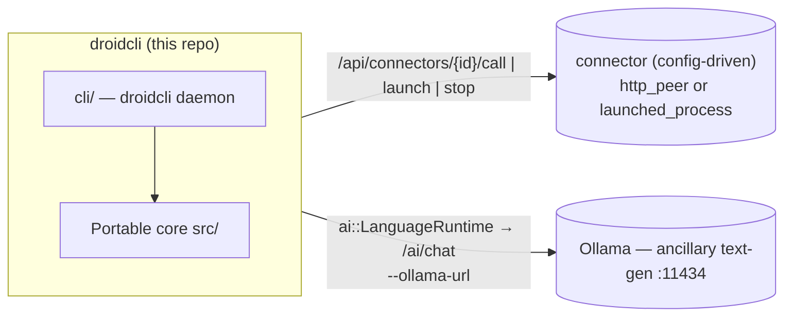
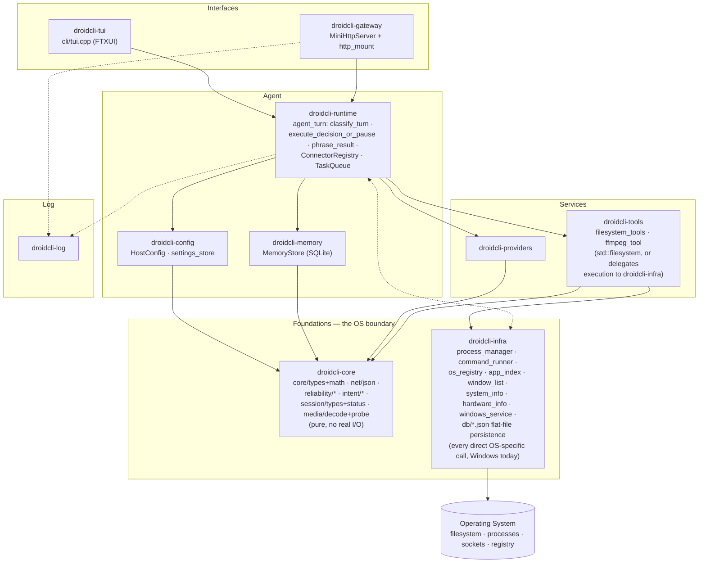
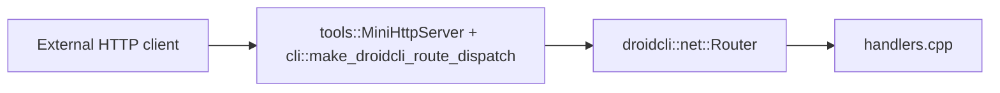
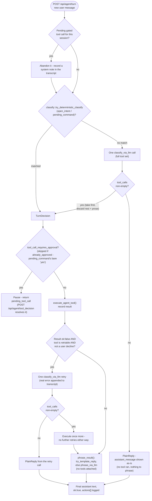
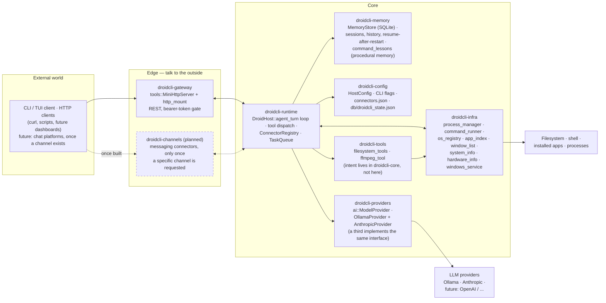
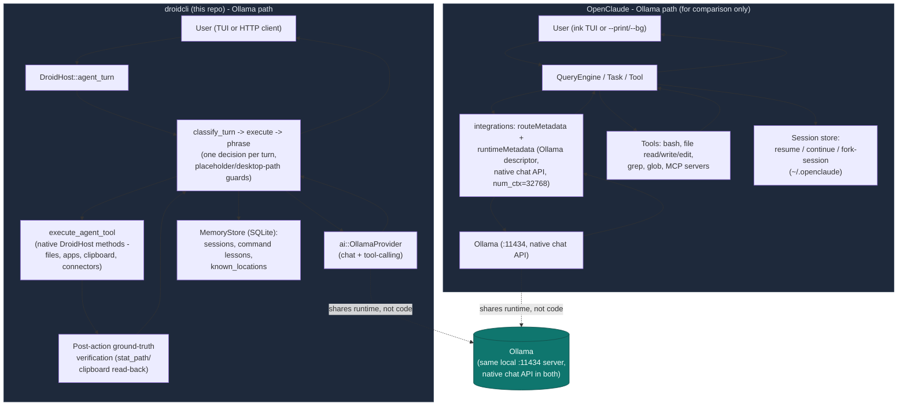

# droidcli - Architecture

Portable C++17 library for Droidcli **control logic**: HTTP route handlers,
the connector/task-queue system, media decode, session snapshots, and the
Ollama AI seam (incl. tool-calling). The droidcli host (`cli/`) supplies
transport, process I/O, and API auth through thin callbacks.

App version: **droidcli 0.1.0** (first release under this name).

---

## System context — a core plus config-driven connectors

droidcli is the **agent controller and network trigger** at the center of an
open-ended set of peer applications. The portable core decides *what* should
happen; the droidcli host performs the actual transport, process control, and
dispatch. Peers are **connectors defined in config** (or registered at
runtime over HTTP) — the core has zero compiled-in knowledge of any specific
peer app.



| Concern | What it owns | Seam in this repo |
| ------- | ------------ | ----------------- |
| **droidcli core + host** | Control logic, command + task dispatch, HTTP in/out, process control | — |
| **A connector** (operator-configured) | Whatever the operator points it at — an inference server, a media player, anything reachable by URL or local command | `net::Connector` (`http_peer` or `launched_process`), registered via `--config` or `POST /api/connectors` |

> **Ollama stays separate.** Ollama is a general **text-generation** endpoint
> behind `ai::LanguageRuntime` / `/ai/chat` — it is not a connector, it's
> built into the core AI seam. Any purpose-trained inference service is
> registered as an ordinary
> `http_peer` connector instead, with no special-cased code path. All
> endpoints/models are **configuration**, never baked into core.

---

## Design goals

- **Portability** — C++17, `droidcli::core::` value types only, no
  engine/framework types leaking into public headers or core logic.
- **Ground-Truth** — a claimed success is independently re-verified against
  real, observable state (a re-read after write, a live process/registry
  check) rather than trusted on a tool's own say-so.
- **Testability** — CMake + unit tests run with no network, GPU, or GUI
  required; command validation, JSON shapes, and connector/task state all
  live in `src/` specifically so they can be exercised this way.
- **Host Bridge** — hosts inject real transport/process/filesystem I/O into
  core via `std::function` callbacks; core itself never touches a socket,
  process, or window directly.

**Rule of thumb:** if it touches a real socket, process, window, or the
filesystem at runtime, it stays in the host. If it is pure state + parsing +
validation + JSON, it belongs in core.

---

## Agent properties

droidcli is a personal desktop assistant, not a dev/build tool, and not an
MCP client. Extend it *with* these properties, not around them:

1. A location-less file/command reference defaults to the user's real
   Desktop (`default_bare_filename_to_desktop()`, `cli/host.cpp`), not
   droidcli's own working directory.
2. Self-contained: new capabilities are new `DroidHost` methods (see
   `filesystem_tools.{hpp,cpp}`/`command_runner.{hpp,cpp}`), never a
   dependency on an external MCP server. If MCP is ever added, droidcli
   exposes itself as a server, not a client.
3. Every agent-tool result carries `"ok"` first, always. Several tools go
   further and independently verify their own side effect after the fact:
   `write_file` re-`stat_path()`s what it just wrote
   (`verified_exists`/`verified_size_bytes`); `remember_location` only
   persists a location a live `stat_path()` confirms is real right now.
4. Every heuristic guard (`looks_like_*`, `substitute_bare_desktop_token`,
   the `src/intent/` recognizers) is written so a false negative just falls
   through to the normal path — a false positive (misfiring on something
   unrelated) is the failure mode to avoid.
5. Deterministic bypasses ("open X", a bare "yes" confirming a proposed
   command) are reserved for narrow, high-confidence request shapes
   recognized by pure string scanning — never a general substitute for the
   model's own judgment.
6. `tool_call_requires_approval()` (`cli/host.cpp`) gates every
   side-effecting tool behind human approval; read-only tools are never
   gated.
7. Three SQLite-backed memories share one `MemoryStore` database
   (`cli/memory_store.{hpp,cpp}`): session transcripts (`memory_entries`),
   command lessons (`command_lessons`), and known locations
   (`known_locations`). Deliberately minimal — no embeddings, no vector
   search, `LIKE`-based substring matching only.
8. Fixes are narrow and evidence-driven, not generic — a genuinely hard,
   unsolved problem (e.g. verifying a model's claim about tool *content*,
   not just whether a tool ran) is recorded as open rather than papered over
   with a narrow regex that wouldn't generalize.
9. The model decides at most one action per turn, never both decides and
   narrates the outcome: `classify_turn()` picks a deterministic match or
   makes exactly one LLM classification call; execution is always
   deterministic code, never the model's own say-so; the reply is either a
   zero-LLM-call template or a second, narrowly-grounded phrasing call shown
   only the actual result. A failed, retriable action gets exactly one
   bounded auto-retry (`finish_turn_after_execution()`), never a nudge loop -
   see "The agent turn" below.
10. Every process launch resolves through the Windows execution ruleset's
    trust order before it runs, and before a gated call is even shown to a
    human for approval — never an unverified guess (see "Windows execution
    ruleset" below).
11. Multi-provider by construction: `ai::ModelProvider` is the interface
    `agent_turn` is coded against; `OllamaProvider` and `AnthropicProvider`
    are both adapters over it, selected at runtime via
    `HostConfig::ai_provider`.
12. Configuration and secrets outlive the process: runtime settings persist
    to a JSON file across restarts and update immediately on change;
    secrets (bearer token, API keys) are DPAPI-encrypted at rest on
    Windows. `--service` lets the process itself survive a reboot/logoff.

---

## Repository layout

```
metaagent/                        (repository directory name unchanged)
├── droidcli_core.h                Umbrella public API
├── droidcli_core.cpp              Single TU — #includes all module .cpp files
├── src/
│   ├── initialize.hpp             initialize_defaults()
│   ├── core/                      Vec3, math, log_sink, value types, spawn() attribution
│   ├── media/                     PNG/JPEG decode, probe, MediaStore
│   ├── net/                       Route table, handlers, connector, json
│   ├── notify/                    Notify body parsing
│   ├── session/                   RuntimeSession + status strings
│   ├── app/                       tasks (persistent task queue)
│   ├── ai/                        Ollama text-gen client (incl. tool-calling) + LanguageRuntime + ModelProvider interface
│   ├── intent/                    Deterministic open/create-file/create-image/pending-command phrase recognizers + shared phrase_strip helpers (no LLM, no I/O)
│   ├── classify/                  TurnDecision + try_deterministic_classify/try_template_reply (Classify -> Execute -> Phrase, no LLM, no I/O)
│   └── reliability/               Path/destructive-command guards used by cli/host.cpp (no LLM, no I/O)
├── cli/                            droidcli host: DroidHost, ProcessManager, command_runner, MemoryStore (SQLite), HTTP route mount, entrypoint
├── tools/                         mini_http_server + sync_http_client (raw-socket HTTP, WinHTTP for https://)
├── tests/                         One *_test.cpp per core module
├── third_party/sqlite/            Vendored SQLite amalgamation (committed - see third_party/README.md)
├── config/                         Example connector config (connectors.example.json)
├── distribute/                    Dist templates (run_all.bat, README)
├── CMakeLists.txt
├── README.md
└── ARCHITECTURE.md
```

Public entry point: `#include "droidcli_core.h"`.

---

## Modules

Grouped by the `droidcli-xyz` module boundary each belongs to - the same
vocabulary "Comparison to ZeroClaw's crate architecture" below uses. This is
a conceptual grouping, not a separate CMake target or library - droidcli
stays one static library (`src/`) plus one executable (`cli/`).



`droidcli-tui` and `droidcli-gateway` are drawn side by side, not stacked -
both call into `droidcli-runtime` directly as independent front doors,
neither goes through the other. `droidcli-memory` and `droidcli-config` sit
in `Agent` alongside `droidcli-runtime`, not in `Services` below it - both
are state `agent_turn` owns and reads/writes directly (session transcripts,
command lessons, known locations; host settings and secrets), not a
callable capability the runtime dispatches out to the way it does with
`droidcli-tools`/`droidcli-providers`.

`Foundations` is where droidcli's own division against the real Operating
System sits, split into its two halves: `droidcli-core` (the left box) is
everything pure - no real socket/process/filesystem I/O (per the Golden
rule in `AGENTS.md`) - while `droidcli-infra` (the right box) is the part
that actually crosses into the OS. `droidcli-infra` is deliberately the
*only* module that executes OS-specific commands directly - process
launch/tracking (`process_manager`, `command_runner`), registry reads
(`os_registry`, shared by `command_runner`/`system_info`/`hardware_info`),
window enumeration (`window_list`), installed-app discovery (`app_index`),
service control (`windows_service`), and flat-file state persistence -
currently implemented and tested against Windows. It's a two-way connection
to `Agent`, not one-way: `droidcli-runtime` tells it to launch/stop a
process, and `droidcli-infra` reports PID/liveness back, which is why the
edge is drawn `<-.->` rather than a single arrowhead. `droidcli-tools`
depends on it too (`ffmpeg_tool` delegates its actual process execution to
`command_runner` rather than calling `CreateProcess` itself), which is why
`TOOLS --> INFRA` is a solid edge, not dotted - it's a real, direct
dependency, not a cross-cutting notification the way logging is.
`droidcli-log` stays separate, in its own `Log` layer, rather than folded
into `droidcli-infra` - it's not infrastructure the runtime depends on to
function, it's a channel every other layer writes into (the dotted edges
from `droidcli-runtime`/`droidcli-gateway` into it), so it gets its own box
rather than being conflated with process/state management.

> **Naming note:** the `droidcli-core` module in this diagram is a
> conceptual grouping label (like every other `droidcli-xyz` name on this
> page), not the same thing as the `droidcli_core` CMake library target /
> `droidcli_core.h`/`droidcli_core.cpp` umbrella translation unit, which
> spans *all* of `src/` (see "Repository layout" above). The umbrella
> library happens to share the name because it predates this module
> breakdown; don't read `droidcli-core` here as "the whole static library."

### `droidcli-core` — Foundations' pure, portable half

| Module | Role |
| --- | --- |
| `core/types` + `math` | `String`, `Array`, `Vec3`, color types, math helpers |
| `net/json` | Escape/build/extract JSON fields (no external JSON dependency) |
| `notify/parse` | Notify body parsing (JSON or text) |
| `session/types` + `status` | `RuntimeSession`, `FeatureFlags` (ai/networking/recording/ui), status |
| `media/decode` + `probe` | FFmpeg-backed decode + probe (host stages the DLLs) |
| `reliability/*` | `path_guards`/`command_guards` - the placeholder-path/destructive-command heuristics that validate an already-decided action or path (see "Algorithms reference" below) |
| `intent/*` | `open_intent`, `create_file_intent`, `create_image_intent` (deterministic "open X"/"create a file"/"create an image" recognizers), `pending_command` (deterministic "yes" confirms a just-proposed command), and `phrase_strip` (shared courtesy/filler-stripping helpers all four use) - pure string scanning, no LLM, no I/O |
| `classify/*` | `turn_decision` (`TurnDecision`/`try_deterministic_classify`, composing the two `intent/*` recognizers) and `response_templates` (`try_template_reply`) - the portable half of Classify -> Execute -> Phrase, see "The agent turn" below |

### `droidcli-runtime` — agent loop, connectors, tasks, spawn attribution

| Module | Role |
| --- | --- |
| `net/connector` | **Generic peer registry**: `Connector` (`http_peer` \| `launched_process`), `ConnectorRegistry` register/unregister/list/find, JSON build/parse |
| `app/tasks` | **Persistent task queue**: `Task` (incl. `result_json`, one-shot delay, cron-style `recurrence_ms`), `TaskQueue` (enqueue/claim_next/complete/fail/find/list) |
| `core/spawn` | **Spawn attribution**: `spawn(name, fn, sink)` - named `std::thread` construction reporting "spawned"/"joined"/"threw: ..." via an optional `ThreadEventSink`. `cli/tui.cpp`'s background threads wire the sink to `DroidHost::log_thread_event` |
| `classify/turn_decision`, `classify/response_templates` | **Classify -> Execute -> Phrase**: `classify::TurnDecision`/`try_deterministic_classify` (wraps `intent::parse_open_intent`/`extract_proposed_command`, pure/portable) and `classify::try_template_reply` (zero-LLM-call phrasing for the common tool results) - see "The agent turn" below |
| `DroidHost::classify_turn`/`classify_via_llm`/`execute_decision_or_pause`/`finish_turn_after_execution`/`phrase_result`/`phrase_via_llm` (`cli/host.cpp`) | The host-side driver: decide at most one action (a deterministic match, or one `ai::ModelProvider` classification call), run it through the unchanged gate/execution pipeline, one bounded auto-retry on a retriable failure, then phrase the result - never a multi-hop loop where the model both decides and narrates. Every step is logged (`append_app_log`, `"chat"` channel) and persisted (`record_agent_message`) to `droidcli-memory` |

### `droidcli-providers` — LLM backends

| Module | Role |
| --- | --- |
| `ai/model_provider` | **Provider abstraction**: `ModelProvider` interface (`build_request`/`parse_response`), adapted by `OllamaProvider` and `AnthropicProvider`. `DroidHost::agent_turn` is coded against the interface, selecting a concrete provider at runtime via `HostConfig::ai_provider` |
| `ai/ollama_client` | Ollama request/response shaping, incl. **tool-calling** (`ToolDefinition`/`ToolCall`, `"tools"` request field, `message.tool_calls` response parsing) and per-call telemetry (`num_ctx`, token counts, timing) |
| `ai/anthropic_client` | Anthropic Messages API request/response shaping - the same free-function, no-I/O shape as `ai/ollama_client`, including its own tool-calling (`tool_use` content blocks) and telemetry (`usage.input_tokens`/`output_tokens`) |
| `ai/language_runtime` | Transcript + turn state for the legacy single-shot **Ollama text-gen** endpoint (`/ai/chat`); POST via `LanguageTransportCallbacks`. No tool-calling - the multi-hop agent loop lives in `DroidHost::agent_turn` instead |

### `droidcli-memory`

| Module | Role |
| --- | --- |
| `memory_store` | `MemoryStore` (SQLite-backed): session transcripts (`memory_entries`, resumable across restarts, `GET /api/agent/history`), command lessons (`command_lessons`, "this broke, this fixed it," searched before a similar attempt), and known locations (`known_locations`, a name → real path mapping) |

### `droidcli-config`

| Module | Role |
| --- | --- |
| `settings_store` (`cli/settings_store.{hpp,cpp}`) | JSON settings file (port, Ollama/Anthropic config, provider selection) with secrets (bearer token, API key) DPAPI-encrypted at rest on Windows - loaded at startup and re-saved on every runtime change, not just at process start |
| `HostConfig` (`cli/host.hpp`) | In-memory config struct `DroidHost` actually runs against - populated from CLI flags, the settings file, or a runtime `POST /api/config`/`POST /api/ollama/config` update |

### `droidcli-tools` — callable tool implementations

Deliberately narrow now: everything here goes through `std::filesystem` or
delegates its actual OS execution elsewhere, rather than calling a raw
process/registry/window API directly - that's the line that keeps a module
in `droidcli-tools` instead of `droidcli-infra` (see "Genuine mismatch"
note below).

| Module | Role |
| --- | --- |
| `filesystem_tools` | `read_file`/`write_file`/`list_dir`/`stat_path`/`get_current_working_directory`/`which_executable`, `std::filesystem`-backed, no external dependency |
| `ffmpeg_tool` | Resolves the ffmpeg binary and builds its argument list for transcode/convert/clip/extract/thumbnail work - delegates the actual process execution to `droidcli-infra`'s `command_runner` (`via_shell=false`, see "Windows execution ruleset") rather than calling `CreateProcess` itself |

### `droidcli-gateway`

| Module | Role |
| --- | --- |
| `net/router` + `net/handlers` | Portable route table + handlers: `/health`, `/echo`, `/notify`, `/ai/chat` |
| `tools/mini_http_server` | Raw-socket HTTP server, bearer-token gate (`request_requires_auth`/`is_authorized`), custom-route fallback hook |
| `http_mount` (`cli/http_mount.cpp`) | Mounts every `droidcli`-specific `/api/*` route onto the router via `CustomRouteFn` |
| `tools/sync_http_client` | Outbound HTTP/HTTPS (WinHTTP for `https://`, raw sockets for local `http://` peers) - what `ai/model_provider`'s providers actually POST through |

### `droidcli-infra` — the OS-interaction boundary

The module(s) allowed to execute OS-specific commands directly - currently
implemented and tested against Windows, with a POSIX process-group path
present alongside `process_manager`'s job tracking. `droidcli-runtime`
calls into it to launch/stop a process and reads its liveness/PID back - a
two-way connection, not a fire-and-forget call (see the `<-.->` edge in the
Modules diagram above).

> **Genuine mismatch, fixed.** An earlier pass at this table only listed
> `process_manager` and flat-file persistence here, while `command_runner`,
> `app_index`, `window_list`, `system_info`, `hardware_info`, and
> `windows_service` - all of which call a raw Win32 process/registry/window
> API directly - stayed listed under `droidcli-tools`. That contradicted the
> "droidcli-infra is the module that executes OS-specific commands" rule
> stated above it, so those six modules moved here to match what the code
> actually does. `filesystem_tools` and `ffmpeg_tool` stayed in
> `droidcli-tools` - the former goes through `std::filesystem` rather than a
> raw OS handle API, the latter delegates its actual process execution to
> `command_runner` instead of calling `CreateProcess` itself. Separately,
> `os_registry` was added as the one shared registry-read primitive
> (`RegOpenKeyExA`/`RegQueryValueExA`/`RegCloseKey`) - `command_runner`,
> `system_info`, and `hardware_info` used to each hand-roll their own copy
> of that open/read/close sequence; they now call the same function.

| Module | Role |
| --- | --- |
| `process_manager` | Job Object (Windows) / process-group (POSIX) tracking for any `launched_process` connector, so `stop()` kills the whole tree it spawned; reports PID + running state back to `DroidHost` via `/api/process/status` and `ConnectorRegistry` liveness checks |
| `command_runner` | One-shot, synchronous, timeout-bounded shell command execution (`run_command_once`, captured stdout/stderr) plus `launch_application` (detached, fire-and-forget GUI-app launch) - see "Windows execution ruleset" below for the trust-ordered resolution both go through |
| `os_registry` | The shared registry-read primitive (`read_registry_string`/`read_registry_dword`) - open a key under a root, read one value, close it. Used by `command_runner` (App Paths lookup), `system_info` (OS version), and `hardware_info` (CPU name) |
| `app_index` | `scan_installed_applications()` - Windows' Add/Remove Programs/Uninstall registry entries (HKLM native + WOW6432Node + HKCU), scanned once at `DroidHost::initialize()` and cached |
| `windows_locations` | `scan_windows_locations()` - known folders (`IKnownFolderManager`, a fixed `KNOWNFOLDERID` allowlist) and Administrative Tools `.lnk` shortcuts (`IShellLink`/`IPersistFile`, each target verified to exist), plus a small hardcoded exception list for `ms-settings:` deep links and a handful of not-yet-automated entries - scanned once at `DroidHost::initialize()` and cached in `windows_locations_`, same lifecycle as `app_index` above. See "Windows execution ruleset" below |
| `window_list` | `list_open_windows()` - `EnumWindows` filtered to visible/titled top-level windows, a live uncached snapshot re-enumerated every call, unlike `app_index`'s scan-once |
| `system_info` | Environment grounding - OS, architecture, real Desktop path via the Windows Known Folder API, the current date/time (freshly read every call, not cached) |
| `hardware_info` | Opt-in (`--enable-hardware-scan`), read-only local CPU/GPU/RAM/disk inventory |
| `windows_service` (`cli/windows_service.{hpp,cpp}`) | Windows Service lifecycle (`ServiceMain`/`RegisterServiceCtrlHandler`) and install/uninstall via the Service Control Manager |
| `db/droidcli_state.json`, `db/droidcli_settings.json` | Flat-file persistence (connector state, host settings) alongside `memory_store`'s SQLite backend |

### `droidcli-log`

| Module | Role |
| --- | --- |
| `core/log_sink` | The `LogSink` interface core logs through - host-injected, no direct stdout/file dependency in `src/` |
| `DroidHost::append_app_log` (`cli/host.cpp`) | Structured JSONL (`logs/log.jsonl`), one object per line, `session_id` attribution on `"chat"`-channel entries |

### `droidcli-tui`

| Module | Role |
| --- | --- |
| `cli/tui.cpp` | FTXUI-based terminal dashboard - chat pane, connector list, app log, session/model status line |

---

## HTTP flow



Inbound: `tools::MiniHttpServer` (raw-socket, no httplib) binds the socket,
parses headers into `net::HttpRequest`, and - before any route is dispatched -
checks the bearer token for every `/api/*` path and `/ai/chat` (see "HTTP API"
below), returning `401` on failure. Requests that pass the check are
tried against the portable `net::RouteTable` (`/health`, `/echo`, `/notify`,
`/ai/chat`); anything else falls through to
`cli::make_droidcli_route_dispatch`'s `CustomRouteFn`, which covers `/api/*`
(status/config/ollama/process/run/agent/connectors/tasks).
Outbound: `tools::sync_http_client` performs the POST/GET (raw socket for
`http://`, WinHTTP for `https://`); core builds and parses the bodies.

---

## HTTP API

### Security: API authentication

droidcli's HTTP API can execute shell commands (`/api/run`) and drive an LLM
tool-calling loop that can call those same routes (`/api/agent/turn`) — so
every `/api/*` route, plus `/ai/chat` (an Ollama call has a real cost even
though it can't run shell commands), requires an
`Authorization: Bearer <token>` header. `/health`, `/echo`, and `/notify` stay
open since they're read-only/log-only and liveness checks shouldn't need a
token.

The token comes from, in order: `--token <value>`, the `DROIDCLI_API_TOKEN`
env var, or — if neither is set — a random 32-byte (64 hex char) token
generated at startup and printed to the console:

```
droidcli: generated API token (save this): 3f9a1c...
```

droidcli **never** starts the HTTP API with authentication disabled. A
request without a valid token gets `401 Unauthorized`:

```sh
curl -i http://127.0.0.1:30080/api/status
# HTTP/1.1 401 ...
# {"error":"unauthorized","message":"missing or invalid Authorization: Bearer <token> header"}

curl -i http://127.0.0.1:30080/api/status -H "Authorization: Bearer 3f9a1c..."
# HTTP/1.1 200 ...
```

The in-process TUI (`cli/tui.cpp`) calls `DroidHost` methods directly, not
over HTTP, so it never needs the token.

### Routes

`[auth]` marks routes that require the `Authorization: Bearer <token>` header.

| Method | Route | Description |
| ------ | ----- | ------------ |
| `GET` | `/health` | Liveness + session snapshot (portable handler, no auth) |
| `GET` / `POST` | `/echo` | Echo query/body (no auth) |
| `POST` | `/notify` | Ingest notify event (no auth) |
| `POST` | `/ai/chat` `[auth]` | Ollama text-gen chat via `LanguageRuntime` |
| `GET` | `/api/status` `[auth]` | Host status: AI-enabled flag, connector/task counts |
| `GET` | `/api/network/status` `[auth]` | Networking flag + connector count |
| `GET` | `/api/config` `[auth]` | Effective host configuration (Ollama) |
| `POST` | `/api/config` `[auth]` | Update host configuration at runtime |
| `GET` | `/api/notify/log` `[auth]` | Recent notify messages |
| `GET` | `/api/app/log` `[auth]` | Recent host application log |
| `POST` | `/api/run` `[auth]` | Run a one-shot shell command — body `{"command":"...","work_dir":"...","timeout_ms":30000}` |
| `POST` | `/api/ffmpeg/run` `[auth]` | Run ffmpeg (resolved via `PATH` or `$DROIDCLI_FFMPEG_ROOT`) — body `{"args":"...","work_dir":"...","timeout_ms":120000}` |
| `GET` | `/api/system` `[auth]` | The host machine droidcli is running on — `os_name`/`os_version`/`architecture`/`hostname`/`username`/`cwd`, queried once at startup |
| `POST` | `/api/open` `[auth]` | Launch a GUI application, detached (no wait, no output capture) — body `{"path_or_name":"...","args":"...","work_dir":"..."}` |
| `POST` | `/api/apps/find` `[auth]` | Search the installed-apps index (scanned at startup) — body `{"query":"..."}`, returns `{"matches":[{"name":...,"path":...}]}` |
| `POST` | `/api/apps/quick_open` `[auth]` | Deterministic, LLM-free "open X" recognizer — body `{"message":"..."}`, returns `{"matched":bool,"app_name":"...","ambiguous":bool,"resolved_name":"...","resolved_path":"...","candidates":[...]}` (see "Quick-open" below) |
| `GET` | `/api/apps/open` `[auth]` | Live snapshot of currently open windows — `{"windows":[{"title":...,"process_name":...,"pid":...}]}`, re-enumerated fresh on every call |
| `POST` | `/api/fs/read` `[auth]` | Read a file — body `{"path":"...","max_bytes":65536}`, response reports `truncated` |
| `POST` | `/api/fs/write` `[auth]` | Write/append a file — body `{"path":"...","content":"...","append":false}` |
| `POST` | `/api/fs/list` `[auth]` | Non-recursive directory listing — body `{"path":"..."}` (omit for cwd) |
| `POST` | `/api/fs/stat` `[auth]` | Check existence/type/size of a path — body `{"path":"..."}` |
| `GET` | `/api/fs/cwd` `[auth]` | droidcli's current working directory |
| `POST` | `/api/fs/which` `[auth]` | Resolve an executable against `PATH` — body `{"name":"..."}` |
| `POST` | `/api/agent/turn` `[auth]` | Tool-calling agent turn — body `{"message":"...","clear":false,"session_id":"..."}`, response includes `"session_id"` (see "Persistent memory" and "The agent turn" below) |
| `POST` | `/api/agent/tool_decision` `[auth]` | Resolve a gated tool call `agent_turn` paused on — body `{"approved":bool,"session_id":"...","reason":"..."}` |
| `POST` | `/api/agent/lessons` `[auth]` | Record a "this broke, this fixed it" command lesson — body `{"tool":"...","broken":"...","failure_reason":"...","working":"...","lesson":"..."}` |
| `POST` | `/api/agent/lessons/search` `[auth]` | Case-insensitive substring search over recorded lessons — body `{"query":"..."}` |
| `GET` | `/api/agent/tools` `[auth]` | The agent's fixed tool set — `{"tools":[{"name":...,"description":...,"parameters":{...}}]}` |
| `GET` | `/api/agent/history` `[auth]` | One session's persisted message history — `?session_id=...` (defaults to the current session), returns `{"session_id":"...","messages":[{"hop_index":N,"role":"...","content":"...","created_at":"..."}]}` |
| `GET` | `/api/agent/sessions` `[auth]` | Every session id with persisted history, most recently active first — `{"current_session_id":"...","session_ids":[...]}` |
| `GET` | `/api/ollama/status` `[auth]` | Ollama text-gen endpoint status + model list |
| `POST` | `/api/ollama/config` `[auth]` | Update Ollama model at runtime |
| `GET` | `/api/ollama/setup-status` `[auth]` | Whether Ollama is installed/online, pulled models, configured-model status (drives the TUI's in-chat setup flow) |
| `POST` | `/api/ollama/install` `[auth]` | Run `winget install --id Ollama.Ollama ...` (blocking) |
| `POST` | `/api/ollama/start` `[auth]` | Launch `ollama serve` and poll until reachable (blocking) |
| `POST` | `/api/ollama/pull` `[auth]` | Pull a model and make it the active one — body `{"model":"..."}` (blocking) |
| `GET` | `/api/process/status` `[auth]` | PID + running state of every launched connector process |

**Connectors** (generic peer config; all `[auth]`):

| Method | Route | Description |
| ------ | ----- | ------------ |
| `GET` | `/api/connectors` | List all registered connectors |
| `POST` | `/api/connectors` | Register (or replace) a connector — body is a `Connector` JSON object |
| `GET` | `/api/connectors/{id}/status` | Liveness: PID/running for `launched_process`, `/health` probe for `http_peer` |
| `POST` | `/api/connectors/{id}/launch` | Launch a `launched_process` connector (Job Object / process group, PID-tracked) |
| `POST` | `/api/connectors/{id}/stop` | Stop it |
| `POST` | `/api/connectors/{id}/call` | Proxy an HTTP call to an `http_peer` connector — body `{"path":"/api/x","method":"POST","payload_json":"{...}"}` |

**Tasks** (persistent pending/running/done/failed queue; `tick_tasks()` runs every poll loop iteration and dispatches one pending task per tick; all `[auth]`):

| Method | Route | Description |
| ------ | ----- | ------------ |
| `GET` | `/api/tasks` | List all tasks (history capped, pending/running always kept) |
| `POST` | `/api/tasks` | Enqueue a task — body `{"connector_id":"...","command":"launch\|stop\|run\|<path>","payload_json":"{...}"}` |
| `GET` | `/api/tasks/{id}` | Task status, including `result_json` once done (e.g. captured stdout/stderr for a `"run"` task) |

A task with `command: "launch"` or `"stop"` calls `launch_connector`/`stop_connector`
on its `connector_id`; `command: "run"` runs `payload_json`'s `{"command":"...","work_dir":"..."}`
as a one-shot shell command (no `connector_id` needed); any other command is
treated as the HTTP path to call on an `http_peer` connector.

### Quick-open (`POST /api/apps/quick_open`)

`intent::parse_open_intent()` (`src/intent/open_intent.hpp`/`.cpp`, portable
core, network-free, unit tested in `tests/intent_test.cpp`) recognizes
"open/launch/start X" as the first word of a message (after stripping
courtesy/filler phrasing) via pure string scanning - no LLM call. This
exists because a small local model asked to "open Blender" sometimes claims
it can't, even though the tool exists; recognizing the shape deterministically
bypasses that failure mode entirely.

`DroidHost::try_quick_open_json()` (`cli/host.cpp`) resolves a recognized
`app_name` against the installed-apps index (`installed_apps_`, including a
built-in-accessories table for apps that never register an Add/Remove
Programs entry - Notepad, Calculator, Paint, Command Prompt, PowerShell,
File Explorer, Task Manager, Control Panel, Snipping Tool, Magnifier,
Registry Editor, Character Map, Remote Desktop Connection, Disk Cleanup) and
reports an unambiguous match, an ambiguous candidate set, or nothing found.
The TUI (`cli/tui.cpp`) calls this on every Enter press before the
agent-turn worker; on a match it asks the user to confirm before calling
`open_application` - the LLM is bypassed for recognition, a human still
approves every launch. Name matching (`normalize_for_match()`) is case- and
spacing/punctuation-insensitive.

### Persistent memory (SQLite) — `cli/memory_store.cpp`

Every message `DroidHost::agent_turn` adds to a session's transcript -
system prompt, user message, model replies, tool results - is appended to a
SQLite-backed `MemoryStore` (`cli/memory_store.hpp`/`.cpp`, schema:
`memory_entries(session_id, hop_index, role, content, created_at)`), linked
against the vendored SQLite amalgamation (`third_party/sqlite/`, see
`third_party/README.md`). This is real file I/O, so it lives in `cli/`
(host), never in the portable `droidcli_core` library, per `AGENTS.md`'s
Golden rule. The database file (`db/droidcli_memory.sqlite3`, git-ignored,
see `db/README.md`) opens once at `DroidHost::initialize()`; a failed open
degrades to in-memory-only behavior rather than crashing the daemon.

**Sessions, not one global transcript.** `DroidHost` tracks a
`current_session_id_`, freshly generated per process start (a short
timestamp + disambiguator, e.g. `20260715T121525-e3f4`). `POST
/api/agent/turn`'s body may include `"session_id"`: omitted continues the
current session; a previously-returned id resumes that session, including
across a restart (its history replays from `MemoryStore` first); `"clear":
true` always starts a new session id. Every `agent_turn` response includes
the active `"session_id"`. `cli/tui.cpp` persists the current session id to
`db/droidcli_last_session.json` (git-ignored) and replays it on the next
launch, so restarting the TUI itself resumes where you left off; pressing
`n` starts a new session instead.

Deliberately minimal: no embeddings, no vector retrieval, no eviction
policy. Durability (survives a restart) and queryability (`GET
/api/agent/history`, `GET /api/agent/sessions`) are the whole scope.

### The agent turn (`POST /api/agent/turn`) — Classify -> Execute -> Phrase

The model is never allowed to both *decide an action* and *narrate what
happened* in the same breath - almost every guard the old multi-hop design
needed existed to catch it doing exactly that. Instead, each turn is at most
three steps: **classify** one action (or none), **execute** it through the
unchanged, fully deterministic gate/resolution pipeline, then **phrase** a
reply from the actual result - never from the model's own unverified say-so.

**Classify** (`DroidHost::classify_turn`, `cli/host.cpp`): tries
`classify::try_deterministic_classify` first (`src/classify/turn_decision.cpp`,
wraps `intent::parse_open_intent`/`extract_proposed_command`+
`is_bare_affirmative` - pure string scanning, no LLM call at all). If neither
recognizer matches, exactly **one** `ai::ModelProvider` call is made
(`classify_via_llm`) with the full tool set - the model's response is
reduced to a single decision no matter what it actually returns: the first
`tool_calls` entry only (any extras are logged and discarded - a structural
cap, not a request the model has to reliably follow), or a plain-text reply
if it returned no tool call. The model's own `assistant_message` accompanying
a tool call is never persisted or shown - there is nothing left for a
fabricated "I did X" to attach to.

**Execute** (`DroidHost::execute_decision_or_pause`): the decided
`{tool_name, arguments_json}` goes through the exact same pipeline every
tool call always has - `tool_call_requires_approval()`'s gate,
`precheck_and_resolve_gated_call()`/the Windows execution ruleset, then
`execute_agent_tool()`. A `pending_command` bare-"yes" match skips the gate
(the user's "yes" to the assistant's own just-proposed command already IS
the approval); every other decision, deterministic or model-classified,
pauses for human approval exactly like today if it names a gated tool.

**A model-classified `work_dir` is never trusted as-is.** A real transcript
showed the classifier invent a `run_ffmpeg` `work_dir` of `/path/to/Desktop`
- a placeholder, not a real path - which reached the approval prompt
unvalidated. `precheck_and_resolve_gated_call` now rewrites an empty,
placeholder-looking, or invented-desktop `work_dir` to the real Desktop
*before* the human ever sees it (`resolve_work_dir_or_desktop`, see
"Algorithms reference" below); `run_command`/`run_ffmpeg_json` apply the
same resolution again at execution time, and a placeholder embedded
*inside* the command/args text itself (not a separate field - a second
observed shape) fails outright at both layers rather than being guessed at.

**App vs. Windows-location is now visible in the reply, not just the log.**
`open_application` already transparently resolves both installed apps and
known Windows locations (Settings pages, Control Panel applets) under one
trust-ordered pipeline - see "Windows execution ruleset" below - but the
phrased response used to say "Opened C:\...\SystemSettings.exe ms-settings:display."
either way. `ResolvedLaunchTarget::display_name` (set only for a
`windows_known_location` match) now rides through `precheck_and_resolve_gated_call`'s
rewritten arguments_json as `resolved_display_name`, and `try_template_reply`
prefers it: "Opened Display Settings." - visibly different from an app
launch, without changing resolution order or priority at all.

If a retriable tool's execution genuinely fails (`ok:false` on one of
`kRetriableTools` - `run_command`, `run_ffmpeg`, the filesystem tools,
`open_application`), `DroidHost::finish_turn_after_execution` makes **one**
bounded auto-retry: the real error is appended to the transcript and
`classify_via_llm` is called again (never the deterministic recognizers -
they'd just recognize the identical shape and fail identically), then
whatever it decides executes once more, then phrasing happens regardless of
outcome. A user's explicit *decline* of a gated call never triggers this -
that's a veto, not a technical failure to correct.

**Phrase** (`DroidHost::phrase_result`): `classify::try_template_reply`
(`src/classify/response_templates.cpp`) first - a fully deterministic,
zero-LLM-call sentence built only from the actual result JSON, covering the
common cases (`open_application`, the file-mutation tools, `write_clipboard`,
`run_command`/`run_ffmpeg`). If no template matches, `phrase_via_llm` makes a
second, distinct provider call with **no tools attached** (so it cannot
decide a new action) and only the ground-truth `result_json` in view, with
an explicit instruction to state only what that JSON says. Its own
transport/HTTP failure falls back to a hard-coded generic sentence
(`generic_result_sentence`) rather than ever dropping the reply.



```sh
curl -X POST http://127.0.0.1:30080/api/agent/turn \
  -H "Authorization: Bearer <token>" \
  -H "Content-Type: application/json" \
  -d '{"message":"list the registered connectors"}'
```

Response shape:

```json
{
  "ok": true,
  "assistant": "You have 2 connectors registered: ...",
  "session_id": "20260715T121525-e3f4",
  "actions": [
    {"tool": "list_connectors", "arguments_json": "{}", "result_json": "{\"connectors\":[...]}"}
  ]
}
```

If the provider is disabled, unreachable, or the classification/retry call
itself fails at the transport level, the response is still valid JSON
(`ok:false` with an `error`) rather than a crash - there is no
`budget_exhausted` field anymore, since there is no hop budget left to
exhaust (one classification, one execution, at most one retry). The model
also never gets a blank `"assistant"` field - a genuinely empty
classification response is replaced with a visible placeholder rather than
surfaced as silence. An `ok:false` response from a failed provider call
still includes `"session_id"` - the user's message was persisted before the
call was attempted, so a caller can find it via `GET /api/agent/history`
even though the turn itself failed. (The two earliest failure paths -
missing `"message"`, AI disabled entirely - return before any session is
touched, so they have no `session_id` to report.)

### One-shot commands (`POST /api/run`)

```sh
curl -X POST http://127.0.0.1:30080/api/run \
  -H "Authorization: Bearer <token>" \
  -H "Content-Type: application/json" \
  -d '{"command":"echo hello","work_dir":"","timeout_ms":30000}'
# {"ok":true,"launched":true,"exit_code":0,"stdout":"hello\r\n","stderr":"","error":""}
```

Synchronous and blocking (unlike the PID-tracked `launched_process` connector
lifecycle) — captures stdout/stderr and enforces `timeout_ms`, killing the
process and reporting `error` if it's exceeded. `"ok"` (`command_succeeded()`
in `cli/command_runner.hpp`) is `launched && exit_code == 0 &&
error_message.empty()` - the same contract `/api/ffmpeg/run` and every other
agent tool follow.

---

## Build

### Standalone

```powershell
cd metaagent
cmake -S . -B build -DCMAKE_BUILD_TYPE=Release
cmake --build build
ctest --test-dir build --output-on-failure
```

Tests: `media_decode_test`, `net_handler_test`, `ollama_client_test`,
`language_runtime_test`, `connector_test`, `task_queue_test`, `intent_test`,
`model_provider_test`, `spawn_test`.

On Windows the whole tree builds with **one MSVC runtime**
(`CMAKE_MSVC_RUNTIME_LIBRARY` in the root CMakeLists: dynamic Debug, static
Release) — never set a per-target runtime that diverges.

---

## Comparison to ZeroClaw's crate architecture

ZeroClaw (https://docs.zeroclawlabs.ai) is a Rust cargo workspace of ~18
crates split into three tiers: **Core** (runtime/config/memory/providers/
tools), **Edge** (channels/gateway — the crates that talk to the outside
world), and consumers of the public **API** trait layer (`ModelProvider`,
`Channel`, `Tool`, `Memory`, `Observer`, `RuntimeAdapter`, `Peripheral`).
droidcli is a single C++ static library plus one executable, not a
multi-crate workspace - the diagram below maps droidcli's own module groups
onto that same three-tier shape for orientation, not as a plan to split into
18 targets.



### Current status and next hardening priorities

Every Core-tier gap the original ZeroClaw comparison identified is closed at
the concrete-implementation level except a formal `Channel`/`Memory`/
`Observer` trait layer, which nothing in droidcli needs yet. In place: a
real provider abstraction (Ollama + Anthropic, selected at runtime), durable/
queryable session memory (history, command lessons, known locations) with a
procedural "lessons learned" store, structured JSONL logging, a self-health
watchdog, a task queue with both one-shot delay and cron/SOP-style
recurrence, a read-only opt-in local hardware inventory, and a reliability
layer around the agent-turn loop (see "Agent properties" above and
"Algorithms reference" below).

Remaining open items:

1. **A `Channel` concept, only once a channel is actually wanted** - do not
   build `zeroclaw-channels`-equivalent plumbing speculatively. `Connector`
   already generalizes "a peer droidcli talks to"; a messaging channel is a
   new `Connector` kind (`kind: "messaging_peer"` or similar) plus inbound
   webhook handling in `http_mount.cpp`, not a new subsystem. `MemoryStore`'s
   session model is what would key each external conversation's history
   once this lands.
2. **A Linux background service** - `--service` (Windows Service) exists;
   `--daemon` remains a documented no-op on Linux/POSIX pending a systemd
   unit.
3. **Config schema depth** - secrets are encrypted at rest and a runtime
   change saves immediately, but there's still no full TOML schema, autonomy
   levels, or workspace concept beyond the current flat JSON settings file.

`zeroclaw-plugins` (dynamic plugin loading) remains intentionally out of
scope - see the "droidcli does not consume MCP servers" guardrail in
`AGENTS.md`; capabilities are native `DroidHost` methods, not a loadable
surface. `zeroclaw-hardware`'s original GPIO/I2C/SPI/USB *device-control*
scope also remains out of scope (see the "No engine code" guardrail) - the
read-only hardware *inventory* is a deliberately narrower slice of that
crate, not a reversal of the guardrail against device control.

---

## Windows execution ruleset

**This section is the canonical contract for how droidcli launches anything
on Windows - a GUI application, a built-in Windows panel/Settings page, or a
shell command. Treat it as stable: a change here should be rare, deliberate,
and update this section in the same commit, not just the code.** The
concrete failure mode every rule below exists to prevent is droidcli
launching something other than what the user actually asked for while still
reporting success.

### The rules

1. **Never call `CreateProcess` (or any process-spawning API) with an
   unresolved bare name.** Every launch target must first be resolved to a
   real, verified path. `launch_application` (`cli/command_runner.cpp`)
   itself enforces this as a hard precondition - it refuses outright
   (`looks_like_path` check) if handed anything that isn't already a
   resolved path, rather than doing any resolution of its own.
2. **Resolution is trust-ordered, not first-match, and every tier is
   independently verified - never dependent on the PATH environment
   variable being configured a particular way.** The order, from most to
   least trustworthy: an explicit path the caller gave (verified via
   `fs::exists`) → the Windows App Paths registry → droidcli's own
   installed-apps index → droidcli's Windows-locations data
   (`list_windows_locations`, backed by `scan_windows_locations()` -
   `cli/windows_locations.cpp`, see "Windows-locations data source" below) →
   a verified PATH search (`which_executable`), as an explicit last resort
   only. A more specific, more curated source always gets first refusal over
   a more generic one. See `DroidHost::resolve_open_application_target`
   (`cli/host.cpp`) for the implementation of this exact order.

   This tier's entries are resolved via `resolve_system_executable`
   (`GetSystemDirectoryA`/`GetWindowsDirectoryA`, *not* a PATH search) for
   bare names (`taskmgr.exe`, `eventvwr.exe`, ...); a discovered
   Administrative Tools entry already carries a full, `.lnk`-resolved
   absolute path, and `std::filesystem::path`'s own `operator/` semantics
   mean joining an absolute path onto either directory candidate simply
   yields that same absolute path back - `resolve_system_executable`
   verifies it exists without needing a separate code path for "already
   absolute." Not a coincidence to leave undocumented: this is why an
   Admin-Tools-discovered target (which can live anywhere, not just
   System32/the Windows root) still resolves correctly through this tier.

   **Windows-locations data source.** Not a single hand-typed table anymore
   - `scan_windows_locations()` combines real OS enumeration (known folders
   via `IKnownFolderManager`, queried against a small fixed allowlist of
   `KNOWNFOLDERID`s - which folders are worth exposing is curated, but each
   one's current real display name/shell path is asked of Windows, not
   hand-typed; Administrative Tools shortcuts via `.lnk` enumeration -
   `IShellLink`/`IPersistFile`, each target verified to exist before being
   accepted) with a small, explicitly-justified hardcoded exception list for
   the two categories with no discoverable API at all (`ms-settings:` deep
   links - Microsoft exposes no list of valid sub-pages) or not yet
   automated (5 deferred Control Panel applets - genuinely enumerable via
   Shell PIDL/`IEnumIDList`, meaningfully fiddlier COM code, a candidate for
   a focused follow-up; 4 stable admin one-liners - Task Manager, Device
   Manager, Disk Management, Control Panel itself - not confidently
   guaranteed to appear as standalone Admin Tools shortcuts on every Windows
   install). Scanned once at startup (`DroidHost::initialize()`, mirroring
   `scan_installed_applications()`) and cached in `windows_locations_`, not
   re-scanned per lookup. `find_known_windows_target`'s matching
   algorithm itself (exact/substring, then word-order-independent
   `words_all_present`) is completely unchanged - only where the data comes
   from changed.
3. **If nothing resolves, fail outright - never guess.** An unresolved bare
   name (or a given path that doesn't actually exist) is a clean, explicit
   error (`resolution_source` empty, `launched:false`, a message telling the
   caller to ask the user for the exact name or full path), not an attempt
   with the OS's own unverified search as a hope-it-works fallback. A false
   negative here (refusing something that might have worked) is always
   safe; a false positive (launching the wrong thing while reporting
   success) is the actual failure mode this rule exists to prevent.
4. **Every successful launch reports what actually happened, not what was
   guessed.** `resolved_path` (`QueryFullProcessImageNameA` queried back
   from the live process handle) and `resolution_source` are both present
   on every success - a caller (human or model) should never have to trust
   an echo of its own input as proof of what ran.
5. **A command needing real shell features (pipes, redirects, env var
   expansion) goes through `run_command`'s `via_shell=true` (the default,
   routing through `cmd.exe /c`); a command that's just "run this program
   with these arguments" and needs no shell features uses `via_shell=false`
   (`CreateProcess`'s own argv-style parsing) instead** - routing a
   quote-sensitive command (e.g. an ffmpeg filter expression with nested
   quotes) through `cmd.exe`'s own re-tokenizing grammar is a real,
   observed corruption risk, not a theoretical one. `run_ffmpeg` is the
   existing precedent (`cli/ffmpeg_tool.cpp`, `resolve_ffmpeg` - itself a
   verified-resolution function following this same ruleset); apply the
   same judgment to any new command-shaped tool rather than defaulting to
   shell execution out of habit.
6. **Filesystem mutations (`write_file`, `copy_file`, `move_path`,
   `delete_file`, `create_directory`) never go through the command line at
   all** - they call `std::filesystem`/Win32 file APIs directly
   (`cli/filesystem_tools.cpp`), so there is no shell-quoting surface for
   this category of operation to begin with. This ruleset's trust-ordering
   concerns (rules 1-3) are specific to *process launches* (`open_application`,
   `run_command`, `run_ffmpeg`); they don't apply to file I/O, which has its
   own, separate guard layer (`src/reliability/path_guards.hpp` - placeholder-path
   rejection, invented-Desktop-path rejection, ground-truth post-write
   verification - see the "Agent-turn reliability" table in "Algorithms
   reference" below).
7. **Search before giving up, and never let deterministic recognition trap a
   request it can't actually resolve.** `find_known_windows_target` has
   a word-order-independent fallback tier - "partition disk" still finds
   the "disk partition" alias even though neither phrase contains the
   other. But no matcher covers every phrasing, so recognizing *that* a
   message is an open-request (`parse_open_intent`'s verb-shape check) is
   not the same thing as having found something real to open - the TUI's
   deterministic quick-open path only commits to its yes/no confirmation
   flow when a candidate or a resolved target actually exists; otherwise it
   falls through to the normal agent loop instead of proposing a
   guaranteed-to-fail "try it anyway". The agent loop has
   `find_application`/`list_windows_locations` and can search further
   before honestly reporting it couldn't find anything.

### Where this is enforced (defense in depth, not one checkpoint)

| Layer | What it does | Where |
|---|---|---|
| Deterministic recognition | A high-confidence request shape ("open the memory panel") resolves to a real Windows target *before the model is ever asked to decide* - no LLM guess enters the picture at all for the shapes this covers. Word-order-independent, and never commits to a doomed confirmation when nothing actually resolves - falls through to the agent loop instead. | `src/intent/open_intent.cpp`, `find_known_windows_target` (`cli/host.cpp`), the quick-open handler (`cli/tui.cpp`) |
| Pre-approval resolution | Runs the full trust-ordered resolution *before* a gated call is ever shown to a human as a yes/no - rewrites the proposal to the already-verified target on success, or fails immediately (no prompt at all) if nothing resolves. The human never approves a proposal that references something that doesn't exist. | `DroidHost::precheck_and_resolve_gated_call` (`cli/host.cpp`) |
| Resolution (this ruleset) | Rules 1-3 above - trust-ordered, verified-or-refused, never a blind guess. Shared by the pre-approval precheck and execution itself, so they can't resolve the same input differently. | `DroidHost::resolve_open_application_target` (`cli/host.cpp`) |
| Execution-layer enforcement | The last line of defense against a resolution bug: even if a caller somehow got this wrong, `launch_application` itself refuses to run an unresolved bare name rather than falling back to its own blind search. | `launch_application` (`cli/command_runner.cpp`) |
| Tool-facing documentation | The `open_application`/`run_command`/`run_ffmpeg` tool descriptions state the trust order and the "ask, don't guess" rule explicitly, so a model that *isn't* caught by the deterministic layer is still told the same discipline. | `agent_tool_definitions()` (`cli/host.cpp`) |
| Human-facing transparency | The approval prompt shows a full, resolved path when one was given, not a bare guess a human can't verify at a glance. | `display_arguments_with_full_paths` (`cli/host.cpp`) |
| Post-execution truth | `resolved_path`/`resolution_source` report what actually ran, independent of what was asked for - the last line of defense if every earlier layer still let something surprising through. | `LaunchAppResult` (`cli/command_runner.hpp`), `DroidHost::open_application` |
| Self-correction on failure | An `open_application` failure (including a pre-approval resolution failure) is a retriable-tool failure - the model gets pushed to retry with a corrected, real name instead of stalling or asking the user again. | `kRetriableTools` (`cli/host.cpp`) |
| Regression coverage | `tests/intent_test.cpp`/`tests/path_guards_test.cpp` lock in the pure-logic pieces (courtesy-phrase stripping, path-guard heuristics) - run `ctest` after any change touching this area. | `tests/` |

None of these layers alone is sufficient on its own - a gap in one layer (a
phrasing the deterministic recognizer misses, a tool description a smaller
model doesn't follow) is still caught by the layers below it. That's the
actual argument for keeping all of them, not collapsing to "just fix the
resolver."

---

## Extension points

1. **New HTTP route** — handler in `net/handlers.cpp`, register in the router,
   mount in the host(s). If it's a `cli::`-only route (not a portable
   `net::RouteTable` handler), it lands under `/api/*` in
   `cli/http_mount.cpp` and is automatically covered by the bearer-token
   check in `tools::MiniHttpServer::poll_once`.
2. **New connector (peer app)** — usually **config-only**: add an entry to a
   `connectors.json` (or `POST /api/connectors`) with `kind: "http_peer"` and a
   `base_url`; droidcli proxies calls to it via `/api/connectors/{id}/call`
   with zero new code. For `kind: "launched_process"`, `ProcessManager`
   already generalizes over any `launch_cmd`/`work_dir` — again no new code
   needed unless the process has bespoke lifecycle requirements beyond
   launch/stop, in which case extend `DroidHost::launch_connector`/
   `stop_connector` in `cli/host.cpp`.

## Algorithms reference

Every non-obvious algorithm/heuristic in the codebase, in one place, for
findability. File/function names are given instead of line numbers, which
drift too fast in an actively-changing file to stay trustworthy.

### Agent-turn reliability (`cli/host.cpp`, `src/classify/`, `src/reliability/`)

The old design's guards mostly existed to police the model's own free-form
narration across an open-ended multi-hop loop - fabricated success claims,
false capability denial, leaked role tokens. Classify -> Execute -> Phrase
removes that surface structurally (the model's own prose accompanying a
tool call is never persisted or shown - see "The agent turn" above) rather
than detecting it after the fact, so those narration-specific guards
(`looks_like_unverified_action_claim`, `looks_like_degenerate_role_leak`,
`looks_like_capability_denial`, `a_tool_call_already_succeeded_this_turn`,
and the hop/nudge budgets that used to bound retrying them) are gone
entirely, not just relocated. What's below is what's actually load-bearing
under the new design.

| Algorithm | Location | What it does |
|---|---|---|
| `try_deterministic_classify` | `classify/turn_decision.cpp` | Tries `open_intent`/`pending_command` and maps a match directly to a resolved `{tool_name, arguments_json}` - see "Deterministic bypasses" below. |
| `classify_via_llm` | `host.cpp` | The one LLM call a turn (or its single retry) ever makes - takes the response's first `tool_calls` entry only, discards any extras and the accompanying `assistant_message` outright. |
| `try_template_reply` | `classify/response_templates.cpp` | Zero-LLM-call phrasing for the common tool results, built only from the actual `result_json` fields - never invents anything beyond them. |
| `phrase_via_llm` | `host.cpp` | The phrasing fallback when no template matches - no tools attached (so it can't decide a new action), given only the ground-truth result and told to state only what it says. |
| `tool_call_requires_approval` | `host.cpp` | The fixed list of side-effecting tools gated behind human approval; read-only tools are excluded. |
| `resolve_work_dir_or_desktop` | `host.cpp` | `run_command`/`run_ffmpeg`'s `work_dir` never comes from the model as-is: empty, placeholder (`looks_like_placeholder_path`), or invented-desktop values all resolve to the real Desktop - checked both pre-approval (`precheck_and_resolve_gated_call`) and at execution. A placeholder embedded *inside* the command/args text itself (not a separate field) fails outright instead of being guessed at, at both the same two layers. |
| `substitute_bare_desktop_token` | `path_guards.cpp` | Rewrites a bare `desktop/...` token to the real, OS-resolved Desktop path - position-aware, doesn't touch `"Desktop"` mid-path. |
| `looks_like_placeholder_path` | `path_guards.cpp` | Rejects a documentation-style invented path (`path/to/`, `username`, `example.txt`) before a filesystem tool touches disk. |
| `looks_like_mismatched_binary_content` | `path_guards.cpp` | A `write_file` target ending in a binary/image extension must have real matching magic bytes, or the write is rejected. |
| `looks_like_invented_desktop_path` | `path_guards.cpp` | Structural: any `"desktop"` path segment that isn't the one real, resolved Desktop is definitionally invented. |
| `looks_like_destructive_command` | `command_guards.cpp` | Flags an unambiguously destructive shell shape so the approval prompt can warn - a visibility aid, not a gate. |
| Post-action ground-truth verification | every mutating tool (`host.cpp`) | An independent re-check via the same OS API confirms a claimed effect actually happened, before the result reaches the model. |
| `remember_location_json` pre-store check | `host.cpp` | A name → path mapping is only persisted if a live `stat_path()` confirms it's real right now. |

### Deterministic bypasses (`src/intent/`, `src/classify/`, portable core, no LLM call)

A narrow, high-confidence request shape is recognized by pure string
scanning instead of trusting the local model's own tool-calling judgment.
A false negative (falling through to a real classification call) is always
safe, so recognition stays deliberately narrow. All four recognizers below
are reached through one unified entry point, `classify::try_deterministic_classify`
(`classify/turn_decision.cpp`). `to_lower_ascii`/`trim_ascii`/`is_word_char`/
`strip_leading_courtesy`/`strip_trailing_filler`/`find_whole_word`/
`truncate_before_save_clause` live in `intent/phrase_strip.{hpp,cpp}`,
shared by all four rather than duplicated per recognizer.

| Algorithm | Location | What it does |
|---|---|---|
| `parse_open_intent` | `open_intent.cpp` | "open/launch/start X" as the first word, after courtesy/filler stripping - narrow enough that "how do I open a file in Python" never matches. |
| `parse_create_file_intent` | `create_file_intent.cpp` | "create/make a file called X" - requires the whole word "file" (so "create a folder called X" doesn't match) and an explicit naming keyword (never guesses a name). Maps to an empty-content `write_file` call. |
| `parse_create_image_intent` | `create_image_intent.cpp` | "create/make a WxH `<color>` image [called X]" - requires the verb, the whole word "image", a `WxH` digit pattern, and a color from a fixed whitelist, all four independently. Maps to a fully code-constructed `run_ffmpeg` call (`-f lavfi -i color=<color>:s=WxH ...`) - the ffmpeg invocation is never model-authored text for this shape. |
| `extract_proposed_command` | `pending_command.cpp` | Scans the assistant's previous message for a permission phrase plus a fenced/bare command, together - lets a bare "yes" execute it directly. |
| `is_bare_affirmative` | `pending_command.cpp` | Whole-string match (not substring) against a fixed affirmative list - "yes but not that one" correctly doesn't trigger the bypass. |
| `resolve_open_application_target` | `host.cpp` | The Windows execution ruleset's trust-ordered resolution - see that section above, not repeated here. |

### Persistent memory (`cli/memory_store.cpp`) and host infrastructure

| Algorithm | Location | What it does |
|---|---|---|
| `MemoryStore::search_lessons` | `memory_store.cpp` | Case-insensitive `LIKE` scan, most recent first - deliberately not semantic/embeddings search. |
| `MemoryStore::remember_location` | `memory_store.cpp` | Upsert keyed on name (`COLLATE NOCASE`) - remembering the same name again updates in place. |
| `should_emit_periodic_log`/watchdog throttle | `tick_watchdog` (`host.cpp`) | Folds a recurring health check into the existing poll loop instead of a separate timer thread. |
| Bearer-token gate | `MiniHttpServer::poll_once` (`mini_http_server.cpp`) | Centralized once, before any route dispatch - a new route inherits it automatically. |
| `ProcessManager` job/group tracking | `process_manager.cpp` | A Windows Job Object / POSIX process group per launch, so `stop()` kills the whole spawned tree, not just the top PID. |

Product usage, HTTP tables, and env vars: repository root `[README.md](./README.md)`.

---

## OpenClaude — a comparable open-source agent, for alignment purposes

[OpenClaude](https://github.com/Gitlawb/openclaude) is a comparable
open-source agent CLI (TypeScript/Bun+Node, `ink` terminal UI). The sketch
below maps its query/tool loop against droidcli's own agent-turn loop,
scoped to the Ollama path only, as a starting point for judging future
design decisions - not a final design.

The two sharpest divergences worth keeping in mind when this comparison
comes up: droidcli is self-contained (new capabilities are native
`DroidHost` methods, never an MCP client - see `AGENTS.md`) where OpenClaude
consumes MCP servers directly; and droidcli's host **is** an always-on HTTP
daemon with an in-process `TaskQueue`, where OpenClaude's `--bg` sessions
are detached child processes with no persistent service underneath them.
Both trace back to droidcli's own identity as a personal desktop assistant
with direct machine control, not a coding agent working against
MCP-extended tooling.



Candidates worth a deliberate yes/no decision as this diagram keeps
developing:

1. ~~Make `kMaxHops` a configurable value~~ - moot: Classify -> Execute ->
   Phrase replaced the hop budget entirely with one classification, one
   execution, and at most one bounded auto-retry per turn - there's no
   longer a multi-hop budget to make configurable.
2. A conversation-branch operation on top of the existing `MemoryStore`
   session model (mirroring `--fork-session`'s conversation-only branching,
   not filesystem isolation) - low-risk, additive, no schema change beyond a
   new "forked from" pointer. Not decided yet.
