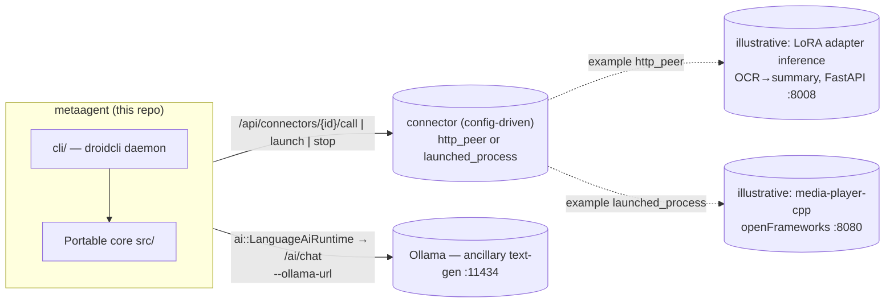
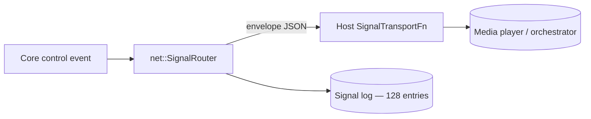
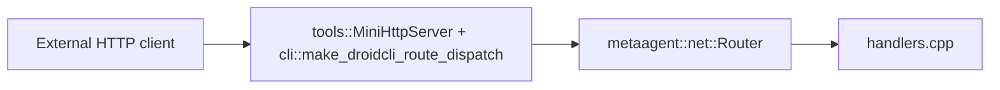

# metaagent - Architecture

Portable C++17 library for MetaAgent **control logic**: HTTP route handlers,
signal/trigger dispatch, media decode + corpus reading, session snapshots,
command validation, and the AI seams. A host (the desktop app or the headless
server) supplies transport, windowing, and process I/O through thin callbacks.

App version: **agent core 0.2.0** (library version 0.2.0 — hold at 0.2.x).

---

## System context — a core plus config-driven connectors

metaagent is the **agent controller and network trigger** at the center of an
open-ended set of peer applications. The portable core decides *what* should
happen; the droidcli host performs the actual transport, process control, and
dispatch. Peers are **connectors defined in config** (or registered at
runtime over HTTP) — the core has zero compiled-in knowledge of any specific
peer app. A LoRA adapter inference service and an openFrameworks media player
are the two peers this repo has historically talked to, and they're shown
below as illustrative (dotted) examples, not fixed graph nodes.



| Concern | What it owns | Seam in this repo |
| ------- | ------------ | ----------------- |
| **metaagent core + droidcli** | Control logic, command + signal + task dispatch, HTTP in/out, corpus reading, process control | — |
| **A connector** (operator-configured) | Whatever the operator points it at — an inference server, a media player, anything reachable by URL or local command | `net::Connector` (`http_peer` or `launched_process`), registered via `--config` or `POST /api/connectors` |

> **Ollama stays separate.** Ollama is a general **text-generation** endpoint
> behind `ai::LanguageAiRuntime` / `/ai/chat` — it is not a connector, it's
> built into the core AI seam. Any purpose-trained inference service (an
> OCR→summary LoRA adapter, or anything else) is registered as an ordinary
> `http_peer` connector instead, with no special-cased code path. All
> endpoints/models are **configuration**, never baked into core.

---

## Design goals

| Goal                   | How                                                                     |
| ---------------------- | ----------------------------------------------------------------------- |
| Portability            | C++17, `metaagent::core::`* value types, no engine/framework types      |
| Single source of truth | Command validation, JSON shapes, signal envelopes, corpus parsing       |
| Testability            | CMake + unit tests without network, GPU, or GUI                         |
| Host bridge            | Hosts inject transport/process I/O via `std::function` callbacks        |

**Rule of thumb:** if it touches a real socket, process, window, or the
filesystem at runtime, it stays in the host. If it is pure state + parsing +
validation + JSON, it belongs in core.

---

## Repository layout

```
metaagent/
├── metaagent.h                    Umbrella public API
├── metaagent.cpp                  Single TU — #includes all module .cpp files
├── src/
│   ├── initialize.hpp             initialize_defaults()
│   ├── core/                      Vec3, math, log_sink, value types
│   ├── media/                     PNG/JPEG decode, probe, MediaStore, corpus
│   ├── net/                       Route table, handlers, signal_router, json
│   ├── notify/                    Notify body parsing
│   ├── session/                   RuntimeSession + status strings
│   ├── app/                       Command registry, runtime catalog
│   ├── ai/                        Ollama text-gen client + LanguageAiRuntime
│   └── runtime/                   Host service callbacks (recording/AI)
├── cli/                            droidcli host: DroidHost, ProcessManager, HTTP route mount, entrypoint
├── tools/                         mini_http_server + sync_http_client (raw-socket HTTP, WinHTTP for https://)
├── tests/                         One *_test.cpp per core module
├── config/                         Example connector config (connectors.example.json)
├── external/                      Submodules: pre-training + media-player-cpp
├── distribute/                    Dist templates (run_all.bat, README)
├── CMakeLists.txt
├── README.md
└── ARCHITECTURE.md
```

Public entry point: `#include "metaagent.h"`.

---

## Modules

| Module                    | Role                                                                  |
| ------------------------- | --------------------------------------------------------------------- |
| `core/types` + `math`     | `String`, `Array`, `Vec3`, color types, math helpers                  |
| `media/decode` + `probe`  | FFmpeg-backed decode + probe (host stages the DLLs)                   |
| `media/corpus`            | Load OCR/objects corpora; subtitles, previews, focus rects, masks     |
| `net/router` + `handlers` | `/health`, `/echo`, `/notify`, `/ai/chat`                             |
| `net/signal_router`       | **Network trigger**: register peer `SignalTarget`s, dispatch `SignalEnvelope`s via `SignalTransportFn`, log delivery |
| `net/connector`           | **Generic peer registry**: `Connector` (`http_peer` \| `launched_process`), `ConnectorRegistry` register/unregister/list/find, JSON build/parse |
| `net/google_search`       | Google Programmable Search Engine (Custom Search JSON API) URL build + hand-rolled JSON response parse |
| `net/json`                | Escape/build/extract JSON fields (no external JSON dependency)        |
| `notify/parse`            | Notify body parsing (JSON or text)                                    |
| `session/types` + `status`| `RuntimeSession`, `FeatureFlags` (ai/networking/recording/ui), status |
| `app/commands`            | `CommandId`, parse + validate against session features                |
| `app/tasks`               | **Persistent task queue**: `Task`, `TaskQueue` (enqueue/claim_next/complete/fail/find/list), JSON build/parse |
| `app/runtime_catalog`     | Host-local runtime descriptors for the UI                             |
| `ai/ollama_client`        | Ollama request/response shaping                                       |
| `ai/language_runtime`     | Transcript + turn state for **Ollama text-gen** (`/ai/chat`); POST via `LanguageAiTransportCallbacks`. Separate from any connector-registered inference peer |
| `runtime/host_interfaces` | Recording + AI snapshots/toggles (`HostServiceCallbacks`)             |

The droidcli host (`cli/`) additionally owns: the config store, the
`ConnectorRegistry` + `TaskQueue` instances and their dispatch (`call_connector`
for `http_peer`, `launch_connector`/`stop_connector` for `launched_process`,
`tick_tasks()` draining the queue), and the **ProcessManager** (Job
Object/process-group launch of any `launched_process` connector with PID
tracking).

---

## Network triggers (`metaagent/net/signal_router`)

The "network trigger" half of metaagent's role: a portable registry + dispatcher
for sending typed signals to peer applications (the media player or any external
orchestrator). Core owns the **envelope shape, target registry, and delivery
log**; the host supplies the actual transport.

| Type | Role |
| ---- | ---- |
| `SignalTarget` | Registered peer: `id`, `control_url`, `capabilities`, `enabled` |
| `SignalEnvelope` | Versioned message: `id`, `type`, `target`, `timestamp_ms`, `payload_json` |
| `SignalRouter` | Register/unregister targets, `dispatch(envelope, transport)`, ring-buffered log (128 entries) |
| `SignalTransportFn` | Host-provided `std::function` performing the POST |
| `SignalDispatchResult` / `SignalLogEntry` | Per-dispatch outcome + auditable history |

Build/parse helpers (`build_signal_envelope_json`, `parse_signal_envelope`,
`build_targets_json`, `parse_target_from_json`, `build_signal_log_json`) keep all
JSON in core. Tests: `signal_router_test.cpp`.



---

## HTTP flow



Inbound: `tools::MiniHttpServer` (raw-socket, no httplib) binds the socket and
converts requests to `net::HttpRequest`. It first tries the portable
`net::RouteTable` (`/health`, `/echo`, `/notify`, `/ai/chat`); anything else
falls through to `cli::make_droidcli_route_dispatch`'s `CustomRouteFn`, which
covers `/api/*` (status/config/ollama/process/command/connectors/tasks).
Outbound: `tools::sync_http_client` performs the POST/GET (raw socket for
`http://`, WinHTTP for `https://`); core builds and parses the bodies.

---

## Build

### Standalone

```powershell
cd metaagent
cmake -S . -B build -DCMAKE_BUILD_TYPE=Release
cmake --build build
ctest --test-dir build --output-on-failure
```

Tests: `media_decode_test`, `corpus_test`, `net_handler_test`,
`app_command_test`, `host_interfaces_test`, `ollama_client_test`,
`language_runtime_test`, `signal_router_test`, `runtime_catalog_test`,
`google_search_test`, `connector_test`, `task_queue_test`.

On Windows the whole tree builds with **one MSVC runtime**
(`CMAKE_MSVC_RUNTIME_LIBRARY` in the root CMakeLists: dynamic Debug, static
Release) — never set a per-target runtime that diverges.

---

## Extension points

1. **New HTTP route** — handler in `net/handlers.cpp`, register in the router,
   mount in the host(s).
2. **New network trigger / signal type** — extend `net/signal_types`
   (envelope/target + JSON) and `net/signal_router` (dispatch/log); host supplies
   the `SignalTransportFn`; add a `signal_router_test` case.
3. **New validated command** — `CommandId` + `validate_command` in
   `app/commands`, a host-side handler in `apply_command_side_effects`.
4. **New corpus field** — extend `media/corpus` parsing + `corpus_test`.
5. **New connector (peer app)** — usually **config-only**: add an entry to a
   `connectors.json` (or `POST /api/connectors`) with `kind: "http_peer"` and a
   `base_url`; droidcli proxies calls to it via `/api/connectors/{id}/call`
   with zero new code. For `kind: "launched_process"`, `ProcessManager`
   already generalizes over any `launch_cmd`/`work_dir` — again no new code
   needed unless the process has bespoke lifecycle requirements beyond
   launch/stop, in which case extend `DroidHost::launch_connector`/
   `stop_connector` in `cli/host.cpp`.

Product usage, HTTP tables, and env vars: repository root `[README.md](./README.md)`.
