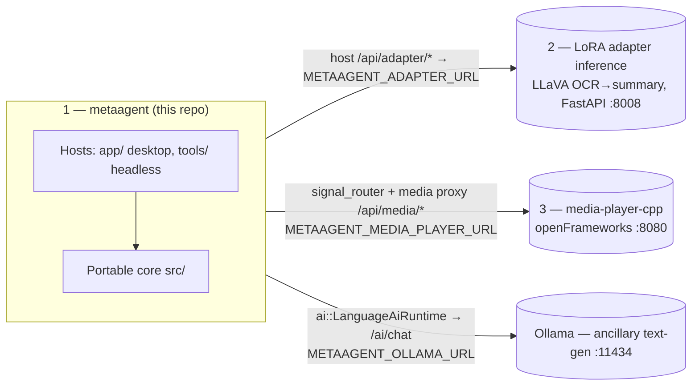
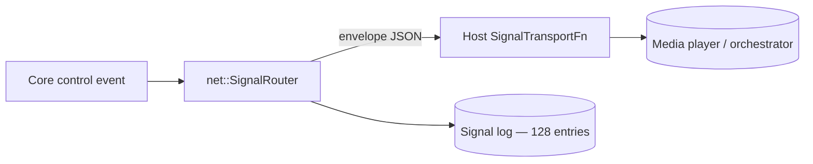
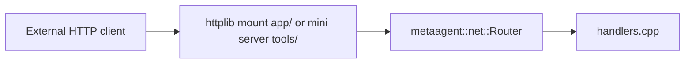

# metaagent - Architecture

Portable C++17 library for MetaAgent **control logic**: HTTP route handlers,
signal/trigger dispatch, media decode + corpus reading, session snapshots,
command validation, and the AI seams. A host (the desktop app or the headless
server) supplies transport, windowing, and process I/O through thin callbacks.

App version: **agent core 0.2.0** (library version 0.2.0 — hold at 0.2.x).

---

## System context — three cooperating applications

metaagent is the **agent controller and network trigger** in a three-application
system. The portable core decides *what* should happen; hosts and peers perform
the actual transport, inference, and rendering.



| App | What it owns | Seam in this repo |
| --- | ------------ | ----------------- |
| **1. metaagent** | Control logic, command + signal dispatch, HTTP in/out, corpus reading, process control | — |
| **2. Adapter inference** (LoRA) | Purpose-trained **LLaVA 1.5 LoRA**; OCR-text → summary generation only ([vecnode/pre-training](https://github.com/vecnode/pre-training), FastAPI) | Desktop host `/api/adapter/status` + `/api/adapter/summarize` proxy to `adapter_url` |
| **3. media-player-cpp** | Playback of clips/subtitles/focus crops | `net::SignalRouter` (triggers) + the desktop host's `/api/media/*` proxy to `media_player_base_url` |

> **Two distinct AI models.** The **LoRA adapter** (app #2) is the trained model,
> used *only* for its OCR→summary generation, surfaced as the *Document Adapter*
> panel. **Ollama** is a separate, ancillary general **text-generation** endpoint
> behind `ai::LanguageAiRuntime` / `/ai/chat` (the *Agent* panel) and the
> subtitle condenser — it is not one of the three apps. All endpoints/models are
> **configuration**, never baked into core.

---

## Design goals

| Goal                   | How                                                                     |
| ---------------------- | ----------------------------------------------------------------------- |
| Portability            | C++17, `metaagent::core::`* value types, no engine/framework types      |
| Single source of truth | Command validation, JSON shapes, signal envelopes, corpus parsing       |
| Testability            | CMake + unit tests without network, GPU, or GUI                         |
| Host bridge            | Hosts inject transport/process I/O via `std::function` callbacks        |

**Rule of thumb:** if it touches a real socket, process, window, or the
filesystem at runtime, it stays in the host. If it is pure state + parsing +
validation + JSON, it belongs in core.

---

## Repository layout

```
metaagent/
├── metaagent.h                    Umbrella public API
├── metaagent.cpp                  Single TU — #includes all module .cpp files
├── src/
│   ├── initialize.hpp             initialize_defaults()
│   ├── core/                      Vec3, math, log_sink, value types
│   ├── media/                     PNG/JPEG decode, probe, MediaStore, corpus
│   ├── net/                       Route table, handlers, signal_router, json
│   ├── notify/                    Notify body parsing
│   ├── session/                   RuntimeSession + status strings
│   ├── app/                       Command registry, runtime catalog
│   ├── ai/                        Ollama text-gen client + LanguageAiRuntime
│   └── runtime/                   Host service callbacks (recording/AI)
├── app/                           Desktop host (WebView + httplib, process manager)
├── tools/                         Headless metaagent_server CLI + HTTP helpers
├── tests/                         One *_test.cpp per core module
├── external/                      Submodules: pre-training + media-player-cpp
├── distribute/                    Dist templates (run_all.bat, README)
├── CMakeLists.txt
├── README.md
└── ARCHITECTURE.md
```

Public entry point: `#include "metaagent.h"`.

---

## Modules

| Module                    | Role                                                                  |
| ------------------------- | --------------------------------------------------------------------- |
| `core/types` + `math`     | `String`, `Array`, `Vec3`, color types, math helpers                  |
| `media/decode` + `probe`  | FFmpeg-backed decode + probe (host stages the DLLs)                   |
| `media/corpus`            | Load OCR/objects corpora; subtitles, previews, focus rects, masks     |
| `net/router` + `handlers` | `/health`, `/echo`, `/notify`, `/ai/chat`                             |
| `net/signal_router`       | **Network trigger**: register peer `SignalTarget`s, dispatch `SignalEnvelope`s via `SignalTransportFn`, log delivery |
| `net/json`                | Escape/build/extract JSON fields (no external JSON dependency)        |
| `notify/parse`            | Notify body parsing (JSON or text)                                    |
| `session/types` + `status`| `RuntimeSession`, `FeatureFlags` (ai/networking/recording/ui), status |
| `app/commands`            | `CommandId`, parse + validate against session features                |
| `app/runtime_catalog`     | Host-local runtime descriptors for the UI                             |
| `ai/ollama_client`        | Ollama request/response shaping                                       |
| `ai/language_runtime`     | Transcript + turn state for **Ollama text-gen** (`/ai/chat`); POST via `LanguageAiTransportCallbacks`. Separate from the LoRA adapter, which the desktop host proxies directly |
| `runtime/host_interfaces` | Recording + AI snapshots/toggles (`HostServiceCallbacks`)             |

The desktop host (`app/src/`) additionally owns: the endpoints/config store,
media-player proxy + subtitle push (with Ollama condensing), adapter proxy,
dataset CSV reader (`/api/dataset`), and the **ProcessManager** (Job
Object/process-group launch of the peer apps with PID tracking).

---

## Network triggers (`metaagent/net/signal_router`)

The "network trigger" half of metaagent's role: a portable registry + dispatcher
for sending typed signals to peer applications (the media player or any external
orchestrator). Core owns the **envelope shape, target registry, and delivery
log**; the host supplies the actual transport.

| Type | Role |
| ---- | ---- |
| `SignalTarget` | Registered peer: `id`, `control_url`, `capabilities`, `enabled` |
| `SignalEnvelope` | Versioned message: `id`, `type`, `target`, `timestamp_ms`, `payload_json` |
| `SignalRouter` | Register/unregister targets, `dispatch(envelope, transport)`, ring-buffered log (128 entries) |
| `SignalTransportFn` | Host-provided `std::function` performing the POST |
| `SignalDispatchResult` / `SignalLogEntry` | Per-dispatch outcome + auditable history |

Build/parse helpers (`build_signal_envelope_json`, `parse_signal_envelope`,
`build_targets_json`, `parse_target_from_json`, `build_signal_log_json`) keep all
JSON in core. Tests: `signal_router_test.cpp`.



---

## HTTP flow



Inbound: the host binds the socket and converts requests to `net::HttpRequest`;
core routes and handles. Outbound: the host's `sync_http_client` performs the
POST/GET; core builds and parses the bodies.

---

## Build

### Standalone

```powershell
cd metaagent
cmake -S . -B build -DCMAKE_BUILD_TYPE=Release
cmake --build build
ctest --test-dir build --output-on-failure
```

Tests: `media_decode_test`, `corpus_test`, `net_handler_test`,
`app_command_test`, `host_interfaces_test`, `ollama_client_test`,
`language_runtime_test`, `signal_router_test`, `runtime_catalog_test`.

On Windows the whole tree builds with **one MSVC runtime**
(`CMAKE_MSVC_RUNTIME_LIBRARY` in the root CMakeLists: dynamic Debug, static
Release) — never set a per-target runtime that diverges.

---

## Extension points

1. **New HTTP route** — handler in `net/handlers.cpp`, register in the router,
   mount in the host(s).
2. **New network trigger / signal type** — extend `net/signal_types`
   (envelope/target + JSON) and `net/signal_router` (dispatch/log); host supplies
   the `SignalTransportFn`; add a `signal_router_test` case.
3. **New validated command** — `CommandId` + `validate_command` in
   `app/commands`, a host-side handler in `apply_command_side_effects`.
4. **New corpus field** — extend `media/corpus` parsing + `corpus_test`.
5. **New controlled process** — a `ProcessManager` key + host method + route +
   UI button (see `/api/media/build` as the template).

Product usage, HTTP tables, and env vars: repository root `[README.md](./README.md)`.
