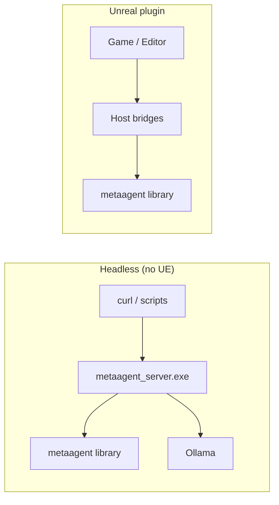
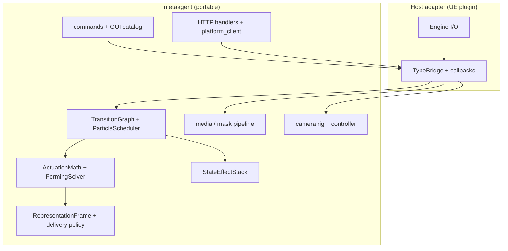

# metaagent

Portable C++17 core for MetaAgent: **particle pattern mechanics**, **camera rig math**, **media/mask pipeline**, **HTTP (inbound + outbound)**, **session + command validation**, and **input policy**. No Unreal headers.

Full design notes: `[ARCHITECTURE.md](./ARCHITECTURE.md)`.

## Build Standalone

```sh
cd metaagent
cmake -S . -B build -DCMAKE_BUILD_TYPE=Release
cmake --build build
ctest --test-dir build
```

## Headless HTTP Server

```sh
./build/metaagent_server.exe --port 8080
```

## API

Start the headless server, then call these routes with `curl` or any HTTP client. No Unreal Engine required.

| Method | Route | Description |
|--------|-------|-------------|
| `GET` | `/health` | Liveness + session snapshot (`status`, `map`, `build`) |
| `GET` / `POST` | `/echo` | Echo back `msg` query param or raw POST body |
| `POST` | `/notify` | Ingest a JSON/text event; prints `[notify]` on the server console |
| `POST` | `/ai/chat` | Send a prompt to Ollama via `LanguageAiRuntime`; returns assistant text |

### Examples

```sh
# Health
curl http://127.0.0.1:8080/health

# Echo
curl "http://127.0.0.1:8080/echo?msg=hello"

# Notify (logs to server stdout)
curl -X POST http://127.0.0.1:8080/notify \
  -H "Content-Type: application/json" \
  -d '{"message":"start pattern"}'

# AI chat (requires Ollama running locally)
curl -X POST http://127.0.0.1:8080/ai/chat \
  -H "Content-Type: application/json" \
  -d '{"prompt":"Hello"}'
```

**`/ai/chat` request body**

| Field | Required | Description |
|-------|----------|-------------|
| `prompt` | yes* | User message (`text` or `message` also accepted) |
| `system` | no | Override system prompt for this server session |
| `clear` | no | If `true`, clears transcript before sending |


### Server flags

```sh
./build/metaagent_server.exe --port 8080 \
  --ollama-url http://127.0.0.1:11434 \
  --ollama-model llama3.2 \
  --system-prompt "You are a concise assistant."
```

Use `--no-ai` to disable `/ai/chat` (Ollama outbound calls).




## What this library is

`metaagent` is the **domain layer** for a multimodal agent runtime. Hosts (Unreal today, others later) supply:

- World I/O (Niagara buffers, view target, filesystem, async HTTP transport)
- Type conversion (`FVector` ↔ `metaagent::core::Vec3`)
- Asset binding (textures, pattern assets, Niagara profiles)

Everything that can be expressed as **state + math + validation + JSON** lives here so it can be unit-tested without an editor.




## Layout

```
metaagent/
  metaagent.h                 Public umbrella API (single include)
  metaagent.cpp               Amalgamated implementation
  src/                        Headers + module .cpp implementations
  tests/                      Standalone unit tests (CMake)
  tools/                      metaagent_server CLI
  CMakeLists.txt
  ARCHITECTURE.md
```

Embed elsewhere: add `metaagent/src`, compile `metaagent.cpp` once (the UE plugin uses `MetaAgentCoreAggregate.cpp`).

## Portable modules


| Namespace             | Responsibility                                                                                                              |
| --------------------- | --------------------------------------------------------------------------------------------------------------------------- |
| `metaagent::particle` | FSM, scheduler, forming/return solvers, actuation compose, shape/mask, state effects, effect catalog, **visual continuity** |
| `metaagent::camera`   | Zoom, cinematic orbit pose, sway, `SlowOrbit`, `CameraController`                                                           |
| `metaagent::media`    | PNG/JPEG decode, mask pipeline, thumbnails                                                                                  |
| `metaagent::net`      | Router, inbound handlers, `platform_client` (outbound)                                                                      |
| `metaagent::session`  | `RuntimeSession`, feature flags, status text                                                                                |
| `metaagent::app`      | Command parse/validate, GUI panel catalog, GUI action validation                                                            |
| `metaagent::runtime`  | Host service callbacks (recording, AI) + **ParticleHostCallbacks**                                                          |
| `metaagent::input`    | GUI-open vs observation-mode input policy                                                                                   |
| `metaagent::ai`       | Ollama chat client, `LanguageAiRuntime`, transcript + representation text                                                   |


## Host integration contract (particles)

The scheduler is **callback-driven**. The host implements `SchedulerCallbacks` and optional `**particle_host`** (`ParticleHostCallbacks`):


| Callback                                     | Host responsibility                                                |
| -------------------------------------------- | ------------------------------------------------------------------ |
| `build_pattern_targets`                      | Shape providers, async mask cache, sync runtime → core             |
| `begin_pattern_start`                        | Set active config/tags (displayed pose frozen by core before call) |
| `enter_pattern_state`                        | Sync core ↔ runtime, optional side effects                         |
| `complete_pattern_run`                       | Reset runtime, re-seed idle baseline                               |
| `particle_host.read_displayed_positions`     | Return on-screen positions (compose + state-effect offsets)        |
| `particle_host.apply_world_positions`        | Push frozen pose to runtime/GPU buffers                            |
| `particle_host.authoritative_particle_count` | Live particle count for baseline/mask validation                   |


**Visual continuity:** on each FSM transition, the scheduler reads the **displayed** pose via `particle_host`, then `apply_visual_continuity_for_transition()` / `freeze_displayed_pose()` updates baseline and targets. See `[particle/visual_continuity.hpp](./src/particle/visual_continuity.hpp)` and `[ARCHITECTURE.md](./ARCHITECTURE.md#visual-continuity)`.

## HTTP


| Direction    | Core                         | UE host                    |
| ------------ | ---------------------------- | -------------------------- |
| **Inbound**  | `net/handlers`, `net/router` | `FMetaAgentHttpBridge`     |
| **Outbound** | `net/platform_client`        | `FMetaAgentPlatformBridge` |


## Standalone build

```powershell
cd metaagent
cmake -S . -B build -DCMAKE_BUILD_TYPE=Release
cmake --build build
ctest --test-dir build --output-on-failure
```

### Standalone server

```powershell
cmake --build build --target metaagent_server
./build/metaagent_server.exe --port 8080
```

## Unreal integration

The UE plugin embeds this library via `Source/MetaAgentPlugin/MetaAgentCoreAggregate.cpp`.


| Adapter                            | Role                                                                          |
| ---------------------------------- | ----------------------------------------------------------------------------- |
| `MetaAgentTypeBridge`              | UE ↔ core conversion, scheduler bridge, camera sync                           |
| `UMetaAgentParticleRuntime`        | Tick glue, Niagara actuation, **ReadDisplayedPose / ApplyHostWorldPositions** |
| `UMetaAgentParticleControl`        | Orchestrator, representation drivers                                          |
| `Host/MetaAgentHttpBridge`         | Inbound HTTPServer                                                            |
| `Host/MetaAgentPlatformBridge`     | Outbound platform POST                                                        |
| `Host/MetaAgentHostSession`        | Session snapshot for validation                                               |
| `Host/MetaAgentInputBridge`        | Command / GUI validation                                                      |
| `Host/MetaAgentHostServicesBridge` | Recording + AI `HostServiceCallbacks`                                         |


Tick paths:

- Particles: `UMetaAgentParticleRuntime` → `ParticleScheduler`
- Camera: `FMetaAgentCameraRuntime` → `CameraController::tick_cinematic()`
- Platform: `SendEventToPlatform` → `platform_client` → `FMetaAgentPlatformBridge`

## Embed elsewhere

```cpp
#include <metaagent/metaagent.h>

int main() {
    metaagent::initialize_defaults();
    metaagent::net::PlatformEndpointConfig config;
    config.base_url = "http://127.0.0.1:8000";
    config.event_endpoint = "/api/unreal/event";
    // build_platform_outbound_request(...) — no UE required
    return 0;
}
```

## Recommended next steps (library)

1. **Authoritative particle count in `PatternRuntime`** — persist count from `particle_host.authoritative_particle_count` for mask builds and baseline rejection.
2. **Headless FSM + continuity harness** — mock `ParticleHostCallbacks` in tests; full transition sweep without Niagara.
3. **Extend session snapshot** — expose pattern state + particle count on `/health`.
4. **More continuity edges in `visual_continuity_test`** — Anticipating, Dissipating, auto-mode transitions.

Details: `[ARCHITECTURE.md](./ARCHITECTURE.md#roadmap)`.

### Recently completed

- `DisplayedPose`, `freeze_displayed_pose()`, `apply_visual_continuity_for_transition()` (`particle/visual_continuity`)
- `ParticleHostCallbacks` on `SchedulerCallbacks::particle_host`
- `visual_continuity_test`, `HostServiceCallbacks` query helpers
- UE: host read/apply only; `MetaAgentHostServicesBridge`; AI + Recording GUI catalog rows

