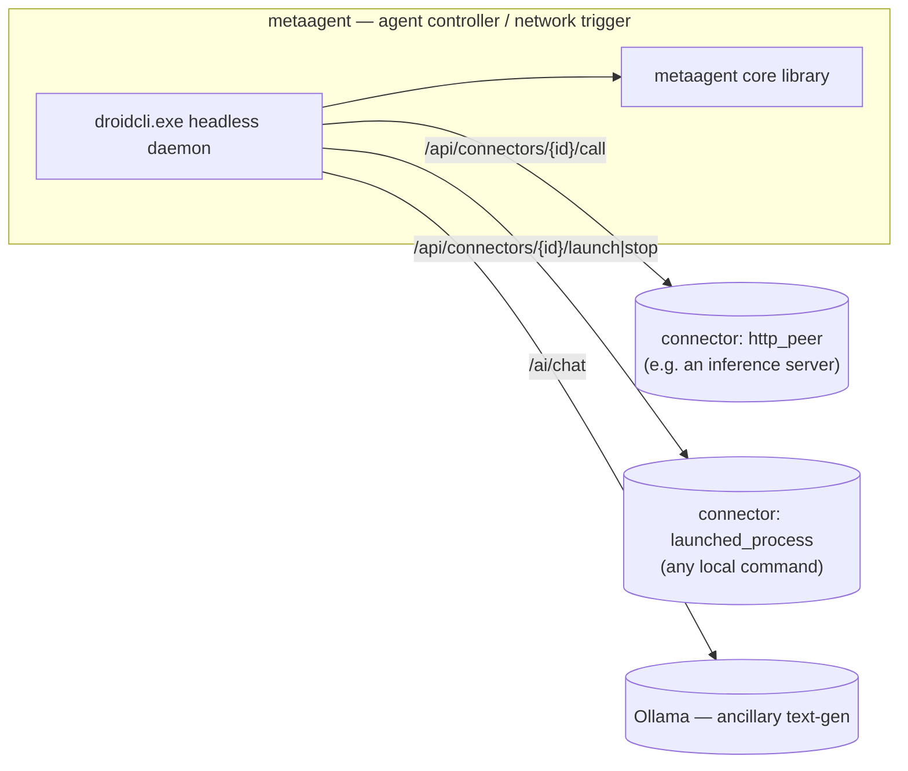

# metaagent — agent core 0.2.0

Portable C++17 core for the metaagent library, plus **droidcli**, a headless
CLI agent daemon built on top of it.

metaagent does not render or play media itself: it holds the control logic
(commands, session, corpus, AI seams) and **coordinates peer applications over
HTTP through a generic connector system** — droidcli has no compiled-in
knowledge of any specific peer app. Connectors are either an `http_peer`
(reached by URL, e.g. a local inference server) or a `launched_process`
(a local command droidcli can start/stop and track by PID), registered via
config file or at runtime over HTTP.

> **Not a namespace rename.** "droidcli" is the CLI **binary/product** name
> only. The C++ namespace (`metaagent::`) and the repository/library name stay
> `metaagent` — do not attempt a full rename.

> **Two separate AI seams, do not conflate them.** **Ollama**
> (`--ollama-url`, default `:11434`) is an ancillary, general **text-generation**
> endpoint behind `/ai/chat` — it is not a connector, it's built into the core
> `ai::LanguageAiRuntime`. Any purpose-trained inference service (an OCR→summary
> LoRA adapter, or anything else) is registered as an ordinary `http_peer`
> connector instead; it gets no special-cased code path.

Core capabilities: **HTTP (inbound + outbound)**, **signal/trigger dispatch**,
**media decode + corpus reading (OCR/objects/summaries)**, **session + command
validation**, **the Ollama AI seam**, **a generic connector registry**, **a
persistent task queue**, and **centralised process control** (launch/stop any
`launched_process` connector with PID tracking).

The **entrypoint** is `[cli/droidcli.cpp](./cli/droidcli.cpp)` — a headless
HTTP daemon (`droidcli.exe`), no window, no WebView, no GTK. There used to be
a separate windowed desktop app (`app/`); it has been removed entirely and
droidcli is now the only host.

Full design notes: `[ARCHITECTURE.md](./ARCHITECTURE.md)`. Working in the repo as
an agent: `[AGENTS.md](./AGENTS.md)`.

## Build

All commands from the repository root (`metaagent/`). Requires CMake 3.20+ and Git.

**Windows** — VS 2022 **MSVC** x64

On first configure, FFmpeg is downloaded automatically into `third_party/ffmpeg/` when missing.

```powershell
cmake -B build-msvc -G "Visual Studio 17 2022" -A x64
cmake --build build-msvc --config Debug -j
.\build-msvc\Debug\droidcli.exe
```

Optional FFmpeg overrides:

```powershell
# Disable auto-download and use an existing local FFmpeg prefix
cmake -B build-msvc -G "Visual Studio 17 2022" -A x64 -DMETAAGENT_FFMPEG_AUTO_DOWNLOAD=OFF -DMETAAGENT_FFMPEG_ROOT="C:/path/to/ffmpeg"

# Keep auto-download enabled but use a custom archive URL
cmake -B build-msvc -G "Visual Studio 17 2022" -A x64 -DMETAAGENT_FFMPEG_URL="https://.../ffmpeg-win64-shared.zip"

# Disable insecure TLS retry fallback (default is ON)
cmake -B build-msvc -G "Visual Studio 17 2022" -A x64 -DMETAAGENT_FFMPEG_ALLOW_INSECURE_DOWNLOAD=OFF
```

Shortcut: `.\build_and_run.bat` (configures only when needed; accepts `Debug`/`Release`, `--configure`, `--clean`, `--no-run`).

Release: use `--config Release` → `build-msvc\Release\droidcli.exe`

**Linux** — C++20

```sh
cmake -B build -DCMAKE_BUILD_TYPE=Release
cmake --build build -j
./build/droidcli
```

### Library + tests only

**Windows / Linux** (same commands):

```sh
cmake -B build -DCMAKE_BUILD_TYPE=Release
cmake --build build -j
ctest --test-dir build --output-on-failure
```

## Distribution

`.\build_and_distribute.bat` builds everything **Release** and stages a portable
folder + zip under `dist\metaagent-<version>\`:

| Folder | Contents |
| ------ | -------- |
| `droidcli\` | `droidcli.exe` + FFmpeg DLLs |
| `media-player\` | `media-player-cpp.exe` + MinGW DLLs + `data\` corpus/media (staged unconditionally, unrelated to whether you actually reference it as a connector) |
| `adapter\` | pre-training deploy code + uv files + the **trained LoRA adapter** (`training/runs/llava15_lora/final_adapter`, ~40 MB — your model, staged as-is; **no base/fused model weights**, ~14 GB, downloaded on first run instead) |
| `datasets\` | corpus CSVs |
| `run_all.bat` | starts droidcli with `--config connectors.json` |

Unlike the old windowed app, droidcli does **not** auto-discover
`media-player\`/`adapter\`/`datasets\` by path convention — connectors are
explicit config (`connectors.json`, copied from
`config/connectors.example.json` and edited to point at the sibling folders).

Config (env vars): `DIST_MEDIA_DIR` (media player working copy — point it at your
openFrameworks tree so `bin\data` media ships; the submodule has code only),
`DIST_OF_ROOT` (when the media dir is outside an OF tree), `DIST_ADAPTER_DIR`,
`DIST_ADAPTER_WEIGHTS_DIR` (trained LoRA adapter to stage; default
`%DIST_ADAPTER_DIR%\training\runs\llava15_lora\final_adapter` — warns, doesn't
fail, if missing), `DIST_DATASET_DIR`, `MSYS2_ROOT`. Flags: `--skip-media`, `--no-zip`.

Docker was considered and deliberately **not** used: the media player is a
native Windows GUI app (OpenGL + Media Foundation) and cannot meaningfully run
in a container; droidcli itself is a plain headless binary and could run in
one, but there is no current need. The adapter is the best container
candidate — worth a Dockerfile only if it moves to a Linux GPU server.

---

## droidcli agent daemon (`cli/`)

Headless HTTP agent daemon: a process you start once and leave running. It
owns a session, the Ollama text-gen seam, a **connector registry** (generic
peer config — no compiled-in adapter/media-player knowledge), and a
**persistent task queue** it dispatches from its own poll loop.

### CLI flags

```
droidcli [--port 30080] [--config path/to/connectors.json] [--no-ai]
         [--ollama-url URL] [--ollama-model NAME] [--daemon]
```

| Flag | Default | Purpose |
| ---- | ------- | ------- |
| `--port` | `30080` | HTTP listen port |
| `--config` | (none) | JSON file with a top-level `connectors` array, loaded at startup |
| `--no-ai` | off | Disable `/ai/chat` (Ollama text-gen) |
| `--ollama-url` | `http://127.0.0.1:11434` | Ollama base URL |
| `--ollama-model` | `llama3.2` | Ollama model name |
| `--daemon` | off | Documented no-op: droidcli always runs in the foreground (see "Deviations" in the design notes) — use a process supervisor (nssm, Task Scheduler, systemd) for true background operation |

Google search polling reads `METAAGENT_GOOGLE_API_KEY` / `METAAGENT_GOOGLE_CSE_ID`
/ `METAAGENT_GOOGLE_SEARCH_QUERY` from the environment at startup (see below).

### Config file format

```json
{
  "connectors": [
    {
      "id": "my-http-peer",
      "kind": "http_peer",
      "base_url": "http://127.0.0.1:8008",
      "enabled": true,
      "capabilities": "summarize"
    },
    {
      "id": "my-launched-process",
      "kind": "launched_process",
      "launch_cmd": "some-server.exe",
      "work_dir": "C:/path/to/project",
      "enabled": true
    }
  ]
}
```

A ready-to-copy example (referencing the LoRA adapter and media-player-cpp as
*illustrations*, not built-in behavior) lives at
`[config/connectors.example.json](./config/connectors.example.json)`.

### HTTP routes

| Method | Route | Description |
| ------ | ----- | ------------ |
| `GET` | `/health` | Liveness + session snapshot (portable handler) |
| `GET` / `POST` | `/echo` | Echo query/body |
| `POST` | `/notify` | Ingest notify event |
| `POST` | `/ai/chat` | Ollama text-gen chat via `LanguageAiRuntime` |
| `GET` | `/api/status` | Host status: recording / autopilot toggles |
| `GET` | `/api/network/status` | Networking flag + connector count |
| `GET` | `/api/config` | Effective host configuration (Ollama + Google search) |
| `POST` | `/api/config` | Update host configuration at runtime |
| `GET` | `/api/runtimes` | Runtime catalog (all host-local) |
| `GET` | `/api/notify/log` | Recent notify messages |
| `GET` | `/api/app/log` | Recent host application log |
| `POST` | `/api/command` | Dispatch validated command (`{"command":"toggle_recording"}`) |
| `GET` | `/api/ollama/status` | Ollama text-gen endpoint status + model list |
| `POST` | `/api/ollama/config` | Update Ollama model at runtime |
| `GET` | `/api/process/status` | PID + running state of every launched connector process |

**Connectors** (generic peer config, replaces the old hardcoded `/api/adapter/*` and `/api/media/*`):

| Method | Route | Description |
| ------ | ----- | ------------ |
| `GET` | `/api/connectors` | List all registered connectors |
| `POST` | `/api/connectors` | Register (or replace) a connector — body is a `Connector` JSON object |
| `GET` | `/api/connectors/{id}/status` | Liveness: PID/running for `launched_process`, `/health` probe for `http_peer` |
| `POST` | `/api/connectors/{id}/launch` | Launch a `launched_process` connector (Job Object / process group, PID-tracked) |
| `POST` | `/api/connectors/{id}/stop` | Stop it |
| `POST` | `/api/connectors/{id}/call` | Proxy an HTTP call to an `http_peer` connector — body `{"path":"/api/x","method":"POST","payload_json":"{...}"}` |

**Tasks** (persistent pending/running/done/failed queue; `tick_tasks()` runs every poll loop iteration and dispatches one pending task per tick):

| Method | Route | Description |
| ------ | ----- | ------------ |
| `GET` | `/api/tasks` | List all tasks (history capped, pending/running always kept) |
| `POST` | `/api/tasks` | Enqueue a task — body `{"connector_id":"...","command":"launch\|stop\|<path>","payload_json":"{...}"}` |
| `GET` | `/api/tasks/{id}` | Task status |

A task with `command: "launch"` or `"stop"` calls `launch_connector`/`stop_connector`
on its `connector_id`; any other command is treated as the HTTP path to call on
an `http_peer` connector.

### Example session

```sh
# Start droidcli with the example connectors.
droidcli --port 30080 --config config/connectors.example.json

# Confirm it's up and see what loaded.
curl http://127.0.0.1:30080/health
curl http://127.0.0.1:30080/api/connectors

# Register a new connector at runtime.
curl -X POST http://127.0.0.1:30080/api/connectors \
  -d '{"id":"my-peer","kind":"http_peer","base_url":"http://127.0.0.1:9000","capabilities":"summarize"}'

# Launch a launched_process connector directly.
curl -X POST http://127.0.0.1:30080/api/connectors/media-player-example/launch

# Or queue it as a task and poll for completion.
curl -X POST http://127.0.0.1:30080/api/tasks -d '{"connector_id":"my-peer","command":"launch"}'
curl http://127.0.0.1:30080/api/tasks
```

### Google search (background)

Once `METAAGENT_GOOGLE_API_KEY` + `METAAGENT_GOOGLE_CSE_ID` + `METAAGENT_GOOGLE_SEARCH_QUERY`
are all set (env vars, read at startup), droidcli runs that search every
`METAAGENT_GOOGLE_SEARCH_INTERVAL_SECONDS` (default 10, also `POST /api/config`-settable)
via Google's official **Programmable Search Engine / Custom Search JSON API** —
a real HTTP GET to `googleapis.com`, not HTML scraping of a search results
page. Get a free API key + search engine ID at
https://programmablesearchengine.google.com/ (free tier: 100 queries/day).
Results are logged to the `search` channel in `GET /api/app/log`.

This is also why droidcli links `winhttp` (see `tools/sync_http_client.cpp`):
outbound calls to local peers (Ollama, connectors) are plain HTTP over raw
sockets, but Google's API is HTTPS-only, so `sync_http_get`/
`sync_http_post_json` transparently route `https://` URLs through WinHTTP
(which handles the TLS handshake) while `http://` URLs keep using the original
raw-socket path unchanged.

## Shared HTTP API (library handlers)

`/health`, `/echo`, `/notify`, and `/ai/chat` are handled by the portable
`net::RouteTable` (in `src/net/`) and are identical no matter which host binds
them:

| Method         | Route      | Description                                            |
| -------------- | ---------- | ------------------------------------------------------ |
| `GET`          | `/health`  | Liveness + session snapshot (`status`, `map`, `build`) |
| `GET` / `POST` | `/echo`    | Echo back `msg` query param or raw POST body           |
| `POST`         | `/notify`  | Ingest a JSON/text event                               |
| `POST`         | `/ai/chat` | Send a prompt to Ollama; returns assistant text        |

### Examples

```sh
curl http://127.0.0.1:30080/health
curl "http://127.0.0.1:30080/echo?msg=hello"
curl -X POST http://127.0.0.1:30080/notify \
  -H "Content-Type: application/json" \
  -d '{"message":"media ready"}'
curl -X POST http://127.0.0.1:30080/ai/chat \
  -H "Content-Type: application/json" \
  -d '{"prompt":"Hello"}'
```

Use `--no-ai` to disable `/ai/chat`.



## Portable modules

| Namespace             | Responsibility                                                                                              |
| --------------------- | ----------------------------------------------------------------------------------------------------------- |
| `metaagent::media`    | PNG/JPEG decode, probe, store, **corpus** (OCR/objects/summaries → subtitles, focus data)                   |
| `metaagent::net`      | Router, inbound handlers, **`signal_router`** (network triggers to peers), **`connector`** (generic peer registry) |
| `metaagent::session`  | `RuntimeSession`, feature flags, status text                                                                |
| `metaagent::app`      | Command parse/validate, runtime catalog, **`tasks`** (persistent task queue)                                |
| `metaagent::runtime`  | Host service callbacks (recording + AI snapshots/toggles)                                                   |
| `metaagent::ai`       | Ollama chat client, `LanguageAiRuntime`                                                                     |
| `metaagent::notify`   | Notify body parsing                                                                                         |
| `metaagent::cli`      | droidcli host wiring: `DroidHost`, `ProcessManager`, HTTP route mount (not portable — links sockets/process control) |

## Embed elsewhere

```cpp
#include "metaagent.h"

int main() {
    metaagent::initialize_defaults();
    // Use RouteTable, SignalRouter, ConnectorRegistry, TaskQueue, MediaCorpus,
    // LanguageAiRuntime, etc.
    return 0;
}
```

Details: `[ARCHITECTURE.md](./ARCHITECTURE.md)`.
