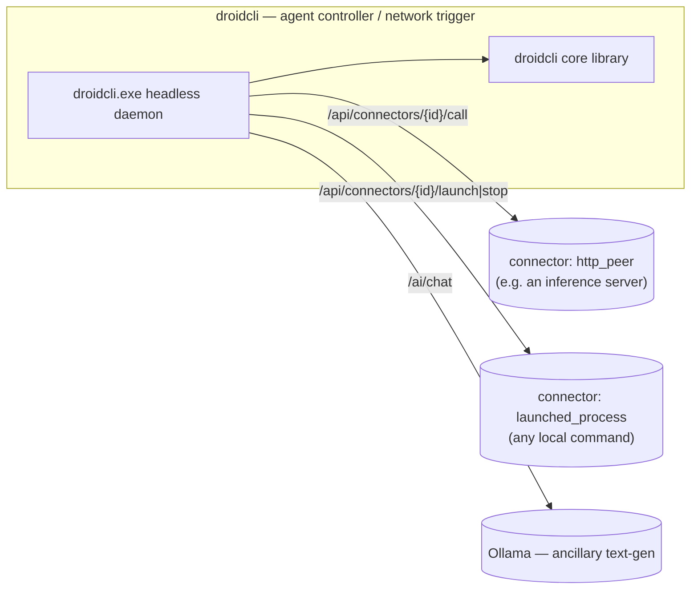

# droidcli

  


`droidcli` is a library to create agents that execute multimodal tasks, a headless CLI agent daemon.

Core capabilities: 
- HTTP (inbound + outbound)
- signal/trigger dispatch
- media and corpus decode
- Ollama API seam
- Persistent task queue
- Launched processes connectors with PID tracking

Full design notes: [ARCHITECTURE.md](./ARCHITECTURE.md).
 Working in the repo as an agent: [AGENTS.md](./AGENTS.md).

## Build

Requires CMake 3.20+ and Git.

**Windows** - VS 2022 **MSVC** x64

On first configure, FFmpeg is downloaded automatically into `third_party/ffmpeg/` when missing.

```powershell
cmake -B build-msvc -G "Visual Studio 17 2022" -A x64
cmake --build build-msvc --config Debug -j
.\build-msvc\Debug\droidcli.exe
```

Optional FFmpeg overrides:

```powershell
# Disable auto-download and use an existing local FFmpeg prefix
cmake -B build-msvc -G "Visual Studio 17 2022" -A x64 -DDROIDCLI_FFMPEG_AUTO_DOWNLOAD=OFF -DDROIDCLI_FFMPEG_ROOT="C:/path/to/ffmpeg"

# Keep auto-download enabled but use a custom archive URL
cmake -B build-msvc -G "Visual Studio 17 2022" -A x64 -DDROIDCLI_FFMPEG_URL="https://.../ffmpeg-win64-shared.zip"

# Disable insecure TLS retry fallback (default is ON)
cmake -B build-msvc -G "Visual Studio 17 2022" -A x64 -DDROIDCLI_FFMPEG_ALLOW_INSECURE_DOWNLOAD=OFF
```

Shortcut: `.\build_and_run.bat` (configures only when needed; accepts `Debug`/`Release`, `--configure`, `--clean`, `--no-run`).

Release: use `--config Release` → `build-msvc\Release\droidcli.exe`

**Linux** — C++20

```sh
cmake -B build -DCMAKE_BUILD_TYPE=Release
cmake --build build -j
./build/droidcli
```

### Library + tests only

**Windows / Linux** (same commands):

```sh
cmake -B build -DCMAKE_BUILD_TYPE=Release
cmake --build build -j
ctest --test-dir build --output-on-failure
```

## Distribution

`.\build_and_distribute.bat` builds droidcli **Release** and stages a portable
folder + zip under `dist\droidcli-<version>\`: `droidcli.exe` + FFmpeg DLLs,
`config\connectors.example.json`, and `run_all.bat`. droidcli does not
auto-discover peer apps — copy the example connector config to
`connectors.json` next to `run_all.bat` and edit it to point at whatever you
want droidcli to control.

### CLI flags

```
droidcli [--port 30080] [--config path/to/connectors.json] [--no-ai]
         [--ollama-url URL] [--ollama-model NAME] [--headless] [--daemon]
```

| Flag | Default | Purpose |
| ---- | ------- | ------- |
| `--port` | `30080` | HTTP listen port |
| `--config` | (none) | JSON file with a top-level `connectors` array, loaded at startup |
| `--no-ai` | off | Disable `/ai/chat` (Ollama text-gen) |
| `--ollama-url` | `http://127.0.0.1:11434` | Ollama base URL |
| `--ollama-model` | `llama3.2` | Ollama model name |
| `--headless` | off | Skip the interactive TUI; run the plain foreground daemon+HTTP-API loop only (unchanged scriptable behavior) |
| `--daemon` | off | Documented no-op: droidcli always runs in the foreground — use a process supervisor (nssm, Task Scheduler, systemd) for true background operation |

### Config file format

```json
{
  "connectors": [
    {
      "id": "my-http-peer",
      "kind": "http_peer",
      "base_url": "http://127.0.0.1:9000",
      "enabled": true,
      "capabilities": "example"
    },
    {
      "id": "my-launched-process",
      "kind": "launched_process",
      "launch_cmd": "some-server.exe",
      "work_dir": "C:/path/to/project",
      "enabled": true
    }
  ]
}
```

A ready-to-copy template (generic placeholders, not built-in behavior) lives
at `[config/connectors.example.json](./config/connectors.example.json)`.

### HTTP routes

| Method | Route | Description |
| ------ | ----- | ------------ |
| `GET` | `/health` | Liveness + session snapshot (portable handler) |
| `GET` / `POST` | `/echo` | Echo query/body |
| `POST` | `/notify` | Ingest notify event |
| `POST` | `/ai/chat` | Ollama text-gen chat via `LanguageAiRuntime` |
| `GET` | `/api/status` | Host status: recording / autopilot toggles |
| `GET` | `/api/network/status` | Networking flag + connector count |
| `GET` | `/api/config` | Effective host configuration (Ollama) |
| `POST` | `/api/config` | Update host configuration at runtime |
| `GET` | `/api/runtimes` | Runtime catalog (all host-local) |
| `GET` | `/api/notify/log` | Recent notify messages |
| `GET` | `/api/app/log` | Recent host application log |
| `POST` | `/api/command` | Dispatch validated command (`{"command":"toggle_recording"}`) |
| `GET` | `/api/ollama/status` | Ollama text-gen endpoint status + model list |
| `POST` | `/api/ollama/config` | Update Ollama model at runtime |
| `GET` | `/api/process/status` | PID + running state of every launched connector process |

**Connectors** (generic peer config, replaces the old hardcoded `/api/adapter/*` and `/api/media/*`):

| Method | Route | Description |
| ------ | ----- | ------------ |
| `GET` | `/api/connectors` | List all registered connectors |
| `POST` | `/api/connectors` | Register (or replace) a connector — body is a `Connector` JSON object |
| `GET` | `/api/connectors/{id}/status` | Liveness: PID/running for `launched_process`, `/health` probe for `http_peer` |
| `POST` | `/api/connectors/{id}/launch` | Launch a `launched_process` connector (Job Object / process group, PID-tracked) |
| `POST` | `/api/connectors/{id}/stop` | Stop it |
| `POST` | `/api/connectors/{id}/call` | Proxy an HTTP call to an `http_peer` connector — body `{"path":"/api/x","method":"POST","payload_json":"{...}"}` |

**Tasks** (persistent pending/running/done/failed queue; `tick_tasks()` runs every poll loop iteration and dispatches one pending task per tick):

| Method | Route | Description |
| ------ | ----- | ------------ |
| `GET` | `/api/tasks` | List all tasks (history capped, pending/running always kept) |
| `POST` | `/api/tasks` | Enqueue a task — body `{"connector_id":"...","command":"launch\|stop\|<path>","payload_json":"{...}"}` |
| `GET` | `/api/tasks/{id}` | Task status |

A task with `command: "launch"` or `"stop"` calls `launch_connector`/`stop_connector`
on its `connector_id`; any other command is treated as the HTTP path to call on
an `http_peer` connector.

## Shared HTTP API (library handlers)

`/health`, `/echo`, `/notify`, and `/ai/chat` are handled by the portable
`net::RouteTable` (in `src/net/`) and are identical no matter which host binds
them:

| Method         | Route      | Description                                            |
| -------------- | ---------- | ------------------------------------------------------ |
| `GET`          | `/health`  | Liveness + session snapshot (`status`, `map`, `build`) |
| `GET` / `POST` | `/echo`    | Echo back `msg` query param or raw POST body           |
| `POST`         | `/notify`  | Ingest a JSON/text event                               |
| `POST`         | `/ai/chat` | Send a prompt to Ollama; returns assistant text        |

### Examples

```sh
curl http://127.0.0.1:30080/health
curl "http://127.0.0.1:30080/echo?msg=hello"
curl -X POST http://127.0.0.1:30080/notify \
  -H "Content-Type: application/json" \
  -d '{"message":"test event"}'
curl -X POST http://127.0.0.1:30080/ai/chat \
  -H "Content-Type: application/json" \
  -d '{"prompt":"Hello"}'
```

Use `--no-ai` to disable `/ai/chat`.



## Portable modules

| Namespace             | Responsibility                                                                                              |
| --------------------- | ----------------------------------------------------------------------------------------------------------- |
| `droidcli::media`    | PNG/JPEG decode, probe, store, **corpus** (OCR/objects/summaries → subtitles, focus data)                   |
| `droidcli::net`      | Router, inbound handlers, **`signal_router`** (network triggers to peers), **`connector`** (generic peer registry) |
| `droidcli::session`  | `RuntimeSession`, feature flags, status text                                                                |
| `droidcli::app`      | Command parse/validate, runtime catalog, **`tasks`** (persistent task queue)                                |
| `droidcli::runtime`  | Host service callbacks (recording + AI snapshots/toggles)                                                   |
| `droidcli::ai`       | Ollama chat client, `LanguageAiRuntime`                                                                     |
| `droidcli::notify`   | Notify body parsing                                                                                         |
| `droidcli::cli`      | droidcli host wiring: `DroidHost`, `ProcessManager`, HTTP route mount (not portable — links sockets/process control) |

# License

Licensed under the [Apache 2.0](./LICENSE)  license.